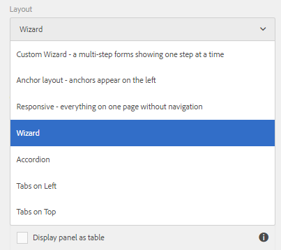
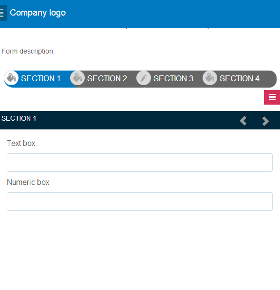

# Funciones de diseño de formularios adaptables{#layout-capabilities-of-adaptive-forms}

Adobe Experience Manager (AEM) le permite crear formularios adaptables fáciles de usar que ofrecen experiencias dinámicas a los usuarios finales. La presentación del formulario controla cómo se muestran los elementos o los componentes en un formulario adaptable.

## Conocimientos previos {#prerequisite-knowledge}

Antes de conocer las diferentes funciones de presentación de los formularios adaptables, lea los siguientes artículos para obtener más información sobre los formularios adaptables.

[Introducción a AEM Forms](../../forms/using/introduction-aem-forms.md)

[Introducción a la creación de formularios](../../forms/using/introduction-forms-authoring.md)

## Tipos de diseños {#types-of-layouts}

Un formulario adaptable proporciona los siguientes tipos de diseños:

**Diseño de panel**: controla cómo se muestran los elementos o componentes de un panel en un dispositivo.

**Diseño móvil**: controla la navegación de un formulario en un dispositivo móvil. Si el ancho del dispositivo es de 768 píxeles o más, el diseño se considera un diseño móvil y se optimiza para un dispositivo móvil.

**Diseño de barra de herramientas**: controla la ubicación de los botones de acción en la barra de herramientas o la barra de herramientas del panel de un formulario.

Todos estos diseños de panel se definen en la siguiente ubicación:

`/libs/fd/af/layouts`.

>[!NOTE]
>
>Para cambiar la presentación de un formulario adaptable, utilice el modo de creación en AEM.


## Diseño de panel {#panel-layout}

Un autor de formularios puede asociar una presentación con cada panel de un formulario adaptable, incluido el panel raíz.

Los diseños de panel están disponibles en la ubicación `/libs/fd/af/layouts/panel`. 



Lista de diseños de panel en formularios adaptables

### Adaptable: todo en una página sin navegación {#responsive-everything-on-one-page-without-navigation-br}

Utilice este diseño de panel para crear un diseño adaptable que se ajuste al tamaño de pantalla del dispositivo sin necesidad de utilizar ningún tipo de navegación especializada.

Con este diseño, puede colocar varias **[!UICONTROL Formulario adaptable del panel]** componentes uno tras otro dentro del panel.


Un formulario con diseño adaptable, tal como se ve en una pantalla pequeña


Un formulario con presentación interactiva, tal como se ve en una pantalla grande

### Asistente: formulario de varios pasos que muestra cada paso {#wizard-a-multi-step-form-showing-one-step-at-a-time}

Utilice este diseño de panel para proporcionar navegación guiada dentro de un formulario. Por ejemplo, utilice este diseño cuando desee capturar información obligatoria en un formulario y guiar a los usuarios paso a paso.

Utilice la variable `Panel adaptive form` para proporcionar navegación paso a paso dentro de un panel. Cuando se utiliza este diseño, el usuario solo puede pasar al siguiente paso una vez que ha completado el paso actual.

```javascript
window.guideBridge.validate([], this.panel.navigationContext.currentItem.somExpression)
```


Expresión de finalización de pasos en la presentación del Asistente para un formulario de varios pasos


Un formulario con el Asistente

### Diseño de acordeón {#layout-for-accordion-design}

Con este diseño, puede colocar la variable `Panel adaptive form` en un panel con navegación de estilo de acordeón. Este diseño también permite crear paneles repetibles. Los paneles repetibles permiten agregar o quitar paneles de forma dinámica según sea necesario. Puede definir el número mínimo y máximo de veces que se repite un panel. Además, el título del panel se puede determinar dinámicamente en función de la información proporcionada en los elementos del panel.

La expresión de resumen se puede utilizar para mostrar los valores proporcionados por el usuario final en el título del panel minimizado.


Paneles repetibles creados con el diseño Acordeón

### Diseño con pestañas: las pestañas aparecen a la izquierda {#tabbed-layout-tabs-appear-on-the-left}

Con este diseño, puede colocar la variable `Panel adaptive form` en un panel con navegación por pestañas. Las pestañas se colocan a la izquierda del contenido del panel.


Las pestañas aparecen a la izquierda del panel

### Diseño con pestañas: las pestañas aparecen en la parte superior {#tabbed-layout-tabs-appear-on-the-top}

Con este diseño, puede colocar la variable `Panel adaptive form` Componente de un panel con navegación por fichas. Las pestañas se colocan sobre el contenido del panel.


Pestañas que aparecen en la parte superior de un panel

## Diseños móviles {#mobile-layouts}

Los diseños móviles proporcionan una navegación fácil de usar en los dispositivos móviles con pantallas relativamente más pequeñas. Los diseños móviles utilizan estilos con pestañas o de asistente para la navegación del formulario. La aplicación de un diseño para móvil proporciona un diseño único para todo el formulario.

Este diseño controla la navegación mediante una barra y un menú de navegación. La barra de navegación muestra los iconos **&lt;** y **>** para indicar los pasos de navegación **Siguiente** y **Anterior** en el formulario.

Los diseños móviles están disponibles en la ubicación `/libs/fd/af/layouts/mobile/`. De forma predeterminada, los siguientes diseños móviles están disponibles en los formularios adaptables.


Lista de diseños móviles en formularios adaptables

Cuando se utiliza una presentación móvil, el menú de formulario, para acceder a varios paneles de formulario, está disponible pulsando  icono.

### Diseño con títulos de panel en el encabezado del formulario {#layout-with-panel-titles-in-the-form-header}

Este diseño, como su nombre indica, muestra los títulos de los paneles junto con el menú y la barra de navegación. También incluye los iconos Siguiente y Anterior para la navegación.



Diseños móviles con títulos de panel en los encabezados del formulario

### Diseño sin títulos de panel en el encabezado del formulario {#layout-without-panel-titles-in-the-form-header}

Este diseño, como su nombre indica, muestra únicamente el menú y la barra de navegación, sin títulos de panel. También incluye los iconos Siguiente y Anterior para la navegación.


Diseños móviles sin títulos de panel en los encabezados del formulario

## Diseños de la barra de herramientas {#toolbar-layouts}

Un diseño de barra de herramientas controla la colocación y visualización de cualquier botón de acción que agregue a los formularios adaptables. La presentación se puede agregar a nivel de formulario o de panel.


Una lista de diseños de barra de herramientas en formularios adaptables

Los diseños de la barra de herramientas están disponibles en `/libs/fd/af/layouts/toolbar` ubicación. los formularios adaptables proporcionan los siguientes diseños de barra de herramientas de forma predeterminada.

### Diseño predeterminado de la barra de herramientas {#default-layout-for-toolbar}

Esta presentación está seleccionada como presentación predeterminada cuando se añaden botones de acción en un formulario adaptable. Al seleccionar este diseño, se muestra el mismo diseño tanto para el escritorio como para los dispositivos móviles.

Además, puede agregar varias barras de herramientas que contengan botones de acción configurados con este diseño. Un botón de acción está asociado a un control de formulario. Puede configurar las barras de herramientas para que estén antes o después de un panel.


Vista predeterminada de la barra de herramientas

### Diseño fijo móvil para la barra de herramientas {#mobile-fixed-layout-for-toolbar}

Seleccione este diseño para proporcionar diseños alternativos para equipos de escritorio y dispositivos móviles.

Para el diseño de escritorio, puede añadir botones de acción utilizando algunas etiquetas específicas. Solo se puede configurar una barra de herramientas con este diseño. Si hay más de una barra de herramientas configurada con este diseño, hay una superposición para los dispositivos móviles y solo una barra de herramientas está visible. Por ejemplo, puede tener una barra de herramientas en la parte inferior o superior del formulario o, después o antes de los paneles del formulario.

Para el diseño móvil, puede añadir botones de acción mediante iconos.


Diseño fijo móvil para la barra de herramientas
