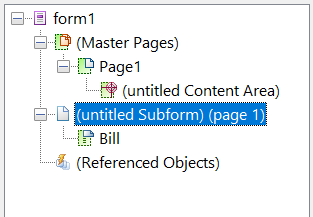

# Diseño de diseño{#layout-design}

Las plantillas de formulario XFA o XDP son las plantillas para:

* [Cartas](/help/forms/using/create-letter.md)
* [Imprimir ](/help/forms/using/web-channel-print-channel.md#printchannel) canal de comunicaciones  [interactivas](/help/forms/using/interactive-communications-overview.md)

* Fragmentos de diseños

Un XDP está diseñado en Adobe Forms Designer. En este artículo se explica cómo diseñar los XDP para crear correspondencias/comunicaciones interactivas eficaces, como dónde utilizar los campos de formulario o las áreas de destino y cuándo utilizar los fragmentos de diseño.

## Creación de un diseño para letras o para el canal de impresión de Interactive Communications {#creating-a-layout-for-letters-or-for-interactive-communications-print-channel}

Un diseño define el diseño gráfico de un canal de letra/impresión de una comunicación interactiva. La presentación puede contener campos de formulario típicos, como &quot;Dirección&quot; y &quot;Número de referencia&quot;. También contiene subformularios vacíos que denotan áreas de destino. Cree la presentación en el diseñador de formularios y cuando termine, el especialista en aplicaciones la cargará en AEM servidor. Desde allí, puede seleccionar el diseño al crear una plantilla de correspondencia o un canal de impresión de una comunicación interactiva.

Siga estos pasos para crear diseños para cartas/canal de impresión de Interactive Communications:

1. Analice el diseño y determine el contenido que se repite en todas las páginas; normalmente, el encabezado y pie de página se ajustan a esta categoría. Este contenido se coloca en páginas de formato de diseño. El contenido restante se dirige a las páginas de trabajo del diseño. En una chaqueta de directiva, el logotipo y la dirección de la empresa se pueden agregar al encabezado y al pie de página de la página de formato. Por ejemplo, el Aviso de cancelación utiliza el mismo diseño.
1. Al diseñar páginas de trabajo, divida el contenido de la página en secciones. Cada sección está diseñada como un subformulario incrustado en la propia presentación o como una presentación de fragmento. Si la sección contiene tabla, modele la sección como un fragmento de diseño.
1. Un diseño se puede diseñar de la siguiente manera:

   1. Consiga que cada sección sea un subformulario independiente que contenga todos los elementos de la sección.
   1. Hacer que cada subformulario de sección sea secundario al mismo subformulario principal. La presentación del subformulario principal está definida en posición variable para permitir que las secciones se desplazen por debajo en caso de que los datos grandes se combinen en secciones anteriores.
   1. La residencia principal de la sección también se puede reutilizar en otros diseños. Crearla como un diseño de fragmento.
   1. Sección Los detalles de interés adicionales contienen solo dos elementos colocados uno debajo de otro, pueden contener datos grandes y están diseñados de la forma fluida.
   1. Otras secciones contienen elementos en posiciones específicas, por lo que están diseñados como diseño en posición fija.
   1. Desglose una sección en subformularios si la sección contiene elementos en posiciones específicas y estos elementos contienen grandes cantidades de datos. A continuación, organice los subformularios para lograr el comportamiento deseado.
   1. Para la sección Residencia principal , agregue un área objetivo de marcador de posición. Este marcador de posición está enlazado a la residencia principal del fragmento en el momento del diseño de la carta/comunicación interactiva.
   1. Cargue el diseño (y el fragmento, si lo hay, que utiliza el diseño) en el servidor de AEM Forms.

### Utilizar subformulario en una plantilla XDP {#usesubformxdp}

Una vez analizado la presentación necesaria para crear la comunicación interactiva, puede crear subformularios en la plantilla XDP con Forms Designer. Los componentes de subformulario en blanco utilizados en la plantilla XDP dan como resultado la visualización de áreas de destino en el canal Imprimir de la comunicación interactiva.

>[!NOTE]
>
>Añada contenido al canal Imprimir de la comunicación interactiva en lugar de añadir contenido al componente de subformulario en la plantilla XDP. Agregue contenido a las áreas de destino en el canal Imprimir utilizando [fragmentos de documento, gráficos, imágenes](create-interactive-communication.md#step2) y fragmentos de diseño.

Realice los siguientes pasos para utilizar el subformulario en una plantilla XDP:

1. Abra el Diseñador de Forms, seleccione **Archivo** > **Nuevo** > **Utilizar un formulario en blanco**, pulse **Siguiente** y, a continuación, pulse **Finalizar** para abrir el formulario para la creación de plantillas.

   Asegúrese de que las opciones **Biblioteca de objetos** y **Objeto** están seleccionadas en el menú **Ventana**.

1. Arrastre y suelte el componente **Subformulario** desde la **Biblioteca de objetos** hasta el formulario.

   

1. Seleccione el subformulario para mostrar las opciones del subformulario en la ventana **Objeto** del panel derecho.
1. Seleccione la pestaña **Subform** y seleccione **De posición variable** en la lista desplegable **Contenido**. Arrastre el punto final izquierdo del subformulario para ajustar la longitud.

   

1. En la pestaña **Binding**:

   1. Especifique un nombre para el subformulario en el campo **Name**.
   1. Seleccione **Sin enlace de datos** en la lista desplegable **Enlace de datos**.

1. Del mismo modo, seleccione el subformulario raíz en el panel izquierdo.

   

1. Seleccione la pestaña **Subform** y seleccione **De posición variable** en la lista desplegable **Contenido**. En la pestaña **Bindings**:

   1. Especifique un nombre para el subformulario en el campo **Name**.
   1. Seleccione **Sin enlace de datos** en la lista desplegable **Enlace de datos**.

   Repita los pasos del 2 al 5 para agregar más subformularios a la plantilla XDP. Agregue [texto, fragmentos de documento, imágenes y gráficos](create-interactive-communication.md#step2) a las áreas de destino solo mientras crea la comunicación interactiva.

1. Seleccione **Archivo** > **Guardar como** para guardar el archivo en el sistema de archivos local:

   1. Vaya a la ubicación para guardar el archivo y especificar un nombre para la plantilla XDP.
   1. Seleccione **.xdp** en la lista desplegable **Guardar como tipo**.

   1. Toque **Guardar**.

### Uso del componente Campo de imagen en una plantilla XDP {#use-image-field-component-in-an-xdp-template}

Utilice el componente Campo de imagen o Subformulario en la plantilla XDP y añada una imagen durante la creación de la comunicación interactiva.

>[!NOTE]
>
>Agregue una imagen al canal Imprimir de la comunicación interactiva en lugar de agregar una imagen al componente Campo de imagen o Subformulario en la plantilla XDP. Para obtener más información, consulte [Adición de contenido a la comunicación interactiva](../../forms/using/create-interactive-communication.md#step2).

Siga estos pasos para utilizar el componente Campo de imagen en una plantilla XDP:

1. Arrastre y suelte el componente **Campo de imagen** desde la **Biblioteca de objetos** hasta el formulario.
1. Seleccione el subformulario para mostrar las opciones del subformulario en la ventana **Objeto** del panel derecho.
1. En la pestaña **Binding**:

   1. Especifique un nombre para el campo de imagen en el campo **Name**.
   1. Seleccione **Sin enlace de datos** en la lista desplegable **Enlace de datos**.

### Creación de una plantilla XDP para fragmentos de diseño {#xdplayoutfragments}

Utilice el componente Tabla de Forms Designer para crear fragmentos de diseño y, a continuación, utilizarlos para crear tablas mientras crea el canal Imprimir de Comunicación interactiva. El uso de fragmentos de diseño para crear tablas garantiza que el contenido de la tabla conserve la estructura cuando el canal web se genera automáticamente mediante el canal de impresión.

>[!NOTE]
>
>Introduzca texto en las celdas de la tabla o [cree un enlace con los objetos del modelo de datos del formulario](create-interactive-communication.md#step2) solo durante la creación de la comunicación interactiva.

Siga los siguientes pasos para utilizar el componente Tabla en la plantilla XDP mediante Forms Designer:

1. Arrastre y suelte el componente **Tabla** desde la **Biblioteca de objetos** hasta el formulario.
1. En el cuadro de diálogo **Insertar tabla**:

   1. Especifique el número de filas y columnas de la tabla.
   1. Active la casilla **Incluir fila de encabezado en tabla** para incluir una fila para el encabezado de tabla.
   1. Pulse **Aceptar**.

1. Pulse **+** en el panel izquierdo junto al nombre de la tabla, haga clic con el botón derecho en los nombres de celdas incluidos en el encabezado y otras filas y seleccione **Cambiar nombre de objeto** para cambiar el nombre de las celdas de la tabla.
1. Haga clic en los campos de texto del encabezado de tabla en la **Vista diseño** y cambie el nombre a ellos.
1. Arrastre y suelte el componente **Campo de texto** de la **Biblioteca de objetos** a cada celda de la tabla de la **Vista diseño**. Realice este paso para poder enlazar celdas de tabla con los objetos del modelo de datos de formulario durante la creación de la comunicación interactiva.

   

1. Seleccione el nombre de la fila en el panel izquierdo y seleccione **Objeto** > **Enlace** > **Repetir fila para cada elemento de datos**. Realice este paso para asegurarse de que si se crea un enlace entre las celdas de la tabla de esta fila con objetos del modelo de datos de formulario de tipo colección, la fila de la tabla se repite automáticamente para cada elemento de datos disponible en la base de datos.

   Introduzca texto en las celdas de la tabla o [cree un enlace con los objetos del modelo de datos del formulario](create-interactive-communication.md#step2) solo durante la creación de la comunicación interactiva.

1. Seleccione **Archivo** > **Guardar como** para guardar el archivo en el sistema de archivos local:

   1. Vaya a la ubicación para guardar el archivo y especifique el nombre de la plantilla XDP.
   1. Seleccione **.xdp** en la lista desplegable **Guardar como tipo**.

   1. Toque **Guardar**.

### Cargar la plantilla XDP al servidor de AEM Forms {#uploadxdptemplate}

Una vez creada una plantilla XDP con el Diseñador de Forms, debe cargarla en el servidor de AEM Forms para que la plantilla esté disponible para usar durante la creación de la comunicación interactiva.

1. Seleccione **Forms** > **Forms &amp; Documents**.
1. Pulse **Crear** > **Cargar archivo**.
1. Vaya a la ubicación de la plantilla XDP en el sistema de archivos local y pulse **Abrir** para importar la plantilla XDP al servidor de AEM Forms.

## Uso del esquema {#using-schema}

Puede utilizar un esquema en un fragmento de diseño o diseño , pero no es obligatorio. Si utiliza un esquema, asegúrese de lo siguiente:

1. El diseño y todos los diseños de fragmento utilizados en una carta/comunicación interactiva utilizan el mismo esquema que la letra/comunicación interactiva.
1. Todos los campos necesarios para rellenarse con datos están enlazados al esquema.

## Creación de campos relacionados {#creating-relatable-fields}

De forma predeterminada, todos los campos se consideran relacionados con otras fuentes de datos. Si la presentación contiene campos que no están relacionados con una fuente de datos, asigne un nombre al campo con un sufijo &quot;_int&quot; (interno); por ejemplo, pageCount_int.

Un campo relacionado debe:

* ser un XFA &lt;field> o &lt;exclGroup>
* tienen una referencia de enlace XFA
* si es un &lt;exclGroup>, debe tener al menos un campo de botón de radio secundario; de lo contrario, su tipo de valor no se puede determinar

Un campo relacionado debe:

* tienen un nombre

Un campo relacionado no debe:

* Incluir un sufijo &quot;_int&quot; en su nombre
* tienen el enlace establecido como &quot;ninguno&quot;
* ser un elemento secundario de un elemento &lt;exclGroup>

Siempre que un campo relacionado cumpla los criterios descritos anteriormente, puede estar en cualquier ubicación y en cualquier profundidad de anidación en el diseño. Puede utilizar campos relacionados dentro de las páginas de formato.

Los campos son más flexibles en la configuración de presentación que los subformularios de área de destino; sin embargo, están unidos a un solo tipo de valor. Puede hacer que un campo sea grande o establecerlo en una anchura y altura fijas, etc. El módulo o resultado de regla resuelto se inserta en el campo .

## Decidir cuándo usar subformularios y campos de texto {#deciding-when-to-use-subforms-and-text-nbsp-fields}

Utilice un subformulario si desea capturar contenido de varios módulos en una presentación vertical de flujo superior (varios párrafos o imágenes). La presentación debe controlar el hecho de que el subformulario crece en altura para ajustarse a su contenido. Si no puede estar seguro de que la longitud del contenido asociado al subformulario o destino nunca exceda el espacio reservado para el subformulario en la presentación, cree el subformulario como secundario dentro de un contenedor de subformulario de posición variable. Este proceso garantiza que los objetos de presentación situados debajo del subformulario vayan descendiendo a medida que crezca el subformulario.

Utilice un campo si desea capturar datos de módulo o datos de elementos del diccionario de datos en el esquema del diseño (porque los campos están enlazados a datos) o para mostrar el contenido del módulo en una página de formato. Recuerde que el contenido de una página de formato no puede fluir con el contenido de la página de trabajo, por lo que debe asegurarse de que el campo de imagen se utilice como logotipo de encabezado. Esta tabla proporciona más criterios para decidir cuándo utilizar un subformulario o un campo en una presentación.

<table>
 <tbody>
  <tr>
   <td>
<strong>Utilizar un subformulario cuando</strong>
 </td>
   <td>
<strong>Utilizar un campo de texto cuando</strong>
 </td>
  </tr>
  <tr>
   <td>
Contiene una combinación de elementos, como un apellido y un nombre
 </td>
   <td>
Contiene un solo elemento, como un número de directiva.
 </td>
  </tr>
  <tr>
   <td>
Incluye varios párrafos
 </td>
   <td>
El texto está ajustado y justificado
 </td>
  </tr>
  <tr>
   <td>
Los grupos de datos repetitivos, opcionales y condicionales están enlazados a subformularios para reducir el riesgo de errores de diseño que podrían producirse si se utilizan secuencias de comandos para obtener los mismos resultados
 </td>
   <td>
Los elementos como el logotipo y la dirección de su organización aparecen en todas las páginas de una carta o comunicación interactiva. En este caso, cree campos de formulario para esos elementos y colóquelos en la página de formato. Si establece el enlace de campo en "Sin enlace de datos", los campos no aparecen como campos relacionados en el Editor de cartas/comunicaciones interactivas. Si desea relacionar algún tipo de contenido con estos campos, deben tener enlaces.
 
Si la dirección de la empresa contiene más de una línea de datos, utilice el campo de texto con la opción "Permitir líneas múltiples" para representar la dirección de la presentación.
 
Si el tipo de datos de un campo de texto está definido como texto sin formato, se utiliza la versión de texto sin formato de la salida del módulo en lugar de la versión de texto enriquecido (se descarta todo el formato). Para conservar el formato, establezca el tipo de datos del campo de texto en texto enriquecido.
 </td>
  </tr>
  <tr>
   <td>
El texto tiene posición variable
 </td>
   <td>
Los campos de texto y los campos de imagen se utilizan en las páginas de formato. Las páginas de formato no pueden utilizar subformularios como áreas de destino.
 </td>
  </tr>
  <tr>
   <td>
Los objetos se agrupan y organizan sin enlazar el subformulario a un elemento de datos
 </td>
   <td>
 
 </td>
  </tr>
  <tr>
   <td>
Hay un campo de texto dentro del subformulario. El subformulario puede crecer y no sobrescribir otros objetos debajo de él en la presentación.
 </td>
   <td>
Necesita un acceso fácil a sus datos en el proceso posterior.
 </td>
  </tr>
 </tbody>
</table>

## Configuración de elementos repetitivos {#setting-up-repetitive-elements}

Cuando elementos como el logotipo y la dirección de su organización aparezcan en todas las páginas de una carta o comunicación interactiva, cree campos de formulario para esos elementos y colóquelos en la página de formato. Utilice el enlace Nombre (Nombre de campo) para estos campos.

## Especifique el formato de renderización del servidor {#specify-the-server-nbsp-render-format}

Utilizar el formato de renderización del servidor de la presentación en Formulario XML dinámico; de lo contrario, las letras o comunicaciones interactivas basadas en este diseño no se pueden procesar correctamente. De forma predeterminada, el formato de renderización del servidor en Forms Designer está definido como Formulario XML dinámico. Para asegurarse de que está utilizando el formato correcto:

* En Designer, haga clic en **Archivo** > **Propiedades del formulario** > **Predeterminados** y asegúrese de que la configuración Procesamiento/formato de PDF está establecida en Formulario XML dinámico.

