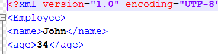
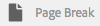

# Fragmentos de documento{#document-fragments}

## Fragmentos de documento {#document-fragments-1}

Los fragmentos de documento son partes o componentes reutilizables de una correspondencia mediante los cuales se pueden componer cartas o correspondencia. Los fragmentos del documento son de los siguientes tipos:

* **Texto**: Un recurso de texto es un fragmento de contenido que consta de uno o más párrafos de texto. Un párrafo puede ser estático o dinámico.
* **Lista**: Lista es un grupo de fragmentos de documento, que incluyen texto, listas, condiciones e imágenes. El orden de los elementos de la lista puede ser fijo o editable. Al crear una carta, puede utilizar algunos o todos los elementos de la lista para replicar un patrón de elementos reutilizable.
* **Condición**: Las condiciones permiten definir qué contenido se incluye en el momento de la creación de la correspondencia, según los datos suministrados. La condición se describe en términos de variables de control. Una variable de control puede ser un elemento de diccionario de datos o un marcador de posición.
* **Fragmento** de diseño: Un fragmento de diseño es un diseño que se puede utilizar en una o varias letras. Un fragmento de diseño se utiliza para crear patrones repetibles, especialmente tablas dinámicas. La presentación puede contener campos de formulario típicos, como &quot;Dirección&quot; y &quot;Número de referencia&quot;. También contiene subformularios vacíos que denotan áreas de destino. Los diseños (XDP) se crean en Designer y, a continuación, se cargan en AEM Forms.

## Texto {#text}

Un recurso de texto es un fragmento de contenido que consta de uno o más párrafos de texto. Un párrafo puede ser estático o dinámico. Un párrafo dinámico contiene referencias a elementos de datos, cuyos valores se proporcionan durante la ejecución. Por ejemplo, el nombre del cliente en un saludo de letras podría ser un elemento de datos dinámico, con su valor disponible durante la ejecución. Al cambiar estos valores, se puede utilizar la misma plantilla de letras para generar cartas para distintos clientes.

La solución de administración de correspondencia admite dos tipos de elementos de datos dinámicos (datos variables):

* **Elementos** del diccionario de datos: Estos elementos están enlazados al diccionario de datos y obtienen sus valores del origen de datos proporcionado. Una variable de diccionario de datos puede estar protegida o desprotegida. Durante la creación de la correspondencia, el usuario puede modificar el valor predeterminado de las variables de diccionario de datos no protegidas, pero no puede modificar las protegidas.
* **Marcadores de posición**: Son variables que no están enlazadas a una fuente de datos back-end. Requieren que el usuario rellene un valor durante la creación de la correspondencia. Los marcadores de posición no están protegidos de forma predeterminada.

>[!NOTE]
>
>Las plantillas de Gestión de Correspondencia no obligan a crear nombres únicos al crear marcadores de posición. Si se crean dos marcadores de posición con el mismo nombre, como un texto y una condición, y se utilizan ambos en una plantilla de carta, los valores del último marcador de posición insertado se utilizan para ambos marcadores de posición. Si dos marcadores de posición tienen el mismo nombre, se comparan sus tipos. Si los tipos son diferentes, su tipo se convierte en String. Sin embargo, dentro de un módulo no se pueden crear varios marcadores de posición con el mismo nombre.

### Crear texto {#create-text}

1. Seleccione **Forms** > **Fragmentos de documento**.
1. Toque **Crear** > **Texto** o seleccione un recurso de texto y pulse **Editar**.
1. Especifique la siguiente información para el texto:

   * **Título: (Opcional)** Introduzca el título del recurso de texto. Los títulos no tienen que ser únicos y pueden tener caracteres especiales y caracteres que no sean de inglés. Los textos son referidos por sus títulos (cuando están disponibles), como en miniaturas y propiedades de recursos.
   * **Nombre:** el nombre exclusivo del recurso de texto. No pueden existir dos recursos (texto, condición o lista) con el mismo nombre en ningún estado. En el campo Nombre, solo se pueden introducir caracteres, números y guiones en inglés. El campo Nombre se rellena automáticamente en función del campo Título . Los caracteres especiales, espacios, números y caracteres que no sean de inglés introducidos en el campo Título se sustituyen por guiones en el campo Nombre. Aunque el valor del campo Título se copia automáticamente en el Nombre, puede editarlo.
   * **Descripción**: Escriba una descripción del recurso.
   * **Diccionario** de datos: De forma opcional, seleccione el diccionario de datos en el que desea asignar. Este atributo permite agregar referencias a elementos de diccionario de datos en el recurso de texto.
   * **Etiquetas**: De forma opcional, para crear una etiqueta personalizada, introduzca un valor en el campo de texto y pulse Intro. Puede ver la etiqueta debajo del campo de texto de las etiquetas. Al guardar este texto, también se crean las etiquetas recientemente agregadas.

1. Toque **Siguiente**. Gestión de correspondencia muestra la página Editor, donde puede agregar párrafos de texto y elementos de datos al texto.

   El corrector ortográfico predeterminado del navegador comprueba la ortografía en el editor de texto. Para administrar la revisión ortográfica y gramatical, puede editar la configuración del corrector ortográfico del navegador o instalar complementos del navegador para revisar la ortografía y la gramática.

   También puede utilizar los distintos métodos abreviados del teclado en el editor de texto para administrar, editar y dar formato al texto. Para obtener más información sobre los [métodos abreviados del teclado del Editor de texto](/help/forms/using/keyboard-shortcuts.md#p-formatting-p) en Atajos de teclado de la Gestión de correspondencia.

1. Se abre un editor de texto e introduzca el texto. Utilice la barra de herramientas situada en la parte superior de la página para dar formato al texto, insertar condiciones, vínculos y saltos de página.

   

   * **Vínculo**: Inserte un vínculo de   hipertexto en el texto.
   * **Repetir**: Repita el proceso imprime el elemento de colección en el diccionario de datos con un delimitador.
   * **Condición**: Pulse para insertar una condición. Inserte texto basado en una condición. Si la condición es verdadera, el texto es visible en letra; en caso contrario, no.
   * **Agregar descripción**: Agregue anotaciones a un texto. Este es un metadato visible para el autor, pero no una parte de la carta que se crea.
   * **Salto** de página: Si establece el atributo de salto de página de un módulo de texto en false, el módulo de texto no se rompe en las páginas.

   Se abre un editor de texto. Introduzca el texto. La barra de herramientas cambia según el tipo de ediciones que elija realizar: Párrafo, alineación o lista:

   

   Seleccionar tipo de barra de herramientas: Párrafo, alineación o lista

   

   Barra de herramientas Párrafo
   barra de herramientasBarra de herramientas Alineación

   

   Barra de herramientas de listas (haga clic en para abrir una imagen de tamaño completo)

1. Para reutilizar uno de los párrafos de texto que existen en otra aplicación, como de páginas MS Word o HTML, copie y pegue el texto en el editor de texto. El formato del texto copiado se conserva en el editor de texto.

   Puede copiar y pegar uno o varios párrafos de texto en un módulo de texto editable. Por ejemplo, puede tener un documento de MS Word con una lista con viñetas de pruebas de residencia aceptables como las siguientes:

   

   Puede copiar y pegar directamente el texto del documento de MS Word en un módulo de texto editable. El formato, como la lista con viñetas, la fuente y el color del texto, se conserva en el módulo de texto.

   

   >[!NOTE]
   >
   >Sin embargo, el formato del texto pegado tiene algunas [limitaciones](https://helpx.adobe.com/aem-forms/kb/cm-copy-paste-text-limitations.html).

1. Si es necesario, inserte caracteres especiales en el fragmento de documento. Por ejemplo, puede utilizar la paleta Caracteres especiales para insertar:

   * Símbolos monetarios como €, Euros y £
   * Símbolos matemáticos como la adminis... ...la adm., la j... ...la adm.
   * Símbolos de puntuación como ‟ y&quot;

   

   Correspondence Management ha incorporado compatibilidad con 210 caracteres especiales. El administrador puede [añadir compatibilidad para más caracteres especiales personalizados mediante personalización](/help/forms/using/custom-special-characters.md).

1. Para resaltar o resaltar partes de texto en un módulo en línea editable, seleccione el texto y pulse Resaltar color.

   

   Puede tocar directamente un color básico `**[A]**` presente en la paleta Colores básicos o pulsar **Seleccionar** después de utilizar el control deslizante `**[B]**` para elegir el tono apropiado del color.

   De forma opcional, también puede ir a la ficha Avanzado para seleccionar el tono, la luminosidad y la saturación `**[C]**` adecuados para crear el color preciso y, a continuación, pulsar Seleccionar `**[D]**` para aplicar el color y resaltar el texto.

   

1. En el panel de datos, arrastre y suelte los elementos del diccionario de datos y los elementos del marcador de posición al texto.

   A:

   * Agregue un elemento de diccionario de datos al texto, seleccione un elemento de datos de la lista y pulse Insertar ( ). Si selecciona Protegido, el elemento del diccionario de datos es de solo lectura y aparece en el editor de cartas, pero no en la interfaz de usuario Crear correspondencia o Creador de correspondencia.
   * Agregue un elemento de marcador de posición en el texto; en el panel Elementos de datos, pulse Crear nuevo, introduzca los detalles del nuevo elemento de datos y pulse Crear para agregar el nuevo elemento a la lista. El nuevo marcador de posición se puede insertar en el texto del mismo modo que el elemento del diccionario de datos. Para editar un marcador de posición, seleccione un marcador de posición y pulse Editar.

   

   Elementos de marcador de posición tal como se especifica en el archivo de datos de ejemplo de un diccionario de datos

   

   Los valores de los elementos del marcador de posición en la vista CCR se rellenan desde las variables del diccionario de datos, tal como se especifica en el archivo de datos de ejemplo

   También puede utilizar el símbolo @ para buscar y agregar elementos de diccionario de datos y marcador de posición al editor de texto. Coloque el cursor donde desee insertar el elemento . Escriba @ seguido de la cadena de búsqueda. El editor de texto realiza la operación de búsqueda en todos los elementos de diccionario de datos y marcador de posición disponibles en el fragmento de documento de texto. La operación de búsqueda recupera y muestra los elementos que contienen la cadena de búsqueda como una lista desplegable. Navegue por los resultados de búsqueda y haga clic en el elemento que desee insertar en la ubicación del cursor. Pulse Esc para ocultar los resultados de la búsqueda.

1. Puede utilizar condiciones en línea y repetir para que la carta sea altamente contextual y esté bien estructurada. Para obtener más información sobre la condición en línea y la repetición, consulte [Condiciones en línea y repetir en letras](/help/forms/using/cm-inline-condition.md).
1. Toque **Guardar**.

#### Insertar hipervínculo en un texto {#insert-hyperlink}

Ejecute los siguientes pasos para crear un hipervínculo en un recurso de texto:

1. Seleccione el texto o el objeto del modelo de datos en el editor de texto.

2. Toque **[!UICONTROL Link]**. Pulse **[!UICONTROL Texto alternativo]** para quitar el nombre o texto del objeto del modelo de datos existente.

3. Especifique la dirección URL y pulse .

#### Búsqueda y reemplazo de texto {#searching-and-replacing-text}

Cuando se trabaja con elementos de texto que contienen un gran cuerpo de texto, es necesario buscar una cadena de texto específica. También es posible que tenga que reemplazar una cadena de texto específica por una cadena alternativa.

La función Buscar y reemplazar permite buscar (y reemplazar) cualquier cadena de texto en un elemento de texto. La función también incluye una potente búsqueda de expresiones regulares.

#### Para buscar texto en un módulo de texto {#to-search-text-in-a-text-module}

1. Abra el módulo de texto en el editor de texto.

1. Toque Buscar y reemplazar.
1. Introduzca el texto que desea buscar en el cuadro de texto Buscar y pulse Buscar. El texto de búsqueda se resalta en el módulo de texto.
1. Para buscar la siguiente instancia del texto, pulse de nuevo Buscar.

   Si continúa pulsando el botón Buscar , la búsqueda continúa hacia abajo en la página. Una vez encontrada la última instancia del texto, el mensaje **Reached end of module** indica que no se encontraron más resultados de búsqueda.

   Sin embargo, si no se encuentra ninguna instancia del texto de búsqueda en el módulo de texto, el mensaje mostrado es: **Coincidencia no encontrada**.

1. Si vuelve a pulsar Buscar, la búsqueda continúa en la parte superior de la página.

#### Opciones de búsqueda {#search-options}

**Caso de coincidencia:** la búsqueda devuelve resultados con el mismo caso solamente.

**Palabra completa:** la búsqueda solo devuelve palabras completas.

>[!NOTE]
>
>Si introduce caracteres especiales en el cuadro de texto Buscar, se desactivará la opción Palabra completa .

**Ejemplo:** Buscar con expresiones regulares. Por ejemplo, la siguiente expresión regular busca direcciones de correo electrónico en un módulo de texto:

`[a-zA-Z0-9._%+-]+@[a-zA-Z0-9.-]+\.[a-zA-Z]{2,4}`

#### Para buscar y reemplazar texto en un módulo de texto {#to-search-and-replace-text-in-a-text-module}

1. Abra el módulo de texto en el editor de texto.
1. Toque Buscar y reemplazar.
1. Introduzca el texto que desea buscar en el cuadro de texto Buscar y el texto que reemplazará el texto de búsqueda por y pulse Reemplazar.
1. Si se encuentra el texto de búsqueda, el texto se reemplaza por el texto Reemplazar .

   * Si se encuentra otra instancia del texto de búsqueda, esa instancia se resalta en el módulo de texto. Si vuelve a pulsar Reemplazar, se reemplaza la instancia resaltada y el cursor se mueve hacia adelante, si se encuentra una tercera instancia.
   * Si no se encuentra otra instancia, el cursor se detiene en la última instancia reemplazada.

1. Si vuelve a pulsar Buscar, la búsqueda continúa en la parte superior de la página.

   Utilice la opción Reemplazar todo para reemplazar todas las instancias de un texto en el módulo de texto. Cuando nos haga &quot;, el número de reemplazos se mostrará como un mensaje en el cuadro de diálogo Buscar y reemplazar .

#### Prácticas recomendadas, sugerencias y trucos para módulos de texto {#best-practices-tips-and-tricks-for-text-modules}

* Utilice una convención de nombres uniforme para evitar duplicaciones.
* Utilice el enlace de diccionario de datos adecuado en los módulos de texto.
* Las siguientes reglas se aplican al usar el Editor de texto al cambiar un recurso de texto:

   * **Adición de la variable:** permitido
   * **Eliminación de variable:** permitido
   * **Actualización de propiedades:** permitido
   * **Cambio del diccionario de datos:** permitido hasta que no se utilice el elemento del diccionario de datos. No se puede cambiar el diccionario de datos al actualizar.

## Lista {#list}

Una lista es un grupo de fragmentos de documento, que incluye texto, (otras) listas, condiciones e imágenes. El orden de los elementos de la lista puede ser fijo o editable. Al crear una carta, puede utilizar algunos o todos los elementos de la lista para replicar un patrón de elementos reutilizable. Las listas se comportan básicamente como objetivos que se pueden anidar dentro de otros destinos.

### Implementación de listas {#implementing-lists}

La implementación de listas consta de dos pasos:

1. Definición de propiedades principales como nombre, descripción o diccionario de datos.
1. Sección del contenido que forma parte de la lista y, a continuación, definición de propiedades como orden de bloqueo y acceso a la biblioteca para la lista.

### Crear una lista {#create-a-list}

Una lista es un grupo de contenido relacionado que se puede utilizar en una plantilla de carta como una sola unidad. Se puede añadir cualquier tipo de contenido a una lista. Las listas también se pueden anidar. Los módulos de lista se pueden especificar de la siguiente manera:

* **ORDENADO**: El orden no se puede cambiar en el tiempo de ejecución Crear correspondencia.
* **Acceso** a la biblioteca: Los usuarios pueden agregar módulos a la lista. Este indicador especifica si el acceso a la biblioteca está habilitado. Si está habilitado (abierto), el usuario puede agregar módulos a la lista mientras previsualiza la carta.
* Al crear una lista, puede especificar un tipo, como:
* **Sin formato**: No se aplica ningún formato de estilo adicional a la lista.
* **Con viñetas**: Lista con formato de viñeta simple.
* **Numerado**: Una lista numérica con las opciones Estándar (1, 2,...), Superior romana (I, II, ...) y Baja romana (i, ii,...).
* **Escritos**: Una lista alfabética con la opción de letras en minúsculas (a, b,...) y mayúsculas (A, B,...).
* **Personalizado**: Puede crear cualquier tipo Numerado/Escrito y los valores de prefijo y sufijo que desee.

1. Seleccione **Forms** > **Fragmentos de documento**.

1. Seleccione **Crear** > **Lista**.

1. Especifique la siguiente información para la lista:

   * **Título (opcional):** Introduzca el título de la lista. El título no tiene que ser único y puede tener caracteres especiales y caracteres que no sean de inglés. Las listas son referidas por sus títulos (cuando están disponibles), como en miniaturas y propiedades de recursos.
   * **Nombre:** el nombre único de la lista. No pueden existir dos recursos (texto, condición o lista) con el mismo nombre en ningún estado. En el campo Nombre, solo se pueden introducir caracteres, números y guiones en inglés. El campo Nombre se rellena automáticamente con el valor del campo Título. Los caracteres especiales, espacios, números y caracteres que no sean de inglés introducidos en el campo Título se sustituyen por guiones en el campo Nombre. Aunque el valor del campo Título se copia automáticamente en el Nombre, puede editarlo.
   * **Descripción (opcional)**: Escriba una descripción del recurso.
   * **Diccionario de datos (opcional)**: De forma opcional, seleccione el diccionario de datos al que desea conectarse. Solo se pueden agregar a la lista recursos que utilicen el mismo diccionario de datos que la lista, o recursos que no tengan asignado ningún diccionario de datos. Asignar un diccionario de datos a una lista facilita que la persona que crea una plantilla de carta encuentre la lista adecuada.
   * **Etiquetas (opcional)**: Seleccione las etiquetas que desee aplicar. También puede escribir el nombre de una etiqueta nueva y crearla. (La nueva etiqueta se crea al pulsar **Guardar**).

1. Toque **Siguiente**.
1. Toque **Agregar recurso**.
1. Para añadir recursos a la lista, selecciónelos en la página Seleccionar recursos y pulse **Listo**.

   

1. Los recursos se agregan a la página Lista de elementos .
Para cambiar el orden de los recursos dentro de la lista, pulse y mantenga presionado el icono de flechas (  ) y arrastre y suelte. Cuando el usuario abre una plantilla de carta en la interfaz de usuario Crear correspondencia , el contenido se organiza en el orden definido aquí.

   

1. Puede seleccionar las siguientes opciones para especificar cómo se comporta la lista en la interfaz de usuario de CCR:

   * **Acceso** a la biblioteca: Para habilitar el acceso a la biblioteca para agregar recursos, pulse Acceso a la biblioteca. Cuando el acceso a la biblioteca está habilitado, el ajustador de reclamaciones puede añadir más contenido a la lista. De lo contrario, el ajuste de reclamaciones se limita al contenido que haya definido para la lista.
   * **Orden** de bloqueo: Para bloquear el orden de los recursos en la lista de modo que el ajuste de reclamaciones no pueda cambiar el orden, pulse Bloquear orden. Si no selecciona esta opción, el Ajuste de Reclamaciones puede cambiar el orden de los artículos de la lista.

   * **Agregar viñetas**: Utilice esta opción para aplicar una viñeta o un estilo de numeración al módulo. Puede utilizar un estilo de lista prediseñado o personalizado. También puede especificar el texto que se mostrará antes y después de cada uno de los elementos de la lista.
   * **Salto** de página: Seleccione esta opción (  ) para añadir un salto de página entre el contenido de la lista. Cuando esta opción no está seleccionada ( ), si el contenido de la lista está desbordando a la página siguiente, toda la lista se cambia a la página siguiente en lugar de saltar la página entre la lista.

   * **Configuración** de asignación: Utilice esta opción para especificar el número mínimo y máximo de recursos que se pueden agregar a la lista.

1. Puede seleccionar las siguientes opciones para especificar el comportamiento de cada recurso en la lista durante la ejecución:

   * **Editable:** cuando se selecciona esta opción, el contenido se puede editar en la interfaz de usuario Crear correspondencia. (Esta opción no está disponible para los módulos Lista e Imagen ).
   * **Obligatorio:** Cuando se selecciona esta opción, el contenido es necesario en la interfaz de usuario Crear correspondencia.
   * **Seleccionado:** cuando se selecciona esta opción, el contenido se preselecciona en la interfaz de usuario Crear correspondencia.
   * **Omitir estilo:** cuando se selecciona esta opción, el contenido omite las viñetas y la numeración en la interfaz de usuario Crear correspondencia. (Esta opción no está disponible para los módulos Image . Además, entre Omitir estilo, Compuesto e Ignorar estilo de lista, solo se puede aplicar una de las opciones a un módulo. Una de estas opciones se puede utilizar para un módulo cuando se selecciona Agregar viñetas para un módulo).
   * **Sangría:** puede cambiar el nivel de sangría de cada módulo/contenido seleccionado como parte de la lista. La sangría se especifica en términos de Niveles (comenzando por cero), de modo que cada nivel de sangría corresponde a un relleno de 36 puntos.
   * **Compuesto:** cuando se selecciona, la numeración compuesta se aplica como una combinación del estilo de la lista exterior (principal) y su propio estilo. La numeración compuesta de esta lista anidada se basa en el orden en que esta lista anidada aparece en la lista externa.
   * **Ignorar estilo de lista:**  si la opción Numeración compuesta está desactivada, la opción Ignorar estilo de lista está activada. Esta selección ignora el estilo de la Lista anidada y la numeración continúa desde la Lista externa. Por lo tanto, los módulos de la lista anidada se tratan como parte de la propia lista externa, sin tener en cuenta los estilos especificados en la lista anidada. Si la opción Ignorar estilo de lista no está seleccionada para una lista anidada, los módulos que forman parte de esa lista anidada tienen su propio estilo de numeración.
   * **Mantener con siguiente:** establece el salto de página para los recursos contenidos en una lista. Si establece la propiedad Mantener con siguiente de un recurso de una lista en **Activado**, ese recurso y el siguiente permanecerán en la misma página. Esto implica que el contenido del recurso seleccionado y el siguiente no se dividirán en páginas.

1. Toque **Guardar**.

### Prácticas recomendadas, sugerencias y trucos {#best-practices-tips-and-tricks}

* Utilice una convención de nombres uniforme para evitar duplicaciones.
* Usar enlace de diccionario de datos adecuado
* Las siguientes reglas se aplican al usar el Editor de listas para cambiar una lista:

   * Actualización de propiedades: Permitido
   * **Cambio del diccionario de datos:**  permitido hasta que no se asocie a él ningún elemento que utilice el diccionario de datos. No se puede cambiar el diccionario de datos al actualizar.

## Condiciones {#conditions}

Las condiciones permiten definir qué contenido se incluye en el momento de la creación de la correspondencia o la carta, según los datos suministrados. La condición se describe en términos de variables de control. Cuando agregue una condición, puede elegir incluir un recurso en función del valor que tenga la variable de control.

En función de las opciones que elija, solo se evalúa la primera expresión que se encuentre como verdadera, en función de la variable de condición actual, o de toda la condición. Al rellenar la carta en Crear correspondencia (CCR), las condiciones se comportan como &quot;cuadros blancos&quot;. Si una condición resulta en una lista, se muestran todos los elementos obligatorios y preseleccionados de la lista. Si alguno de estos elementos es una condición o una lista, su contenido resultante también se genera, en orden descendente y en orden profundo, como una lista plana de texto y contenido de imagen. Los resultados de la condición pueden ser de cualquier tipo (texto, lista, condición o imagen).

### Condiciones de implementación {#implementing-conditions}

El Editor de condiciones viene con una interfaz de usuario del [Generador de expresiones](/help/forms/using/expression-builder.md) que admite la creación de expresiones utilizando varios marcadores de posición y elementos del diccionario de datos. Puede utilizar operandos comunes y funciones locales/globales en dichas expresiones. Cada expresión se puede asociar con cierto contenido y, opcionalmente, podría haber una sección predeterminada si ninguna de las expresiones se evalúa como verdadera. Todas las expresiones se evalúan en la secuencia en la que se definen y se seleccionan las primeras expresiones que devuelven el valor &quot;True&quot; y el contenido asociado se devuelve mediante ese módulo condicional.

Por ejemplo, si el texto de los términos y condiciones de una carta difiere según el estado en que se encuentre el cliente y el diccionario de datos contenga un elemento llamado &quot;state&quot;, puede agregar la condición de la siguiente manera:
・ state = NY, seleccione el párrafo de texto T&amp;C_NY
・ estado = CN, seleccione párrafo de texto T&amp;C_NC

El editor de condiciones permite especificar una condición predeterminada. Si el valor de las variables de control no coincide con ninguna de las condiciones, se utiliza el contenido asociado con la condición predeterminada. Después del ejemplo anterior, puede añadir esta fila de condición:
・ Predeterminado, seleccione T&amp;C_Rest

### Crear una condición {#create-a-condition}

1. Seleccione **Forms** > **Fragmentos de documento**.
1. Seleccione **Crear > Condición**.
1. Especifique la siguiente información para la lista:

   * **Título (opcional):** introduzca el título de la condición. El título no tiene que ser único y puede tener caracteres especiales y caracteres que no sean de inglés. Las condiciones son referidas por sus títulos (cuando están disponibles), como en miniaturas y propiedades de recursos.
   * **Nombre:** El nombre exclusivo de la condición. No pueden existir dos recursos (texto, condición o lista) con el mismo nombre en ningún estado. En el campo Nombre, solo se pueden introducir caracteres, números y guiones en inglés. El campo Nombre se rellena automáticamente en función del campo Título . Los caracteres especiales, espacios, números y caracteres que no sean de inglés introducidos en el campo Título se sustituyen por guiones en el campo Nombre. Aunque el valor del campo Título se copia automáticamente en el Nombre, puede editarlo.
   * **Descripción (Opcional)** Escriba una descripción de la condición.
   * **Diccionario de datos (opcional)**: De forma opcional, seleccione el diccionario de datos al que desea conectarse. Solo se pueden agregar a la lista recursos que utilicen el mismo diccionario de datos que la condición, o recursos que no tengan asignado un diccionario de datos. Asignar un diccionario de datos a una lista facilita a la persona que crea una plantilla de carta encontrar la condición adecuada.
   * **Etiquetas (opcional)**: De forma opcional, seleccione las etiquetas que desee aplicar. También puede escribir el nombre de una etiqueta nueva y crearla. (La nueva etiqueta se crea al pulsar **Guardar**).

1. Toque **Siguiente**.
1. Toque **Agregar recurso**.
1. Para añadir un recurso a la condición, selecciónelo en la página Seleccionar recursos y pulse **Listo**. Los recursos se agregan al panel Expresión.
1. Puede seleccionar las siguientes opciones para especificar el comportamiento de la condición durante la ejecución:

   * **Desactive la evaluación de varios resultados\Active la evaluación** de varios resultados: Cuando esta opción está habilitada (aparece como &quot;Habilitar varios...&quot;), todas las condiciones se evalúan y el resultado es la suma de todas las condiciones verdaderas. Si esta opción está desactivada (aparece como &quot;Disable Multiple...&quot;), solo se evalúa la primera condición que se encuentra como verdadera y se convierte en el resultado de la condición.
   * **Salto** de página: Seleccione esta opción (  ) para añadir un salto de página entre los módulos de las condiciones. Cuando esta opción no está seleccionada ( ), si una condición se está desbordando a la página siguiente, toda la condición pasa a la página siguiente en lugar de romperse en la página entre la condición.

1. Para cambiar el orden de los recursos dentro de la condición, pulse y mantenga presionado el icono de flechas (  ) y arrastre y suelte. Cuando el usuario abre una plantilla de carta en la interfaz de usuario Crear correspondencia , el contenido se organiza en el orden definido aquí.
1. Toque **Delete** para eliminar la fila. Si pulsa Eliminar para la fila predeterminada, solo se borra la información del recurso.
1. Toque **Copiar** para duplicar una fila.
1. Pulse **Editar** para cambiar el recurso o editar la expresión.

   Además:

   * Para actualizar el recurso, pulse el icono de carpeta en la columna Recurso .
   * Para abrir el Generador de expresiones e insertar una expresión, pulse el icono de carpeta en la columna Expresión. Para obtener más información sobre el Generador de expresiones, consulte [Generador de expresiones](/help/forms/using/expression-builder.md).

### Prácticas recomendadas, sugerencias y trucos {#best-practices-tips-and-tricks-1}

* Utilice una convención de nombres uniforme para facilitar la búsqueda y evitar duplicaciones.
* Las condiciones se comportan como instrucciones de caso, por lo que el orden de las condiciones es importante. Se devuelve la primera coincidencia.
* Usar enlace de diccionario de datos adecuado
* Las siguientes reglas se aplican al usar el Editor de condiciones para editar una condición:

   * **Adición de la variable:** permitido
   * **Eliminación de variable:** permitido
   * **Actualización de propiedades:** permitido
   * **Cambio del diccionario de datos:** permitido hasta que no se utilice el elemento del diccionario de datos.

## Fragmentos de diseños {#layoutfragments}

Un fragmento de diseño se basa en XDP creados en Designer. Para crear fragmentos de diseño, debe crear los XDP y [cargarlos en AEM Forms](/help/forms/using/import-export-forms-templates.md).

Uno o más fragmentos de diseño pueden formar partes de una carta y definir el diseño gráfico de esas partes. Un fragmento de presentación puede contener campos de formulario típicos, como Dirección y Número de referencia, y subformularios vacíos que denotan áreas de destino. Además, los fragmentos de diseño permiten crear tablas e insertarlas en letras.

Un caso de uso común es localizar patrones de diseño reutilizables en letras y crear fragmentos de diseño para ellos. Por ejemplo, la parte de saludo, dirección y asunto de la carta, que aparece en el mismo orden con varias letras. Otro ejemplo podría ser una tabla con un número similar de filas y columnas utilizadas en varias letras.

Puede crear un fragmento de diseño basado en un XDP existente. Un fragmento de diseño puede estar compuesto por campos y áreas de destino o por una o más tablas. Las tablas de un diseño pueden ser estáticas o dinámicas. Se crea un XDP en Designer y [se carga en AEM Forms](/help/forms/using/import-export-forms-templates.md). Un XDP puede formar la estructura de un fragmento de diseño o de una letra. Más información sobre [Diseño de diseño](/help/forms/using/layout-design-details.md).

El uso de fragmentos enlazados a áreas de destino permite cambiar la letra en el momento de la creación. Se puede crear un fragmento de diseño con diferentes dimensiones y el fragmento apropiado se puede enlazar al área de destino. Los fragmentos de diseño también permiten personalizar algunas de las propiedades de la tabla:

1. Puede aumentar el número de filas y columnas.
1. Puede especificar el texto del encabezado y pie de página para más filas y columnas.
1. Puede definir la proporción del ancho de columna de la tabla. En tiempo de ejecución, las columnas de la tabla cambian de tamaño según la proporción definida y el espacio disponible. La suma de la relación de anchura debe ser 100. De lo contrario, no es aplicable.
1. Si una tabla es un marcador de posición (contiene solo una celda en blanco), puede definir el tipo (área/campo de destino) de nuevas columnas.
1. Puede ocultar filas de encabezado y pie de página.

Antes de realizar este procedimiento, cree un fragmento XFA con Designer. El fragmento puede contener tablas para organizar campos y áreas de destino. Designer permite la creación de dos tipos de tablas: estático y dinámico. Las tablas estáticas contienen un número fijo de filas. Las tablas estáticas pueden contener campos y áreas de destino. Estos campos y áreas de destino no se pueden enlazar a DDE de repetición. Una tabla dinámica también puede tener una sola fila. Los datos enlazados a celdas de tabla determinan el número de filas para tablas dinámicas. Una tabla dinámica solo puede contener campos. Los DDE pueden ser repetitivos o no repetitivos.

Tenga en cuenta los siguientes puntos al diseñar tablas:

1. Las tablas se pueden personalizar en el momento de crear el fragmento de diseño. Sin embargo, la opción de personalización solo está activada cuando el subformulario principal de la tabla tiene posición variable.
1. Para las tablas dinámicas, todos los campos, filas y tablas repetibles utilizan el enlace &quot;usar nombre&quot; para que los datos se combinen correctamente.
1. En las tablas dinámicas, todos los DDE repetitivos enlazados a los campos de tabla forman parte de la misma jerarquía. Para los DDE no repetitivos, no existe dicha restricción.
1. En el momento de combinar el fragmento de diseño en tablas de área de destino principales, se cambia el tamaño según el espacio disponible, pero el cambio de tamaño solo se produce cuando el fragmento de diseño no contiene ningún área de destino o campo directamente dentro del subformulario de nivel superior. Se permiten el área de destino y los campos dentro de la tabla.
1. Puede crear tablas de marcador de posición. Las tablas del marcador de posición tienen una sola celda en blanco.

* Para las tablas de marcadores de posición, puede personalizar las siguientes propiedades en el momento de la creación del fragmento.

   * recuento de filas
   * recuento de columnas
   * encabezado y pie de página de cada columna
   * tipo (área/campo de destino) de cada columna
   * relación de anchura para cada columna

* Para una tabla que no es de marcador de posición, puede personalizar las siguientes propiedades:

   * recuento de filas
   * recuento de columnas
   * encabezado y pie de página para una columna adicional
   * relación de anchura para cada columna

Puede anidar fragmentos en una carta. Esto implica que puede agregar un fragmento dentro de un fragmento. La solución de Gestión de Correspondencia admite hasta cuatro niveles de anidación dentro de una carta: **Carta**->**Fragmento**->**Fragmento**->**Fragmento**->**Fragmento**

Para ver un ejemplo detallado del uso de tablas estáticas y dinámicas en fragmentos de diseño, consulte [Ejemplo con archivos de ejemplo: uso de tablas estáticas y dinámicas en una letra](#examplewithsamplefiles).

### Creación de un fragmento de diseño {#creating-a-layout-fragment}

1. Seleccione **Crear** > **Fragmento de diseño**.
1. La gestión de correspondencia muestra los XDP disponibles. Seleccione el XDP en el que desea basar el fragmento de diseño y pulse **Siguiente**.
1. Especifique la siguiente información para el diseño:

   * **Título (opcional):** introduzca el título del fragmento de diseño. El título no tiene que ser único y puede tener caracteres especiales y caracteres que no sean de inglés. Los fragmentos de diseño se remiten por sus títulos (cuando están disponibles), como en miniaturas y propiedades de recursos.
   * **Nombre:** el nombre exclusivo del fragmento de diseño. No pueden existir dos recursos (texto, condición o lista) con el mismo nombre en ningún estado. En el campo Nombre, solo se pueden introducir caracteres, números y guiones en inglés. El campo Nombre se rellena automáticamente en función del campo Título . Los caracteres especiales, espacios, números y caracteres que no sean de inglés introducidos en el campo Título se sustituyen por guiones en el campo Nombre. Aunque el valor del campo Título se copia automáticamente en el Nombre, puede editarlo. Este nombre aparece en la lista de la interfaz de usuario Administrar recursos .
   * **Descripción (opcional)**: Descripción que aparece en la lista de la interfaz de usuario de Administrar recursos.
   * **Etiquetas (opcional)**: De forma opcional, seleccione las etiquetas que desea aplicar a la condición. También puede escribir el nombre de una etiqueta nueva y crearla.

1. Pulse la pestaña **Table** y especifique la siguiente información para el diseño:

   * **Configuración para**: Seleccione la tabla que se está configurando. Como sufijo del nombre de tabla en la lista desplegable es (Estático) si la tabla es estática o (Dinámica) si la tabla es dinámica. Las tablas estáticas contienen un número fijo de filas. Las tablas estáticas pueden contener campos y áreas de destino. Estos campos y áreas de destino no se pueden enlazar a DDE de repetición. Los datos enlazados a celdas de tabla determinan el número de filas para tablas dinámicas.

   * **Filas**: Seleccione el número de filas para la presentación. El recuento de filas configurado debe ser bueno o igual al recuento de filas original.
   * **Columnas**: seleccione el número de columnas para la presentación. El recuento de columnas configurado debe ser bueno o igual al recuento de columnas original.

   Para cada columna se requieren los siguientes detalles:

   * **Encabezado**: texto que se mostrará para el encabezado
   * **Pie de página**: texto que se mostrará para el pie de página
   * **Tipo**: tipo de columna adicional. Campo o área de destino. El tipo está habilitado para tablas estáticas de marcador de posición. El tipo se puede definir en el nivel de columna y no en el de celda. Todas las celdas de una columna extendida serían del mismo tipo. Para una tabla dinámica, todas las columnas son del tipo Campo. Para las tablas que no son marcadores de posición, no se puede definir el tipo de columnas adicionales. En este caso, el tipo de celdas adicionales en la columna extendida es el mismo que el tipo de la última columna de esa fila; y el tipo de celda en fila adicional es el mismo que el tipo de última celda de esa columna.
   * **Relación de ancho:** proporción de los anchos de columna de la tabla.

   Para ver un ejemplo detallado del uso de tablas estáticas y dinámicas en fragmentos de diseño, consulte [Ejemplo con archivos de ejemplo: uso de tablas estáticas y dinámicas en una letra](#examplewithsamplefiles).

1. Toque **Guardar**.

### Cargar un XDP a la administración de correspondencia {#upload-an-xdp-to-correspondence-management}

Para obtener instrucciones sobre cómo cargar/importar un XDP a la gestión de correspondencia, consulte [Importación y exportación de recursos a AEM Forms](/help/forms/using/import-export-forms-templates.md).

### Prácticas recomendadas, sugerencias y trucos {#best-practices-tips-and-tricks-2}

#### Definición del enlace predeterminado de subformulario {#set-the-default-subform-binding}

Al crear áreas de destino en Designer, se ayuda a establecer el enlace predeterminado para todos los subformularios nuevos en &quot;ninguno&quot;.

Para establecer el enlace predeterminado:

1. En Designer, pulse **Herramientas** > **Opciones** > **Enlaces de datos** > **Enlace de subformulario**.

1. En la lista Enlace predeterminado para nuevos subformularios, seleccione **Sin enlace de datos**.

Esto garantiza que los subformularios insertados mediante el comando Insertar > Subformulario o arrastrando y soltando desde la paleta Objeto tengan un enlace de &quot;ninguno&quot; de forma predeterminada. Esto significa que, de forma predeterminada, cualquier nuevo subformulario es un área de destino a menos que se le agregue contenido, se cambie su configuración de enlace o se asigne un nombre al subformulario con el sufijo &quot;_int&quot;.

#### Cumplimiento de la sección 508 {#section-compliance}

Si la carta final creada en la interfaz de usuario Crear correspondencia se utiliza para rellenar un flujo de trabajo posterior. Siga estas recomendaciones relacionadas con la sección 508 al crear el diseño. De lo contrario, la letra PDF se muestra y puede ignorar estas recomendaciones:

* Todos los subformularios de área de destino y todos los campos de una presentación tienen un orden de tabulación.
* Los campos con rótulos son compatibles con 508 de forma predeterminada. El atributo /field/help/speak@priority del campo está configurado como &quot;personalizado&quot; de forma predeterminada, lo que significa que, a menos que se proporcione texto personalizado del lector de pantalla, el lector de pantalla leerá el rótulo del campo.
* Los campos sin rótulos especifican una información del objeto e indican que los lectores de pantalla leen la información del objeto configurando

`/field/assist/speak@priority="toolTip"` y especificar texto de información del objeto en  `/field/assist/toolTip`.

#### Formatos de fecha en Designer y Asset Configuration Manager {#date-formats-in-designer-and-asset-configuration-manager}

Al diseñar una presentación en Designer, asegúrese de que los formatos de los campos de fecha coinciden con los formatos de fecha especificados en Formatos de visualización de datos en [Propiedades de configuración de la gestión de correspondencia](/help/forms/using/cm-configuration-properties.md). Para obtener más información, consulte &quot;Formato de valores de campo y uso de patrones&quot; en la Ayuda de Designer.

#### Captura de intervalos de fechas {#capturing-date-ranges}

Cuando se trata de una combinación de fechas, como startDate - endDate, utilice un solo subformulario para garantizar la alineación correcta en la carta final y para minimizar el número de campos.

#### Configuración del enlace a nivel de formulario {#setting-form-level-binding}

Cuando una presentación contiene muchos campos y áreas de destino que están asignados a elementos XML únicos, utilice enlaces de nivel de formulario y cree un nodo independiente para cada elemento. Los campos enlazados en el nivel de formulario se omiten al asignar datos en Gestión de Correspondencia.

#### No utilizar áreas de destino de subformulario en una página de formato {#do-not-use-subform-target-areas-in-a-master-page}

Las áreas de destino de subformulario de una página de formato no están visibles en la interfaz de usuario de Administrar recursos y no se pueden asignar datos a ellas.

#### Elección de posiciones y tipos adecuados para las áreas de destino {#choosing-appropriate-positions-and-types-for-target-areas}

Al diseñar la presentación, tenga cuidado al elegir subformularios. Si la presentación contiene un solo subformulario, puede ser de tipo variable. Una vez colocados los campos en el subformulario, se puede ajustar en otro subformulario para que el subformulario ajustado también tenga posición variable y la presentación no se vea alterada.

#### Colocación de campos en páginas de formato {#placing-fields-on-master-pages}

Tenga en cuenta lo siguiente cuando coloque un campo en una página de formato:

* Establezca el enlace de los campos de la página de formato en Usar datos globales
* No coloque el campo directamente debajo de la raíz PageArea de la página de formato.
* Ajuste el campo en un subformulario con nombre y asegúrese de que el enlace del subformulario con nombre está definido en Usar nombre.

## Creación de tablas mediante fragmentos de diseño {#creating-tables-using-layout-fragments}

Muchas plantillas de letras contienen tablas. Las tablas pueden ser estáticas, como una tabla de términos y condiciones, donde cada fila representa una condición y cada parte se muestra en una columna separada. Las tablas también pueden ser dinámicas, como la información de la cuenta, que contiene información como el nombre del cliente, el identificador de la cuenta, el número de transacción y el importe de la transacción.

* **Tablas** estáticas: A veces, las tablas se crean con filas con un número diferente de columnas, como una tabla de términos y condiciones. Donde cada fila representa una condición y cada condición puede tener diferentes subpartes. Cada pieza se muestra en una columna separada.
* **Tablas** dinámicas: Los fragmentos de diseño proporcionan la capacidad de enlazar los campos de una tabla dinámica a los DDE de recopilación. En el momento de la generación de letras, las filas de la tabla se generan según el tamaño de los DDE de recopilación.

El DD tiene un elemento de colección Nominee_details que tiene un elemento compuesto con tres elementos primitivos: Nominee_name, Nominee_address y Nominee_gender.
El XDP dinámico también tiene los mismos encabezados. Por lo tanto, puede asignar los campos XDP dinámicos con los campos de DD mencionados anteriormente.

### Ejemplo con archivos de ejemplo: Uso de tablas estáticas y dinámicas en una letra {#examplewithsamplefiles}

En este ejemplo se muestra cómo crear una tabla dinámica y una tabla estática, enlazar la tabla dinámica a DDE y, a continuación, crear una carta que incluya estas dos tablas. Mientras trabaja con este ejemplo, puede crear archivos desde cero o utilizar los archivos de entrada indicados en los pasos.

1. Cree un diccionario de datos (DD) que desee usar en el ejemplo, tal como se representa en el gráfico.

   A continuación, seleccione DD y exporte datos de ejemplo. El archivo XML que obtiene contiene datos de Empleado y tres instancias para Nominee_details (de forma predeterminada, se descargan 3 instancias). Puede agregar o eliminar según sus necesidades). Actualice los valores y, a continuación, importe los datos de prueba en DD. El archivo CMP es el paquete y contiene el DD. Por lo tanto, importe el DD en Gestión de Correspondencia.

   Para obtener más información sobre cómo trabajar con el diccionario de datos y los datos de prueba, consulte [Diccionario de datos](/help/forms/using/data-dictionary.md#p-working-with-test-data-p).

   

   [Obtener archivo](assets/exportpackage_1431709897770.cmp.zip)

1. En Designer, cree dos XDP (fragmentos de diseño): una tabla dinámica y una tabla estática. Para ambos diseños:

   * Agregue el subformulario a la columna de tabla. Asegúrese de cambiar la presentación del subformulario principal de la tabla a De posición variable y quitar los enlaces del subformulario en la tabla.
   * Agregue un subformulario a la celda de la tabla. Asegúrese de cambiar la presentación del subformulario principal de la tabla a De posición variable y quitar los enlaces del subformulario en la tabla.

   O utilice los XDP estáticos y dinámicos adjuntos a este paso.

   Para obtener más información sobre cómo trabajar con fragmentos de diseño, consulte [Fragmentos de diseño](#layoutfragments).
Para obtener más información sobre el diseño de diseños, consulte [Ayuda de Designer](https://help.adobe.com/en_US/AEMForms/6.1/DesignerHelp/).

   [Obtener archivo](assets/static.xdp.zip)

   [Obtener archivo](assets/dynamic.xdp.zip)

1. Cargue los XDP en AEM Forms.
1. Cree un fragmento de diseño basado en el XDP dinámico. La ficha Tabla de las propiedades muestra que la tabla es dinámica (campo Configuración para ). El número de filas (1) y columnas (3) se deriva del fragmento XDP/Diseño.

   Los campos de este diseño se enlazan posteriormente al DD importado y, en la letra, el número de filas se crea dinámicamente en función del número de registros en el archivo de datos de prueba (el archivo de datos XML adjunto al DD).

   

   Haga clic para abrir una imagen de tamaño completo

1. Cree un fragmento de diseño basado en el XDP estático. La ficha Tabla de las propiedades muestra que la tabla es estática (campo Configuración para ). El número de filas (1) y columnas (3) se deriva del fragmento XDP/Diseño.

   Aquí puede cambiar el número de columnas y filas. Según lo que elija en esta pantalla, el número de filas y columnas de una tabla estática permanecen fijos en la carta que se crea con esta presentación.
   

1. Cree una carta utilizando ambos fragmentos de diseño. Cuando inserte el XDP dinámico en la carta, establezca el enlace de sus campos a los elementos de colección del diccionario de datos.

   Para obtener más información sobre la creación de plantillas de letras y letras, consulte [Crear carta](/help/forms/using/create-letter.md).

1. Guarde la carta y previsualícela. Cuando se obtiene una vista previa de la carta, los valores del diccionario de datos se muestran en la carta. Para la tabla dinámica, hay tres filas. Esto se debe a que los datos de prueba tienen tres registros para estas filas.

   Para la tabla estática, hay tantas filas y columnas como haya especificado al crear el fragmento de diseño.

   

   Para la tabla dinámica, las tres filas aparecen según el número de registros del archivo de datos de prueba. Esto ocurría porque, al agregar el diseño a la carta, se creaba un enlace entre los campos de la tabla dinámica y los elementos de colección del diccionario de datos. Los valores Nombre, Dirección y Sexo se rellenan desde el archivo de datos de prueba utilizado.

   

## Crear una copia de un fragmento de documento {#create-a-copy-of-a-document-fragment}

Para crear rápidamente un fragmento de documento con propiedades y contenido similares a un fragmento de documento existente, puede copiarlo y pegarlo.

1. En la lista de fragmentos de documento, seleccione uno o varios fragmentos de documento. La interfaz de usuario muestra el icono Copiar .
1. Pulse Copiar. La interfaz de usuario muestra el icono Pegar . También puede elegir ir dentro de una carpeta antes de pegar. Las distintas carpetas pueden contener recursos con los mismos nombres. Para obtener más información sobre las carpetas, consulte [Carpetas y organización de recursos](/help/forms/using/import-export-forms-templates.md#folders-and-organizing-assets).
1. Pulse Pegar. Aparecerá el cuadro de diálogo Pegar. Si está copiando y pegando los fragmentos del documento en el mismo lugar, el sistema asigna automáticamente nombres y títulos a las nuevas copias de letras, pero puede editar los títulos y nombres de las letras.
1. Si es necesario, edite el Título y el Nombre con los que desea guardar la copia del fragmento de documento.
1. Pulse Pegar. Se crea la copia del fragmento del documento.

