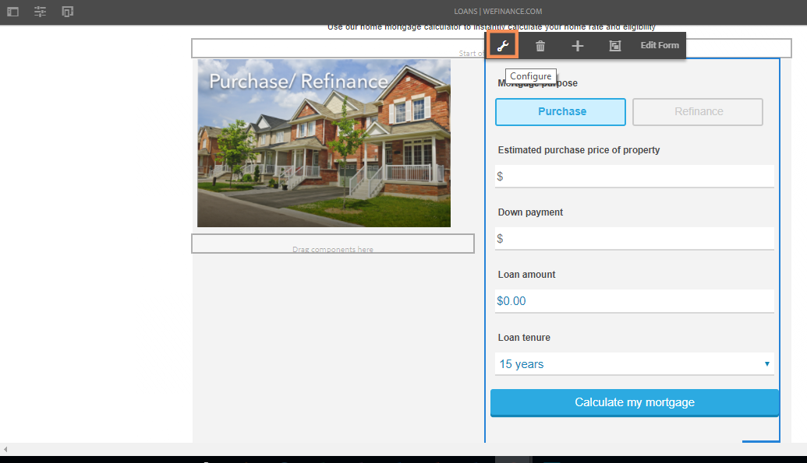

# Configurar Microsoft Dynamics 365 para el flujo de trabajo de hipoteca de origen del sitio de referencia We.Finance {#configure-microsoft-dynamics-for-the-home-mortgage-workflow-of-the-we-finance-reference-site}

Obtenga información sobre cómo aprovechar los servicios de Microsoft® Dynamics 365 mediante formularios adaptables para el flujo de trabajo de hipotecas domésticas del sitio de referencia We.Finance

## Información general {#overview}

Microsoft® Dynamics 365 es un software de administración de la relación con los clientes (CRM) y de planificación de recursos empresariales (ERP) que proporciona soluciones empresariales para crear y administrar cuentas de clientes, contactos, posibles clientes, oportunidades y casos.

AEM Forms proporciona un servicio en la nube para integrar Dynamics 365 con el módulo de integración [de datos de](/help/forms/using/data-integration.md) Forms. El tutorial de la aplicación hipoteca [doméstica del escenario con Microsoft® Dynamics](/help/forms/using/finance-reference-site-walkthrough.md#home-mortgage-application-walkthrough-with-microsoft-dynamics) muestra cómo un cliente utiliza el sitio de referencia We.Finance para solicitar un préstamo cuando el sitio utiliza Microsoft® Dynamics para la integración de datos de Forms. Antes de poder usar el tutorial de la aplicación hipoteca doméstica con el escenario Microsoft® Dynamics, debe configurar Microsoft® Dynamics 365 para que se utilice con el sitio de referencia We.Finance.

## Requisitos previos {#prerequisites}

Antes de comenzar a configurar y configurar Dynamics 365, asegúrese de que:

* [Configure y configure sitios](/help/forms/using/setup-reference-sites.md)de referencia de AEM Forms.

* AEM 6.3 Forms Service Pack 1 y posterior
* Cuenta de Microsoft® Dynamics 365
* Aplicación registrada para el servicio Dynamics 365 con Microsoft® Azure Active Directory
* ID de cliente y secreto de cliente para la aplicación registrada

## Vincule la calculadora de hipoteca con la página de inicio del sitio {#link-the-home-mortgage-calculator-with-your-site-home-page}

1. En la instancia de creación, vaya a la siguiente página:

   `https://[server]:[port]/editor.html/content/we-finance/global/en/loan-landing-page.html`

1. Desplácese hacia abajo hasta la calculadora de hipotecas domésticas.
1. Resalte el panel de la columna derecha (calculadora) y toque para mostrar el menú emergente. En el menú emergente, toque Configurar. Aparecerá el cuadro de diálogo Editar Contenedor de AEM Forms.

   

1. En el cuadro de diálogo Editar Contenedor de AEM Forms, examine la ruta de acceso del recurso y seleccione la calculadora de hipotecas domésticas en la siguiente ruta y toque **Confirmar**:

   formsanddocuments/We.Finance/MS Dynamics/

   

1. Puntee **Listo**.
1. Publique la página editada.

   >[!NOTE]
   >
   >El enlace de los campos de la calculadora con el FDM está preconfigurado a través del paquete del sitio de referencia We.Finance. Para vista del enlace, puede abrir el formulario en el modo de creación y ver las referencias de enlace de campo.

1. Para crear una entidad personalizada para almacenar el registro de solicitante para la aplicación de hipoteca, importe el paquete de la solución AEMFormsFSIRefsite_1_0.zip a la instancia de Microsoft® Dynamics:

   1. Descargue el paquete de:

      `https://'[server]:[port]'/content/aemforms-refsite-collaterals/we-finance/home-mortgage/ms-dynamics/AEMFormsFSIRefsite_1_0.zip`

   1. Importe el paquete de soluciones a la instancia de Microsoft® Dynamics. En la instancia de Microsoft® Dynamics, vaya a **Configuración** > **Soluciones** y, a continuación, toque **Importar**.

1. Para configurar los detalles de contacto del usuario utilizados en el refsite, importe el paquete Sarah Rose Contact.CSV a la instancia de Microsoft® Dynamics:

   1. Descargue el paquete de:

      `https://'[server]:[port]'/content/aemforms-refsite-collaterals/we-finance/home-mortgage/ms-dynamics/Sarah%20Rose%20Contact.csv`

   1. Importe el paquete a su instancia de Microsoft® Dynamics. En la instancia de Microsoft® Dynamics, vaya a **Ventas** > **Contactos** y, a continuación, toque **Importar datos**.

