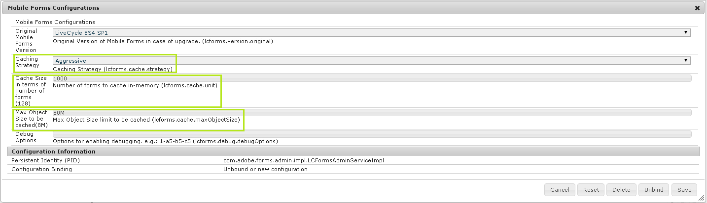

# Ajuste del rendimiento del servidor de AEM Forms{#performance-tuning-of-aem-forms-server}

Este artículo analiza las estrategias y las prácticas recomendadas que puede implementar para reducir los cuellos de botella y optimizar el rendimiento de su implementación de AEM Forms.

## Configuración de caché {#cache-settings}

Puede configurar y controlar la estrategia de almacenamiento en caché de AEM Forms mediante el **Configuraciones de Mobile Forms** AEM en la consola de configuración web de en:

* (AEM Forms en OSGi)`https://'[server]:[port]'/system/console/configMgr`
* (AEM Forms en JEE)`https://'[server]:[port]'/lc/system/console/configMgr`

Las opciones disponibles para el almacenamiento en caché son las siguientes:

* **Ninguno**: no se almacena en caché ningún artefacto. Esto, en la práctica, ralentiza el rendimiento y requiere una alta disponibilidad de memoria debido a la ausencia de caché.
* **Conservador**: almacena en caché únicamente los artefactos intermedios que se generan antes de procesar el formulario, como una plantilla que contenga fragmentos e imágenes en línea.
* **Agresivo**: almacena en caché casi todos los elementos que se pueden almacenar, incluido el contenido HTML procesado, además de todos los artefactos del nivel de almacenamiento en caché Conservador. Es la opción que mejor rendimiento produce, pero también consume más memoria para almacenar artefactos en caché. Una estrategia agresiva de almacenamiento en caché significa que se obtiene un rendimiento de tiempo constante al procesar un formulario a medida que el contenido procesado se almacena en caché.

Es posible que la configuración de caché predeterminada de AEM Forms no sea lo suficientemente buena como para obtener un rendimiento óptimo. Por lo tanto, se recomienda utilizar la siguiente configuración:

* **Estrategia de caché**: agresiva
* **Tamaño de caché** (en términos de número de formularios): según los requisitos
* **Tamaño máximo del objeto**: según los requisitos



>[!NOTE]
>
>Si utiliza AEM Dispatcher para almacenar en caché los formularios adaptables, también almacenará en caché el formulario adaptable que contiene formularios con datos rellenados previamente. AEM Si estos formularios se proporcionan desde la caché de Dispatcher de la, puede provocar que se proporcionen datos rellenados previamente o antiguos a los usuarios. Por lo tanto, utilice AEM Dispatcher para almacenar en caché formularios adaptables que no utilicen datos rellenados previamente. Además, una caché de Dispatcher no invalida automáticamente los fragmentos en caché. Eso significa que no debe utilizarlo para almacenar en caché fragmentos de formulario. Para este tipo de formularios y fragmentos, utilice la [caché de formularios adaptables](../../forms/using/configure-adaptive-forms-cache.md).

## Parámetros de JVM {#jvm-parameters}

Para obtener un rendimiento óptimo, se recomienda utilizar la siguiente JVM `init` argumentos para configurar la variable `Java heap` y `PermGen`.

```shell
set CQ_JVM_OPTS=%CQ_JVM_OPTS% -Xms8192m
set CQ_JVM_OPTS=%CQ_JVM_OPTS% -Xmx8192m
set CQ_JVM_OPTS=%CQ_JVM_OPTS% -XX:PermSize=256m
set CQ_JVM_OPTS=%CQ_JVM_OPTS% -XX:MaxPermSize=1024m
```

>[!NOTE]
>
>La configuración recomendada es específica del JDK de Windows 2008 R2 8 Core y Oracle HotSpot 1.7 (64 bits), y debe ampliarse o reducirse según la configuración del sistema.

## Uso de un servidor web {#using-a-web-server}

Los formularios adaptables y los formularios HTML5 se procesan en formato HTML5. Dependiendo de factores como el tamaño del formulario y las imágenes que este contiene, la salida resultante puede tener un gran tamaño. El método recomendado para optimizar la transferencia de datos es comprimir la respuesta del HTML mediante el servidor web desde el que se suministra la solicitud. Este método reduce el tamaño de la respuesta, el tráfico de red y el tiempo necesario para transmitir los datos entre los equipos cliente y servidor.

Por ejemplo, realice los siguientes pasos para habilitar la compresión en Apache Web Server 2.0 de 32 bits con JBoss®:

>[!NOTE]
>
>Las siguientes instrucciones no se aplican a ningún servidor distinto de Apache Web Server 2.0 de 32 bits. Para ver los pasos específicos de cualquier otro servidor, consulte la documentación del producto correspondiente.

Los siguientes pasos muestran los cambios necesarios para habilitar la compresión con Apache Web Server

**Obtenga el software del servidor web Apache aplicable a su sistema operativo**.

* Windows: descargue el servidor web Apache desde el sitio del proyecto Apache HTTP Server.
* Solaris™ de 64 bits: descargue el servidor web Apache desde el sitio web de Sunfreeware para Solaris™.
* Linux®: el servidor web Apache está preinstalado en un sistema Linux®.

Apache puede comunicarse con CRX mediante el protocolo HTTP. El objetivo de las configuraciones es la optimización mediante HTTP.

1. Elimine los comentarios de las siguientes configuraciones de módulo en el archivo `APACHE_HOME/conf/httpd.conf`.

   ```shell
   LoadModule proxy_balancer_module modules/mod_proxy.so
   LoadModule proxy_balancer_module modules/mod_proxy_http.so
   LoadModule deflate_module modules/mod_deflate.so
   ```

   >[!NOTE]
   >
   >En Linux®, la opción predeterminada `APACHE_HOME` es `/etc/httpd/`.

1. Configure el proxy en el puerto 4502 de CRX.
Añada la siguiente configuración en el archivo de configuración `APACHE_HOME/conf/httpd.conf`.

   ```shell
   ProxyPass / https://<server>:4502/
   ProxyPassReverse / https://<server>:4502/
   ```

1. Habilite la Compresión. Añada la siguiente configuración en el archivo de configuración `APACHE_HOME/conf/httpd.conf`.

   **Para formularios HTML5**

   ```xml
   <Location /content/xfaforms>
       <IfModule mod_deflate.c>
           SetOutputFilter DEFLATE
           #Do not compress
           SetEnvIfNoCase Request_URI \.(?:gif|jpe?g|png)$ no-gzip dont-vary
           SetEnvIfNoCase Request_URI \.(?:exe|t?gz|zip|bz2|sit|rar)$ no-gzip dont-vary
           #Dealing with proxy servers
               <IfModule mod_headers.c>
                   Header append Vary User-Agent
               </IfModule>
       </IfModule>
   </Location>
   ```

   **Para formularios adaptables**

   ```xml
   <Location /content/forms/af>
       <IfModule mod_deflate.c>
           SetOutputFilter DEFLATE
           #Do not compress
           SetEnvIfNoCase Request_URI \.(?:gif|jpe?g|png)$ no-gzip dont-vary
           SetEnvIfNoCase Request_URI \.(?:exe|t?gz|zip|bz2|sit|rar)$ no-gzip dont-vary
           #Dealing with proxy servers
               <IfModule mod_headers.c>
                   Header append Vary User-Agent
               </IfModule>
       </IfModule>
   </Location>
   ```

   Para acceder al servidor CRX, utilice `https://'server':80`, donde `server` es el nombre del servidor en el que se está ejecutando el servidor Apache.

## Uso de un antivirus en un servidor que ejecuta AEM Forms {#using-an-antivirus-on-server-running-aem-forms}

Es posible que experimente un rendimiento lento en los servidores que ejecutan un software antivirus. Un software antivirus siempre activo (análisis en tiempo real) analiza todos los archivos de un sistema. Esto puede ralentizar el servidor y afectar al rendimiento de AEM Forms.

Para mejorar el rendimiento, puede configurar el software antivirus para que excluya los siguientes archivos y carpetas de AEM Forms del análisis siempre activo (en tiempo real):

* El directorio de instalación de AEM. Si no es posible excluir el directorio completo, excluya los siguientes elementos:

   * [El directorio de instalación de AEM]\crx-repository\temp
   * [El directorio de instalación de AEM]\crx-repository\repository
   * [El directorio de instalación de AEM]\crx-repository\launchpad

* El directorio temporal del servidor de aplicaciones. La ubicación predeterminada es:

   * (JBoss®) [AEM directorio de instalación de]\jboss\standalone\tmp
   * (WebLogic) \Oracle\Middleware\user_projects\domains\LCDomain\servers\LCServer1\tmp
   * (WebSphere®) \Program Files\IBM\WebSphere\AppServer\profiles\AppSrv01\temp

* **(Solo AEM Forms en JEE)** El directorio de almacenamiento global de documentos (GDS). La ubicación predeterminada es:

   * (JBoss®) [raíz de appserver]/server/&#39;server&#39;/svcnative/DocumentStorage
   * (WebLogic) [appserverdomain]/&#39;server&#39;/adobe/LiveCycleServer/DocumentStorage
   * (WebSphere®) [raíz de appserver]/installApps/adobe/&#39;server&#39;/DocumentStorage

* **(solo AEM Forms en JEE)** Registros del servidor de AEM Forms y directorio temporal. La ubicación predeterminada es:

   * Registros del servidor - [Directorio de instalación de AEM Forms]\Adobe\AEM formularios\[servidor de aplicaciones]\server\all\logs
   * Directorio temporal - [Directorio de instalación de AEM Forms]\temp

>[!NOTE]
>
>* Si utiliza una ubicación diferente para el GDS y el directorio temporal, abra AdminUI en `https://'[server]:[port]'/adminui`, vaya a **Inicio > Configuración > Configuración del sistema principal > Configuraciones principales** para confirmar la ubicación utilizada.
>
* Si el servidor de AEM Forms funciona lentamente incluso después de excluir los directorios sugeridos, excluya también el archivo ejecutable Java™ (java.exe).
>
