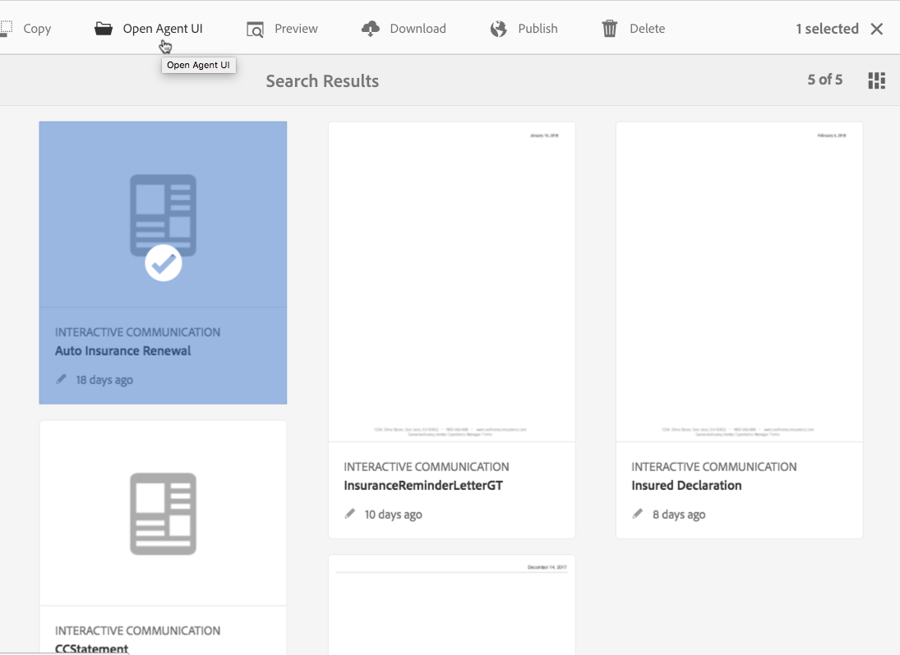
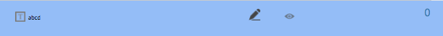

# Preparación y envío de comunicación interactiva mediante la interfaz de usuario del agente {#prepare-and-send-interactive-communication-using-the-agent-ui}

La interfaz de usuario del agente permite a los agentes preparar y enviar la comunicación interactiva al proceso posterior. El agente realiza las modificaciones necesarias según lo permitido y envía la comunicación interactiva a un proceso de publicación, como correo electrónico o impresión.

## Información general {#overview}

Después de crear una comunicación interactiva, el agente puede abrir la comunicación interactiva en la interfaz de usuario del agente y preparar una copia específica del destinatario introduciendo datos y administrando contenido y archivos adjuntos. Por último, el agente puede enviar la comunicación interactiva a un proceso posterior.

Mientras prepara la comunicación interactiva mediante la interfaz de usuario del agente, el agente administra los siguientes aspectos de la comunicación interactiva en la interfaz de usuario del agente antes de enviarla a un proceso de publicación:

* **Datos**: La ficha Datos de la interfaz de usuario del agente muestra todas las variables editables por el agente y las propiedades del modelo de datos de formulario desbloqueadas en la comunicación interactiva. Estas variables/propiedades se crean al editar o crear fragmentos de documento incluidos en la Comunicación interactiva. La ficha Datos también incluye los campos creados en la plantilla de canal XDP/impresión. La ficha Datos solo aparece cuando hay variables, propiedades del modelo de datos de formulario o campos en la comunicación interactiva que el agente pueda editar.
* **Contenido**: En la ficha Contenido, el agente administra el contenido, como fragmentos de documento y variables de contenido, en la Comunicación interactiva. El agente puede realizar los cambios en el fragmento de documento como se permite al crear la comunicación interactiva en las propiedades de esos fragmentos de documento. El agente también puede reordenar, agregar o quitar un fragmento de documento y agregar saltos de página, si se permite.
* **Datos adjuntos**: La ficha Datos adjuntos aparece en la interfaz de usuario del agente solo si la comunicación interactiva tiene datos adjuntos o si el agente tiene acceso a la biblioteca. El agente puede o no tener permiso para cambiar o editar los archivos adjuntos.

## Preparación de la comunicación interactiva mediante la interfaz de usuario del agente {#prepare-interactive-communication-using-the-agent-ui}

1. Seleccione **[!UICONTROL Formularios]** > **[!UICONTROL Formularios y documentos]**.
1. Seleccione la comunicación interactiva adecuada y toque **[!UICONTROL Abrir interfaz de usuario]** del agente.

   >[!NOTE]
   >
   >La interfaz de usuario del agente solo funciona si la comunicación interactiva seleccionada tiene un canal de impresión.

   

   En función del contenido y las propiedades de la comunicación interactiva, aparece la interfaz de usuario del agente con las tres fichas siguientes: Datos, Contenido y Datos adjuntos.

   

   Proceda a introducir datos, administrar el contenido y administrar los archivos adjuntos.

### Introducir datos {#enter-data}

1. En la ficha Datos, introduzca los datos de las variables, las propiedades del modelo de datos de formulario y los campos de plantilla de impresión (XDP), según sea necesario. Rellene todos los campos obligatorios marcados con un asterisco (&amp;ast;) para activar el botón **Enviar** .

   Toque un valor de campo de datos en la vista previa de Comunicación interactiva para resaltar el campo de datos correspondiente en la ficha Datos o viceversa.

### Gestionar contenido {#manage-content}

En la ficha Contenido, administre el contenido como fragmentos de documento y variables de contenido en la Comunicación interactiva.

1. Select **[!UICONTROL Content]**. Aparece la ficha de contenido de la comunicación interactiva.

   

1. Edite los fragmentos del documento, según sea necesario, en la ficha Contenido. Para enfocar el fragmento relevante en la jerarquía de contenido, puede tocar la línea o el párrafo correspondiente en la vista previa de la comunicación interactiva o tocar el fragmento directamente en la jerarquía de contenido.

   Por ejemplo, el fragmento de documento con la línea &quot;Realizar un pago en línea ahora ... &quot; se selecciona en la vista previa en el gráfico de abajo y se selecciona el mismo fragmento de documento en la ficha Contenido.

   

   En la ficha Contenido o Datos, al tocar Resaltar módulos seleccionados en el contenido ( ) en la parte superior izquierda de la vista previa, puede desactivar o habilitar la funcionalidad para ir al fragmento de documento cuando se toca/selecciona el texto, el párrafo o el campo de datos relevantes en la vista previa.

   Los fragmentos que el agente puede editar al crear la comunicación interactiva tienen el icono Editar contenido seleccionado ( ). Toque el icono Editar contenido seleccionado para iniciar el fragmento en modo de edición y realizar cambios en él. Utilice las siguientes opciones para dar formato y administrar el texto:

   * [Opciones de formato](#formattingtext)

      * [Copiar y pegar texto con formato de otras aplicaciones](#pasteformattedtext)
      * [Resaltar partes del texto](#highlightemphasize)
   * [Caracteres especiales](#specialcharacters)
   * [Métodos abreviados de teclado](/help/forms/using/keyboard-shortcuts.md)
   Para obtener más información sobre las acciones disponibles para varios fragmentos de documento en la interfaz de usuario del agente, consulte [Acciones e información disponibles en la interfaz](#actionsagentui)de usuario del agente.

1. Para agregar un salto de página al resultado de impresión de la Comunicación interactiva, coloque el cursor donde desee insertar un salto de página y seleccione Salto de página antes o Salto de página después de ( ).

   Se inserta un marcador de posición de salto de página explícito en la Comunicación interactiva. Para ver cómo un salto de página explícito afecta a la comunicación interactiva, consulte la vista previa de impresión.

   

   Continúe con la administración de los archivos adjuntos de la Comunicación interactiva.

### Administrar archivos adjuntos {#manage-attachments}

1. Seleccione **[!UICONTROL Datos adjuntos]**. La interfaz de usuario del agente muestra los archivos adjuntos disponibles tal como están configurados al crear la comunicación interactiva.

   Puede optar por no enviar un archivo adjunto junto con la comunicación interactiva tocando el icono de vista y puede tocar la cruz del archivo adjunto para eliminarlo (si el agente puede eliminar u ocultar el archivo adjunto) de la comunicación interactiva. Para los archivos adjuntos especificados como obligatorios al crear la comunicación interactiva, los iconos Ver y Eliminar están desactivados.

   

1. Toque el icono de acceso a la biblioteca (acceso a la ) para acceder a la biblioteca de contenido e insertar recursos DAM como archivos adjuntos.

   >[!NOTE]
   >
   >El icono de acceso a biblioteca solo está disponible si se ha activado el acceso a la biblioteca al crear la comunicación interactiva (en las propiedades del contenedor de documentos del canal de impresión).

1. Si el orden de los datos adjuntos no estaba bloqueado durante la creación de la comunicación interactiva, puede reordenarlos seleccionando un archivo adjunto y tocando las flechas hacia abajo y hacia arriba.
1. Utilice la vista previa de Web y la vista previa de impresión para ver si las dos salidas son las que necesita.

   Si considera que las vistas previas son satisfactorias, toque **[!UICONTROL Enviar]** para enviar o enviar la comunicación interactiva a un proceso de anuncio. O bien, para realizar cambios, salga de la vista previa para volver a realizar los cambios.

## Formato del texto {#formattingtext}

Al editar un fragmento de texto en la interfaz de usuario del agente, la barra de herramientas cambia según el tipo de edición que elija: Fuente, Párrafo o Lista:

 

Fuente, barra de herramientas

Barra de herramientas Párrafo

Lista, barra de herramientas

### Resaltar/enfatizar partes del texto {#highlightemphasize}

Para resaltar o resaltar partes del texto en un fragmento editable, seleccione el texto y toque Color de resaltado.

### Pegar texto con formato {#pasteformattedtext}

### Insertar caracteres especiales en el texto {#specialcharacters}

La interfaz de usuario del agente ha incorporado la compatibilidad con 210 caracteres especiales. El administrador puede [añadir compatibilidad con más caracteres especiales personalizados personalizándolos](/help/forms/using/custom-special-characters.md).

#### Entrega de datos adjuntos {#attachmentdelivery}

* Cuando la comunicación interactiva se procesa con las API del lado del servidor como un PDF interactivo o no interactivo, el PDF procesado contiene archivos adjuntos como archivos PDF adjuntos.
* Cuando se carga un proceso de publicación asociado a una comunicación interactiva como parte del parámetro Enviar mediante la interfaz de usuario del agente, los archivos adjuntos se pasan como parámetro List&lt;com.adobe.idp.Document> inAttachmentDocs.
* Los flujos de trabajo del mecanismo de entrega, como correo electrónico e impresión, también proporcionan archivos adjuntos junto con la versión en PDF de la Comunicación interactiva.

## Acciones e información disponibles en la interfaz de usuario del agente {#actionsagentui}

### Document fragments {#document-fragments}

* **Flechas** arriba/abajo: Flechas para mover los fragmentos del documento hacia arriba o hacia abajo en la Comunicación interactiva.
* **Eliminar**: Si está permitido, elimine el fragmento de documento de la comunicación interactiva.
* **Salto de página antes** (aplicable a fragmentos secundarios del área de destino): Inserta un salto de página antes del fragmento del documento.
* **Sangría**: Aumentar o reducir la sangría de un fragmento de documento.
* **Salto de página después** (aplicable a fragmentos secundarios del área de destino): Inserta un salto de página después del fragmento de documento.

* Editar (solo fragmentos de texto): Abra el editor de texto enriquecido para editar el fragmento del documento de texto. Para obtener más información, consulte [Formato del texto](#formattingtext).

* Selección (icono de ojo): Incluye\excluye el fragmento de documento de la comunicación interactiva.
* Valores no rellenados (información): Indica el número de variables sin rellenar en el fragmento del documento.

### Lista de fragmentos de documentos {#list-document-fragments}

* Insertar línea en blanco: Inserta una nueva línea en blanco.
* Selección (icono de ojo): Incluye\excluye el fragmento de documento de la comunicación interactiva.
* Omitir viñetas/numeraciones: Active esta opción para omitir viñetas/numeración en el fragmento del documento de la lista.
* Valores no rellenados (información): Indica el número de variables sin rellenar en el fragmento del documento.

