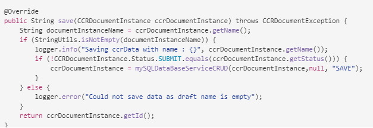

# Prepare y envíe comunicación interactiva mediante la interfaz de usuario del agente {#prepare-and-send-interactive-communication-using-the-agent-ui}

La interfaz de usuario del agente permite a los agentes preparar y enviar la comunicación interactiva al proceso posterior. El agente realiza las modificaciones necesarias según lo permitido y envía la comunicación interactiva a un proceso posterior, como correo electrónico o impresión.

## Información general {#overview}

Una vez creada una comunicación interactiva, el agente puede abrir la comunicación interactiva en la interfaz de usuario del agente y preparar una copia específica del destinatario introduciendo datos y administrando contenido y archivos adjuntos. Por último, el agente puede enviar la comunicación interactiva a un proceso posterior.

Al preparar la comunicación interactiva mediante la interfaz de usuario del agente, el agente administra los siguientes aspectos de la comunicación interactiva en la interfaz de usuario del agente antes de enviarla a un proceso posterior:

* **Datos**: La ficha Datos de la interfaz de usuario del agente muestra todas las variables editables por el agente y las propiedades del modelo de datos de formulario desbloqueadas en la comunicación interactiva. Estas variables/propiedades se crean al editar o crear fragmentos de documento incluidos en la comunicación interactiva. La pestaña Data también incluye todos los campos creados en la plantilla XDP/print channel . La ficha Datos solo aparece cuando el agente puede editar alguna variable, propiedad del modelo de datos de formulario o campo en la comunicación interactiva.
* **Contenido**: En la pestaña Contenido , el agente administra el contenido, como los fragmentos de documento y las variables de contenido, de la comunicación interactiva. El agente puede realizar los cambios en el fragmento de documento como se permiten al crear la comunicación interactiva en las propiedades de esos fragmentos de documento. El agente también puede reordenar, agregar o quitar un fragmento de documento y agregar saltos de página, si se permite.
* **Archivos adjuntos**: La ficha Archivos adjuntos aparece en la interfaz de usuario del agente solo si la comunicación interactiva tiene datos adjuntos o si el agente tiene acceso a la biblioteca. Puede permitirse o no que el agente cambie o edite los archivos adjuntos.

## Preparación de la comunicación interactiva mediante la interfaz de usuario del agente {#prepare-interactive-communication-using-the-agent-ui}

1. Seleccione **[!UICONTROL Forms]** > **[!UICONTROL Forms &amp; Documents]**.
1. Seleccione la comunicación interactiva adecuada y pulse **[!UICONTROL Abrir interfaz de usuario del agente]**.

   >[!NOTE]
   >
   >La interfaz de usuario del agente solo funciona si la comunicación interactiva seleccionada tiene un canal de impresión.

   

   En función del contenido y las propiedades de la comunicación interactiva, la interfaz de usuario del agente aparece con las tres pestañas siguientes: Datos, contenido y datos adjuntos.

   

   Proceda a introducir datos, administrar el contenido y administrar los archivos adjuntos.

### Introducir datos {#enter-data}

1. En la pestaña Data , introduzca los datos de las variables, las propiedades del modelo de datos de formulario y los campos de plantilla de impresión (XDP), según sea necesario. Rellene todos los campos obligatorios marcados con un asterisco (&amp;ast;) para habilitar el botón **Submit**.

   Pulse un valor de campo de datos en la vista previa de comunicación interactiva para resaltar el campo de datos correspondiente en la ficha Datos o viceversa.

### Gestionar contenido {#manage-content}

En la pestaña Contenido , administre el contenido, como los fragmentos del documento y las variables de contenido, en la Comunicación interactiva.

1. Seleccione **[!UICONTROL Content]**. Aparece la pestaña contenido de la comunicación interactiva.

   

1. Edite los fragmentos del documento, según sea necesario, en la pestaña Content . Para enfocar el fragmento relevante en la jerarquía de contenido, puede tocar la línea o el párrafo correspondiente en la vista previa de comunicación interactiva o pulsar el fragmento directamente en la jerarquía de contenido.

   Por ejemplo, el fragmento de documento con la línea &quot;Realizar un pago en línea ahora ...&quot; está seleccionado en la vista previa del gráfico siguiente y el mismo fragmento de documento se ha seleccionado en la pestaña Contenido .

   

   En la ficha Contenido o Datos, al pulsar Resaltar los módulos seleccionados en el contenido ( ) en la parte superior izquierda de la vista previa, puede deshabilitar o habilitar la funcionalidad para ir al fragmento del documento cuando el texto, el párrafo o el campo de datos relevantes se toca o selecciona en la vista previa.

   Los fragmentos que el agente puede editar al crear la comunicación interactiva tienen el icono Editar contenido seleccionado ( ). Pulse el icono Editar contenido seleccionado para iniciar el fragmento en modo de edición y realizar cambios en él. Utilice las siguientes opciones para dar formato y administrar texto:

   * [Opciones de formato](#formattingtext)

      * [Copiar y pegar texto con formato de otras aplicaciones](#pasteformattedtext)
      * [Resaltar partes del texto](#highlightemphasize)
   * [Caracteres especiales](#specialcharacters)
   * [Métodos abreviados del teclado](/help/forms/using/keyboard-shortcuts.md)

   Para obtener más información sobre las acciones disponibles para varios fragmentos de documento en la interfaz de usuario del agente, consulte [Acciones e información disponible en la interfaz de usuario del agente](#actionsagentui).

1. Para añadir un salto de página a la salida de impresión de la comunicación interactiva, coloque el cursor donde desee insertar un salto de página y seleccione Salto de página antes o Salto de página después ( ).

   En la comunicación interactiva se inserta un marcador de posición de salto de página explícito. Para ver cómo un salto de página explícito afecta a la comunicación interactiva, consulte la vista previa de impresión.

   

   Continúe administrando los archivos adjuntos de la Comunicación interactiva.

### Administrar archivos adjuntos {#manage-attachments}

1. Seleccione **[!UICONTROL Attachment]**. La interfaz de usuario del agente muestra los archivos adjuntos disponibles tal como están configurados al crear la comunicación interactiva.

   Puede optar por no enviar un archivo adjunto junto con la comunicación interactiva tocando el icono de vista y puede pulsar la cruz del archivo adjunto para eliminarlo (si el agente puede eliminar u ocultar el archivo adjunto) de la comunicación interactiva. Para los archivos adjuntos especificados como obligatorios al crear la comunicación interactiva, los iconos Ver y Eliminar están desactivados.

   

1. Pulse el icono de acceso a biblioteca ( ) para acceder a la biblioteca de contenido e insertar los recursos DAM como archivos adjuntos.

   >[!NOTE]
   >
   >El icono Acceso a biblioteca solo está disponible si el acceso a la biblioteca estaba habilitado al crear la comunicación interactiva (en las propiedades del contenedor de documentos del canal Imprimir).

1. Si el orden de los archivos adjuntos no estaba bloqueado al crear la comunicación interactiva, puede reordenar los archivos adjuntos seleccionando un archivo adjunto y pulsando las flechas abajo y arriba.
1. Utilice Vista previa en la Web y Vista previa de impresión para ver si las dos salidas son las que necesite.

   Si las vistas previas le parecen satisfactorias, pulse **[!UICONTROL Enviar]** para enviar la comunicación interactiva a un proceso posterior. O para realizar cambios, salga de la vista previa para volver a los cambios realizados.

## Formato de texto {#formattingtext}

Al editar un fragmento de texto en la interfaz de usuario del agente, la barra de herramientas cambia según el tipo de ediciones que elija realizar: Fuente, párrafo o lista:

 

Barra de herramientas Fuente


Barra de herramientas Párrafo


Barra de herramientas de lista

### Resaltar/resaltar partes del texto {#highlightemphasize}

Para resaltar o resaltar partes de texto en un fragmento editable, seleccione el texto y pulse Resaltar color.


### Pegar texto con formato {#pasteformattedtext}


### Insertar caracteres especiales en el texto {#specialcharacters}

La interfaz de usuario del agente ha incorporado la compatibilidad con 210 caracteres especiales. El administrador puede [añadir compatibilidad para más caracteres especiales personalizados mediante personalización](/help/forms/using/custom-special-characters.md).

#### Entrega de archivos adjuntos {#attachmentdelivery}

* Cuando la comunicación interactiva se procesa con API del lado del servidor como PDF interactivo o no interactivo, el PDF procesado contiene archivos adjuntos como archivos adjuntos PDF.
* Cuando se carga un proceso de publicación asociado a una comunicación interactiva como parte de Enviar mediante la interfaz de usuario del agente, los archivos adjuntos se pasan como parámetro List&lt;com.adobe.idp.Document> inAttachmentDocs .
* Los flujos de trabajo del mecanismo de entrega, como el correo electrónico y la impresión, también proporcionan archivos adjuntos junto con la versión PDF de la Comunicación interactiva.

## Acciones e información disponible en la interfaz de usuario del agente {#actionsagentui}

### Fragmentos de documento {#document-fragments}


* **Flechas** arriba/abajo: Flechas para mover fragmentos de documento hacia arriba o hacia abajo en la Comunicación interactiva.
* **Eliminar**: Si está permitido, elimine el fragmento del documento de la comunicación interactiva.
* **Salto de página antes**  (aplicable a fragmentos secundarios de área de destino): Inserta un salto de página antes del fragmento de documento.
* **Sangría**: Aumente o disminuya la sangría de un fragmento de documento.
* **Salto de página después de**  (aplicable a fragmentos secundarios de área de destino): Inserta un salto de página después del fragmento de documento.


* Editar (solo fragmentos de texto): Abra el editor de texto enriquecido para editar el fragmento del documento de texto. Para obtener más información, consulte [Formato del texto](#formattingtext).

* Selección (icono de ojo): Incluye\excluye el fragmento de documento de la comunicación interactiva.
* Valores no rellenados (información): Indica el número de variables no rellenadas en el fragmento de documento.

### Lista de fragmentos de documento {#list-document-fragments}


* Insertar línea en blanco: Inserta una nueva línea en blanco.
* Selección (icono de ojo): Incluye\excluye el fragmento de documento de la comunicación interactiva.
* Omitir viñetas/numeraciones: Active esta opción para omitir viñetas/numeración en el fragmento del documento de la lista.
* Valores no rellenados (información): Indica el número de variables no rellenadas en el fragmento de documento.

## Guardar comunicaciones interactivas como borrador {#save-as-draft}

Puede utilizar la interfaz de usuario del agente para guardar uno o más borradores para cada comunicación interactiva y recuperar el borrador más adelante para seguir trabajando en él. Puede especificar un nombre diferente para cada borrador para identificarlo.

Adobe recomienda ejecutar estas instrucciones de forma secuencial para guardar correctamente una comunicación interactiva como borrador.

### Habilitar la función Guardar como borrador {#before-save-as-draft}

La función Guardar como borrador no está activada de forma predeterminada. Siga estos pasos para habilitar la función:

1. Implemente la [ccrDocumentInstance](https://helpx.adobe.com/experience-manager/6-5/forms/javadocs/com/adobe/fd/ccm/ccr/ccrDocumentInstance/api/services/CCRDocumentInstanceService.html) Interfaz de proveedor de servicios (SPI).

   El SPI permite guardar la versión borrador de la comunicación interactiva en la base de datos con un ID de borrador como identificador único. Estas instrucciones suponen que tiene conocimientos previos sobre cómo construir un paquete OSGi usando un proyecto Maven.

   Para obtener ejemplos de implementación de SPI, consulte [Ejemplo de implementación de ccrDocumentInstance SPI](#sample-ccrDocumentInstance-spi).
1. Abra `http://<hostname>:<port>/ system/console/bundles` y pulse **[!UICONTROL Instalar/Actualizar]** para cargar el paquete OSGi. Compruebe que el estado del paquete cargado se muestra como **Activo**. Reinicie el servidor si el estado del paquete no se muestra como **Active**.
1. Ir a `https://'[server]:[port]'/system/console/configMgr`.
1. Pulse **[!UICONTROL Crear configuración de correspondencia]**.
1. Seleccione **[!UICONTROL Habilitar Guardar usando CCRDocumentInstanceService]** y pulse **[!UICONTROL Guardar]**.

### Guardar una comunicación interactiva como borrador {#save-as-draft-agent-ui}

Realice los siguientes pasos para guardar una comunicación interactiva como borrador:

1. Seleccione una comunicación interactiva en Forms Manager y pulse **[!UICONTROL Abrir interfaz de usuario del agente]**.

1. Realice los cambios correspondientes en la interfaz de usuario del agente y pulse **[!UICONTROL Guardar como borrador]**.

1. Especifique el nombre del borrador en el campo **[!UICONTROL Name]** y pulse **[!UICONTROL Listo]**.

Una vez guardada la comunicación interactiva como borrador, pulse **[!UICONTROL Guardar cambios]** para guardar cualquier cambio adicional en el borrador.

### Recupere el borrador de una comunicación interactiva {#retrieve-draft}

Después de guardar una comunicación interactiva como borrador, puede recuperarla para continuar trabajando en ella. Recupere la comunicación interactiva mediante:

`https://server:port/aem/forms/createcorrespondence.hmtl?draftid=[draftid]`

[] borrador hace referencia al identificador único de la versión borrador que se genera después de guardar una comunicación interactiva como borrador.

>[!NOTE]
>
>Si realiza cambios en la Comunicación interactiva después de guardarla como borrador, la versión de borrador no se abre.

### Ejemplo de implementación de crDocumentInstance SPI {#sample-ccrDocumentInstance-spi}

Implemente el SPI `ccrDocumentInstance` para guardar una comunicación interactiva como borrador. A continuación se muestra una implementación de muestra del SPI `ccrDocumentInstance`.

```javascript
package Implementation;

import com.adobe.fd.ccm.ccr.ccrDocumentInstance.api.exception.CCRDocumentException;
import com.adobe.fd.ccm.ccr.ccrDocumentInstance.api.model.CCRDocumentInstance;
import com.adobe.fd.ccm.ccr.ccrDocumentInstance.api.services.CCRDocumentInstanceService;
import org.apache.commons.lang3.StringUtils;
import org.osgi.service.component.annotations.Component;
import org.slf4j.Logger;
import org.slf4j.LoggerFactory;

import java.util.*;


@Component(service = CCRDocumentInstanceService.class, immediate = true)
public class CCRDraftService implements CCRDocumentInstanceService {

    private static final Logger logger = LoggerFactory.getLogger(CCRDraftService.class);

    private HashMap<String, Object> draftDataMap = new HashMap<>();

    @Override
    public String save(CCRDocumentInstance ccrDocumentInstance) throws CCRDocumentException {
        String documentInstanceName = ccrDocumentInstance.getName();
        if (StringUtils.isNotEmpty(documentInstanceName)) {
            logger.info("Saving ccrData with name : {}", ccrDocumentInstance.getName());
            if (!CCRDocumentInstance.Status.SUBMIT.equals(ccrDocumentInstance.getStatus())) {
                ccrDocumentInstance = mySQLDataBaseServiceCRUD(ccrDocumentInstance,null, "SAVE");
            }
        } else {
            logger.error("Could not save data as draft name is empty");
        }
        return ccrDocumentInstance.getId();
    }

    @Override
    public void update(CCRDocumentInstance ccrDocumentInstance) throws CCRDocumentException {
        String documentInstanceName = ccrDocumentInstance.getName();
        if (StringUtils.isNotEmpty(documentInstanceName)) {
            logger.info("Saving ccrData with name : {}", documentInstanceName);
            mySQLDataBaseServiceCRUD(ccrDocumentInstance, ccrDocumentInstance.getId(), "UPDATE");
        } else {
            logger.error("Could not save data as draft Name is empty");
        }
    }

    @Override
    public CCRDocumentInstance get(String id) throws CCRDocumentException {
        CCRDocumentInstance cCRDocumentInstance;
        if (StringUtils.isEmpty(id)) {
            logger.error("Could not retrieve data as draftId is empty");
            cCRDocumentInstance = null;
        } else {
            cCRDocumentInstance = mySQLDataBaseServiceCRUD(null, id,"GET");
        }
        return cCRDocumentInstance;
    }

    @Override
    public List<CCRDocumentInstance> getAll(String userId, Date creationTime, Date updateTime,
                                            Map<String, Object> optionsParams) throws CCRDocumentException {
        List<CCRDocumentInstance> ccrDocumentInstancesList = new ArrayList<>();

        HashMap<String, Object> allSavedDraft = mySQLGetALLData();
        for (String key : allSavedDraft.keySet()) {
            ccrDocumentInstancesList.add((CCRDocumentInstance) allSavedDraft.get(key));
        }
        return ccrDocumentInstancesList;
    }

    //The APIs call the service in the database using the following section.
    private CCRDocumentInstance mySQLDataBaseServiceCRUD(CCRDocumentInstance ccrDocumentInstance,String draftId, String method){
        if(method.equals("SAVE")){

            String autoGenerateId = draftDataMap.size() + 1 +"";
            ccrDocumentInstance.setId(autoGenerateId);
            draftDataMap.put(autoGenerateId, ccrDocumentInstance);
            return ccrDocumentInstance;

        }else if (method.equals("UPDATE")){

            draftDataMap.put(ccrDocumentInstance.getId(), ccrDocumentInstance);
            return ccrDocumentInstance;

        }else if(method.equals("GET")){

            return (CCRDocumentInstance) draftDataMap.get(draftId);

        }
        return null;
    }

    private HashMap<String, Object> mySQLGetALLData(){
        return draftDataMap;
    }
}
```

Las operaciones `save`, `update`, `get` y `getAll` llaman al servicio de base de datos para guardar una comunicación interactiva como borrador, actualizar una comunicación interactiva, recuperar datos de la base de datos y recuperar datos para todas las comunicaciones interactivas disponibles en la base de datos. Este ejemplo utiliza `mySQLDataBaseServiceCRUD` como nombre del servicio de base de datos.

La siguiente tabla explica la implementación SPI de muestra `ccrDocumentInstance`. Muestra cómo las operaciones `save`, `update`, `get` y `getAll` llaman al servicio de base de datos en la implementación de muestra.

<table> 
 <tbody>
 <tr>
  <td><p><strong>Operación</strong></p></td>
  <td><p><strong>Ejemplos de servicio de base de datos</strong></p></td> 
   </tr>
  <tr>
   <td><p>Puede crear un borrador para una comunicación interactiva o enviarlo directamente. La API para la operación de guardado comprueba si la comunicación interactiva se envía como borrador e incluye un nombre de borrador. A continuación, la API llama al servicio mySQLDataBaseServiceCRUD con Guardar como método de entrada.</p></br></br>[#$sd1_sf1_dp9]</td>
   <td><p>El servicio mySQLDataBaseServiceCRUD verifica Save como método de entrada y genera un ID de borrador generado automáticamente y lo devuelve a AEM. La lógica para generar un ID de borrador puede variar según la base de datos.</p></br></br>[#$sd1_sf1_dp13]</td>
   </tr>
  <tr>
   <td><p>La API para la operación de actualización recupera el estado del borrador de la comunicación interactiva y comprueba si la comunicación interactiva incluye un nombre de borrador. La API llama al servicio mySQLDataBaseServiceCRUD para actualizar ese estado en la base de datos.</p></br></br>[#$sd1_sf1_dp17]</td>
   <td><p>El servicio mySQLDataBaseServiceCRUD verifica Update como método de entrada y guarda el estado del borrador de la comunicación interactiva en la base de datos.</br></p></td>
   </tr>
   <tr>
   <td><p>La API para la operación get comprueba si la comunicación interactiva incluye un ID de borrador. A continuación, la API llama al servicio mySQLDataBaseServiceCRUD con Get como método de entrada para recuperar los datos de la comunicación interactiva.</br></p></td>
   <td><p>El servicio mySQLDataBaseServiceCRUD verifica Get como método de entrada y recupera los datos de la comunicación interactiva en función del ID de borrador.</p></br></br>[#$sd1_sf1_dp29]</td>
   </tr>
   <tr>
   <td><p>La API para la operación getAll llama al servicio mySQLGetALLData para recuperar datos para todas las comunicaciones interactivas guardadas en la base de datos.</br></p></td>
   <td><p>El servicio mySQLGetALLData recupera datos de todas las comunicaciones interactivas guardadas en la base de datos.</p></br></br>[#$sd1_sf1_dp37]</td>
   </tr>
  </tbody>
</table>

El siguiente es un ejemplo del archivo `pom.xml` que forma parte de la implementación:

```xml
<?xml version="1.0" encoding="UTF-8"?>
<project xmlns="http://maven.apache.org/POM/4.0.0"
         xmlns:xsi="http://www.w3.org/2001/XMLSchema-instance"
         xsi:schemaLocation="http://maven.apache.org/POM/4.0.0 http://maven.apache.org/xsd/maven-4.0.0.xsd">
    <modelVersion>4.0.0</modelVersion>

    <groupId>com.adobe.livecycle</groupId>
    <artifactId>draft-sample</artifactId>
    <version>2.0.0-SNAPSHOT</version>

    <name>Interact</name>
    <packaging>bundle</packaging>

    <dependencies>
        <dependency>
            <groupId>com.adobe.aemfd</groupId>
            <artifactId>aemfd-client-sdk</artifactId>
            <version>6.0.160</version>
        </dependency>
    </dependencies>


    <!-- ====================================================================== -->
    <!-- B U I L D D E F I N I T I O N -->
    <!-- ====================================================================== -->
    <build>
        <plugins>
            <plugin>
                <groupId>org.apache.felix</groupId>
                <artifactId>maven-bundle-plugin</artifactId>
                <version>3.3.0</version>
                <extensions>true</extensions>
                <executions>
                    <!--Configure extra execution of 'manifest' in process-classes phase to make sure SCR metadata is generated before unit test runs-->
                    <execution>
                        <id>scr-metadata</id>
                        <goals>
                            <goal>manifest</goal>
                        </goals>
                    </execution>
                </executions>
                <configuration>
                    <exportScr>true</exportScr>
                    <instructions>
                        <!-- Enable processing of OSGI DS component annotations -->
                        <_dsannotations>*</_dsannotations>
                        <!-- Enable processing of OSGI metatype annotations -->
                        <_metatypeannotations>*</_metatypeannotations>
                        <Bundle-SymbolicName>${project.groupId}-${project.artifactId}</Bundle-SymbolicName>
                    </instructions>
                </configuration>
            </plugin>
            <plugin>
                <groupId>org.apache.maven.plugins</groupId>
                <artifactId>maven-surefire-plugin</artifactId>
            </plugin>
            <plugin>
                <groupId>org.apache.maven.plugins</groupId>
                <artifactId>maven-compiler-plugin</artifactId>
                <configuration>
                    <source>8</source>
                    <target>8</target>
                </configuration>
            </plugin>
        </plugins>
    </build>
    <profiles>
        <profile>
            <id>autoInstall</id>
            <build>
                <plugins>
                    <plugin>
                        <groupId>org.apache.sling</groupId>
                        <artifactId>maven-sling-plugin</artifactId>
                        <executions>
                            <execution>
                                <id>install-bundle</id>
                                <phase>install</phase>
                                <goals>
                                    <goal>install</goal>
                                </goals>
                            </execution>
                        </executions>
                    </plugin>
                </plugins>
            </build>
        </profile>
    </profiles>

</project>
```

>[!NOTE]
>
>Asegúrese de actualizar la dependencia `aemfd-client-sdk` a 6.0.160 en el archivo `pom.xml`.
