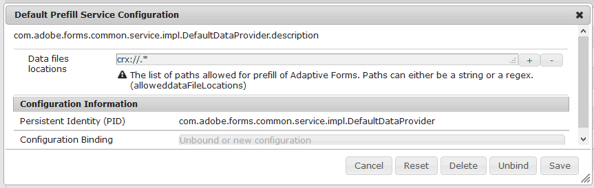

# Rellenar previamente los campos de un formulario adaptable{#prefill-adaptive-form-fields}

| Versión | Vínculo del artículo |
| -------- | ---------------------------- |
| AEM as a Cloud Service | [Haga clic aquí.](https://experienceleague.adobe.com/docs/experience-manager-cloud-service/content/forms/adaptive-forms-authoring/authoring-adaptive-forms-foundation-components/prepopulate-adaptive-form-fields.html?lang=es) |
| AEM 6.5 | Este artículo |

## Introducción {#introduction}

Puede rellenar previamente los campos de un formulario adaptable mediante los datos existentes. Cuando un usuario abre un formulario, los valores de esos campos ya han sido rellenados. Para rellenar previamente los datos de un formulario adaptable, haga que los datos de usuario estén disponibles como un XML/JSON de relleno en el formato que se adhiera a la estructura de datos de relleno previo del formulario adaptable.

## Estructura de los datos de relleno previo {#the-prefill-structure}

Un formulario adaptable puede tener una combinación de campos enlazados y no enlazados. Los campos enlazados son campos que se arrastran desde la pestaña Buscador de contenido y que contienen valores de propiedad que no están vacíos `bindRef` en el cuadro de diálogo de edición de campos. Los campos no enlazados se arrastran directamente desde el explorador de componentes de la barra de tareas y tienen un valor vacío `bindRef`.

Puede rellenar previamente tanto los campos enlazados como los no enlazados de un formulario adaptable. Los datos de relleno previo contienen las secciones afBoundData y afUnBoundData para rellenar previamente los campos enlazados de un formulario adaptable y los no enlazados. La sección `afBoundData` contiene los datos de relleno previo de los campos y paneles enlazados. Estos datos deben cumplir con el esquema del modelo de formulario asociado:

* Para los formularios adaptables que utilizan la [plantilla de formulario XFA](../../forms/using/prepopulate-adaptive-form-fields.md), utilice el XML de relleno previo compatible con el esquema de datos de la plantilla XFA.
* Para los formularios adaptables que utilizan el esquema [XML](#xml-schema-af), utilice el XML de relleno previo compatible con la estructura del esquema XML.
* Para los formularios adaptables que utilizan el [esquema JSON](#json-schema-based-adaptive-forms), utilice el JSON de relleno previo compatible con el esquema JSON.
* Para los formularios adaptables que utilizan el esquema FDM, utilice el JSON de relleno previo compatible con el esquema FDM.
* En los formularios adaptables [sin modelo de formulario](#adaptive-form-with-no-form-model), no hay datos enlazados. Cada campo es un campo independiente y se rellena previamente mediante el XML independiente.

### Ejemplo de estructura XML de relleno previo {#sample-prefill-xml-structure}

```xml
<?xml version="1.0" encoding="UTF-8"?>
<afData>
  <afBoundData>
     <employeeData>
        .
     </employeeData>
  </afBoundData>

  <afUnboundData>
    <data>
      <textbox>Hello World</textbox>
         .
         .
      <numericbox>12</numericbox>
         . 
         .              
    </data>
  </afUnboundData>
</afData>
```

### Ejemplo de estructura JSON de relleno previo {#sample-prefill-json-structure}

```javascript
{
   "afBoundData": {
      "employeeData": { }
   },
   "afUnboundData": {
      "data": {
         "textbox": "Hello World",
         "numericbox": "12"
      }
   }
}
```

Para los campos enlazados con los mismos campos bindref o unbound con el mismo nombre, los datos especificados en la etiqueta XML o el objeto JSON se rellenan en todos los campos. Por ejemplo, dos campos de un formulario se asignan al nombre `textbox` en los datos de relleno previo. Durante el tiempo de ejecución, si el primer campo de cuadro de texto contiene “A”, entonces “A” se rellena automáticamente en el segundo cuadro de texto. Esta vinculación se denomina vinculación activa de los campos de formulario adaptable.

### Formularios adaptables que utilizan una plantilla de formulario XFA {#xfa-based-af}

La estructura XML de relleno previo y el XML enviado para los formularios adaptables basados en XFA es la siguiente:

* **Estructura XML de relleno previo**: el XML de relleno previo para formularios adaptables basados en XFA debe ser compatible con el esquema de datos de la plantilla de formulario XFA. Para rellenar previamente los campos no enlazados, ajuste la estructura XML de relleno previo en la etiqueta`/afData/afBoundData`.

* **Estructura XML enviada**: Cuando no se utiliza ningún XML de relleno previo, el XML enviado contiene datos para los campos enlazados y no enlazados en la `afData` etiqueta envolvente. Si se utiliza un XML de relleno previo, el XML enviado tendrá la misma estructura que el XML de relleno previo. Si el XML de relleno previo comienza con la etiqueta raíz `afData`, el XML de salida también tendrá el mismo formato. Si el XML de relleno previo no tiene `afData/afBoundData` envolvente y comienza directamente desde la etiqueta raíz del esquema como `employeeData`, el XML enviado también comenzará con la etiqueta `employeeData`.

Prefill-Submit-Data-ContentPackage.zip

[Obtener archivo](assets/prefill-submit-data-contentpackage.zip)
Ejemplo que contiene datos de relleno previo y datos enviados

### Formularios adaptables basados en esquemas XML  {#xml-schema-af}

La estructura del XML de relleno previo y del XML enviado para formularios adaptables basados en esquemas XML es la siguiente:

* **Estructura XML de relleno previo**: El XML de relleno previo debe ser compatible con el esquema XML asociado. Para rellenar previamente los campos no enlazados, envuelva la estructura XML de relleno previo con la etiqueta /afData/afBoundData.
* **Estructura XML enviada**: Si no se utiliza ningún XML de relleno previo, el XML enviado contendrá datos para los campos enlazados y no enlazados en la etiqueta envolvente `afData`. Si se utiliza el XML de relleno previo, el XML enviado tendrá la misma estructura que el XML de relleno previo. Si el XML de relleno previo comienza con la etiqueta raíz `afData`, el XML de salida tendrá el mismo formato. Si el XML de relleno previo no tiene `afData/afBoundData` envolvente y comienza directamente desde la etiqueta raíz del esquema como `employeeData`, el XML enviado también comenzará con la etiqueta `employeeData`.

```xml
<?xml version="1.0" encoding="utf-8" ?> 
<xs:schema targetNamespace="https://adobe.com/sample.xsd"
            xmlns="https://adobe.com/sample.xsd"
            xmlns:xs="https://www.w3.org/2001/XMLSchema">
 
    <xs:element name="sample" type="SampleType"/>
         
    <xs:complexType name="SampleType">
        <xs:sequence>
            <xs:element name="noOfProjectsAssigned" type="xs:string"/>
        </xs:sequence>
    </xs:complexType>
</xs:schema>
```

Para los campos cuyo modelo es un esquema XML, los datos se rellenan previamente en la etiqueta `afBoundData` como se muestra en el siguiente ejemplo XML. Se puede utilizar para rellenar previamente un formulario adaptable con uno o más campos de texto no enlazados.

```xml
<?xml version="1.0" encoding="UTF-8"?><afData>
  <afUnboundData>
    <data>
      <textbox>Ignorance is bliss :) </textbox>
    </data>
  </afUnboundData>
  <afBoundData>
    <data>
      <noOfProjectsAssigned>twelve</noOfProjectsAssigned>
    </data>
  </afBoundData>
</afData>
```

>[!NOTE]
>
>Se recomienda no utilizar campos no enlazados en paneles enlazados (paneles no vacíos `bindRef` que se hayan creado al arrastrar componentes de la barra de tareas o de la pestaña Fuentes de datos). Podría causar la pérdida de los datos de estos campos independientes. Además, se recomienda que los nombres de los campos sean únicos en todo el formulario, especialmente para los campos independientes.

#### Un ejemplo sin los envoltorios afData y afBoundData  {#an-example-without-afdata-and-afbounddata-wrapper}

```xml
<?xml version="1.0" encoding="UTF-8"?><config>
 <assignmentDetails descriptionOfAssignment="Some Science Project" durationOfAssignment="34" financeRelatedProject="1" name="Lisa" numberOfMentees="1"/>
 <assignmentDetails descriptionOfAssignment="Kidding, right?" durationOfAssignment="4" financeRelatedProject="1" name="House" numberOfMentees="3"/>
</config>
```

### Formularios adaptables basados en esquemas JSON {#json-schema-based-adaptive-forms}

A continuación, se describe la estructura del JSON de relleno previo y el JSON enviado para formularios adaptables basados en el esquema JSON. Para obtener más información, consulte [Creación de formularios adaptables mediante el esquema JSON](../../forms/using/adaptive-form-json-schema-form-model.md).

* **Estructura JSON de relleno previo**: El JSON de relleno previo debe ser compatible con el esquema JSON asociado. Opcionalmente, se puede envolver en el objeto /afData/afBoundData si también desea rellenar previamente los campos no enlazados.
* **Estructura JSON enviada**: Si no se utiliza un JSON de relleno previo, el JSON enviado contiene datos para los campos enlazados y no enlazados en la etiqueta de envoltorio afData. Si se utiliza el JSON de relleno previo, el JSON enviado tendrá la misma estructura que el JSON de relleno previo. Si el JSON de relleno previo comienza con el objeto raíz afData, el JSON de salida tendrá el mismo formato. Si el JSON de relleno previo no tiene un envoltorio afData/afBoundData y en su lugar comienza directamente desde el objeto raíz del esquema como usuario, el JSON enviado también comenzará con el objeto de usuario.

```json
{
    "id": "https://some.site.somewhere/entry-schema#",
    "$schema": "https://json-schema.org/draft-04/schema#",
    "type": "object",
    "properties": {
        "address": {
            "type": "object",
            "properties": { 
    "name": {
     "type": "string"
    },
    "age": {
     "type": "integer"
}}}}}
```

Para los campos que utilizan el modelo de esquema JSON, los datos se rellenan previamente en el objeto afBoundData como se muestra en el siguiente archivo JSON de ejemplo. Se puede utilizar para rellenar previamente un formulario adaptable con uno o más campos de texto no enlazados. A continuación se muestra un ejemplo de datos con `afData/afBoundData` envoltorio:

```json
{
  "afData": {
    "afUnboundData": {
      "data": { "textbox": "Ignorance is bliss :) " }
    },
    "afBoundData": {
      "data": { {
   "user": {
    "address": {
     "city": "Noida",
     "country": "India"
}}}}}}}
```

A continuación se muestra un ejemplo sin `afData/afBoundData` envolvente:

```json
{
 "user": {
  "address": {
   "city": "Noida",
   "country": "India"
}}}
```

>[!NOTE]
>
>**No** se recomienda el uso de campos no enlazados en paneles enlazados (paneles con bindRef no vacíos que se hayan creado al arrastrar componentes de la barra de tareas o la pestaña Fuentes de datos) recomendado, ya que podría causar la pérdida de datos de los campos independientes. Se recomienda tener nombres de campo únicos en todo el formulario, especialmente en los campos no enlazados.

### Formulario adaptable sin modelo de formulario {#adaptive-form-with-no-form-model}

En los formularios adaptables sin modelo de formulario, los datos de todos los campos se encuentran en la etiqueta `<data>` de `<afUnboundData> tag`.

Asimismo, tome nota de lo siguiente:

Las etiquetas XML para los datos de usuario enviados para varios campos se generan al utilizar el nombre de los campos. Por lo tanto, los nombres de campo deben ser únicos.

```xml
<?xml version="1.0" encoding="UTF-8"?><afData>
  <afUnboundData>
    <data>
      <radiobutton>2</radiobutton>
      <repeatable_panel_no_form_model>
        <numericbox>12</numericbox>
      </repeatable_panel_no_form_model>
      <repeatable_panel_no_form_model>
        <numericbox>21</numericbox>
      </repeatable_panel_no_form_model>
      <checkbox>2</checkbox>
      <textbox>Nopes</textbox>
    </data>
  </afUnboundData>
  <afBoundData/>
</afData>
```

## Configuración del servicio de relleno previo  Uso del Administrador de configuración {#configuring-prefill-service-using-configuration-manager}

Para habilitar el servicio de relleno previo, especifique la configuración predeterminada del servicio de relleno previo en la configuración de la consola web de AEM. Siga los siguientes pasos para configurar el servicio de relleno previo:

>[!NOTE]
>
>La configuración del servicio de relleno previo es aplicable a los formularios adaptables, los formularios HTML5 y los conjuntos de formularios HTML5.

1. Abra la **[!UICONTROL configuración de la consola web de Adobe Experience Manager]** usando la URL:\
   https://&lt;server>:&lt;port>/system/console/configMgr
1. Busque y abra **[!UICONTROL Configuración predeterminada del servicio de relleno previo]**.

   

1. Introduzca la ubicación de los datos o una regex (expresión regular) para las **ubicaciones de los archivos de datos**. Estos son algunos ejemplos de ubicaciones de archivos de datos válidas:

   * file:///C:/Users/public/Document/Prefill/.&#42;
   * https://localhost:8000/somesamplexmlfile.xml

   >[!NOTE]
   >
   >De forma predeterminada, se permite el relleno previo mediante archivos crx para todos los tipos de formularios adaptables (XSD, XDP, JSON, FDM y sin modelo de formulario). El relleno previo solo se permite con archivos JSON y XML.

1. El servicio de relleno previo ya está configurado para el formulario.

   >[!NOTE]
   >
   >El protocolo crx se encarga de la seguridad de los datos rellenos previamente y, por lo tanto, está permitido de forma predeterminada. El relleno previo a través de otros protocolos mediante regex genéricas puede causar vulnerabilidad. En la configuración, especifique una configuración de URL segura para proteger los datos.

## El curioso caso de los paneles repetibles {#the-curious-case-of-repeatable-panels}

Por lo general, los campos enlazados (esquema de formulario) y no enlazados se crean en el mismo formulario adaptable, pero a continuación se enumeran algunas excepciones en el caso de que el enlace sea repetible:

* Los paneles repetibles no enlazados no son compatibles con los formularios adaptables que utilizan la plantilla de formulario XFA, XSD, el esquema JSON o el esquema FDM.
* No utilice campos independientes en paneles repetibles enlazados.

>[!NOTE]
>
>Como regla general, no mezcle campos enlazados y no enlazados si están intersectados en datos rellenos por el usuario final en campos no enlazados. Si es posible, debe modificar el esquema o la plantilla de formulario XFA y agregar una entrada para los campos no enlazados, de modo que también se conviertan en enlazados y sus datos estén disponibles como otros campos en los datos enviados.

## Protocolos admitidos para rellenar previamente datos de usuario {#supported-protocols-for-prefilling-user-data}

Los formularios adaptables se pueden rellenar previamente con datos de usuario en formato de datos de relleno previo mediante los siguientes protocolos cuando se configuran con una regex válida:

### El protocolo crx:// {#the-crx-protocol}

```http
https://localhost:4502/content/forms/af/xml.html?wcmmode=disabled&dataRef=crx:///tmp/fd/af/myassets/sample.xml
```

El nodo especificado debe tener una propiedad denominada `jcr:data` y mantener los datos.

### El protocolo file://  {#the-file-protocol-nbsp}

```http
https://localhost:4502/content/forms/af/someAF.html?wcmmode=disabled&dataRef=file:///C:/Users/form-user/Downloads/somesamplexml.xml
```

El archivo de referencia debe estar en el mismo servidor.

### El protocolo https:// {#the-http-protocol}

```http
https://localhost:4502/content/forms/af/xml.html?wcmmode=disabled&dataRef=https://localhost:8000/somesamplexmlfile.xml
```

### El protocolo service:// {#the-service-protocol}

```http
https://localhost:4502/content/forms/af/abc.html?wcmmode=disabled&dataRef=service://[SERVICE_NAME]/[IDENTIFIER]
```

* SERVICE_NAME hace referencia al nombre del servicio de relleno previo OSGI. Consulte [Crear y ejecutar un servicio de relleno previo](../../forms/using/prepopulate-adaptive-form-fields.md#create-and-run-a-prefill-service).
* IDENTIFIER se refiere a cualquier metadato que requiera el servicio de relleno previo OSGI para recuperar los datos. Un identificador para el usuario que ha iniciado sesión es un ejemplo de metadatos que se pueden utilizar.

>[!NOTE]
>
>No se admite el paso de parámetros de autenticación.

### Configurar el atributo de datos en slingRequest {#setting-data-attribute-in-slingrequest}

También puede configurar el atributo `data` en `slingRequest`, donde el atributo `data` es una cadena que contiene XML o JSON, como se muestra en el siguiente código de ejemplo (el ejemplo es para XML):

```javascript
<%
           String dataXML="<afData>" +
                            "<afUnboundData>" +
                                "<data>" +
                                    "<first_name>"+ "Tyler" + "</first_name>" +
                                    "<last_name>"+ "Durden " + "</last_name>" +
                                    "<gender>"+ "Male" + "</gender>" +
                                    "<location>"+ "Texas" + "</location>" +
                                    "</data>" +
                            "</afUnboundData>" +
                        "</afData>";
        slingRequest.setAttribute("data", dataXML);
%>
```

Puede escribir una cadena XML o JSON simple que contenga todos los datos y establecerlos en slingRequest. Esto se puede hacer fácilmente en el JSP del procesador para cualquier componente que quiera incluir en la página donde puede establecer el atributo de datos slingRequest.

Por ejemplo, donde quiera un diseño específico para la página con un tipo específico de encabezado. Para lograrlo, puede escribir su propio `header.jsp`, que puede incluir en el componente de página y establecer el atributo`data`.

Otro buen ejemplo es un caso de uso en el que le gustaría rellenar previamente los datos de inicio de sesión a través de cuentas en redes sociales como Facebook, Twitter o LinkedIn. En este caso, puede incluir un JSP simple en `header.jsp`, que obtenga datos de la cuenta de usuario y establezca el parámetro de los datos.

prefill-page component.zip

[Obtener archivo](assets/prefill-page-component.zip)
Ejemplo de prefill.jsp en el componente de página

## Servicio de relleno previo personalizado de AEM Forms {#aem-forms-custom-prefill-service}

Puede utilizar el servicio de relleno previo personalizado para escenarios en los que se lean constantemente datos de una fuente predefinida. El servicio de relleno previo lee datos de las fuentes de datos definidas y rellena previamente los campos del formulario adaptable con contenido del archivo de datos de relleno previo. También le permite asociar de forma permanente los datos rellenados previamente con un formulario adaptable.

### Crear y ejecutar un servicio de relleno previo {#create-and-run-a-prefill-service}

El servicio de relleno previo es un servicio OSGi y se empaqueta a través del paquete OSGi. Puede crear el paquete OSGi, cargarlo e instalarlo en los paquetes de AEM Forms. Antes de empezar a crear el paquete, haga lo siguiente:

* [Descargar el AEM Forms Client SDK](https://helpx.adobe.com/es/aem-forms/kb/aem-forms-releases.html)
* Descargue el paquete de plantillas

* Coloque el archivo de datos (datos de relleno previo) en el repositorio crx. Puede colocar el archivo en cualquier ubicación de la carpeta \content del repositorio crx.

[Obtener archivo](assets/prefill-sumbit-xmlsandcontentpackage.zip)

#### Crear un servicio de relleno previo {#create-a-prefill-service}

El paquete de plantillas (paquete de servicio de relleno previo de ejemplo) contiene una implementación de ejemplo del servicio de relleno previo de AEM Forms. Abra el paquete de plantillas en un editor de código. Por ejemplo, abra el proyecto de plantillas en Eclipse para editarlo. Después de abrir el paquete de plantillas en un editor de código, realice los siguientes pasos para crear el servicio.

1. Abra el archivo src\main\java\com\adobe\test\Prefill.java para editarlo.
1. En el código, establezca el siguiente valor:

   * `nodePath:` La variable de ruta del nodo que señala a la ubicación del repositorio crx contiene la ruta del archivo de datos (relleno previo). Por ejemplo, /content/prefilldata.xml
   * `label:` El parámetro Etiqueta especifica el nombre del servicio para mostrar. Por ejemplo, Servicio de relleno previo predeterminado

1. Guarde y cierre el archivo `Prefill.java`.
1. Agregue el paquete `AEM Forms Client SDK` a la ruta de la versión del proyecto de las plantillas.
1. Compile el proyecto y cree el .jar para el paquete.

#### Iniciar y utilizar el servicio de relleno previo {#start-and-use-the-prefill-service}

Para iniciar el servicio de relleno previo, cargue el archivo JAR en la consola web de AEM Forms y active el servicio. Ahora, el servicio aparecerá en el Editor de formularios adaptables. Para asociar un servicio de relleno previo a un formulario adaptable, haga lo siguiente:

1. Abra el formulario adaptable en el Editor de formularios y abra el panel Propiedades del contenedor de formularios.
1. En la consola Propiedades, navegue hasta el contenedor de AEM Forms > Básico > Servicio de relleno previo.
1. Seleccione el servicio de relleno previo predeterminado y haga clic en **[!UICONTROL Guardar]**. El servicio estará asociado al formulario.

## Relleno previo de datos en el cliente {#prefill-at-client}

Cuando se rellena previamente un formulario adaptable, el servidor de AEM Forms combina los datos con un formulario adaptable y le envía el formulario rellenado. La acción de combinación de datos se realiza en el servidor de forma predeterminada.

Puede configurar el servidor de AEM Forms para que realice la acción de combinación de datos en el cliente en lugar de en el servidor. Esto reduce considerablemente el tiempo necesario para rellenar previamente y procesar los formularios adaptables. Esta función está desactivada de forma predeterminada. Puede habilitarla desde el Administrador de configuración o la línea de comandos.

* Para habilitarla o deshabilitarla desde el Administrador de configuración:
   1. Abra el Administrador de configuración de AEM.
   1. Busque y abra la configuración del canal web de comunicaciones interactivas y formularios adaptables.
   1. Habilite la opción Configuration.af.clientside.datamerge.enabled.name.
* Para habilitar o deshabilitar esta opción desde la línea de comandos:
   * Para habilitarla, ejecute el siguiente comando cURL:
     `curl -u admin:admin -X POST -d apply=true \ -d propertylist=af.clientside.datamerge.enabled \ -d af.clientside.datamerge.enabled=true \ http://${crx.host}:${crx.port}/system/console/configMgr/Adaptive%20Form%20and%20Interactive%20Communication%20Web%20Channel%20Configuration`

   * Para deshabilitarla, ejecute el siguiente comando cURL:
     `curl -u admin:admin -X POST -d apply=true \ -d propertylist=af.clientside.datamerge.enabled \ -d af.clientside.datamerge.enabled=false \ http://${crx.host}:${crx.port}/system/console/configMgr/Adaptive%20Form%20and%20Interactive%20Communication%20Web%20Channel%20Configuration`

  Para aprovechar al máximo los datos de relleno previo en la opción de cliente, actualice el servicio de relleno previo para que devuelva [FileAttachmentMap](https://helpx.adobe.com/es/experience-manager/6-5/forms/javadocs/com/adobe/forms/common/service/PrefillData.html) y [CustomContext](https://helpx.adobe.com/es/experience-manager/6-5/forms/javadocs/com/adobe/forms/common/service/PrefillData.html).
