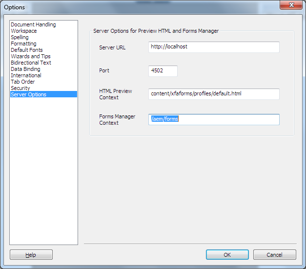

# Generar previsualización de HTML5 de un formulario XDP{#generate-html-preview-of-an-xdp-form}

Al diseñar un formulario en AEM Forms Designer, además de obtener una vista previa de la representación de PDF de un formulario, también se puede obtener una vista previa de la representación de un formulario en HTML5. Puede usar la variable **HTML de vista previa** para obtener una vista previa del formulario tal como aparecería en un explorador.

## Habilitar la vista previa del HTML para formularios XDP en Designer {#html-preview-of-forms-in-forms-designer}

Para permitir que Designer genere una vista previa HTML de los formularios XDP, realice las siguientes configuraciones:

* Configuración del servicio de autenticación Apache Sling
* Desactivar modo protegido
* Proporcionar detalles del servidor de AEM Forms

### Configuración del servicio de autenticación Apache Sling {#configure-apache-sling-authentication-service}

1. Vaya a `https://'[server]:[port]'/system/console/configMgr` en AEM Forms que se ejecuta en OSGi o
   `https://'[server]:[port]'/lc/system/console/configMgr` en AEM Forms que se ejecuta en JEE.
1. Busque y haga clic en **Servicio de autenticación Apache Sling** para abrirlo en modo de edición.

1. Dependiendo de si está ejecutando AEM Forms en OSGi o JEE, agregue lo siguiente en la sección **Requisitos de autenticación** campo:

   * AEM Forms en JEE

      * -/content/xfaforms
      * -/etc/clientlibs
   * AEM Forms en OSGi

      * -/content/xfaforms
      * -/etc/clientlibs/fd/xfaforms

   >[!NOTE]
   >
   >No copie y pegue el valor especificado en el campo Requisitos de autenticación , ya que podría dañar los caracteres especiales del valor. En su lugar, escriba el valor especificado en el campo .

1. Especifique un nombre de usuario y una contraseña en **[!UICONTROL Nombre de usuario anónimo]** y **[!UICONTROL Contraseña de usuario anónimo]** , respectivamente. Las credenciales especificadas se utilizan para gestionar la autenticación anónima y permitir el acceso a usuarios anónimos.
1. Haga clic en **Guardar** para guardar la configuración.

### Desactivar modo protegido {#disable-protected-mode}

La variable [modo protegido](../../forms/using/get-xdp-pdf-documents-aem.md) está activada de forma predeterminada. Manténgalo habilitado para los entornos de producción. Puede deshabilitarlo para un entorno de desarrollo para previsualizar HTML5 Forms en Designer. Siga estos pasos para deshabilitarlo:

1. Inicie sesión en AEM consola web como administrador.

   * La URL de AEM Forms en OSGi es `https://'[server]:[port]'/system/console/configMgr`
   * La URL de AEM Forms en JEE es `https://'[server]:[port]'/lc/system/console/configMgr`

1. Apertura **[!UICONTROL Configuraciones de Forms móvil]** para editar.
1. Anule la selección de **[!UICONTROL Modo protegido]** y haga clic en **[!UICONTROL Guardar]**.

### Proporcionar detalles del servidor de AEM Forms {#provide-details-of-aem-forms-server}

1. En Designer, vaya a **Herramientas** > **Opciones**.
1. En la ventana Opciones, seleccione **Opciones del servidor** , proporcione los siguientes detalles y haga clic en **OK**.

   * **URL del servidor**: URL del servidor de AEM Forms.

   * **Número de puerto HTTP**: AEM puerto del servidor. El valor predeterminado es 4502.
   * **Contexto de vista previa del HTML:** Ruta del perfil para procesar formularios XFA. Los siguientes perfiles predeterminados se utilizan para obtener una vista previa del formulario en Designer. Sin embargo, también puede especificar la ruta a un perfil personalizado.

      * `/content/xfaforms/profiles/default.html` (AEM Forms en OSGi)

      * `/lc/content/xfaforms/profiles/default.html` (AEM Forms en JEE)
   * **Contexto de Forms Manager:** Ruta de contexto en la que se implementa la interfaz de usuario de Forms Manager. Los valores predeterminados son:

      * `/aem/forms` (AEM Forms en OSGi)
      * `/lc/forms` (AEM Forms en JEE)

   >[!NOTE]
   >
   >Asegúrese de que el servidor de AEM Forms esté en funcionamiento. La vista previa del HTML se conecta al servidor CRX a *generar* una vista previa.

   

   Opciones de AEM Forms Designer

1. Para obtener una vista previa de un formulario en el HTML, haga clic en el botón **HTML de vista previa** pestaña .

   >[!NOTE]
   >
   >
   >
   >
   >    * Si la ficha Vista previa del HTML está cerrada, pulse F4 para abrir la ficha HTML de vista previa. También puede seleccionar HTML de vista previa en el menú Ver para abrir la ficha HTML de vista previa .
   >    * La vista previa del HTML no admite documentos del PDF, la vista previa del HTML solo es para documentos XDP.

   >[!CAUTION]
   >
   >Para probar la experiencia real del usuario final, realice una vista previa de los formularios en exploradores externos (Google Chrome, Microsoft Edge, Mozilla Firefox, etc.). Cada explorador utiliza un motor independiente para procesar el HTML, por lo que puede haber algunas diferencias en la forma en que un formulario se previsualiza en Designer y en el explorador externo.

## Obtener una vista previa de un formulario mediante datos de ejemplo {#to-preview-a-form-using-sample-data}

Designer permite obtener una vista previa del formulario y probarlo con datos XML de ejemplo. Se recomienda probar con frecuencia el formulario con datos de ejemplo para asegurarse de que el formulario se procesa correctamente.

Si no dispone de datos de ejemplo, Designer puede crearlos o puede hacerlo usted mismo. (Consulte [Generar automáticamente datos de ejemplo para previsualizar el formulario](https://help.adobe.com/en_US/AEMForms/6.1/DesignerHelp/WS107c29ade9134a2c136ae6f212a1f379c94-8000.2.html#WS92d06802c76abadb-728f46ac129b395660c-7efe.2) y [Crear datos de ejemplo para previsualizar el formulario](https://help.adobe.com/en_US/AEMForms/6.1/DesignerHelp/WS107c29ade9134a2c136ae6f212a1f379c94-8000.2.html#WS92d06802c76abadb-728f46ac129b395660c-7eff.2).)

Al probar su formulario mediante el uso de datos de ejemplo le garantiza la asignación de datos y campos, además de que los subformularios de repetición se repitan como se espera. Puede crear una presentación equilibrada del formulario que ofrezca el espacio apropiado para que cada objeto muestre los datos combinados.

1. Select **Archivo > Propiedades del formulario**.

1. Haga clic en el **Vista previa** y, en el cuadro Archivo de datos, escriba la ruta completa al archivo de datos de prueba. También puede utilizar el botón Examinar para desplazarse hasta el archivo.

1. Haga clic en **Aceptar**. La próxima vez que obtenga una vista previa del formulario en la variable **HTML de vista previa** , los valores de datos del archivo XML de ejemplo aparecerán en los objetos correspondientes.

## Vista previa de formularios ubicados en un repositorio {#html-preview-of-forms-in-forms-manager}

En AEM Forms, puede obtener una vista previa de los formularios y documentos en un repositorio. La vista previa ayuda a conocer exactamente el aspecto y el comportamiento de los formularios a medida que se utilicen para los usuarios finales.
