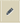

# Informes de consultas ad hoc en proceso{#ad-hoc-queries-in-process-reporting}

## Consultas ad hoc en informes de procesos {#ad-hoc-queries-in-process-reporting-1}

Las consultas ad hoc en los informes de procesos permiten crear consultas personalizadas que puede utilizar para buscar detalles de procesos y tareas de las instancias de procesos de AEM Forms definidas en su entorno de AEM Forms.

Además, las consultas ad hoc se pueden definir mediante filtros de propiedades de proceso y tarea. Estos filtros se pueden guardar y utilizar para ejecutar los informes más adelante.

[**Búsqueda del proceso**](/help/forms/using/process-reporting/adhoc-queries-in-process-reporting.md#p-process-task-search-p): Busque instancias de proceso con un filtro de búsqueda definido por el usuario basado en atributos de proceso.

[**Detalles del proceso**](/help/forms/using/process-reporting/adhoc-queries-in-process-reporting.md#p-process-task-details-p): Vea los detalles de una instancia de proceso especificando el ID de proceso.

**Búsqueda de tareas**: Busque instancias de tareas con un filtro de búsqueda definido por el usuario basado en atributos de tareas.

**Detalles de la tarea**: Para ver los detalles de una instancia de tarea, especifique el ID de la tarea.

### Procesos y tareas {#processes-and-tasks}

Los pasos que sigue para crear filtros y ejecutar consultas para detalles del proceso son los mismos que para las tareas.

Esto significa que las interfaces de usuario para la búsqueda de procesos y la búsqueda de tareas difieren únicamente en los campos por los que puede buscar y en los campos devueltos en los resultados de búsqueda. Esto se debe simplemente a que, aunque muchos de los campos son idénticos, ciertos campos son específicos de los procesos y ciertos campos son específicos de las tareas.

Este artículo detalla las descripciones de las secciones Proceso/Búsqueda de tareas y Detalles de procesos/tareas. En los lugares apropiados, se indicarán específicamente las diferencias específicas.

## Búsqueda de procesos/tareas {#process-task-search}

La búsqueda de procesos/tareas se utiliza para definir filtros para consultar instancias de proceso/tarea.

### Para crear una consulta de búsqueda de proceso/tarea {#to-create-a-process-task-search-query}

1. Para ver las consultas guardadas Process/Task Search o para crear una consulta, haga clic en **Consultas ad hoc** y haga clic en **Búsqueda de procesos/tareas**.

   

   La variable **Mis filtros** se muestra a la derecha de la vista de árbol.

   En el **Mis filtros** , puede crear nuevas consultas ad hoc y hacer clic en para ejecutar consultas guardadas anteriormente.

   

1. Para ejecutar una consulta existente, simplemente haga clic en la consulta en la **Mis filtros** panel.
1. Para crear una consulta, haga clic en **Agregar** (+).

   La variable **Crear filtro** en el panel.

   

   Una consulta consta de uno o más filtros de consulta. Para crear un filtro, agregue una fila de filtro a la consulta. De forma predeterminada, se agrega una fila de filtro a la consulta.

   **Definición de un filtro**

   1. Seleccione un campo.

      

      >[!NOTE]
      >
      >La lista de campos contiene los campos específicos del proceso o la tarea de AEM Forms.

   1. Seleccione una condición.

      

      >[!NOTE]
      >
      >Las condiciones enumeradas dependen del atributo seleccionado para el filtrado.

   1. Introduzca un valor.

      

   1. Para añadir otro filtro a la consulta, haga clic en **Agregar (+)** a la derecha de la fila de filtro.

      Para eliminar un filtro de la consulta, haga clic en **Eliminar (-)** a la derecha de la fila de filtro.

      

Después de crear una consulta, utilice las opciones de la esquina superior derecha de la variable **Crear filtro** para:

* **Cancelar**: Cancelar los cambios y volver al **Mis filtros** panel.
* **Ejecutar**: Ejecute la consulta actual para ver y / o verificar los resultados. En este caso, no es necesario guardar la consulta antes de ejecutar la consulta. Puede verificar los resultados, realizar cambios si es necesario y guardar la consulta cuando esté satisfecho con el resultado.
* **Guardar**: Guarde el filtro. El filtro se puede ver y ejecutar desde la variable **Mis filtros** panel.

### Opciones en el panel Mis filtros {#options-in-my-filters-panel}

Utilice las opciones de la sección **Mis filtros** panel a **Agregar** , **Editar** o **Eliminar** una consulta ad-hoc.

### Para ejecutar una consulta de búsqueda {#to-execute-a-search-query}

1. Para ejecutar una consulta, haga clic en el filtro de la **Mis filtros** o haga clic en el **Ejecutar** si está creando o editando un filtro.
1. Los resultados de la consulta se muestran en la **Informe** del panel **Informes de procesos** ventana.

   

   Puede paginar los resultados de búsqueda con la ayuda del panel paginación que se muestra en la parte inferior del informe.

   

   En el **Mostrar** en la lista desplegable, elija el número de resultados que desea mostrar por página.

   En el **Página** , introduzca un número de página para ir directamente a esa página.

1. Los campos siguientes se muestran en un resultado de búsqueda de proceso:

   * **ID de proceso**: ID del proceso. El campo está hipervinculado. Si hace clic en un ID de proceso en este campo, se le redirige al evento **[!UICONTROL Detalles del proceso]** para el proceso.
   * **Iniciador**: El usuario de AEM Forms que inició la instancia de proceso
   * **Hora de creación**: La fecha y hora en que se inició la instancia de proceso
   * **Tiempo completado**: La fecha y hora en que se completó la instancia de proceso
   * **Duración**: Duración desde el inicio hasta la finalización de la instancia de proceso
   * **Estado**: Estado actual de la instancia de proceso.

   De forma predeterminada, el resultado se ordena por ID de proceso. Sin embargo, para ordenar el resultado por cualquiera de los campos, haga clic en el título del campo.

   Como la ordenación es una operación de alternancia, haga clic en un encabezado de columna para ordenar el resultado en orden ascendente y vuelva a hacer clic en él para ordenar en orden descendente.

   Del mismo modo, los campos siguientes se muestran en un resultado de Búsqueda de tareas:

   * **ID de tarea**: El ID de la tarea. El campo está hipervinculado. Si hace clic en un ID de tarea en este campo, se le redirige al evento **[!UICONTROL Detalles de la tarea]** para la tarea.
   * **Iniciador**: El usuario de AEM Forms que inició la instancia de proceso
   * **Hora de creación**: La fecha y hora en que se inició la instancia de proceso
   * **Tiempo completado**: La fecha y hora en que se completó la instancia de proceso
   * **Duración**: Duración desde el inicio hasta la finalización de la instancia de proceso
   * **Estado**: Estado actual de la instancia de proceso.

   De forma predeterminada, el resultado se ordena por ID de tarea. Sin embargo, para ordenar el resultado por cualquiera de los campos, haga clic en el título del campo. El resultado se ordena por la columna que se indica con una flecha oscura junto al encabezado de la columna.

   Como la ordenación es una operación de alternancia, haga clic en un encabezado de campo para ordenar el resultado en orden ascendente y vuelva a hacer clic en él para ordenar en orden descendente. El orden de clasificación actual (ascendente/descendente) se indica mediante la dirección de la flecha oscurecida situada junto al encabezado de la columna.

   

1. Haga clic en el botón del carril  en la esquina superior izquierda para contraer la variable **Mis filtros** y expande el espacio disponible para el **Informe** panel.
1. Utilice las opciones de la esquina superior derecha del panel **Informe **para realizar operaciones en el resultado de la consulta.

   * **Actualizar**: Actualiza el informe con los datos más recientes en el almacenamiento

   * **Exportar a CSV**: Exporte los datos del informe a un archivo separado por comas.
   >[!NOTE]
   >
   >Al exportar un informe, todo el resultado de la búsqueda se exporta a un archivo CSV y no solo a la página actual

## Detalles del proceso/tarea {#process-task-details}

Utilice la variable **Detalles del proceso** para ver los detalles de un proceso específico.

Del mismo modo, se usa la variable **Detalles de la tarea** para ver los detalles de una tarea específica.

### Para ver los detalles del proceso/tarea {#to-view-process-task-details}

Puede ver los detalles de un proceso o tarea específico de AEM Forms:

* **A partir de un resultado de búsqueda de proceso/tarea**
* **Introduciendo el ID de proceso/tarea en el panel Detalles del proceso/tarea**

#### A partir de un resultado de búsqueda de proceso/tarea {#from-a-process-task-search-result}

1. Ejecute una búsqueda de proceso/tarea. Para obtener más información, consulte [Ejecutar una consulta de búsqueda de proceso](#to-execute-a-search-query).

   Observe que los ID de proceso mostrados devueltos en el resultado están hipervinculados.

   

1. Haga clic en un ID de proceso de la lista para ver los detalles de este proceso en la **Detalles del proceso** panel.

   La variable **Detalles del proceso/tarea** resultado de la consulta muestra detalles de las tareas/formularios contenidos en el proceso/tarea.

   De forma predeterminada, el resultado se ordena por tarea/ID de formulario. Sin embargo, para ordenar el resultado por cualquiera de los campos, haga clic en el título del campo. La columna por la que se ordena el resultado se indica mediante una flecha oscura junto al encabezado de la columna.

   Como la ordenación es una operación de alternancia, haga clic en un encabezado de campo para ordenar el resultado en orden ascendente y vuelva a hacer clic en él para ordenar en orden descendente. El orden de clasificación actual (ascendente/descendente) se indica mediante la dirección de la flecha oscurecida situada junto al encabezado de la columna.

   **Resultado de los detalles del proceso**

   

   **Panel izquierdo:** Muestra los siguientes detalles del proceso seleccionado:

   * Nombre del proceso
   * Hora de la fecha de creación del proceso
   * Hora de finalización del proceso
   * Duración del proceso
   * Estado del proceso
   * Iniciador del proceso

   **Panel superior derecho:** Muestra los siguientes detalles de las tareas que componen el proceso seleccionado:

   * ID de tarea
   * Nombre de la tarea
   * Propietario de la tarea
   * Hora de creación de tareas
   * Hora de la actualización de tareas
   * Fecha de finalización de la tarea
   * Duración de la tarea
   * Estado de la tarea

   **Panel inferior derecho:** Muestra los siguientes detalles del historial de procesos del proceso seleccionado:

   * Nombre del proceso
   * Iniciador del proceso
   * Hora de la actualización del proceso
   * Hora de finalización del proceso
   * Estado del proceso

   **Resultado de los detalles de la tarea**

   

   **Panel izquierdo:** Muestra los siguientes detalles de la tarea seleccionada:

   * Nombre de la tarea
   * ID del proceso al que pertenece esta tarea
   * Descripción de la tarea
   * Hora de creación de tareas
   * Fecha de finalización de la tarea
   * Duración de la tarea
   * Estado de la tarea
   * Ruta de tarea seleccionada

   **Panel superior derecho:** Muestra los siguientes detalles de los formularios que componen la tarea seleccionada:

   * ID de foro
   * Fecha de creación del formulario
   * Hora de la actualización del formulario
   * Url De La Plantilla De Formulario

   **Panel inferior derecho:** Muestra los siguientes detalles del historial de procesos de la tarea seleccionada:

   * Tipo de asignación de tarea
   * Propietario de la tarea
   * Hora de creación de la asignación de tareas
   * Hora de la actualización de tareas

1. Haga clic en **Volver a la búsqueda de proceso/tarea** para volver al resultado de la búsqueda desde el que se profundizaron los detalles del proceso/tarea.

   

   Sin embargo, si los detalles del proceso/tarea se encontraron introduciendo un ID de proceso/tarea específico, hacer clic en Volver al proceso/Búsqueda de tareas le devuelve a **Búsqueda de procesos/tareas**, sin mostrar ningún resultado de búsqueda.

#### Introduciendo el ID de proceso/tarea en el panel Detalles del proceso/tarea {#by-entering-the-process-task-id-in-the-process-task-details-panel-br}

1. Vaya a la **Detalles del proceso/tarea** panel.

   

1. En el cuadro de texto ID de proceso/tarea, introduzca el ID de proceso/tarea.

   

   Los campos de la variable **Detalles del proceso/tarea** el resultado de la consulta son campos específicos de un proceso/tarea de AEM Forms.

   Para un proceso, el resultado de la consulta muestra los detalles de las tareas contenidas en el proceso.

   Para una tarea, el resultado de la consulta muestra los detalles de los formularios contenidos en la tarea.
