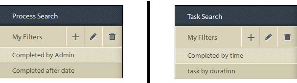

# Informes de consultas ad hoc en proceso{#ad-hoc-queries-in-process-reporting}

## Consultas ad-hoc en informes de proceso {#ad-hoc-queries-in-process-reporting-1}

Las consultas ad-hoc de Informes de proceso le permiten crear consultas personalizadas que puede utilizar para buscar detalles de procesos y tareas de las instancias de proceso de AEM Forms definidas en su entorno de AEM Forms.

Además, las consultas ad hoc se pueden definir mediante filtros de propiedades de proceso y tarea. Estos filtros se pueden guardar y utilizar para ejecutar los informes más adelante.

[**Búsqueda **](/help/forms/using/process-reporting/adhoc-queries-in-process-reporting.md#p-process-task-search-p)de procesos: Busque instancias de proceso con un filtro de búsqueda definido por el usuario basado en atributos de proceso.

[**Detalles **](/help/forms/using/process-reporting/adhoc-queries-in-process-reporting.md#p-process-task-details-p)del proceso: Vea los detalles de una instancia de proceso especificando el ID de proceso.

**Búsqueda** de tareas: Busque instancias de tarea con un filtro de búsqueda definido por el usuario basado en atributos de tarea.

**Detalles** de la tarea: Para ver los detalles de una instancia de tarea, especifique el ID de la tarea.

### Procesos y tareas {#processes-and-tasks}

Los pasos que sigue para crear filtros y ejecutar consultas para detalles de procesos son los mismos que para las tareas.

Esto significa que las interfaces de usuario para la búsqueda de procesos y la búsqueda de tareas difieren solamente en los campos por los que puede buscar y los campos devueltos en los resultados de búsqueda. Esto se debe simplemente a que, aunque muchos de los campos son idénticos, ciertos campos son específicos de los procesos y ciertos campos son específicos de las tareas.

Este artículo detalla las descripciones de las secciones Proceso/Búsqueda de tareas y Detalles de proceso/tarea. En los lugares apropiados, se señalarán específicamente las diferencias específicas.

## Búsqueda de procesos/tareas {#process-task-search}

La búsqueda de procesos/tareas se utiliza para definir filtros para consultar instancias de procesos/tareas.

### Para crear una consulta de búsqueda de proceso/tarea {#to-create-a-process-task-search-query}

1. Para ver las consultas de búsqueda de tareas/proceso guardadas o para crear una consulta, haga clic en Consultas **** ad hoc y, a continuación, haga clic en **Proceso/Búsqueda** de tareas.

   

   El panel **Mis filtros** se muestra a la derecha de la vista de árbol.

   En el panel **Mis filtros** , puede crear nuevas consultas ad-hoc y hacer clic para ejecutar consultas guardadas anteriormente.

   

1. Para ejecutar una consulta existente, simplemente haga clic en la consulta en el panel **Mis filtros** .
1. Para crear una consulta, haga clic en **Agregar** (+).

   Aparece el panel **Crear filtro** .

   

   Una consulta consiste en uno o más filtros de consulta. Para crear un filtro, agregue una fila de filtro a la consulta. De forma predeterminada, se agrega una fila de filtro a la consulta.

   **Definición de un filtro**

   1. Seleccione un campo.

      

      >[!NOTE]
      >
      >La lista de campos contiene los campos específicos del proceso o la tarea de AEM Forms.

   1. Seleccione una condición.

      

      >[!NOTE]
      >
      >Las condiciones enumeradas dependen del atributo seleccionado para el filtrado.

   1. Introduzca un valor.

      

   1. Para agregar otro filtro a la consulta, haga clic en **Agregar (+)** a la derecha de la fila de filtro.

      Para eliminar un filtro de la consulta, haga clic en **Eliminar (-)** a la derecha de la fila de filtro.

      

Después de crear una consulta, utilice las opciones de la esquina superior derecha del panel **Crear filtro** para:

* **Cancelar**: Cancele los cambios y vuelva al panel **Mis filtros** .
* **Ejecutar**: Ejecute la consulta actual para ver y / o verificar los resultados. En este caso, no es necesario guardar la consulta antes de ejecutarla. Puede verificar los resultados, realizar cambios si es necesario y, a continuación, guardar la consulta cuando esté satisfecho con el resultado.
* **Guardar**:Guarde el filtro. El filtro se puede ver y ejecutar desde el panel **Mis filtros** .

### Opciones del panel Mis filtros {#options-in-my-filters-panel}

Utilice las opciones del panel **Mis filtros** para **Agregar** , **Editar** **** o Eliminar_lc_pr editar_filteran una consulta ad-hoc.

### Para ejecutar una consulta de búsqueda {#to-execute-a-search-query}

1. Para ejecutar una consulta, haga clic en el filtro del panel **Mis filtros** o haga clic en el botón **Ejecutar** si está creando o editando un filtro.
1. Los resultados de la consulta se muestran en el panel **Informe** de la ventana Informes **de** procesos.

   

   Puede paginar los resultados de búsqueda con la ayuda del panel de paginación que se muestra en la parte inferior del informe.

   

   En la lista desplegable **Mostrar** , elija el número de resultados que se mostrarán por página.

   En el cuadro de texto **Página** , escriba un número de página para ir directamente a esa página.

1. Los siguientes campos se muestran en un resultado de búsqueda de proceso:

   * **ID** de proceso: ID del proceso. El campo está hipervinculado. Si hace clic en un ID de proceso en este campo, se le redirigirá al panel Detalles **[!UICONTROL del]** proceso para el proceso.
   * **Iniciador**: Usuario de AEM Forms que inició la instancia de proceso
   * **Hora** de creación: Fecha y hora en que se inició la instancia de proceso
   * **Hora** de finalización: Fecha y hora en que se completó la instancia del proceso
   * **Duración**: Duración desde el inicio hasta la finalización de la instancia de proceso
   * **Estado**: Estado actual de la instancia de proceso.
   De forma predeterminada, el resultado se ordena por ID de proceso. Sin embargo, para ordenar el resultado por cualquiera de los campos, haga clic en el título del campo.

   Dado que la ordenación es una operación de alternancia, haga clic en un encabezado de columna para ordenar el resultado de forma ascendente y vuelva a hacer clic en él para ordenar de forma descendente.

   Del mismo modo, los campos siguientes se muestran en un resultado de búsqueda de tareas:

   * **ID** de tarea: ID de la tarea. El campo está hipervinculado. Si hace clic en un ID de tarea en este campo, se le redirigirá al panel Detalles **[!UICONTROL de la]** tarea para la tarea.
   * **Iniciador**: Usuario de AEM Forms que inició la instancia de proceso
   * **Hora** de creación: Fecha y hora en que se inició la instancia de proceso
   * **Hora** de finalización: Fecha y hora en que se completó la instancia del proceso
   * **Duración**: Duración desde el inicio hasta la finalización de la instancia de proceso
   * **Estado**: Estado actual de la instancia de proceso.
   De forma predeterminada, el resultado se ordena por ID de tarea. Sin embargo, para ordenar el resultado por cualquiera de los campos, haga clic en el título del campo. El resultado se ordena por la columna indicada con una flecha oscura junto al encabezado de la columna.

   Dado que la ordenación es una operación de alternancia, haga clic en un encabezado de campo para ordenar el resultado en orden ascendente y vuelva a hacer clic en él para ordenar en orden descendente. El orden actual (ascendente/descendente) se indica mediante la dirección de la flecha oscurecida situada junto al encabezado de la columna.

   

1. Haga clic en el botón del carril  situado en la esquina superior izquierda para contraer el panel **Mis filtros** y ampliar el espacio disponible para el panel **Informe** .
1. Utilice las opciones de la esquina superior derecha del panel **Informe **Para realizar operaciones en el resultado de la consulta.

   * **Actualizar**: Actualiza el informe con los datos más recientes que se encuentran en el almacenamiento

   * **Exportar a CSV**: Exporte los datos del informe a un archivo separado por comas.
   >[!NOTE]
   >
   >Al exportar un informe, todo el resultado de la búsqueda se exporta a un archivo CSV y no sólo a la página actual

## Detalles de proceso/tarea {#process-task-details}

Utilice el panel Detalles **del** proceso para ver los detalles de un proceso específico.

Del mismo modo, se utiliza el panel Detalles **de la** tarea para ver los detalles de una tarea específica.

### Para ver los detalles del proceso/tarea {#to-view-process-task-details}

Puede ver los detalles de un proceso/tarea de AEM Forms específico:

* **A partir de un resultado de búsqueda de proceso/tarea**
* **Al introducir el ID de proceso/tarea en el panel Detalles de proceso/tarea**

#### A partir de un resultado de búsqueda de proceso/tarea {#from-a-process-task-search-result}

1. Ejecutar una búsqueda de proceso/tarea. Para obtener más información, consulte [Ejecución de una consulta](#to-execute-a-search-query)de búsqueda de procesos.

   Observe que los ID de proceso mostrados en el resultado están hipervinculados.

   

1. Haga clic en un ID de proceso en la lista para ver los detalles de este proceso en el panel Detalles **del** proceso.

   El resultado de la consulta Detalles **de** proceso/tarea muestra detalles de las tareas/formularios contenidos en el proceso/tarea.

   De forma predeterminada, el resultado se ordena por tarea o ID de formulario. Sin embargo, para ordenar el resultado por cualquiera de los campos, haga clic en el título del campo. La columna por la que se ordena el resultado se indica con una flecha oscura junto al encabezado de la columna.

   Dado que la ordenación es una operación de alternancia, haga clic en un encabezado de campo para ordenar el resultado en orden ascendente y vuelva a hacer clic en él para ordenar en orden descendente. El orden actual (ascendente/descendente) se indica mediante la dirección de la flecha oscurecida situada junto al encabezado de la columna.

   **Resultado de los detalles del proceso**

   

   **** Panel izquierdo: Muestra los siguientes detalles del proceso seleccionado:

   * Nombre del proceso
   * Hora de la fecha de creación del proceso
   * Hora de finalización del proceso
   * Duración del proceso
   * Estado del proceso
   * Iniciador de proceso
   **** Panel superior derecho: Muestra los siguientes detalles de las tareas que conforman el proceso seleccionado:

   * ID de tarea
   * Nombre de la tarea
   * Propietario de la tarea
   * Hora de la fecha de creación de la tarea
   * Hora de la fecha de actualización de la tarea
   * Hora de finalización de tarea
   * Duración de la tarea
   * Estado de la tarea
   **** Panel inferior derecho: Muestra los siguientes detalles del historial de procesos del proceso seleccionado:

   * Nombre del proceso
   * Iniciador de proceso
   * Hora de la fecha de actualización del proceso
   * Hora de finalización del proceso
   * Estado del proceso
   **Resultado de los detalles de la tarea**

   

   **** Panel izquierdo: Muestra los siguientes detalles de la tarea seleccionada:

   * Nombre de la tarea
   * ID del proceso al que pertenece esta tarea
   * Descripción de la tarea
   * Hora de la fecha de creación de la tarea
   * Hora de finalización de tarea
   * Duración de la tarea
   * Estado de la tarea
   * Ruta de tarea seleccionada
   **** Panel superior derecho: Muestra los siguientes detalles de los formularios que conforman la tarea seleccionada:

   * ID de Foprm
   * Hora de creación del formulario
   * Hora de la actualización del formulario
   * Url de plantilla de formulario
   **** Panel inferior derecho: Muestra los siguientes detalles del historial de procesos de la tarea seleccionada:

   * Tipo de asignación de tarea
   * Propietario de la tarea
   * Hora de creación de la asignación de tareas
   * Hora de la fecha de actualización de la tarea

1. Haga clic en **Volver a la búsqueda** de procesos/tareas para volver al resultado de búsqueda desde el cual se analizaron los detalles del proceso/tarea.

   

   Sin embargo, si los detalles del proceso/tarea se encontraron ingresando una ID de proceso/tarea específica, al hacer clic en Volver a proceso/búsqueda de tareas volverá a la búsqueda de tareas/ **procesos**, sin mostrar ningún resultado de búsqueda.

#### Al introducir el ID de proceso/tarea en el panel Detalles de proceso/tarea {#by-entering-the-process-task-id-in-the-process-task-details-panel-br}

1. Vaya al panel Detalles **de** proceso/tarea.

   

1. En el cuadro de texto Id. de proceso/tarea, introduzca el Id. de proceso/tarea.

   

   Los campos del resultado de la consulta Detalles **de** proceso/tarea son campos específicos de un proceso/tarea de AEM Forms.

   Para un proceso, el resultado de la consulta muestra los detalles de las tareas incluidas en el proceso.

   Para una tarea, el resultado de la consulta muestra los detalles de los formularios contenidos en la tarea.

[Comuníquese con la asistencia técnica](https://www.adobe.com/account/sign-in.supportportal.html)
