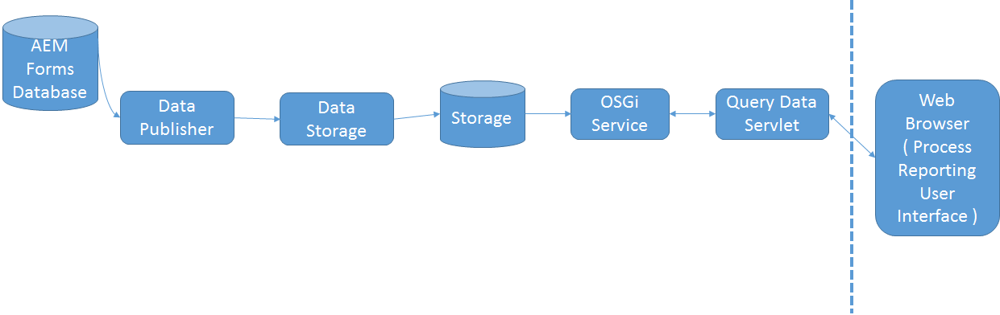

# Funcionamiento de Process Sistema de informes {#how-process-reporting-works}

Process Sistema de informes es el módulo de sistema de informes de AEM Forms en JEE.

Process Sistema de informes permite ejecutar informes en procesos y tareas de AEM Forms.

Process Sistema de informes utiliza el repositorio de Process Sistema de informes incrustado para publicar datos de Forms. Luego utiliza esos datos para ejecutar informes.

El Sistema de informes de procesos consta de los siguientes módulos:

* [Servicio ProcessDataPublisher](/help/forms/using/process-reporting/process-reporting-architecture.md#p-processdatapublisher-service-br-p)
* [Servicio ProcessDataStorage](/help/forms/using/process-reporting/process-reporting-architecture.md#p-processdatastorageprovider-service-br-p)
* [Servicio OSGi](/help/forms/using/process-reporting/process-reporting-architecture.md#p-osgi-service-br-p)
* [servlet de datos de Consulta](/help/forms/using/process-reporting/process-reporting-architecture.md#p-querydataservlet-service-br-p)
* [Interfaz de usuario de Sistema de informes de procesos](/help/forms/using/process-reporting/process-reporting-architecture.md#p-process-reporting-user-interface-br-p)

## Arquitectura de Sistema de informes de procesos {#process-reporting-architecture-br}

## Módulos de Sistema de informes de procesos {#process-reporting-modules}

### Servicio ProcessDataPublisher {#processdatapublisher-service-br}

El servidor ProcessDataPublisher se ejecuta periódicamente en la base de datos de AEM Forms y extrae los datos que han cambiado desde la última ejecución del servicio. A continuación, publica los datos en el servicio Almacenamiento de datos de proceso.

Para obtener más información sobre la configuración del servicio, consulte [Configurar el servicio](/help/forms/using/process-reporting/install-start-process-reporting.md#p-reportconfiguration-service-p)ProcessDataPublisher.

### Servicio ProcessDataStorageProvider {#processdatastorageprovider-service-br}

El servicio ProcessDataStorageProvider recibe datos de proceso del servicio ProcessDataPublisher y los guarda en el repositorio de Process Sistema de informes.

Para obtener más información sobre la configuración del servicio, consulte [Configurar el servicio](/help/forms/using/process-reporting/install-start-process-reporting.md#p-to-configure-the-process-reporting-repository-locations-p)ProcessDataStorageProvider.

### Servicio OSGi {#osgi-service-br}

QueryDataServlet utiliza este servicio para obtener los datos de sistema de informes del repositorio de Process Sistema de informes.

### Servicio QueryDataServlet {#querydataservlet-service-br}

El servicio QueryDataServlet acepta consultas de la interfaz de usuario de Process Sistema de informes.

A continuación, el servicio utiliza los servicios OSGi para obtener los datos de sistema de informes relevantes, procesa los datos y los devuelve a la interfaz de usuario.

### Interfaz de usuario de Sistema de informes de procesos {#process-reporting-user-interface-br}

La interfaz de usuario de Process Sistema de informes es una interfaz basada en explorador Web. Esta interfaz se utiliza para vista de información sobre procesos y tareas publicada en la base de datos de AEM Forms.

### Servicio QueryDataServlet {#querydataservlet-service-br-1}

El servicio QueryDataServlet acepta consultas de la interfaz de usuario de Process Sistema de informes.

A continuación, el servicio utiliza los servicios OSGi para obtener los datos de sistema de informes relevantes, procesa los datos y los devuelve a la interfaz de usuario.

### Informes personalizados {#custom-reports-br}

Puede crear sus propios informes personalizados y mostrarlos en la ficha Informes personalizados de la interfaz de usuario de Process Sistema de informes.

Para ver los pasos para crear un informe personalizado, consulte Para crear un informe personalizado en el artículo Informes [personalizados en proceso Sistema de informes](/help/forms/using/process-reporting/process-reporting-custom-reports.md).
