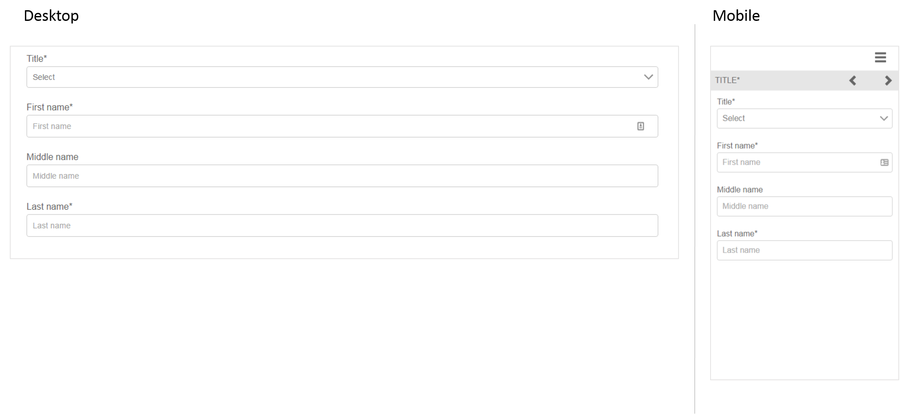

# Fragmentos de formularios adaptables de referencia{#reference-adaptive-form-fragments}

[Un fragmento de formulario adaptable](../../forms/using/adaptive-form-fragments.md) es un grupo de campos o un panel que contiene un grupo de campos que puede utilizar durante la creación de un formulario. Permite crear un formulario de forma fácil y rápida. Puede arrastrar y colocar un fragmento de formulario adaptable en un formulario mediante el Explorador de recursos de la barra lateral y editarlo en el Editor de formularios.

Los fragmentos de referencia se proporcionan en el [paquete de complementos de AEM Forms](https://experienceleague.adobe.com/docs/experience-manager-release-information/aem-release-updates/forms-updates/aem-forms-releases.html?lang=es) para los autores de formularios adaptables. Este paquete incluye los siguientes fragmentos:

* Dirección
* Información de contacto
* Información de la tarjeta de crédito
* Empleo actual
* Información sobre familiares dependientes
* Historial laboral
* Ingresos y gastos
* Nombre
* Términos y condiciones
* Términos y condiciones con firma manuscrita

Al instalar el paquete, se crea una carpeta llamada Fragmentos de referencia que contiene fragmentos de referencia en Formularios y documentos. Para instalar un paquete, consulte [Cómo trabajar con paquetes](/help/sites-administering/package-manager.md).

## Dirección {#address}

Incluye campos para especificar la dirección de correo. Los campos disponibles son la dirección de la calle, el código postal, la ciudad, el estado y el país. También incluye un servicio web preconfigurado que rellena la ciudad y el estado de un código postal de EE. UU. específico.

<!--[Click to enlarge

](assets/address-1.png)-->

## Información de contacto {#contact-information}

Incluye campos para capturar el número de teléfono y la dirección de correo electrónico.

<!--[Click to enlarge

](assets/contact-info-1.png)-->

## Información de la tarjeta de crédito {#credit-card-information}

Incluye campos para capturar información de tarjetas de crédito que se puede utilizar para procesar pagos. 

## Empleo actual {#current-employment}

Incluye campos para capturar detalles sobre el empleo actual, como el estado laboral y los campos del empleo, la denominación, la organización y la fecha de incorporación.

<!--[Click to enlarge

](assets/current-emp-1.png)-->

## Información sobre familiares dependientes {#dependents-information}

Incluye campos para especificar información sobre uno o más familiares dependientes, como el nombre, la relación y la edad en formato tabular.

<!--[Click to enlarge

](assets/dependents-info-1.png)-->

## Historial laboral {#employment-history}

Incluye campos para capturar el historial laboral. Permite agregar varias organizaciones.

<!--[Click to enlarge

](assets/emp-history-1.png)-->

## Ingresos y gastos {#income-expenditure}

Incluye campos para capturar el flujo de efectivo y los gastos mensuales. Los formularios que requieren que los usuarios proporcionen detalles financieros puede utilizar este fragmento para capturar ingresos y gastos.

<!--[Click to enlarge

](assets/income-1.png)-->

## Nombre {#name}

Incluye campos para especificar el título, el nombre, el primer apellido y el segundo.

<!--[Click to enlarge

](assets/name-1.png)-->

## Términos y condiciones {#terms-conditions}

Especifica los términos y condiciones que deben aceptar los usuarios antes de enviar un formulario.

<!--[Click to enlarge

](assets/tnc-1.png)-->

## Términos y condiciones con firma manuscrita {#terms-conditions-with-scribble}

Especifica los términos y condiciones que deben aceptar y firmar los usuarios antes de enviar un formulario.

<!--[Click to enlarge

](assets/tnc-scribble-1.png)-->
