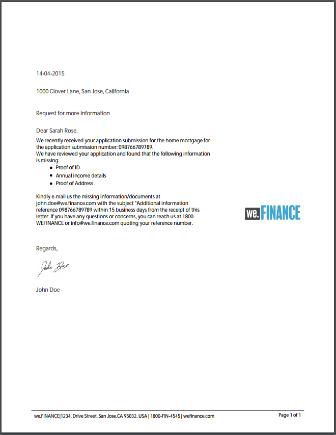
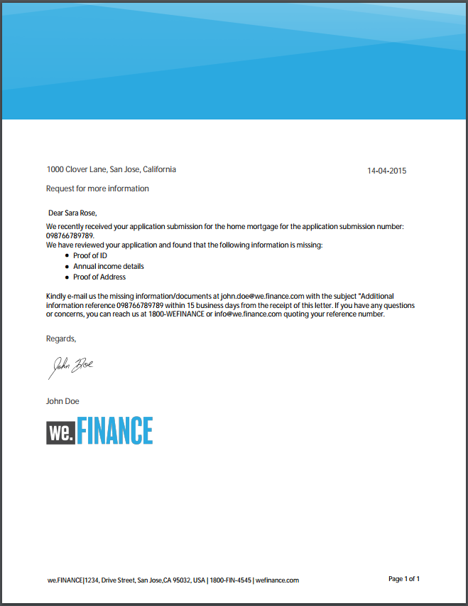

# Plantillas de carta de referencia {#reference-letter-templates}

En Administración de correspondencia, una plantilla de carta contiene campos de formulario típicos, funciones de presentación como encabezado y pie de página y &quot;áreas de destinatario&quot; vacías para la colocación del contenido.

Correspondence Management proporciona plantillas de letras en el paquete de AEM Forms [AEM-FORMS-REFERENCE-LAYOUT-TEMPLATES](https://www.adobeaemcloud.com/content/marketplace/marketplaceProxy.html?packagePath=/content/companies/public/adobe/packages/cq630/fd/AEM-FORMS-6.3-REFERENCE-LAYOUT-TEMPLATES). Para instalar un paquete, consulte [Cómo trabajar con paquetes](/help/sites-administering/package-manager.md). Puede personalizar las plantillas en Designer según sus necesidades comerciales y de marca. El paquete incluye las siguientes plantillas:

* Clásica
* Clásico simple
* Equilibrado a la izquierda
* Equilibrado a la derecha
* Visual Left
* Visual Top
* Visual Top - Classic

Después de instalar el paquete, las plantillas de diseño (XDP) se muestran en la carpeta de plantillas en la siguiente ubicación:

`https://'[server]:[port]'/[context-root]/aem/forms.html/content/dam/formsanddocuments/templates-folder`

A continuación se muestran los campos comunes de todas las plantillas de este paquete:

* Fecha
* Saludo
* Cerrar texto
* Texto de firma

Después de instalar el paquete AEM-FORMS-6.3-REFERENCE-LAYOUT-TEMPLATES, las plantillas se enumeran en templates-folder

## Clásica {#classic}

Con un logotipo en la parte superior, la plantilla clásica es adecuada para una carta profesional simple.

PREVISUALIZACIÓN PDF de una carta creada con la plantilla clásica

## Clásico simple {#classic-simple}

Incluye campos para capturar el número de teléfono y la dirección de correo electrónico. Una plantilla clásica simple es similar a la plantilla clásica, excepto que no tiene campos en los que se pueda introducir la dirección del destinatario.

PREVISUALIZACIÓN en PDF de una carta creada con la plantilla Classic Simple

## Equilibrado a la izquierda {#balanced-left}

La plantilla Equilibrada izquierda incluye un logotipo a la izquierda de la letra.

PREVISUALIZACIÓN PDF de una carta creada con la plantilla Izquierda equilibrada

## Equilibrado derecho {#balanced-right}

La plantilla Equilibrada a la derecha tiene el logotipo de compañía a la izquierda y proporciona espacio para introducir la dirección de destinatarios en la propia carta. La plantilla Equilibrada a la derecha también incluye un pie de página que se reorganiza cuando la carta tiene varias páginas.

PREVISUALIZACIÓN PDF de una carta creada con la plantilla Derecha equilibrada

## Visual Left {#visual-left}

La plantilla Izquierda visual tiene un encabezado lateral a la izquierda de la página con el logotipo de compañía colocado sobre el encabezado lateral. La plantilla de Visual Left tiene un campo de asunto pero no un pie de página.

PREVISUALIZACIÓN PDF de una carta creada con la plantilla Izquierda visual

## Visual Top {#visual-top}

La plantilla Visual Top tiene un margen visual en la parte superior. La plantilla Principio visual tiene un campo para introducir la dirección del destinatario en la propia página. La plantilla Principio visual tiene el campo de asunto y un pie de página que se reajusta para las letras que se extienden a varias páginas.

PREVISUALIZACIÓN PDF de una carta creada con la plantilla Visual Top

## Visual Top - Classic {#visual-top-classic}

La plantilla Visual Top - Classic tiene un encabezado en la parte superior de la página con el logotipo de la compañía. La plantilla Visual Top - Classic tiene un campo para introducir un asunto, pero no un pie de página.

PREVISUALIZACIÓN PDF de una carta creada con la plantilla Visual Top - Classic

