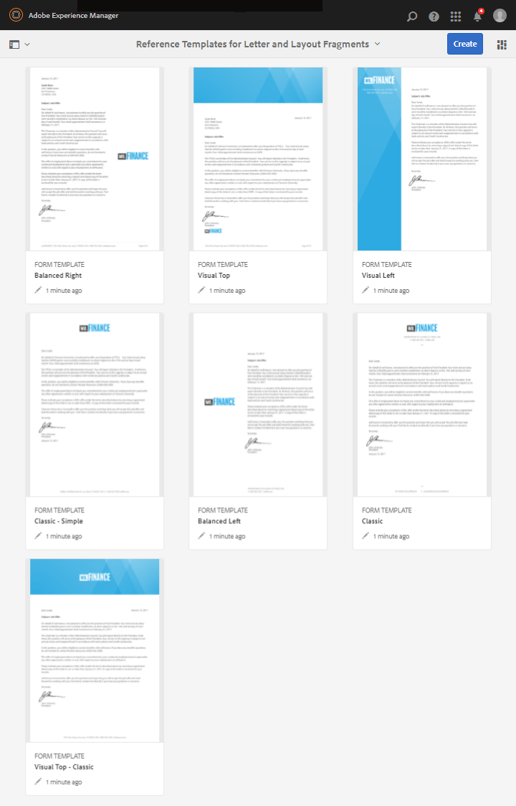

# Plantillas de carta de referencia {#reference-letter-templates}

Una plantilla de carta de Administración de correspondencia contiene campos de formulario comunes, funciones de diseño como un encabezado y un pie de página, y &quot;áreas de destino&quot; vacías para la colocación de contenido.

Administración de correspondencia proporciona plantillas de carta en el [paquete de complementos de AEM Forms](https://experienceleague.adobe.com/docs/experience-manager-release-information/aem-release-updates/forms-updates/aem-forms-releases.html?lang=es). Puede personalizar las plantillas en Designer según sus necesidades empresariales y de marca. El paquete contiene las siguientes plantillas:

* Clásica
* Clásica sencilla
* Equilibrada a la izquierda
* Equilibrada a la derecha
* Visual a la izquierda
* Visual arriba
* Visual arriba - Clásica

Después de instalar el paquete, las plantillas de diseño (XDP) se muestran en la carpeta templates en la siguiente ubicación:

`https://'[server]:[port]'/[context-root]/aem/forms.html/content/dam/formsanddocuments/templates-folder`

A continuación encontrará los campos comunes de todas las plantillas de este paquete:

* Fecha
* Saludo
* Texto de cierre
* Texto de firma

Después de instalar el paquete AEM-FORMS-6.3-REFERENCE-LAYOUT-TEMPLATES, las plantillas se muestran en la carpeta templates.

## Clásica {#classic}

La plantilla Clásica contiene un logotipo en la parte superior y es adecuada para crear cartas profesionales sencillas.

Vista previa del PDF de una carta creada con la plantilla Clásica

## Clásica sencilla {#classic-simple}

Incluye campos para capturar el número de teléfono y la dirección de correo electrónico. La plantilla Clásica sencilla es similar a la plantilla Clásica, salvo que no contiene campos para introducir la dirección del destinatario.

Vista previa del PDF de una carta creada con la plantilla Clásica sencilla

## Equilibrada a la izquierda {#balanced-left}

La plantilla Equilibrada a la izquierda incluye un logotipo en la parte izquierda de la carta.

Vista previa del PDF de una carta creada con la plantilla Equilibrada a la izquierda

## Equilibrada a la derecha {#balanced-right}

La plantilla Equilibrada a la derecha muestra el logotipo de la compañía en la parte izquierda y proporciona espacio para introducir la dirección de los destinatarios en la propia carta. La plantilla Equilibrada a la derecha incluye también un pie de página que se desplaza cuando la carta incluye varias páginas.

Vista previa del PDF de una carta creada con la plantilla Equilibrada a la derecha

## Visual a la izquierda {#visual-left}

La plantilla Visual a la izquierda contiene un encabezado lateral en la parte izquierda de la página con el logotipo de la compañía colocado sobre el encabezado. La plantilla Visual a la izquierda incluye un campo de asunto pero no un pie de página.

Vista previa del PDF de una carta creada con la plantilla Visual a la izquierda

## Visual arriba {#visual-top}

La plantilla Visual arriba contiene un margen visual en la parte superior. La plantilla Visual arriba incluye un campo para introducir la dirección del destinatario en la propia página. La plantilla Visual arriba contiene el campo de asunto y un pie de página que se desplaza en las cartas que se extienden varias páginas.

Vista previa del PDF de una carta creada con la plantilla Visual arriba

## Visual arriba - Clásica {#visual-top-classic}

La plantilla Visual arriba - Clásica incluye un encabezado en la parte superior de la página con el logotipo de la compañía. La plantilla Visual arriba - Clásica contiene un campo para introducir el asunto, pero no un pie de página.

Vista previa del PDF de una carta creada con la plantilla Visual arriba - Clásica
