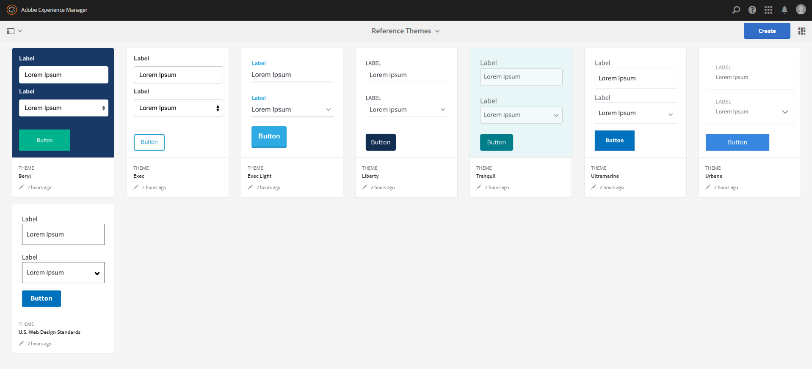

# Temas de referencia{#reference-themes}

 Los temas permiten aplicar estilo a los formularios sin tener conocimientos profundos de CSS. Además del tema predeterminado, puede obtener los siguientes temas instalando el [paquete de complementos de AEM Forms](https://experienceleague.adobe.com/docs/experience-manager-release-information/aem-release-updates/forms-updates/aem-forms-releases.html?lang=en):

* Beryl
* Exec
* Exec-Light
* Libertad
* Ultramarino
* Urbane
* Estándares de diseño web de EE. UU.
* Tranquilo

Cada tema contiene un estilo único y elegante que puede utilizar para crear formularios adaptables para los usuarios. Contiene un estilo único para selectores como panel, cuadro de texto, cuadro numérico, botón de radio, tabla y conmutador. Los ajustes en estos temas se basan en requisitos. Por ejemplo, en una situación concreta se requiere un tema minimalista con fuentes limpias. El tema de la libertad te permite conseguir ese aspecto.

Los temas incluidos en este paquete son interactivos y el estilo de estos temas se define para las pantallas móviles y de escritorio. La mayoría de los navegadores modernos de una variedad de dispositivos pueden procesar formularios aplicados con uno de estos temas sin ningún inconveniente.

Para obtener más información sobre la instalación del paquete, consulte [Cómo trabajar con paquetes](/help/sites-administering/package-manager.md).

## Beryl {#beryl}

El tema Beryl es utilizado por la forma adaptativa We.Gov, y enfatiza el uso de la imagen de fondo, la transparencia y los iconos grandes y planos. En la captura de pantalla siguiente, puede ver el aspecto del tema Beryl y cómo puede mejorar el estilo del formulario.

<!--[Click to enlarge

](assets/beryl-1.png)-->

## Exec {#exec}

El tema Exec evita rellenos de fondo sólidos para resaltar los componentes del formulario. Al seleccionar y hacer clic en los componentes, se cambian los colores de fuente. En comparación con el tema de lienzo predeterminado, el color de fuente del texto en la ficha seleccionada cambia a azul oscuro. Observe que los botones de navegación y envío son diferentes del tema Beryl.

<!--[Click to enlarge

](assets/exec-1.png)-->

## Luz de Exec {#exec-light}

El tema de Exec Light utiliza el espacio en blanco para crear una experiencia perfecta. Los botones Siguiente y Enviar obtienen un relleno sólido y una sombra 3D. Las pestañas seleccionadas a la izquierda obtienen una flecha en lugar de marcas de verificación doble.

<!--[Click to enlarge

](assets/exec-light-1.png)-->

## Libertad {#liberty}

El tema de la libertad utiliza un enfoque minimalista para resaltar lo importante. Por ejemplo, el color de fuente de la ficha visitada cambia a verde. Solo puede ver el contorno inferior del cuadro de texto que emula el aspecto de un formulario basado en papel con líneas. El cuadro de texto activo tiene un contorno inferior negro, mientras que otros obtienen un contorno inferior gris claro.

<!--[Click to enlarge

](assets/liberty-1.png)-->

## Tranquilo {#tranquil}

El tema tranquilo ofrece tonos claros y oscuros de la combinación de colores Tranquilos para resaltar los diferentes componentes de un formulario. Por ejemplo, los botones de radio, los paneles y las pestañas tienen un color verde diferente.

<!--[Click to enlarge

](assets/tranquil-1.png)-->

## Ultramarino {#ultramarine}

El tema ultramarino utiliza tonos azules profundos para resaltar componentes como fichas, paneles, cuadros de texto y botones.

<!--[Click to enlarge](assets/ultramarine-1.png)-->

## Urbane {#urbane}

El tema de Urbane destaca el aspecto minimalista y funcional de su forma. Al aplicar el tema Urbane al formulario, puede ver que los componentes son planos. Los paneles tienen contornos finos para crear un aspecto moderno.

<!--[Click to enlarge

](assets/urbane-1.png)-->

## Estándares de diseño web de EE. UU. {#u-s-web-design-standards}

El tema de las normas de diseño web de EE.UU., como su nombre sugiere, utiliza tipos de letra y estilos descritos en el sitio Borrador de normas de diseño web de EE.UU. Las organizaciones federales utilizan el estándar web para crear experiencias web coherentes en todos los sitios web del gobierno federal.

<!--[Click to enlarge

](assets/usgov.png)-->
