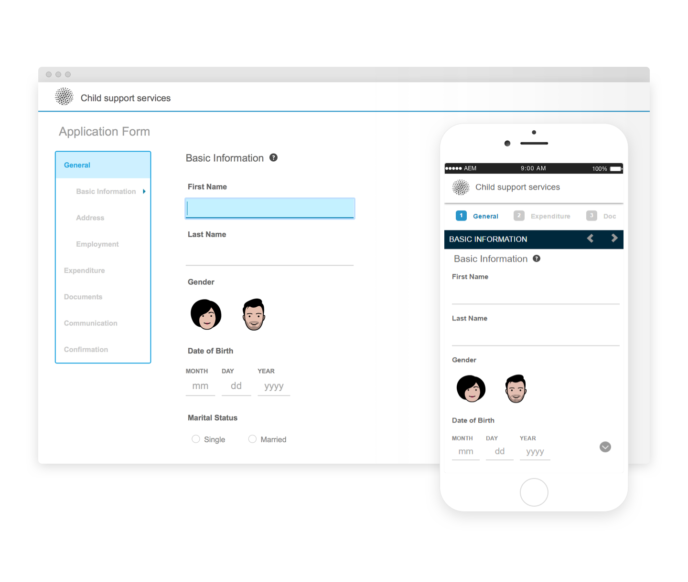
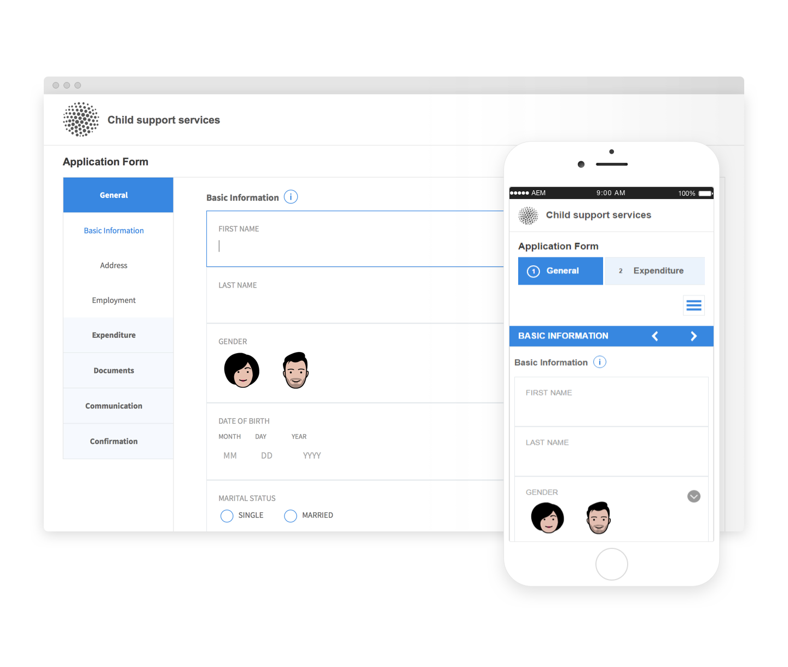

# Temáticas de referencia{#reference-themes}

[Temáticas](../../forms/using/themes.md) permite aplicar un estilo a los formularios sin tener conocimientos profundos de CSS. Además de la temática predeterminada, puede obtener las siguientes temáticas si instala el [Paquete de complementos de AEM Forms](https://experienceleague.adobe.com/docs/experience-manager-release-information/aem-release-updates/forms-updates/aem-forms-releases.html?lang=es):

* Beryl
* Exec
* Exec-Light
* Liberty
* Ultramarine
* Urbane
* Estándares de diseño web de EE. UU.
* Tranquil

Cada temática contiene un estilo único y elegante que puede utilizar para crear formularios adaptables para los usuarios. Contiene un estilo único para selectores como panel, cuadro de texto, cuadro numérico, botón de radio, tabla y conmutador. El estilo de estos temas dependerá de los requisitos. Por ejemplo, en una situación concreta se requiere una temática minimalista con fuentes limpias. La temática Liberty permite conseguir esa apariencia.

Las temáticas incluidas en este paquete son interactivas y su estilo se define para las pantallas móviles y de escritorio. La mayoría de los exploradores modernos de una variedad de dispositivos pueden procesar formularios aplicados con una de estas temáticas sin ningún inconveniente.

Para obtener más información sobre la instalación del paquete, consulte [Cómo trabajar con paquetes](/help/sites-administering/package-manager.md).

## Beryl {#beryl}

El tema Beryl se usa en el formulario adaptativo We.Gov, y enfatiza el uso de la imagen de fondo, la transparencia y los iconos grandes y planos. En la captura de pantalla siguiente, puede ver el aspecto del tema Beryl y cómo puede mejorar el estilo del formulario.

<!--[Click to enlarge

](assets/beryl-1.png)-->

## Exec {#exec}

La temática Exec evita rellenos de fondo sólidos para resaltar los componentes del formulario. Al seleccionar y hacer clic en los componentes, se cambiarán los colores de fuente. En comparación con la temática de lienzo predeterminado, el color de fuente del texto en la pestaña seleccionada cambiará a azul oscuro. Fíjese que los botones de navegación y envío son diferentes a los de la temática Beryl.

<!--[Click to enlarge

](assets/exec-1.png)-->

## Exec Light {#exec-light}

La temática Exec Light utiliza el espacio en blanco para crear una experiencia sin líneas. Los botones Siguiente y Enviar obtienen un relleno sólido y una sombra 3D. Las pestañas seleccionadas a la izquierda obtienen una flecha en lugar de marcas de verificación doble.

<!--[Click to enlarge

](assets/exec-light-1.png)-->

## Liberty {#liberty}

La temática Liberty utiliza un enfoque minimalista para resaltar lo importante. Por ejemplo, el color de fuente de la pestaña visitada cambia a verde. Solo puede ver el contorno inferior del cuadro de texto que emula la apariencia de un formulario basado en papel con líneas. El cuadro de texto activo obtiene un contorno inferior negro, mientras que otros obtienen un contorno inferior gris claro.

<!--[Click to enlarge

](assets/liberty-1.png)-->

## Tranquil {#tranquil}

El tema Tranquil ofrece tonos claros y oscuros de su esquema de colores para resaltar los diferentes componentes de un formulario. Por ejemplo, los botones de radio, los paneles y las pestañas tienen un color verde diferente.

<!--[Click to enlarge

](assets/tranquil-1.png)-->

## Ultramarine {#ultramarine}

El tema Ultramarine utiliza tonos azules profundos para resaltar componentes como fichas, paneles, cuadros de texto y botones.

<!--[Click to enlarge](assets/ultramarine-1.png)-->

## Urbane {#urbane}

El tema de Urbane destaca el aspecto minimalista y funcional de su formulario. Al aplicar el tema Urbane al formulario, puede ver que los componentes son planos. Los paneles tienen contornos finos para crear un aspecto moderno.

<!--[Click to enlarge

](assets/urbane-1.png)-->

## Estándares de diseño web de EE. UU. {#u-s-web-design-standards}

La temática de las normas de diseño web de EE.UU., como su nombre sugiere, utiliza tipos de letra y estilos descritos en el sitio Borrador de normas de diseño web de EE.UU. Las organizaciones federales utilizan el estándar web para crear experiencias web coherentes en todos los sitios web del gobierno federal.

<!--[Click to enlarge

](assets/usgov.png)-->
