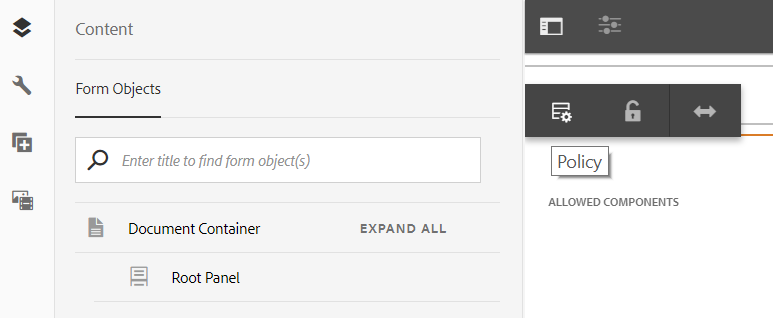

# Utilice el modo Diseño para cambiar el tamaño de los componentes {#use-layout-mode-to-resize-components}

La interfaz de creación de canales web de comunicación interactiva permite cambiar el tamaño de los componentes mediante el modo Diseño . Arrastre y suelte los puntos azules dentro de las columnas para definir los puntos iniciales y finales en los componentes de posición. Los puntos azules se muestran después de pulsar el componente en la cuadrícula interactiva. La cuadrícula interactiva consta de 12 columnas iguales. El sombreado de color blanco y azul en las columnas alternativas diferencia una columna de la otra.

Puede utilizar el modo Diseño para cambiar el tamaño de los componentes de todos los tipos de dispositivos, como escritorio, tableta, teléfono y otros dispositivos más pequeños. La tableta deriva automáticamente la configuración del diseño de la versión de escritorio y los dispositivos más pequeños derivan la configuración del diseño del teléfono. Sin embargo, puede anular las configuraciones derivadas automáticamente para definir una configuración diferente para cada tipo de dispositivo.

>[!NOTE]
>
>Si está creando el canal web utilizando [Print channel as master](../../forms/using/create-interactive-communication.md) para una comunicación interactiva, los componentes disponibles para cambiar el tamaño también incluyen los subformularios y campos que se generan automáticamente en el canal web mediante el canal de impresión. El canal web conserva el diseño de los elementos del canal de impresión en el modo Diseño.

## Acceso al modo Diseño {#access-layout-mode}

Seleccione **Diseño** en la lista desplegable que aparece en la parte superior de la interfaz de creación de comunicación interactiva junto a la opción **Vista previa**. El formulario se muestra en el modo Diseño.

1. Inicie sesión en la instancia de autor de AEM y vaya a **Adobe Experience Manager** > **Forms** > **Forms &amp; Documents**.
1. Cree una [Comunicación interactiva](../../forms/using/create-interactive-communication.md) nueva o abra una existente.
1. Seleccione **Diseño** en la lista desplegable que aparece en la parte superior junto a la opción **Vista previa**. El formulario se muestra en el modo Diseño.

   

## Cambiar el tamaño de los componentes {#resize-components}

1. En el modo Diseño , pulse el componente para cambiar su tamaño. Los puntos azules se muestran al principio y al final de la cuadrícula interactiva.
1. Arrastre y suelte los puntos azules para definir la posición del componente en la cuadrícula interactiva.

   

   La barra de herramientas que se muestra después de pulsar los componentes consta de las siguientes opciones:

   * **Principal:** seleccione el elemento principal de un componente.
   * **Flotar a una línea nueva:** desplace el componente a la línea siguiente si hay varios componentes dentro de la misma línea.

   Puede deshacer todos los cambios de tamaño y aplicar el diseño predeterminado al panel que contiene los componentes cambiados de tamaño mediante la opción **[!UICONTROL Revertir diseño del punto de interrupción]** ( ). Pulse el elemento principal del componente cuyo tamaño se ha cambiado para ver la opción.

   >[!NOTE]
   >
   >No se puede cambiar el tamaño de los componentes de columna de tabla, barra de herramientas, botón de barra de herramientas y área de destino mediante el modo Diseño . Utilice el modo Estilo para cambiar el tamaño de estos componentes.

### Ejemplo {#example}

**Objetivo:** desea insertar un componente de tabla y un componente de imagen y colocarlos en paralelo en una comunicación interactiva.

1. Inserte los componentes de tabla e imagen mediante el modo de edición en el canal web de una comunicación interactiva. El componente de imagen se muestra después del componente de tabla.
1. Cambie al modo Diseño y pulse el componente Tabla. Los puntos azules para cambiar el tamaño de la visualización del componente en las columnas 1 y 12.
1. Arrastre y suelte el punto azul en la columna 12 a la columna 6 de la cuadrícula interactiva.

   

1. Del mismo modo, seleccione el componente Imagen y arrastre y suelte el punto azul en la columna 1 a la columna 7 de la cuadrícula interactiva. Los componentes de tabla e imagen se muestran paralelos entre sí.

   

   Puede seleccionar el componente Imagen y pulsar la opción **Flotar a nueva línea** disponible en la barra de herramientas para cambiar el componente Imagen a la línea siguiente.

## Cambiar el tamaño de los paneles {#resize-panels-layout-mode}

Ejecute los siguientes pasos si desea cambiar el tamaño de todo el panel en lugar de componentes individuales:

1. Pulse cualquiera de los componentes del panel cuyo tamaño desee cambiar, seleccione  y seleccione la primera opción de la lista desplegable, si el panel es el elemento principal inmediato del componente.

   Los puntos azules se muestran al principio y al final de la cuadrícula interactiva.

1. Arrastre y suelte los puntos azules para definir la posición del panel en la cuadrícula interactiva.
Puede repetir los pasos 1 y 2 y seleccionar  para desplazar el panel cuyo tamaño ha cambiado a la línea siguiente.

## Definición del diseño de varias columnas para un panel

Ejecute los siguientes pasos para definir el número de columnas para un panel:

1. En el modo **[!UICONTROL Editar]**, pulse el panel, seleccione  y seleccione la opción **[!UICONTROL Responsivo - todo en la página sin navegación]** en la lista desplegable **[!UICONTROL Diseño del panel]**.

1. Toque  para guardar las propiedades.

1. En el modo **[!UICONTROL Diseño]**, pulse cualquiera de los componentes del panel, seleccione  y seleccione el panel.

1. Toque  y seleccione el número de columnas de la lista desplegable. El número de columnas puede oscilar entre 1 y 12. El panel se divide en un diseño de varias columnas.

## Desactivar el modo Diseño para formularios con presentación interactiva antigua {#disable-layout-mode-for-forms-with-old-responsive-layout}

Puede deshabilitar el modo Diseño para formularios con presentación interactiva antigua editando las propiedades de la plantilla utilizada en el formulario.

Siga estos pasos para desactivar el modo Diseño :

1. Seleccione **[!UICONTROL Tools]** > **[!UICONTROL General]** > **[!UICONTROL Templates]** y abra la plantilla utilizada en el formulario en modo **[!UICONTROL Edit]**.
1. Seleccione el contenedor de documentos en el panel izquierdo y pulse **[!UICONTROL Política.]**

   

1. Pulse la pestaña **[!UICONTROL Configuración del diseño]** y seleccione **[!UICONTROL Deshabilitar modo de diseño]**.
1. Toque  para guardar las propiedades de la plantilla.

