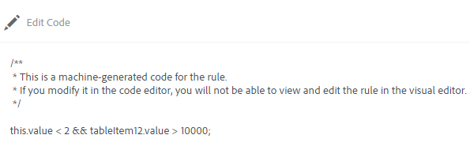

# Editor de reglas de formularios adaptables{#adaptive-forms-rule-editor}

<span class="preview"> Adobe recomienda utilizar la captura de datos moderna y ampliable [Componentes principales](https://experienceleague.adobe.com/docs/experience-manager-core-components/using/adaptive-forms/introduction.html?lang=es) para [crear un nuevo formulario adaptable](/help/forms/using/create-an-adaptive-form-core-components.md) o [añadir formularios adaptables a páginas de AEM Sites](/help/forms/using/create-or-add-an-adaptive-form-to-aem-sites-page.md). Estos componentes representan un avance significativo en la creación de formularios adaptables, lo que garantiza experiencias de usuario impresionantes. Este artículo describe un enfoque más antiguo para crear Formularios adaptables con componentes de base. </span>

| Versión | Vínculo del artículo |
| -------- | ---------------------------- |
| AEM as a Cloud Service | [Haga clic aquí](https://experienceleague.adobe.com/docs/experience-manager-cloud-service/content/forms/adaptive-forms-authoring/authoring-adaptive-forms-foundation-components/add-rules-and-use-expressions-in-an-adaptive-form/rule-editor.html?lang=es) |
| AEM 6.5 | Este artículo |

## Información general {#overview}

La característica del editor de reglas en Adobe Experience Manager Forms permite a los usuarios y desarrolladores de formularios empresariales escribir reglas sobre los objetos del formulario adaptable. Estas reglas definen las acciones que se deben activar en los objetos del formulario en función de los ajustes preestablecidos, las entradas del usuario y las acciones del usuario en el formulario. Esto ayuda a optimizar aún más la experiencia de cumplimentación de formularios, lo que garantiza precisión y velocidad.

El editor de reglas proporciona una interfaz de usuario intuitiva y simplificada para escribir reglas. El editor de reglas ofrece un editor visual para todos los usuarios. Además, solo para los usuarios avanzados de formularios, el editor de reglas proporciona un editor de código para escribir reglas y scripts.
<!-- Some of the key actions that you can perform on adaptive form objects using rules are:

* Show or hide an object
* Enable or disable an object
* Set a value for an object
* Validate the value of an object
* Execute functions to compute the value of an object
* Invoke a form data model service and perform an operation
* Set property of an object -->

El editor de reglas reemplaza las funciones de los scripts de AEM 6.1 Forms y versiones anteriores. Sin embargo, los scripts existentes se conservan en el nuevo editor de reglas. Para obtener más información sobre cómo trabajar con scripts existentes en el editor de reglas, consulte [Impacto del editor de reglas en scripts existentes](#impact-of-rule-editor-on-existing-scripts).

Los usuarios que se agregan al grupo de usuarios avanzados de formularios pueden crear scripts nuevos y editar los existentes. Los usuarios del grupo forms-users pueden utilizar los scripts, pero no crearlos o editarlos.

## Explicación de una regla {#understanding-a-rule}

Una regla es una combinación de acciones y condiciones. En el editor de reglas, las acciones incluyen actividades como ocultar, mostrar, habilitar, deshabilitar o calcular el valor de un objeto en un formulario. Las condiciones son expresiones booleanas que se evalúan realizando comprobaciones y operaciones en el estado, el valor o la propiedad de un objeto de formulario. Las acciones se realizan según el valor devuelto (`True` o `False`) mediante la evaluación de una condición.

El editor de reglas proporciona un conjunto de tipos de reglas predefinidas, como When, Show, Hide, Enable, Disable, Set Value Of y Validate para ayudarle a escribir reglas. Cada tipo de regla permite definir condiciones y acciones en una regla. El documento explica cada tipo de regla en detalle.

Una regla suele seguir una de las siguientes construcciones:

**Condición-acción**. En esta construcción, una regla primero define una condición seguida de una acción que activar. La construcción es comparable a la instrucción if-then en lenguajes de programación.

En el editor de reglas, el tipo de regla **When** aplica la construcción de condición-acción.

**Acción-condición**. En esta construcción, una regla primero define una acción que activar seguida de condiciones para la evaluación. Otra variación de esta construcción es acción-condición-acción alternativa, que también define una acción alternativa que activar si la condición devuelve un valor False.

Los tipos de reglas Show, Hide, Enable, Disable, Set Value Of y Validate del editor de reglas aplican la construcción de reglas acción-condición. De forma predeterminada, la acción alternativa para Mostrar es Ocultar y para Habilitar es Deshabilitar y, a la inversa. No se puede cambiar la acción alternativa predeterminada.

>[!NOTE]
>
>Los tipos de reglas disponibles, incluidas las condiciones y las acciones definidas en el editor de reglas, también dependen del tipo de objeto de formulario en el que se vaya a crear una regla. El editor de reglas solo muestra tipos de reglas y opciones válidas para escribir condiciones e instrucciones de acción para un tipo de objeto de formulario concreto. Por ejemplo, no ve los tipos de reglas Validate, Set Value Of, Enable y Disable para un objeto de panel.

Para obtener más información sobre los tipos de reglas disponibles en el editor de reglas, consulte [Tipos de reglas disponibles en el editor de reglas](#available-rule-types-in-rule-editor).

### Pautas para elegir una construcción de regla {#guidelines-for-choosing-a-rule-construct}

Aunque puede lograr la mayoría de los casos de uso utilizando cualquier construcción de regla, estas son algunas pautas para elegir una construcción antes que otra. Para obtener más información sobre las reglas disponibles en el editor de reglas, consulte [Tipos de reglas disponibles en el editor de reglas](#available-rule-types-in-rule-editor).

* Una regla general típica al crear una regla es pensarla en el contexto del objeto en el que quiere escribirla. Tenga en cuenta que desea ocultar o mostrar el campo B en función del valor que un usuario especifique en el campo A. En este caso, quiere evaluar una condición en el campo A y, en función del valor que se devuelva, se debe activar una acción en el campo B.

  Por lo tanto, si está escribiendo una regla en el campo B (el objeto sobre el que se evalúa una condición), utilice la construcción condición-acción o el tipo de regla When. Del mismo modo, utilice la construcción acción-condición o el tipo de regla Show o Hide en el campo A.

* A veces, debe realizar varias acciones en función de una condición. En estos casos, se recomienda utilizar la construcción condición-acción. En esta construcción, puede evaluar una condición una vez y especificar varias instrucciones de acción.

  Por ejemplo, para ocultar los campos B, C y D en función de la condición que comprueba el valor que un usuario especifica en el campo A, escriba una regla con la estructura condición-acción o el tipo de regla When en el campo A y especifique acciones para controlar la visibilidad de los campos B, C y D. De lo contrario, necesitará tres reglas independientes en los campos B, C y D, donde cada regla comprueba la condición y muestra u oculta el campo respectivo. En este ejemplo, es más eficaz escribir el tipo de regla When en un objeto, en lugar de Show o Hide en tres objetos.

* Para activar una acción basada en varias condiciones, se recomienda utilizar la construcción acción-condición. Por ejemplo, para mostrar y ocultar el campo A mediante la evaluación de condiciones en los campos B, C y D, utilice el tipo de regla Mostrar u Ocultar en el campo A.
* Utilice la construcción condición-acción o acción-condición si la regla contiene una acción para una condición.
* Si una regla comprueba la existencia de una condición y realiza una acción inmediatamente al proporcionar un valor en un campo o al salir de un campo, se recomienda escribir una regla con la construcción condición-acción o el tipo de regla When en el campo en el que se evalúa la condición.
* La condición de la regla When se evalúa cuando un usuario cambia el valor del objeto en el que se aplica dicha regla. Sin embargo, si desea que la acción se almacene en déclencheur cuando el valor cambia en el servidor, como al rellenar previamente el valor, se recomienda escribir una regla When que almacene en déclencheur la acción cuando el campo se inicialice.
* Al escribir reglas para objetos de menús desplegables, botones de opción o casillas de verificación, las opciones o los valores de estos objetos de formulario en el mismo se rellenan previamente en el editor de reglas.

## Tipos de operadores y eventos disponibles en el editor de reglas {#available-operator-types-and-events-in-rule-editor}

El editor de reglas proporciona los siguientes operadores lógicos y eventos mediante los cuales puede crear reglas.

* **Is Equal To**
* **Is Not Equal To**
* **Starts With**
* **Ends With**
* **Contains**
* **Is Empty**
* **Is Not Empty**
* **Has Selected:** devuelve el valor True cuando el usuario selecciona una opción concreta para un botón de opción, un menú desplegable o una casilla de verificación.
* **Is Initialized (event):** devuelve el valor True cuando un objeto de formulario se procesa en el explorador.
* **Is Changed (event):** devuelve el valor True cuando el usuario cambia el valor indicado o la opción seleccionada para un objeto de formulario.

## Tipos de reglas disponibles en el editor de reglas {#available-rule-types-in-rule-editor}

El editor de reglas proporciona un conjunto de tipos de reglas predefinidas que puede utilizar para escribir reglas. Veamos en detalle cada tipo de regla. Para obtener más información sobre cómo escribir reglas en el editor de reglas, consulte [Escribir reglas](#write-rules).

### Cuando  {#whenruletype}

El tipo de regla **When** sigue a la construcción de regla **condición-acción-acción alternativa** o, a veces, solo a la construcción **condición-acción**. En este tipo de regla, primero debe especificar una condición para la evaluación seguida de una acción que se activará si se cumple la condición (`True`). Al usar el tipo de regla When, puede usar varios operadores AND y OR para crear [expresiones anidadas](#nestedexpressions).

Con el tipo de regla When, se puede evaluar una condición en un objeto de formulario y realizar acciones en uno o varios objetos.

En palabras simples, una regla When típica está estructurada de la siguiente manera:

`When on Object A:`

`(Condition 1 AND Condition 2 OR Condition 3) is TRUE;`

`Then, do the following:`

Acción 2 en objeto B;
AND
Acción 3 en objeto C;

_

Cuando tiene un componente de varios valores, como botones de opción o lista, mientras crea una regla para ese componente, las opciones se recuperan automáticamente y se ponen a disposición del creador de reglas. No es necesario que vuelva a escribir los valores de las opciones.

Por ejemplo, una lista tiene cuatro opciones: rojo, azul, verde y amarillo. Al crear la regla, las opciones (botones de opción) se recuperan automáticamente y se ponen a disposición del creador de reglas de la siguiente manera:


Al escribir una regla When, puede activar la acción Clear Value Of. La acción Clear Value Of borra el valor del objeto especificado. Contar con Borrar valor de como opción en la instrucción Cuando permite crear condiciones complejas con varios campos.


**Hide**. Oculta el objeto especificado.

**Show**. Muestra el objeto especificado.

**Enable**. Habilita el objeto especificado.

**Disable**. Deshabilita el objeto especificado.

**Invoke service**. Invoca un servicio configurado en un modelo de datos de formulario. Al elegir la operación Invoke Service, aparece un campo. Al pulsar el campo, se muestran todos los servicios configurados en todos los modelos de datos de formulario de la instancia de AEM. Al elegir un servicio del modelo de datos de formulario, aparecen campos adicionales en los que se pueden asignar objetos de formulario con parámetros de entrada y salida para el servicio especificado. Consulte la regla de ejemplo para invocar los servicios del modelo de datos de formulario.

Además del servicio de modelo de datos de formulario, puede especificar una URL de WSDL directa para invocar un servicio web. Pero un servicio del modelo de datos de formulario tiene muchas ventajas y es el método recomendado para invocar un servicio.

Para obtener más información sobre la configuración de servicios en el modelo de datos de formulario, consulte [Integración de datos de AEM Forms](/help/forms/using/data-integration.md).

**Establecer valor de** Calcula y establece el valor del objeto especificado. Puede establecer el valor del objeto en una cadena, el valor de otro objeto, el valor calculado mediante expresión o función matemática, el valor de una propiedad de un objeto o el valor de salida de un servicio configurado del modelo de datos de formulario. Al elegir la opción de servicio web, se muestran todos los servicios configurados en todos los modelos de datos de formulario de la instancia de AEM. Al elegir un servicio del modelo de datos de formulario, aparecen campos adicionales en los que se pueden asignar objetos de formulario con parámetros de entrada y salida para el servicio especificado.

Para obtener más información sobre la configuración de servicios en el modelo de datos de formulario, consulte [Integración de datos de AEM Forms](/help/forms/using/data-integration.md).

El tipo de regla **[!UICONTROL Establecer propiedad]** permite establecer el valor de una propiedad del objeto especificado en función de una acción de condición. Puede establecer la propiedad en una de las siguientes opciones:

* visible (booleano)
* dorExclusion (booleano)
* chartType (Cadena)
* título (Cadena)
* habilitado (booleano)
* obligatorio (booleano)
* validationsDisabled (booleano)
* validateExpMessage (Cadena)
* valor (Número, Cadena, Fecha)
* elementos (Lista)
* válido (booleano)
* errorMessage (Cadena)

Permite definir reglas para agregar casillas de verificación de forma dinámica al formulario adaptable. Puede utilizar una función personalizada, un objeto de formulario o una propiedad de objeto para definir una regla.


Para definir una regla basada en una función personalizada, seleccione **Salida de función** en la lista desplegable y arrastre y suelte una función personalizada desde la pestaña **Funciones**. Si se cumple la acción de la condición, el número de casillas de verificación definidas en la función personalizada se agregará al formulario adaptable.

Para definir una regla basada en un objeto de formulario, seleccione **Objeto de formulario** en la lista desplegable y arrastre y suelte un objeto de formulario desde la pestaña **Objetos de formulario**. Si se cumple la acción de la condición, el número de casillas de verificación definidas en el objeto de formulario se agregará al formulario adaptable.

La regla Set Property basada en una propiedad de objeto permite agregar el número de casillas de verificación en un formulario adaptable basándose en otra propiedad de objeto incluida en el formulario adaptable.

En la siguiente figura se muestra un ejemplo de cómo agregar casillas de verificación de forma dinámica en función del número de listas desplegables del formulario adaptable:


**Clear Value Of**. Borra el valor del objeto especificado.

**Set Focus**. Define el enfoque del objeto especificado.

**Save Form**. Guarda el formulario.

**Submit Forms**. Envía el formulario.

**Reset Form**. Restablece el formulario.

**Validate Form**. Valida el formulario.

**Add Instance**. Agrega una instancia del panel repetible o fila de tabla especificados.

**Remove Instance**. Quita una instancia del panel repetible o fila de tabla especificados.

**Navegar hasta** navega a otros formularios adaptables, otros recursos, como imágenes o fragmentos de documento, o una URL externa. Para obtener más información, consulte [Botón Agregar a la comunicación interactiva](../../forms/using/create-interactive-communication.md#addbuttontothewebchannel).

### Establecer valor de {#set-value-of}

El tipo de regla **[!UICONTROL Fijar valor de]** le permite definir el valor de un objeto de formulario en función de si la condición especificada se cumple o no. El valor puede establecerse en un valor de otro objeto, una cadena literal, un valor derivado de una expresión matemática o una función, un valor de una propiedad de otro objeto o el resultado de un servicio de modelo de datos de formulario. Del mismo modo, se puede comprobar la existencia de una condición en un componente, una cadena, una propiedad o valores derivados de una función o expresión matemática.

El tipo de regla Set Value Of no está disponible para todos los objetos de formulario, como paneles y botones de la barra de herramientas. Una regla de valor definido estándar tiene la siguiente estructura:


Set value of Objeto A to:

(cadena ABC) OR
(propiedad de objeto X de Ovjeto C) OR
(valor de una función) OR
(valor de una expresión matemática) OR
(valor de salida de un servicio de modelo de datos o web);

When (opcional):

(Condición 1 AND Condición 2 AND Condición 3) is TRUE;


El siguiente ejemplo toma el valor del campo `dependentid` como entrada y establece el valor del campo `Relation` como salida del argumento `Relation` del servicio `getDependent` del modelo de datos de formulario.


Ejemplo de la regla Establecer valor mediante un servicio del modelo de datos de formulario

>[!NOTE]
>
>Además, puede utilizar la regla Establecer valor de para rellenar todos los valores de un componente de lista desplegable desde la salida de un servicio de modelo de datos de formulario o un servicio web. No obstante, asegúrese de que el argumento de salida que elija sea de un tipo de matriz. Todos los valores devueltos en una matriz estarán disponibles en la lista desplegable especificada.

### Show {#show}

Al usar el tipo de regla **Show**, puede escribir una regla para mostrar u ocultar un objeto de formulario en función de si una condición se cumple o no. El tipo de regla Show también activa la acción Hide (ocultar) en caso de que la condición no se cumpla o devuelva un valor `False`.

Una regla Show típica se estructura de la siguiente manera:


`Show Object A;`

`When:`

`(Condition 1 OR Condition 2 OR Condition 3) is TRUE;`

`Else:`

`Hide Object A;`


### Hide {#hide}

Al igual que el tipo de regla Show, puede usar el tipo de regla **Hide** para mostrar u ocultar un objeto de formulario en función de si se cumple o no una condición. El tipo de regla Hide también activa la acción Show (mostrar) en caso de que la condición no se cumpla o devuelva un valor `False`.

Una regla Hide típica se estructura de la siguiente manera:


`Hide Object A;`

`When:`

`(Condition 1 AND Condition 2 AND Condition 3) is TRUE;`

`Else:`

`Show Object A;`


### Habilitar {#enable}

El tipo de regla **Enable** permite activar o desactivar un objeto de formulario en función de si se cumple o no una condición. El tipo de regla Enable también activa la acción Disable en caso de que la condición no se cumpla o devuelva un valor `False`.

Una regla Enable típica se estructura de la siguiente manera:


`Enable Object A;`

`When:`

`(Condition 1 AND Condition 2 AND Condition 3) is TRUE;`

`Else:`

`Disable Object A;`


### Disable {#disable}

Similar al tipo de regla Habilitar, el tipo de regla **Deshabilitar** permite habilitar o deshabilitar un objeto de formulario en función de si se cumple o no una condición. El tipo de regla Disable también activa la acción Enable (habilitar) en caso de que la condición no se cumpla o devuelva un valor `False`.

Una regla Disable típica se estructura de la siguiente manera:


`Disable Object A;`

`When:`

`(Condition 1 OR Condition 2 OR Condition 3) is TRUE;`

`Else:`

`Enable Object A;`

### Validate {#validate}

El tipo de regla **Validate** valida el valor de un campo mediante una expresión. Por ejemplo, puede escribir una expresión para comprobar que el cuadro de texto para especificar el nombre no contenga caracteres especiales ni números.

Una regla Validar típica se estructura de la siguiente manera:

`Validate Object A;`

`Using:`

`(Expression 1 AND Expression 2 AND Expression 3) is TRUE;`

>[!NOTE]
>
>Si el valor especificado no cumple la regla Validar, puede mostrar un mensaje de validación al usuario. Puede especificar la notificación en el **[!UICONTROL mensaje de validación del script]** en las propiedades del componente, en la barra lateral.


### Establecer opciones de {#setoptionsof}

El tipo de regla **Establecer opciones de** permite definir reglas para agregar casillas de verificación de forma dinámica al formulario adaptable. Puede utilizar un modelo de datos de formulario o una función personalizada para definir la regla.

Para definir una regla basada en una función personalizada, seleccione **Salida de función** en la lista desplegable y arrastre y suelte una función personalizada desde la pestaña **Funciones**. El número de casillas de verificación definidas en la función personalizada se agregará al formulario adaptable.


Para crear una función personalizada, consulte [Funciones personalizadas en el editor de reglas](#custom-functions).

Para definir una regla basada en un modelo de datos de formulario:

1. Seleccione **Salida de servicio** en la lista desplegable.
1. Seleccione el objeto de modelo de datos.
1. Seleccione una propiedad de objeto del modelo de datos en la lista desplegable **Valor de visualización**. El número de casillas de verificación del formulario adaptable se deriva del número de instancias definidas para esa propiedad en la base de datos.
1. Seleccione una propiedad de objeto del modelo de datos en la lista desplegable **Guardar valor**.


## Explicación de la interfaz de usuario del editor de reglas {#understanding-the-rule-editor-user-interface}

El editor de reglas proporciona una interfaz de usuario completa pero sencilla para escribir y administrar reglas. Puede iniciar la interfaz de usuario del editor de reglas desde un formulario adaptable en modo de creación.

Para iniciar la interfaz de usuario del editor de reglas, haga lo siguiente:

1. Abra un formulario adaptable en modo de creación.
1. Seleccione el objeto de formulario para el que desea escribir una regla y, en la barra de herramientas de componentes, seleccione .  Aparecerá la interfaz de usuario del editor de reglas.

   

   Cualquier regla existente en los objetos de formulario seleccionados se muestra en esta vista. Para obtener información sobre la administración de reglas existentes, consulte [Administrar reglas](#manage-rules).

1. Seleccione **[!UICONTROL Crear]** para escribir una regla nueva. El editor visual de la interfaz de usuario del editor de reglas se abre de forma predeterminada cuando se inicia el editor de reglas por primera vez.

   

Veamos en detalle cada componente de la interfaz de usuario del editor de reglas.

### A. Visualización de la regla de componente {#a-component-rule-display}

Muestra el título del objeto del formulario adaptable a través del cual se ha iniciado el editor de reglas y el tipo de regla seleccionado actualmente. En el ejemplo anterior, el editor de reglas se inicia desde un objeto de formulario adaptable llamado Salary y el tipo de regla seleccionado es When.

### B. Desde objetos y funciones {#b-form-objects-and-functions-br}

El panel de la izquierda de la interfaz de usuario del editor de reglas incluye dos pestañas: **[!UICONTROL Objetos de formulario]** y **[!UICONTROL Funciones]**.

La pestaña Objetos de formulario muestra una vista jerárquica de todos los objetos contenidos en el formulario adaptable. Muestra el título y el tipo de los objetos. Al escribir una regla, puede arrastrar y soltar objetos de formulario en el editor de reglas. Al crear o editar una regla cuando arrastra y suelta un objeto o función en un marcador de posición, el marcador de posición toma automáticamente el tipo de valor apropiado.

Los objetos de formulario que tienen una o más reglas válidas aplicadas se marcan con un punto verde. Si alguna de las reglas aplicadas a un objeto de formulario no es válida, este se marcará con un punto amarillo.

La pestaña Funciones incluye un conjunto de funciones integradas, como Sum Of (suma de), Min Of (mín. de), Max Of (máx. de), Average Of (promedio de), Number Of (número de) y Validate Form (validar formulario). Puede utilizar estas funciones para calcular valores en paneles repetibles y filas de tabla y utilizarlos en instrucciones de acción y condición al escribir reglas. Sin embargo, también puede crear [funciones personalizadas](#custom-functions).


>[!NOTE]
>
>Puede buscar texto en nombres de objetos y funciones y títulos en las pestañas Objetos de formulario y Funciones.

En el árbol izquierdo de los objetos de formulario, puede seleccionar los objetos de formulario para mostrar las reglas aplicadas a cada uno de ellos. No solo puede desplazarse por las reglas de los distintos objetos de formulario, sino que también puede copiar y pegar reglas entre los objetos de formulario. Para obtener más información, consulte [Copiar y pegar reglas](#copy-paste-rules).

### C. Alternar entre funciones y objetos de formulario {#c-form-objects-and-functions-toggle-br}

Al pulsar el botón de cambio, se alternan los paneles de funciones y de objetos de formulario.

### D. Editor de reglas visual {#d-visual-rule-editor}

El editor de reglas visual es el área del modo de editor visual de la interfaz de usuario del editor de reglas donde se escriben las reglas. Permite seleccionar un tipo de regla y definir las condiciones y las acciones correspondientes. Al definir condiciones y acciones en una regla, puede arrastrar y soltar funciones y objetos de formulario desde el panel Objetos de formulario y el de Funciones.

Para obtener más información sobre el uso del editor de reglas visuales, consulte [Escribir reglas](#write-rules).

### E. Interruptor de editores de código visual {#e-visual-code-editors-switcher}

Los usuarios del grupo forms-power-users pueden acceder al editor de código. Para otros usuarios, el editor de código no está disponible. Si tiene los derechos, puede cambiar del modo de editor visual al modo de editor de código del editor de reglas y, a la inversa, utilizar el conmutador situado justo encima del editor de reglas. Cuando se inicia el editor de reglas por primera vez, se abrirá en el modo de editor visual. Puede escribir reglas en el modo de editor visual o cambiar al modo de editor de código para escribir un script de regla. Sin embargo, si escribe o modifica una regla en el editor de código, no puede cambiar al editor visual para esa regla a menos que borre el editor de código.

AEM Forms rastrea el modo de editor de reglas que utilizó por última vez para escribir una regla. Cuando inicie el editor de reglas la próxima vez, se abrirá en ese modo. Pero también puede configurar un modo predeterminado para abrir el editor de reglas en el modo especificado. Para ello:

1. Vaya a la consola web de AEM en `https://[host]:[port]/system/console/configMgr`.
1. Haga clic para editar **[!UICONTROL Configuración del canal web de comunicaciones interactivas y formularios adaptables]**.
1. Elija **[!UICONTROL Editor visual]** o **[!UICONTROL Editor de código]** de la lista desplegable **[!UICONTROL Modo predeterminado del editor de reglas]**

1. Haga clic en **[!UICONTROL Guardar]**.

### F. Botones Listo y Cancelar {#f-done-and-cancel-buttons}

El botón **[!UICONTROL Listo]** se utiliza para guardar una regla. Puede guardar una regla incompleta. Sin embargo, las que estén incompletas no son válidas, por lo tanto, no se ejecutan. Las reglas guardadas en un objeto de formulario se enumeran cuando se inicia el editor de reglas la próxima vez desde el mismo objeto. Puede administrar las reglas existentes en esa vista. Para obtener más información, consulte [Administrar reglas](#manage-rules).

El botón **[!UICONTROL Cancelar]** descarta los cambios realizados en una regla y cierra el editor de reglas.

## Escribir reglas {#write-rules}

Puede escribir reglas mediante el editor visual de reglas o el editor de código. Cuando se inicia el editor de reglas por primera vez, se abre en el modo de editor visual. Puede cambiar al modo de editor de código y escribir reglas. Pero si escribe o modifica una regla en el editor de código, no puede cambiar al editor visual para esa regla a menos que borre el editor de código. Cuando inicie el editor de reglas la próxima vez, se abrirá en el modo que utilizó por última vez para crear reglas.

Veamos primero cómo escribir reglas utilizando el editor visual.

### Uso del editor visual {#using-visual-editor}

Vamos a comprender cómo crear una regla en el editor visual utilizando el siguiente formulario de ejemplo.


La sección Loan Requirements (requisitos de préstamo) del formulario de solicitud de ejemplo requiere que los solicitantes especifiquen su estado civil, su salario y, si están casados, el salario de su cónyuge. En función de las entradas del usuario, la regla calcula la cantidad de idoneidad para el préstamo y se muestra en el campo Loan Eligibility (elegibilidad del préstamo). Aplique las siguientes reglas para implementar el escenario:

* El campo Spouse’s Salary (salario del cónyuge) solo se muestra cuando en el estado civil (Marital Status) se indica que se está casado o casada (Married).
* La cantidad de la elegibilidad del préstamo es el 50 % del salario total.

Siga estos pasos para escribir reglas:

1. En primer lugar, escriba la regla para controlar la visibilidad del campo del salario del cónyuge en función de la opción que seleccione el usuario para el botón de opción de estado civil.

   Abra el formulario de solicitud de préstamo en modo de creación. Seleccione el componente **Estado civil** y haga clic en . A continuación, seleccione **[!UICONTROL Crear]** para iniciar el editor de reglas.

   

   Al iniciar el editor de reglas, la regla When se selecciona de forma predeterminada. Además, el objeto de formulario (en este caso, Marital Status) desde el que se inició el editor de reglas se especifica en la instrucción When.

   Aunque no puede cambiar ni modificar el objeto seleccionado, puede utilizar la lista desplegable de reglas, como se muestra a continuación, para seleccionar otro tipo de regla. Si desea crear una regla en otro objeto, seleccione Cancelar para salir del editor de reglas y volver a iniciarlo desde el objeto de formulario deseado.

1. Seleccione el menú desplegable **[!UICONTROL Seleccionar estado]** y haga clic en **[!UICONTROL es igual a]**. Aparece el campo **[!UICONTROL Escribir una cadena]**.

   

   En el botón de opción Marital Status, las opciones **Married** y **Single** tienen los valores **0** y **1** asignados, respectivamente. Puede verificar los valores asignados en la pestaña Título del cuadro de diálogo del botón de opción Editar como se muestra a continuación.

   

1. En el campo **Escribir una cadena** de la regla, especifique **0**.

   

   Ha definido la condición como `When Marital Status is equal to Married`. A continuación, defina la acción que se realizará si esta condición es True.

1. En la instrucción Then, seleccione **[!UICONTROL Show]** de la lista desplegable **[!UICONTROL Seleccionar acción]**.

   

1. Arrastre y suelte el campo **Spouse Salary** de la pestaña Objetos de formulario en el campo **Colocar objeto o seleccionar aquí**. Como alternativa, seleccione el campo **Colocar objeto o seleccionar aquí** y seleccionar el campo **Salario del cónyuge** del menú emergente, que enumera todos los objetos del formulario.

   

   La regla aparece de la siguiente manera en el editor.

   

   Seleccione **Listo** para guardar la regla.

1. Repita los pasos del 1 al 5 para definir otra regla que oculte el campo Spouse Salary si el estado civil es Single (soltero o soltera). La regla aparece de la siguiente manera en el editor.

   

   >[!NOTE]
   >
   >Como alternativa, puede escribir una regla Show en el campo Spouse Salary, en lugar de dos reglas When en el campo Marital Status, para implementar el mismo comportamiento.

   

1. A continuación, escriba una regla para calcular el importe de idoneidad para el préstamo, que es el 50 % del salario total, y muéstrela en el campo Loan Eligibility. Para lograr este resultado, cree reglas **Establecer valor de** sobre el campo Loan Eligibility.

   En el modo de creación, seleccione el campo **[!UICONTROL Idoneidad del préstamo]** y haga clic en . A continuación, seleccione **[!UICONTROL Crear]** para iniciar el editor de reglas.

1. Seleccione la regla **[!UICONTROL Set Value Of]** en la lista desplegable de reglas.

   

1. Seleccione **[!UICONTROL Seleccionar opción]** y seleccione **[!UICONTROL Expresión matemática]**. Se abre un campo para escribir una expresión matemática.

   

1. En el campo de la expresión:

   * Seleccione o arrastre y suelte desde la pestaña Objetos de formulario el campo **Salary** (salario) en el primer campo **Colocar objeto o seleccionar aquí**.

   * Seleccione **Más** en el campo **Seleccionar operador**.

   * Seleccione o arrastre y suelte desde la pestaña Objetos de formulario el campo **Spouse Salary** en el otro campo **Colocar objeto o seleccionar aquí**.

   

1. A continuación, seleccione el área resaltada alrededor del campo de expresión y haga clic en **Ampliar expresión**.

   

   En el campo para ampliar la expresión, seleccione **divided byr** en el campo **Seleccionar operador** y **Número** en el campo **Seleccionar opción**. A continuación, especifique **2** en el campo de número.

   

   >[!NOTE]
   >
   >Puede crear expresiones complejas utilizando componentes, funciones, expresiones matemáticas y valores de propiedad del campo Seleccionar opción.

   A continuación, cree una condición que, cuando devuelva un valor True, ejecute la expresión.

1. Seleccione **Agregar condición** para agregar una instrucción When.

   

   En la instrucción When:

   * Seleccione o arrastre y suelte desde la pestaña Objetos de formulario el campo **Marital Status** en el primer campo **Colocar objeto o seleccionar aquí**.

   * Seleccione **es igual a** en el campo **Seleccionar operador**.

   * Seleccione Cadena en el otro campo **Colocar objeto o seleccionar aquí** y especifique **Married** en el campo **Escribir una cadena**.

   La regla finalmente aparece de la siguiente manera en el editor de reglas. 

   Seleccione **Listo** para guardar la regla.

1. Repita los pasos del 7 al 12 para definir otra regla que calcule la idoneidad del préstamo si el estado civil es Single (soltero o soltera). La regla aparece de la siguiente manera en el editor.

   

>[!NOTE]
>
>También puede utilizar la regla Set Value Of para calcular la idoneidad del préstamo en la regla When que creó para mostrar u ocultar el campo Spouse Salary. La regla combinada resultante cuando el estado civil es Single aparece de la siguiente manera en el editor de reglas.
>
>Del mismo modo, puede escribir una regla combinada para controlar la visibilidad del campo Spouse Salary y calcular la idoneidad del préstamo cuando el estado civil sea Married.


### Usar el editor de código {#using-code-editor}

Los usuarios que se agregan al grupo de usuarios con capacidad para formularios pueden utilizar el editor de código. El editor de reglas genera automáticamente el código JavaScript para cualquier regla que cree con el editor visual. Puede cambiar del editor visual al editor de código para ver el código generado. Pero si modifica el código de regla en el editor de código, no podrá volver al editor visual. Si prefiere escribir reglas en el editor de código en lugar de en el editor visual, puede escribir reglas de nuevo en el editor de código. El interruptor de editores de código visual le ayudará a cambiar entre ambos modos.

El editor de código JavaScript es el lenguaje de expresión de los formularios adaptables. Todas las expresiones son expresiones JavaScript válidas y utilizan API de modelos de scripts de formularios adaptables. Estas expresiones devuelven valores de ciertos tipos. Para obtener la lista completa de clases, eventos, objetos y API públicas de los formularios adaptables, consulte [Referencia de la API de la biblioteca JavaScript para formularios adaptables](https://helpx.adobe.com/es/experience-manager/6-5/forms/javascript-api/index.html).

Para obtener más información sobre las directrices para escribir reglas en el editor de código, consulte [Expresiones de formularios adaptables](/help/forms/using/adaptive-form-expressions.md).

Mientras escribe código JavaScript en el editor de reglas, las siguientes indicaciones visuales le ayudarán con la estructura y la sintaxis:

* Elementos destacados de sintaxis
* Sangría automática
* Sugerencias para objetos de formulario, funciones y sus propiedades
* Finalización automática de nombres de componentes de formulario y funciones comunes de JavaScript


#### Funciones personalizadas en el editor de reglas {#custom-functions}

Aparte de las funciones integradas, como *Sum of* que se enumeran en Salida de funciones, puede escribir funciones personalizadas que necesite con frecuencia. Asegúrese de que la función que escriba esté acompañada de una etiqueta `jsdoc` encima.

Incluir una etiqueta `jsdoc` es obligatorio:

* Si desea una configuración y descripción personalizadas.
* Porque hay varias formas de declarar una función en `JavaScript,` y los comentarios permiten realizar un seguimiento de las funciones.

Para obtener más información, consulte [usejsdoc.org](https://jsdoc.app/).

Etiquetas `jsdoc` compatibles:

* **Sintaxis**
privada: `@private`
una función privada no se incluye como función personalizada.

* **Sintaxis**
de nombre: `@name funcName <Function Name>`
O bien, `,` puede usar: `@function funcName <Function Name>` **o** `@func` `funcName <Function Name>`.
  `funcName` es el nombre de la función (no se permiten espacios).
  `<Function Name>` es el nombre para mostrar de la función.

* **Sintaxis**
de abonado: `@memberof namespace`
adjunta un área de nombres a la función.

* **Sintaxis**
de parámetro: `@param {type} name <Parameter Description>`
O bien, puede usar: `@argument` `{type} name <Parameter Description>` **o** `@arg` `{type}` `name <Parameter Description>`.
Muestra los parámetros utilizados por la función. Una función puede tener varias etiquetas de parámetro, una etiqueta para cada parámetro en el orden de ocurrencia.
  `{type}` representa el tipo de parámetro. Los tipos de parámetros permitidos son:

   1. cadena
   1. número
   1. booleano
   1. ámbito

  El ámbito se utiliza para hacer referencia a los campos de un formulario adaptable. Cuando un formulario utiliza la carga diferida, puede utilizar `scope` para acceder a sus campos. Puede acceder a los campos cuando se cargan o si están marcados como globales.

  Todos los demás tipos de parámetro se clasifican en una de las categorías anteriores. Ninguno no es compatible. Asegúrese de seleccionar uno de los tipos anteriores. Los tipos no distinguen entre mayúsculas y minúsculas. No se permiten espacios en el parámetro `name`. `<Parameter Descrption>` `<parameter>  can have multiple words. </parameter>`

* **Sintaxis**
de tipo de retorno: `@return {type}`
O bien, puede usar `@returns {type}`.
Agrega información sobre la función, como su objetivo. 
{type} representa el tipo de valor devuelto de la función. Los tipos de valor devuelto permitidos son:

   1. cadena
   1. número
   1. booleano

  Todos los demás tipos de valor devuelto se clasifican en una de las categorías anteriores. Ninguno no es compatible. Asegúrese de seleccionar uno de los tipos anteriores. Los tipos de devolución no distinguen entre mayúsculas y minúsculas.

* **Esta**
sintaxis: `@this currentComponent`

  Utilice @this para hacer referencia al componente de formulario adaptable en el que se escribe la regla.

  El siguiente ejemplo se basa en el valor de campo. En el ejemplo siguiente, la regla oculta un campo del formulario. La porción `this` de `this.value` hace referencia al componente de formulario adaptable subyacente, en el que se escribe la regla.

  ```
     /**
     * @function myTestFunction
     * @this currentComponent
     * @param {scope} scope in which code inside function will be executed.
     */
     myTestFunction = function (scope) {
        if(this.value == "O"){
              scope.age.visible = true;
        } else {
           scope.age.visible = false;
        }
     }
  ```

>[!NOTE]
>
>Los comentarios antes de la función personalizada se utilizan como resumen. El resumen puede extenderse a varias líneas hasta que se encuentre una etiqueta. Limite el tamaño a un único para ver una descripción concisa en el generador de reglas.

<!--
**Adding a custom function**

For example, you want to add a custom function which calculates area of a square. Side length is the user input to the custom function, which is accepted using a numeric box in your form. The calculated output is displayed in another numeric box in your form. To add a custom function, you have to first create a client library, and then add it to the CRX repository.

Perform the following steps to create a client library and add it in the CRX repository.

1. Create a client library. For more information, see [Using Client-Side Libraries](/help/sites-developing/clientlibs.md).
2. In CRXDE, add a property `categories`with string type value as `customfunction` to the `clientlib` folder.

   >[!NOTE]
   >
   >`customfunction`is an example category. You can choose any name for the category you create in the `clientlib`folder.

After you have added your client library in the CRX repository, use it in your adaptive form. It lets you use your custom function as a rule in your form. Perform the following steps to add the client library in your adaptive form.

1. Open your form in edit mode.
   To open a form in edit mode, select a form and select **Open**.
1. In the edit mode, select a component, then select  &gt; **Adaptive Form Container**, and then select .
1. In the sidebar, under Name of Client Library, add your client library. ( `customfunction` in the example.)

   

1. Select the input numeric box, and select  to open the rule editor.
1. Select **Create Rule**. Using options shown below, create a rule to save the squared value of the input in the Output field of your form.
   [ ](assets/add-custom-rule.png)Select **Done**. Your custom function is added.

#### Function declaration supported types {#function-declaration-supported-types}

**Function Statement**

```javascript
function area(len) {
    return len*len;
}
```

This function is included without `jsdoc` comments.

**Function Expression**

```javascript
var area;
//Some codes later
/** */
area = function(len) {
    return len*len;
};
```

**Function Expression and Statement**

```javascript
var b={};
/** */
b.area = function(len) {
    return len*len;
}
```

**Function Declaration as Variable**

```javascript
/** */
var x1,
    area = function(len) {
        return len*len;
    },
    x2 =5, x3 =true;
```

Limitation: custom function picks only the first function declaration from the variable list, if together. You can use function expression for every function declared.

**Function Declaration as Object**

```javascript
var c = {
    b : {
        /** */
        area : function(len) {
            return len*len;
        }
    }
};
```

>[!NOTE]
>
>Ensure that you use `jsdoc` for every custom function. Although `jsdoc`comments are encouraged, include an empty `jsdoc`comment to mark your function as custom function. It enables default handling of your custom function.
-->

También puede utilizar funciones personalizadas en el editor de reglas. Para obtener instrucciones sobre cómo crear funciones personalizadas, consulte el artículo [Funciones personalizadas en Forms adaptable](/help/forms/using/create-and-use-custom-functions.md).

## Administrar reglas {#manage-rules}

Cualquier regla existente en un objeto de formulario aparece enumerada al seleccionar el objeto y seleccionar . Puede ver el título y una vista previa del resumen de la regla. Además, la IU le permite expandir y ver el resumen completo de las reglas, cambiar el orden, editarlas y eliminarlas.


Puede realizar las siguientes acciones en reglas:

* **Ampliar/contraer**: la columna Contenido de la lista de reglas muestra el contenido de las reglas. Si todo el contenido de la regla no es visible en la vista predeterminada, seleccione  para ampliarla.

* **Reordenar**: cualquier regla nueva que cree se apilará en la parte inferior de la lista de reglas. Las reglas se ejecutan de arriba a abajo. La regla de la parte superior se ejecuta primero, seguida de otras reglas del mismo tipo. Por ejemplo, si tiene las reglas When, Show, Enable y When en las posiciones primera, segunda, tercera y cuarta desde la parte superior, respectivamente, la regla When en la parte superior se ejecuta primero, seguida de la regla When en la cuarta posición. A continuación, se ejecutan las reglas Mostrar y Habilitar.
Puede cambiar el orden de una regla al pulsar  o arrástrela hasta el orden deseado en la lista.

* **Editar**: para editar una regla, active la casilla de verificación situada junto al título de la misma. Aparecerán las opciones para editar y eliminar la regla. Seleccione **Editar** para abrir la regla seleccionada en el editor de reglas en modo visual o editor de código, según el modo utilizado para crearla.

* **Eliminar**: para eliminar una regla, selecciónela y presione **Eliminar**.

* **Habilitar/Deshabilitar**: es posible que tenga que suspender temporalmente el uso de una regla. Puede seleccionar una o varias reglas y seleccionar Deshabilitar en la barra de herramientas Acciones para deshabilitarlas. Si una regla está deshabilitada, no se ejecuta en el tiempo de ejecución. Para habilitar una regla que esté deshabilitada, puede seleccionarla y seleccionar Habilitar en la barra de herramientas de acciones. La columna de estado de la regla muestra si la regla está habilitada o deshabilitada.


## Copiar y pegar reglas {#copy-paste-rules}

Puede copiar y pegar una regla de un campo a otros campos similares para ahorrar tiempo.

Para copiar y pegar reglas, haga lo siguiente:

1. Seleccione el objeto de formulario del que desea copiar una regla y, en la barra de herramientas de componentes, seleccione . La interfaz de usuario del editor de reglas aparece con el objeto de formulario seleccionado y aparecen las reglas existentes.

   

   Para obtener información sobre la administración de reglas existentes, consulte [Administrar reglas](#manage-rules).

1. Seleccione la casilla de verificación situada junto al título de la regla. Aparecerán opciones adicionales para administrar la regla. Seleccione **Copiar**.

   

1. Seleccione otro objeto de formulario al que desee pegar la regla y eija **Pegar**. Además, puede editar la regla para realizar cambios en ella.

   >[!NOTE]
   >
   >Puede pegar una regla en otro objeto de formulario solo si dicho objeto de formulario admite el evento de regla copiada. Por ejemplo, un botón admite el evento de clic. Puede pegar una regla con un evento de clic en un botón, pero no en una casilla de verificación.

1. Seleccione **Listo** para guardar la regla.

## Expresiones anidadas {#nestedexpressions}

El editor de reglas permite utilizar varios operadores AND y OR para crear reglas anidadas. Puede combinar varios operadores AND y OR en las reglas.

A continuación verá un ejemplo de una regla anidada que muestra un mensaje al usuario sobre la elegibilidad para la custodia de un niño cuando se cumplen las condiciones requeridas.


También puede arrastrar y soltar condiciones dentro de una regla para editarla. Seleccione y pase el ratón por encima del controlador () antes de una condición. Una vez que el puntero se convierta en el símbolo de mano como se muestra a continuación, arrastre y suelte la condición en cualquier lugar dentro de la regla. La estructura de la regla cambia.


## Condiciones de expresión de fecha {#dateexpression}

El editor de reglas permite usar comparaciones de fechas para crear condiciones.

A continuación verá una condición de ejemplo que muestra un objeto de texto estático si la hipoteca de la casa ya está cogida, lo que el usuario indica rellenando el campo de la fecha.

Cuando la fecha de la hipoteca de la propiedad tal como la ha rellenado el usuario es anterior, el formulario adaptable muestra una nota sobre el cálculo de ingresos. La siguiente regla compara la fecha rellenada por el usuario con la fecha actual y si la fecha rellenada por el usuario es anterior a la fecha actual, el formulario muestra el mensaje de texto, denominada Income (ingresos).


Cuando la fecha de rellenado es anterior a la fecha actual, el formulario muestra el mensaje de texto (Income) de la siguiente manera:


## Condiciones de comparación de números {#number-comparison-conditions}

El editor de reglas permite crear condiciones que comparen dos números.

A continuación verá una condición de ejemplo que muestra un objeto de texto estático si el número de meses que un solicitante permanece en la dirección actual es inferior a 36.


Cuando el usuario indica que lleva menos de 36 meses en su domicilio actual, el formulario muestra una notificación de que puede solicitarse una prueba de residencia adicional.


## Impacto del editor de reglas en scripts existentes {#impact-of-rule-editor-on-existing-scripts}

En las versiones de AEM Forms anteriores a AEM 6.1 Forms feature pack 1, los autores y desarrolladores de formularios solían escribir expresiones en la pestaña Scripts del cuadro de diálogo Editar componente para agregar el comportamiento dinámico a los formularios adaptables. La pestaña Scripts ahora se reemplaza con el editor de reglas.

Cualquier script o expresión que deba haber escrito en la pestaña Scripts estará disponible en el editor de reglas. Aunque no se pueden ver ni editar en el editor visual, si forma parte del grupo de usuarios avanzados de formularios, puede editar scripts en el editor de código.

## Reglas de ejemplo {#example}

### Invocar servicio del modelo de datos de formulario {#invoke}

Piense en un servicio web `GetInterestRates` que toma el importe del préstamo, el ejercicio y la puntuación crediticia del solicitante como entrada y devuelve un plan de préstamo que incluye el importe del EMI y el tipo de interés. Puede crear un modelo de datos de formulario con el servicio web como fuente de datos. Se agregan objetos del modelo de datos y un servicio `get` al modelo de formulario. El servicio aparece en la pestaña Servicios del modelo de datos de formulario. A continuación, cree un formulario adaptable que incluya campos de los objetos del modelo de datos para capturar las entradas del usuario para el importe del préstamo, el ejercicio y la puntuación crediticia. Agregue un botón que active el servicio web para obtener detalles del plan. La salida se rellena en los campos adecuados.

La siguiente regla muestra cómo configurar la acción Invocar servicio para que se realice el escenario de ejemplo.


Invocar el servicio de modelo de datos de formulario mediante la regla de formulario adaptable

>[!NOTE]
>
>Si la entrada es de tipo matriz, los campos que admiten matrices se pueden ver en la sección desplegable Output.

### Activación de varias acciones mediante la regla When {#triggering-multiple-actions-using-the-when-rule}

En un formulario de solicitud de préstamo, se desea capturar si el solicitante del préstamo es o no un cliente existente. En función de la información que proporcione el usuario, el campo ID de cliente debería mostrarse u ocultarse. Además, desea centrarse en el campo ID del cliente si el usuario es un cliente existente. El formulario de solicitud de préstamo tiene los siguientes componentes:

* Un botón de opción, **Are you an existing Geometrixx customer? (¿Es cliente de Geometrixx?)**, que proporciona las opciones Yes (sí) y No. El valor de Yes es **0** y No es **1**.

* Un campo de texto, **Geometrixx customer ID** (ID de cliente de Geometrixx), para especificar el ID de cliente.

Cuando escriba una regla When en el botón de radio para implementar este comportamiento, la regla aparecerá de la siguiente manera en el editor de reglas visuales. 

Regla en el editor visual

En la regla de ejemplo, la instrucción de la sección When es la condición que, cuando devuelve el valor True, ejecuta las acciones especificadas en la sección Then.

La regla aparece de la siguiente manera en el editor de código.


Regla en el editor de código

### Usar una salida de función en una regla {#using-a-function-output-in-a-rule}

En un formulario de pedido de compra, tiene la siguiente tabla, en la que los usuarios rellenan sus pedidos. En esta tabla:

* La primera fila es repetible, por lo que los usuarios pueden solicitar varios productos y especificar cantidades diferentes. Su nombre de elemento es `Row1`.
* El título de la celda de la columna Product Quantity (cantidad de producto) de la fila repetible es Quantity (cantidad). El nombre de elemento de esta celda es `productquantity`.
* La segunda fila de la tabla es no repetible y el título de la celda de la columna Product Quantity de esta fila es Total Quantity (cantidad total).


**A.** Row1 **B.** Quantity **C.** Total Quantity

Ahora, desea agregar cantidades especificadas en la columna Product Quantity para todos los productos y mostrar la suma en la celda Total Quantity. Puede conseguirlo si escribe una regla Establecer valor de en la celda Cantidad total como se muestra a continuación.


Regla en el editor visual

La regla aparece de la siguiente manera en el editor de código.


Regla en el editor de código

### Validación de un valor de campo mediante una expresión {#validating-a-field-value-using-expression}

En el formulario de orden de compra que se explica en el ejemplo anterior, se desea restringir el pedido de más de una cantidad de cualquier producto cuyo precio sea superior a 10 000. Para hacerlo, puede escribir una regla de validación como se muestra a continuación.


Regla en el editor visual

La regla aparece de la siguiente manera en el editor de código.



Regla en el editor de código
