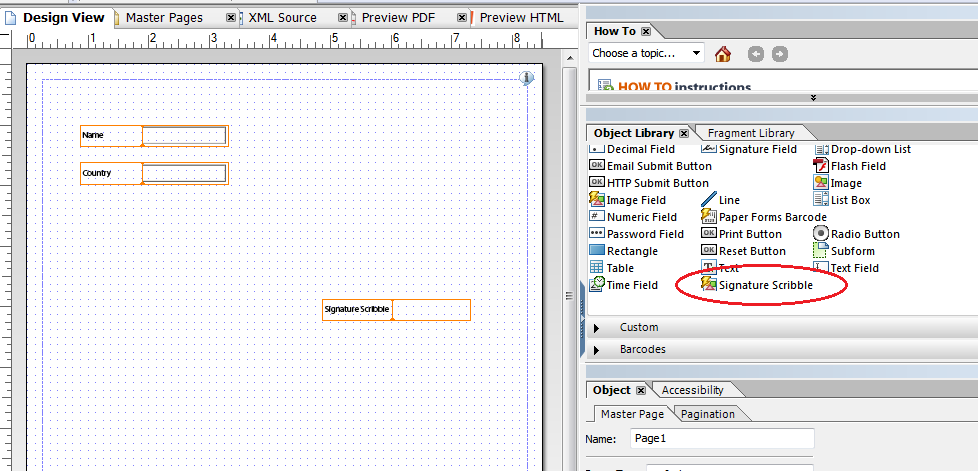

# Uso de la firma manuscrita en formularios HTML5{#using-scribble-signature-in-html-forms}

Los formularios HTML5 se utilizan cada vez más en dispositivos táctiles y uno de los requisitos comunes es admitir firmas. La creación de secuencias de comandos (escritura con un lápiz o un dedo) se está convirtiendo en una forma aceptada de firmar formularios en dispositivos móviles. Los formularios de HTML5 y Forms Designer ahora habilitan la opción de tener un campo de firma de anotaciones en el formulario. Cuando el formulario se procesa en el explorador, se puede iniciar sesión en estos campos con un lápiz, ratón o contacto.

## Cómo diseñar un formulario utilizando el campo Scribble Signature {#how-to-design-a-form-using-scribble-signature-field}

1. Abra un formulario en Forms Designer.
1. Arrastre y suelte el campo Scribble de firma en la página.

   

   >[!NOTE]
   >
   >Los Dimension del campo seleccionado en Forms Designer se reflejan cuando se procesa el campo. Sin embargo, la dimensión del cuadro de firma procesada se calcula en función de la relación de aspecto del campo y no de la dimensión especificada en Forms Designer.

1. Configure el campo Scribble de firma .

   El campo Scribble de firma, de forma predeterminada, marca la información de geolocalización como obligatoria durante el proceso de firma en iPad (y es opcional para otros dispositivos). Este comportamiento predeterminado se puede anular cambiando el valor de la variable `geoLocMandatoryOnIpad` propiedad. Esta propiedad se expone como extras en el campo Scribble de firma . Los pasos para modificarla son:

   1. En el formulario, seleccione el campo Scribble de firma .
   1. Seleccione el **Código fuente XML** pestaña .

      >[!NOTE]
      >
      >Para abrir la ficha Código fuente XML, haga clic en **Ver** > **Código fuente XML**.

   1. Busque la variable `<ui>` en el `<field>` y modifique el código fuente para que tenga el siguiente aspecto:

      ```xml
      <extras name="x-scribble-add-on">
      <boolean name="geoLocMandatoryOnIpad">0</boolean>
      </extras>
      ```

   1. Seleccione el **Vista diseño** pestaña . En el cuadro de confirmación, haga clic en **Sí**.
   1. Guarde el formulario.

1. Representar el formulario en un explorador de escritorio o dispositivo compatible.

## Interrelación con las firmas manuscritas {#interfacing-with-the-scribble-signatures}

### Firma {#signing}

Una vez que se ha agregado un campo de Scribble de firma al formulario y se ha procesado, al pulsar o hacer clic en el campo se abre un cuadro de diálogo. El usuario puede garabatear una firma en el área de dibujo designada por un rectángulo de puntos, utilizando un ratón, un dedo o un lápiz.


**A.** Pincel **B.** Borrador **C.** Geolocalización **D.** Información de geolocalización

### Etiquetado geográfico {#geo-tagging}

Al hacer clic en el icono de geolocalización mientras se crea la secuencia de comandos, la ubicación geográfica y la información horaria se incrustan en el campo.

>[!NOTE]
De forma predeterminada, en iPad es obligatorio incrustar información de geolocalización.

En iPad, el icono de geolocalización no se muestra de forma predeterminada y la información de geolocalización se incrusta automáticamente al hacer clic en **OK**.

Para los iPads, esta configuración se puede modificar modificando el valor de `geoLocManadatoryOnIpad` parámetro a `0`, en los parámetros init del campo .

* Cuando la información de geolocalización es obligatoria, al usuario se le presenta un área de dibujo reducida. El texto de geolocalización se agrega cuando el usuario hace clic en **OK** en el área restante.
* En otros casos, el usuario se presenta con un área de cajón completa. Si el usuario decide incrustar la información de geolocalización, esta área cambia de tamaño para ajustarse al texto de geolocalización.

### Eliminación de una firma {#clearing-a-signature}

Al utilizar esta función, un usuario puede hacer clic en el botón **Borrador** para borrar el campo y volver a empezar. Si se agregó información de geolocalización, también se borra.

### Guardar una firma {#saving-a-signature}

Al hacer clic en **OK** guarda el garabato como una imagen en el campo . La imagen y los valores se pueden enviar al servidor para un procesamiento posterior. Una vez que el usuario ha hecho clic **OK**, el campo de garabatos está bloqueado. La firma no se puede volver a editar con el widget de anotaciones.

Al pulsar o hacer clic en el campo Scribble se abre el cuadro de diálogo en modo de solo lectura.


### Selección del tamaño de la pluma {#selecting-pen-size}

Haga clic en el **Pinceles** para mostrar una lista de los tamaños de pluma disponibles. Toque o haga clic en un tamaño de pluma para usar la pluma correspondiente.

### Eliminar firmas del formulario {#delete-signatures-from-the-form}

Para eliminar las firmas del formulario:

* (Dispositivos móviles) Pulse durante mucho tiempo el campo de firma y, en el cuadro de diálogo de confirmación, pulse **Sí**.
* (Escritorio) Pase el ratón sobre el campo de firma y haga clic en el botón **Cancelar** y, en el cuadro de diálogo de confirmación, haga clic en **Sí**.
