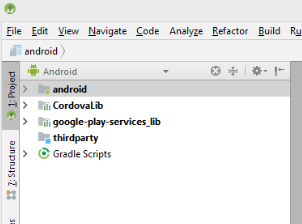

# Compilación de la aplicación para Android de AEM Forms {#build-the-aem-forms-android-app}

Realice los siguientes pasos en la secuencia recomendada para crear la aplicación de Android para AEM Forms.

1. [Descargar el paquete de código fuente de la aplicación de AEM Forms](/help/forms/using/setup-eclipse-project-build-installer.md#main-pars-header-277929160)
1. [Configure las variables de entorno](/help/forms/using/setup-eclipse-project-build-installer.md#main-pars-header-111803610)
1. [Compilación de la aplicación estándar de AEM Forms](/help/forms/using/setup-eclipse-project-build-installer.md#main-pars-heading-0)

## Descargar el paquete de código fuente de la aplicación de AEM Forms {#download-android-zip}

El paquete de código fuente de la aplicación de AEM Forms hace referencia al `adobe-lc-mobileworkspace-src-<version>.zip` archivo. Este archivo incluye el código fuente necesario para crear una aplicación personalizada de AEM Forms. El archivo se incluye en el `adobe-aemfd-forms-app-src-pkg-<version>.zip`paquete disponible en el paquete compartido.

Realice los siguientes pasos para descargar el `adobe-aemfd-forms-app-src-pkg-<version>.zip` archivo:

1. Inicie sesión en la instancia de creación del servidor [de](http://localhost:4502/) AEM como administrador y abra el recurso compartido [de](http://localhost:4502/crx/packageshare)paquetes. Necesita un ID de Adobe para iniciar sesión en el recurso compartido de paquetes.
1. En Uso compartido [de paquetes de](http://localhost:4502/crx/packageshare/login.html)AEM, busque `adobe-aemfd-forms-app-src-pkg-<version>.zip`, haga clic en el paquete aplicable a su sistema operativo y, a continuación, haga clic en **Descargar**. Lea y acepte el contrato de licencia y haga clic en **Aceptar**. Se inicia la descarga. Una vez descargado, la palabra **Descargado** aparece junto al paquete.
1. Una vez finalizada la descarga, haga clic en **Descargado**. Se le redirige al administrador de paquetes. En el administrador de paquetes, busque el paquete descargado y haga clic en **Instalar**.
1. Para descargar el archivo de código fuente, abra **https://&lt;server>:&lt;port>/crx/de/content/forms/mobileapps/src/adobe-lc-mobileWorkspace-src-&lt;version>.zip** en el explorador. El archivo .zip de la aplicación de Android se descarga en el dispositivo.
1. Extraiga el contenido del archivo .zip en una carpeta del sistema de archivos local. Por ejemplo, *C:\&amp;lt;Estructura de carpetas>\adobe-lc-mobilespace-src-2.4.20*

La siguiente imagen muestra la estructura de la `adobe-lc-mobileworkspace-src-<version>.zip\android`carpeta.

## Configure las variables de entorno {#set-environment-variable-android}

Configure las siguientes variables de entorno antes de iniciar el proceso de compilación para la aplicación de AEM Forms:

* Establezca la variable de entorno JAVA_HOME en la ubicación del software JDK en el sistema de archivos local. Por ejemplo, C:\Program Files\Java\jdk1.8.0_181
* Establezca la variable de entorno del `ANDROID_SDK_ROOT` sistema en la ubicación del SDK para Android. Por ejemplo: C:\Users\&amp;lt;username>\AppData\Local\Android\Sdk
* Configure la variable de entorno del `Path` sistema para que incluya las ubicaciones de carpetas de herramientas y herramientas de plataforma para Android. Por ejemplo, C:\Users\&amp;lt;username>\AppData\Local\Android\Sdk\platform-tools and C:\Users\&amp;lt;username>\AppData\Local\Android\Sdk\tools.

## Compilación de la aplicación estándar de AEM Forms {#set-up-the-xcode-project}

Una vez que haya guardado el archivo adobe-lc-mobileWorkspace-src-&lt;version>.zip en el sistema de archivos local y haya establecido las variables de entorno, cree una aplicación de Android de AEM Forms estándar con cualquiera de las siguientes opciones:

* [Compilación de la aplicación de AEM Forms mediante Android Studio](/help/forms/using/setup-eclipse-project-build-installer.md#main-pars-header-1347434739)
* [Generar archivo .apk con Android Studio](/help/forms/using/setup-eclipse-project-build-installer.md#main-pars-header-0)

### Compilación de la aplicación de AEM Forms mediante Android Studio {#using-android-studio}

Siga estos pasos para crear la aplicación de AEM Forms mediante Android Studio:

1. Inicie la aplicación Android Studio en su equipo.
1. Haga clic en **Abrir un proyecto** existente de Android Studio. Si el cuadro de diálogo para abrir un proyecto existente no aparece automáticamente, seleccione **Archivo** > **Abrir**.
1. Vaya a *adobe-lc-mobileWorkspace-src-&lt;version>.zip/android* en el sistema de archivos local y haga clic en **Aceptar**.

   La opción **androide** se muestra en el panel izquierdo.

   

1. Seleccione **android** en el panel izquierdo y haga clic en **Ejecutar** > **Ejecutar &#39;android&#39;**.
1. Seleccione el dispositivo Android en la sección Dispositivos conectados del cuadro de diálogo Seleccionar destino de implementación y haga clic en Aceptar.

   Una vez creado el entorno de desarrollo correctamente, ahora puede aplicar personalizaciones en la aplicación. Utilice los siguientes artículos para personalizar la aplicación:

   * [Personalización de promoción de la marca](/help/forms/using/branding-customization.md)
   * [Personalización de temas](/help/forms/using/theme-customization.md)
   * [Personalización de gestos](/help/forms/using/gesture-customization.md)
   Después de aplicar las personalizaciones adecuadas a la aplicación, puede generar el archivo .apk para su distribución.

### Generar archivo .apk con Android Studio {#generate-apk-android-studio}

Realice los siguientes pasos para generar el archivo .apk mediante Android Studio:

1. Inicie la aplicación Android Studio en su equipo.
1. Seleccione **Abrir un proyecto** existente de Android Studio. Si el cuadro de diálogo para abrir un proyecto existente no aparece automáticamente, seleccione **Archivo** > **Abrir**.
1. Vaya a *adobe-lc-mobileWorkspace-src-&lt;version>.zip/android* en el sistema de archivos local y haga clic en **Aceptar**.

   La opción androide se muestra en el panel izquierdo.

1. Seleccione **Generar** > **Generar APK** para generar el archivo .apk.

   Si lo desea, seleccione **Generar** > **Generar APK** firmado para generar una versión  firmada del archivo .apk.

## Uso de Android Debug Bridge {#build-android-debug-bridge}

Una vez generado el archivo .apk, ejecute el siguiente comando para instalar la aplicación en un dispositivo Android mediante el puente [de depuración de](https://developer.android.com/tools/help/adb.html)Android.

**** Usuarios de Windows: `adb install %HOMEPATH%\Projects\[your-project]\adobe-lc-mobileworkspace-src-[version]\android\build\outputs\apk\android-debug.apk`

**** Usuarios de MAC: `adb install [User_Home]/Projects/[your-project]/adobe-lc-mobileworkspace-src-[version]/android/build/outputs/apk/android-debug.apk`

**[Comuníquese con la asistencia técnica](https://www.adobe.com/account/sign-in.supportportal.html)**
