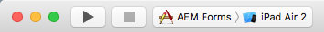

# Configurar el proyecto Xcode y compilar la aplicación iOS{#set-up-the-xcode-project-and-build-the-ios-app}

AEM Forms proporciona el código fuente completo de la aplicación de AEM Forms. La fuente contiene todos los componentes para crear una aplicación de AEM Forms personalizada. El archivo del código fuente, `adobe-lc-mobileworkspace-src-<version>.zip` forma parte del paquete `adobe-aemfd-forms-app-src-pkg-<version>.zip` en Distribución de software.

Para obtener la fuente de la aplicación de AEM Forms, realice los siguientes pasos:

1. Abra [Distribución de software](https://experience.adobe.com/downloads). Necesitará un Adobe ID para iniciar sesión en la distribución de software.
1. Seleccionar **[!UICONTROL Adobe Experience Manager]** disponible en el menú de encabezado.
1. En la sección **[!UICONTROL Filtros]**:
   1. Seleccione **[!UICONTROL Forms]** en la lista desplegable **[!UICONTROL Solución]**.
   2. Seleccione la versión y el tipo del paquete. También puede usar la opción **[!UICONTROL Buscar descargas]** para filtrar los resultados.
1. Seleccione el nombre del paquete aplicable a su sistema operativo, seleccione **[!UICONTROL Aceptar términos de EULA]** y seleccione **[!UICONTROL Descargar]**.
1. Abra el [Administrador de paquetes](https://experienceleague.adobe.com/docs/experience-manager-65/administering/contentmanagement/package-manager.html?lang=es) y haga clic en **[!UICONTROL Cargar paquete]** para cargar el paquete.
1. Seleccione el paquete y haga clic en **[!UICONTROL Instalar]**.

1. Para descargar el archivo del código fuente, abra `https://<server>:<port>/crx/de/content/forms/mobileapps/src/adobe-lc-mobileworkspace-src-<version>.zip` en su explorador.
El paquete de fuente se descargará en el dispositivo.

La siguiente imagen muestra el contenido extraído del `adobe-lc-mobileworkspace-src-<version>.zip`.


La siguiente tabla detalla el contenido de la `adobe-lc-mobileworkspace-src-[version]/ios` carpeta.

<table>
 <tbody>
  <tr>
   <th><p>Directorio</p> </th>
   <th><p>Contenido</p> </th>
  </tr>
  <tr>
   <td><p><code>CordovaLib</code></p> </td>
   <td><p>SDK 6.4.0 de PhoneGap</p> </td>
  </tr>
  <tr>
   <td><p><code>AEM Forms</code></p> </td>
   <td><p>Recursos, complementos de PhoneGap y módulo principal de la aplicación</p> </td>
  </tr>
  <tr>
   <td><p><code>AEM Forms.xcodeproj</code></p> </td>
   <td><p>Proyecto Xcode para la aplicación de AEM Forms</p> </td>
  </tr>
  <tr>
   <td><p><code>www</code></p> </td>
   <td><p>HTML, CSS, imágenes y archivos JavaScript para el proyecto de la aplicación de AEM Forms</p> </td>
  </tr>
 </tbody>
</table>

Para obtener información detallada sobre la firma de código y la adición de dispositivos al portal de aprovisionamiento de iOS, consulte [Configuración, proceso y solución de problemas de iOS Code Signing](https://developer.apple.com/library/ios/documentation/IDEs/Conceptual/AppDistributionGuide/MaintainingCertificates/MaintainingCertificates.html).

## Generar aplicación de AEM Forms estándar {#set-up-the-xcode-project}

1. Realice los siguientes pasos para configurar un proyecto en Xcode y proporcionar una identidad de firma:

   Inicie sesión en su equipo de Mac que tenga Xcode y iOS SDK instalados y configurados.

1. Copie el archivo `adobe-lc-mobileworkspace-src-<version>.zip` de la carpeta de descargas a `[User_Home]/Projects/`.
1. Extraiga el archivo en el directorio `[User_Home]/Projects/[your-project]`.
1. Navegue hasta el directorio ` [User_Home]/Projects/ `[your-project]`/adobe-lc-mobileworkspace-src-[version]/ios`.
1. Abra el proyecto `AEM Forms.xcodeproj` en Xcode.
1. Haga clic en **AEM Forms**, en **OBJETIVOS**, seleccione **AEM Forms**. Seleccione la pestaña **Configurar generación**, busque la sección **Derecho de firma de código**, y en los campos Depurar y Liberar, realice una de las siguientes acciones:

   * Deje los campos sin especificar para crear una aplicación estándar de Mobile Workspace.
   * Especifique los campos a como se explica en [Crear una aplicación segura de AEM Forms para iOS](/help/forms/using/building-secure-mobile-workspace-app.md) para crear una aplicación segura de AEM Forms.

1. En la pestaña **Configurar generación**, haga clic en **Todo** y haga clic en **Combinado**.
1. En la lista **Configuración**, expanda **Firma de código**.
1. Para **Identidad de firma de código**, seleccione la firma adecuada. Para obtener información detallada sobre la creación de firmas nuevas, consulte [Crear y descargar perfiles de aprovisionamiento de desarrollo](https://developer.apple.com/library/ios/documentation/IDEs/Conceptual/AppStoreDistributionTutorial/CreatingYourTeamProvisioningProfile/CreatingYourTeamProvisioningProfile.html).
1. Asegúrese de que se ha seleccionado la misma firma para **Depurar**, **Versión** y **Cualquier SDK de iOS**.
1. Reemplace el siguiente código en el archivo `AEM Forms-info.plist`:

   ```xml
   <key>NSAppTransportSecurity</key>
   <dict>
   <key>NSAllowsArbitraryLoads</key>
   <true/>
   </dict>
   ```

   También reemplace `yourserver.com` con un nombre de host apropiado para su servidor.

   ```xml
   <key>NSAppTransportSecurity</key>
   <dict>
   <key>NSExceptionDomains</key>
   <dict>
   <key>yourserver.com</key>
   <dict>
   <!-Include to allow subdomains->
   <key>NSIncludesSubdomains</key>
   <true/>
   <!-Include to allow HTTP requests->
   <key>NSTemporaryExceptionAllowsInsecureHTTPLoads</key>
   <true/>
   <!-Include to support forward secrecy->
   <key>NSExceptionRequiresForwardSecrecy</key>
   <false/>
   <!-Include to specify minimum TLS version->
   <key>NSTemporaryExceptionMinimumTLSVersion</key>
   <string>TLSv1.1</string>
   </dict>
   </dict>
   </dict>
   ```

   >[!NOTE]
   >
   >Este paso solo es necesario si la aplicación de AEM Forms necesita conectarse a un servidor que no cumpla los requisitos de App Transport Security.

1. En **PROYECTO**, seleccione **AEM Forms** y asegúrese de que la firma adecuada esté seleccionada para **Identidad de firma de código**, **Depurar**, **Versión** y **Cualquier SDK de iOS**.
1. Conecte un iPad aprovisionado a un equipo Mac.
1. Seleccione el dispositivo aprovisionado para el proyecto de **AEM Forms**.

   

   Se ha seleccionado un dispositivo aprovisionado, iPad Air 2.

1. Seleccione **Producto** > **Limpiar**.
1. Seleccione **Producto** > **Generar**.

## Genere el instalador para la aplicación de AEM Forms {#build-the-installer-for-the-mobile-workspace-app}

Debe archivar el proyecto Xcode para generar el instalador (un archivo .ipa) y un archivo de lista de propiedades (un archivo .plist). El archivo de lista de propiedades contiene información de configuración de la aplicación interna alojada, como el nombre y la ubicación de alojamiento de la aplicación. Para obtener más información sobre el archivo de la lista de propiedades, consulte [Acerca de los archivos de la lista de propiedades de información](https://developer.apple.com/library/ios/#documentation/general/Reference/InfoPlistKeyReference/Articles/AboutInformationPropertyListFiles.html).

1. Conecte un iPad aprovisionado a un equipo Mac. Para obtener información detallada sobre el aprovisionamiento de un iPad, consulte [Crear y descargar perfiles de aprovisionamiento de desarrollo](https://developer.apple.com/library/ios/documentation/IDEs/Conceptual/AppStoreDistributionTutorial/CreatingYourTeamProvisioningProfile/CreatingYourTeamProvisioningProfile.html)
1. Seleccione el dispositivo aprovisionado para el proyecto de **AEM Forms**.

   

   Se ha seleccionado un dispositivo aprovisionado, iPad Air 2.

1. Seleccione **Producto** > **Limpiar**.
1. Seleccione **Producto** > **Generar**.
1. Seleccione **Producto** > **Archivo**.
1. En Organizador: Archivos, seleccione el último archivo del proyecto y haga clic en **Distribuir**.
1. Seleccione **Guardar para implementación empresarial o ad hoc** como método de distribución y haga clic en **Siguiente**.
1. Seleccione la **Identidad de firma de código** apropiada y haga clic en **Siguiente**. Haga clic en **Permitir** para aplicar la firma.
1. Proporcione el nombre de la aplicación y seleccione **Guardar para distribución empresarial**.
1. Proporcione la **URL de la aplicación** para la aplicación. Por ejemplo, para alojar la aplicación en un servidor CRX, proporcione la URL `https://[LC_host]:'port'/lc/content/distribution/mobileworkspace/APP_NAME.ipa`.
1. En el **Título**, especifique AEM Forms.
1. Haga clic en **Guardar** y cierre Xcode.

   Un archivo de instalación, `AEM Forms.ipa` y el archivo de lista de propiedades, `AEM Forms-info.plist`, se crean en la ubicación especificada.

1. Abra el archivo `AEM Forms-info.plist` en un editor.
1. Reemplace todos los espacios en la dirección URL del archivo .ipa por %20.
1. Guarde y cierre el archivo `AEM Forms-info.plist`.
