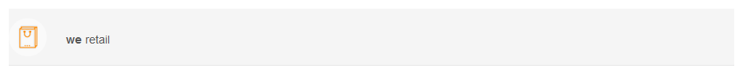
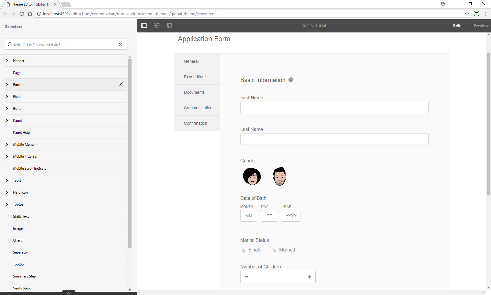

# Aplicar estilo a un formulario adaptable {#do-not-publish-style-your-adaptive-form}

Aprenda a crear una temática personalizada, a aplicar estilo a componentes individuales y a utilizar fuentes web en una temática

Este tutorial es un paso en la serie [Crear su primer formulario adaptable](Https://helpx.adobe.com/es/experience-manager/6-3/forms/using/create-your-first-adaptive-form.html). Se recomienda seguir la serie en orden cronológico para comprender, realizar y mostrar el caso de uso del tutorial completo.

## Información sobre el tutorial  {#about-the-tutorial}

Puede utilizar temáticas para proporcionar una apariencia y un estilo únicos a un formulario adaptable. Puede aplicar temáticas predeterminadas con el editor de formularios adaptables o crear temáticas personalizadas propias. AEM [!DNL Forms] proporciona un [editor de temáticas](https://helpx.adobe.com/es/experience-manager/6-3/forms/using/themes.html) para crear temáticas personalizadas. Una sola temática puede proporcionar una apariencia diferente al mismo formulario adaptable abierto en dispositivos móviles, tabletas o de escritorio. No es necesario tener conocimientos previos de CSS o LESS para utilizar el editor de temáticas, pero es preferible tenerlos.

Al final del tutorial, aprenderá a hacer lo siguiente:

* Aplicar una temática predeterminada a un formulario adaptable
* Crear una temática para un formulario adaptable mediante el editor de temáticas
* Aplicar estilo a los componentes individuales
* Sección Bonus: usar fuentes web en una temática personalizada

El formulario será similar al siguiente después de completar el tutorial:

## Antes de comenzar {#before-you-start}

Descargue las siguientes imágenes de estilo de encabezado y logotipo en su equipo local. El encabezado del formulario adaptable `shipping-address-add-update-form` utiliza las imágenes de estilo de encabezado y logotipo. La imagen de estilo de encabezado aparece a la derecha del encabezado.

[Obtener archivo](assets/header-style.png)

[Obtener archivo](assets/logo-1.png)

## Paso 1: Aplicar una temática a un formulario adaptable {#step-apply-a-theme-to-your-adaptive-form}

El editor de formularios adaptables proporciona varias temáticas predeterminadas. Si no pretende utilizar un estilo personalizado para el formulario adaptable, también puede publicar los formularios adaptables con una temática incorporada. Las temáticas son independientes de los formularios adaptables. Puede aplicar la misma temática a varios formularios adaptables. Para aplicar una temática a un formulario adaptable, haga lo siguiente:

1. Abra el formulario adaptable para editarlo.

   [http://localhost:4502/editor.html/content/forms/af/shipping-address-add-update-form.html](http://localhost:4502/editor.html/content/forms/af/shipping-address-add-update-form.html)

1. Abra las propiedades del **[!UICONTROL Contenedor de formularios adaptables]**. En el explorador de propiedades, navegue hasta **[!UICONTROL Básico]** > **[!UICONTROL Temática del formulario adaptable]**. El campo **[!UICONTROL Temática del formulario adaptable]** enumera todas las temáticas predeterminadas y personalizadas. De forma predeterminada, se aplica la temática Lienzo.
1. Seleccione una temática del campo **[!UICONTROL Temática del formulario adaptable]**. Por ejemplo, **Temática de encuesta**. Pulse  para aplicar la temática seleccionada.

   

   **Figura:** *formulario adaptable con la temática predeterminada*

   

   **Figura:** *formulario adaptable con la temática de encuesta*

## Paso 2: Actualizar el formulario adaptable {#step-update-your-adaptive-form}

El diseño que se muestra más arriba requiere cambios en el texto del marcador de posición y en el logotipo de su formulario adaptable. Realice los siguientes pasos para realizar los cambios necesarios:

1. Cambie el logotipo y el texto existentes del encabezado. Para eliminar el logotipo, haga lo siguiente:

   1. Abra el formulario en el editor de formularios.

      [http://localhost:4502/editor.html/content/forms/af/shipping-address-add-update-form.html](http://localhost:4502/editor.html/content/forms/af/shipping-address-add-update-form.html)

   1. Pulse la imagen de logotipo en el componente [!UICONTROL encabezado] y pulse las **[!UICONTROL propiedades]** . En la propiedad [!UICONTROL imagen], pulse X para eliminar la imagen del logotipo existente.
   1. Pulse **[!UICONTROL cargar]**, seleccione el logo.png y pulse  para guardar los cambios. La imagen se descargó en la sección [Antes de comenzar](/help/forms/using/style-your-adaptive-form.md#before-you-start).
   1. Pulse el texto del encabezado. `We.Retail` y pulse  **[!UICONTROL Editar]**. Cambie el texto del encabezado a `we retail`. Aplique formato de negrita solo a `we`en `we retail`.

      

1. Elimine el título y agregue un texto de marcador de posición:

   1. Pulse el campo ID de cliente y pulse las propiedades .
   1. Copie el contenido del campo **[!UICONTROL Título]** en el campo **[!UICONTROL Texto del marcador de posición]**.
   1. Elimine el contenido del campo **[!UICONTROL Título]** y pulse .
   1. Repita los tres pasos anteriores para todos los cuadros de texto, cuadros numéricos y campos de correo electrónico del formulario.

      

## Paso 3: Crear una temática personalizada para el formulario adaptable {#step-create-a-custom-theme-for-your-adaptive-form}

Puede usar el [Editor de temáticas](/help/forms/using/themes.md) para crear temáticas personalizadas. El editor de temáticas es un poderoso editor WYSIWYG. Es un método visual para aplicar CSS a varios componentes de un formulario adaptable. Proporciona controles más precisos para aplicar estilo a los componentes y los paneles de un formulario adaptable.

Una temática es una entidad independiente como los formularios adaptables. Contiene estilos (CSS) para los componentes y paneles de un formulario adaptable. Los estilos incluyen propiedades CSS como colores de fondo, colores de estado, transparencia, alineación y tamaño. Al aplicar una temática, el estilo especificado se aplica a los componentes correspondientes de un formulario adaptable.

En este tutorial, aplicará estilo al encabezado y al pie de página, a los componentes numéricos y de texto, al componente de datos adjuntos y a los botones. Empecemos por crear una temática:

### Crear una temática {#create-a-theme}

1. Inicie sesión en la instancia de autor de AEM y navegue hasta **[!UICONTROL Adobe Experience Manager]** > **[!UICONTROL Formularios]** > **[!UICONTROL Temáticas]**. La dirección URL predeterminada es [http://localhost:4502/aem/forms.html/content/dam/formsanddocuments-themes](http://localhost:4502/aem/forms.html/content/dam/formsanddocuments-themes).
1. Pulse **[!UICONTROL Crear]** y seleccione **[!UICONTROL Temática]**. Aparecerá la página [!UICONTROL Crear temática] con los campos necesarios para crear una temática. Los campos **[!UICONTROL Título]** y **[!UICONTROL Nombre]** son obligatorios:

   * **Título:** especifique un título para la temática. Por ejemplo, **Temática Global.** El título le ayuda a identificar la temática en la lista de temáticas.
   * **Nombre:** especifique el nombre de la temática. Por ejemplo, **Temática Global.** Se crea un nodo con el nombre especificado en el repositorio. A medida que empieza a escribir un título, el valor del campo de nombre se genera automáticamente. Puede cambiar el valor sugerido. El campo de nombre solo puede incluir caracteres alfanuméricos, guiones y guiones bajos. Todas las entradas no válidas se sustituyen por guiones.

1. Pulse **[!UICONTROL Crear]**. Se crea una temática y aparece un cuadro de diálogo para abrir el formulario y editarlo. Pulse **[!UICONTROL Abrir]** para abrir la temática recién creada en una pestaña nueva. La temática se abre en el editor de temáticas. Para aplicar estilo, el editor de temáticas utiliza un formulario adaptable incorporado que se incluye con AEM [!DNL Forms].

   Para obtener información sobre el uso de la interfaz de usuario del editor de temáticas, consulte [Acerca del editor de temáticas](/help/forms/using/themes.md#aboutthethemeeditor).

1. Pulse **[!UICONTROL Opciones de temática]**  > **[!UICONTROL Configurar]**. En el campo **[!UICONTROL Vista previa del formulario]**, seleccione el formulario adaptable **shipping-address-add-update-form**, pulse , pulse **[!UICONTROL Guardar]**. Ahora, el editor de temáticas está configurado para usar su propio formulario adaptable en lugar del formulario adaptable predeterminado. Pulse **[!UICONTROL Cancelar]** para volver al editor de temáticas.

   

   **Figura:** *editor de temáticas con el formulario adaptable shipping-address-add-update-form*

   

   **Figura:** *formulario adaptable con el formulario predeterminado*

### Aplicar estilo al encabezado y al pie de página {#style-header-and-footer}

El encabezado y el pie de página proporcionan una apariencia coherente y distintiva a un formulario adaptable. Por lo general, el encabezado contiene el logotipo y el nombre de la organización, el pie de página contiene información sobre los derechos de autor y estos datos son idénticos en varias formas de organización. Para aplicar estilo al encabezado y al pie de página del formulario adaptable shipping-address-add-update-form, haga lo siguiente:

1. Navegue hasta la opción **[!UICONTROL Encabezado]** > **[!UICONTROL Texto]** en el panel Selectores. El panel Selectores se encuentra a la izquierda del editor de temáticas. Si el panel no está visible, pulse  Alternar panel lateral.

1. Establezca las siguientes propiedades en el acordeón **[!UICONTROL Texto]** y pulse .

   | Propiedad | Valor |
   |---|---|
   | Familia de fuentes | Arial |
   | Color de fuente | FFFFFF |
   | Tamaño de fuente | 54 px |

1. Pulse el widget [!UICONTROL encabezado] y pulse **[!UICONTROL Encabezado]**. Las opciones para aplicar estilo al widget de encabezado aparecen a la izquierda. Expanda el acordeón **[!UICONTROL Dimensiones y posición]**, establezca la **[!UICONTROL Altura]** a `120px` y pulse .
1. Expanda el acordeón del widget de encabezado **[!UICONTROL Fondo]**, establezca el **[!UICONTROL Color de fondo]** a `F6921E.`

   Pase el ratón sobre **[!UICONTROL Imagen y degradado]** > **[!UICONTROL + Agregar]** y pulse **[!UICONTROL Imagen]**. Establezca las siguientes propiedades y pulse .

   | Propiedad | Valor |
   |---|---|
   | image | Cargue header-style.png. La imagen se descargó en la sección [Antes de comenzar](/help/forms/using/style-your-adaptive-form.md#before-you-start). |
   | Posición | Inferior Derecha |
   | Mosaico | No repetir |

1. En el editor de temáticas, pulse el logotipo en el encabezado y pulse **[!UICONTROL Logotipo de encabezado]**. Expanda el acordeón Dimensiones y posición, defina las siguientes propiedades y pulse .

   <table> 
    <tbody> 
     <tr> 
      <td><b>Margen</b></td> 
      <td><b>Valor</b></td> 
     </tr> 
     <tr> 
      <td>Margen</td> 
      <td> 
       <ul> 
        <li>Superior: 1,5 rem</li> 
        <li>Inferior: -35 px</li> 
        <li>Izquierda: 1rem<strong>  </strong></li> 
       </ul> 
<strong>Sugerencia:</strong> Pulse el icono de vínculo  para proporcionar un valor diferente a cada campo.  
 </td> 
     </tr> 
     <tr> 
      <td>Altura</td> 
      <td>4,75 rem</td> 
     </tr> 
    </tbody> 
   </table>

1. Pulse el widget de pie de página y pulse **[!UICONTROL Pie de página]**. Expanda el acordeón **[!UICONTROL Fondo]**, establezca el **[!UICONTROL Color de fondo]** a `F6921E` y pulse .

### Aplicar un estilo al componente de captura de datos y un fondo al formulario adaptable {#style-the-data-capture-component-and-apply-a-background-to-the-adaptive-form}

Puede utilizar varios componentes en un formulario adaptable para capturar datos. Por ejemplo, cuadro de texto y cuadro numérico. Puede proporcionar un estilo idéntico a todos los componentes de captura de datos o a todos los estilos independientes para cada componente. En este tutorial, se aplica un estilo idéntico a los cuadros numéricos (ID de cliente, código postal) y los cuadros de texto (ID de cliente, nombre, dirección de envío, estado, correo electrónico). Para aplicar estilo a los componentes de captura de datos, haga lo siguiente:

1. Pulse **[!UICONTROL ID de cliente]** y pulse la opción **[!UICONTROL Widget de campo]**. Establezca las siguientes propiedades y pulse .

   <table> 
    <tbody> 
     <tr> 
      <td><b>Acordeón</b></td> 
      <td><b>Propiedad</b></td> 
      <td><b>Valor</b></td> 
     </tr> 
     <tr> 
      <td>Borde</td> 
      <td>Color del borde</td> 
      <td>A7A9AC</td> 
     </tr> 
     <tr> 
      <td>Borde</td> 
      <td>Radio de borde </td> 
      <td> 
       <ul> 
        <li>Superior: 7 px  </li> 
        <li>Derecha: 7 px  </li> 
        <li>Inferior: 7 px  </li> 
        <li>Izquierda: 7 px  </li> 
       </ul> </td> 
     </tr> 
     <tr> 
      <td>Texto</td> 
      <td>Familia de fuentes</td> 
      <td>Arial</td> 
     </tr> 
     <tr> 
      <td>Texto</td> 
      <td>Color de fuente</td> 
      <td>939598  </td> 
     </tr> 
     <tr> 
      <td>Texto</td> 
      <td>Tamaño de fuente</td> 
      <td>18 px</td> 
     </tr> 
     <tr> 
      <td>Dimensiones y posición</td> 
      <td>Anchura</td> 
      <td>60 %</td> 
     </tr> 
     <tr> 
      <td>Dimensiones y posición</td> 
      <td>Margen</td> 
      <td> 
       <ul> 
        <li>Izquierda: 10 rem</li> 
       </ul> </td> 
     </tr> 
    </tbody> 
    </table>

1. Pulse en el área vacía encima del campo **[!UICONTROL ID de cliente]** y pulse **[!UICONTROL Contenedor del panel interactivo]**. Configure el **[!UICONTROL Contexto]** > **[!UICONTROL Color de fondo]** a F1F2F2. Pulse .

   

### Aplicar estilo a los botones {#style-the-buttons}

Puede utilizar una temática personalizada para aplicar un estilo idéntico a todos los botones del formulario adaptable y [aplicar estilo dentro de la línea](/help/forms/using/inline-style-adaptive-forms.md) para aplicar un estilo a un botón específico. Para aplicar estilo a los botones, haga lo siguiente:

1. Pulse el botón **[!UICONTROL Enviar]** y pulse la opción **[!UICONTROL Botón]**. Establezca las siguientes propiedades y pulse .

   <table> 
    <tbody> 
     <tr> 
      <td><b>Acordeón</b></td> 
      <td><b>Propiedad</b></td> 
      <td><b>Valor</b></td> 
     </tr> 
     <tr> 
      <td>Fondo</td> 
      <td>Color de fondo</td> 
      <td>F6921E</td> 
     </tr> 
     <tr> 
      <td>Borde  </td> 
      <td>Color del borde</td> 
      <td>F6921E</td> 
     </tr> 
     <tr> 
      <td>Borde</td> 
      <td>Radio de borde </td> 
      <td> 
       <ul> 
        <li>Superior: 7 px  </li> 
        <li>Derecha: 7 px  </li> 
        <li>Inferior: 7 px  </li> 
        <li>Izquierda: 7 px</li> 
       </ul> </td> 
     </tr> 
     <tr> 
      <td>Texto  </td> 
      <td>Familia de fuentes</td> 
      <td>Arial</td> 
     </tr> 
     <tr> 
      <td>Texto</td> 
      <td>Color de fuente</td> 
      <td>FFFFFF</td> 
     </tr> 
     <tr> 
      <td>Texto</td> 
      <td>Tamaño de fuente</td> 
      <td>18 px</td> 
     </tr> 
    </tbody> 
   </table>

1. [Aplicar la temática personalizada](/help/forms/using/style-your-adaptive-form.md#step-apply-a-theme-to-your-adaptive-form), Temática global, a su formulario adaptable. Si el estilo no se refleja en el formulario adaptable, limpie la memoria caché del explorador y vuelva a intentarlo.

   

## Paso 4: Aplicar estilo a componentes individuales {#step-style-individual-components}

Algunos estilos solo se aplican a un componente específico. Estos componentes están diseñados en el editor de formularios adaptables.

1. Abra el formulario adaptable para editarlo. [http://localhost:4502/editor.html/content/forms/af/shipping-address-add-update-form.html](http://localhost:4502/editor.html/content/forms/af/change-billing-shipping-address.html)
1. En la barra superior, seleccione la opción **[!UICONTROL Estilo]**.

   

1. Pulse el botón **[!UICONTROL Adjuntar]** y pulse el icono . Establezca las siguientes propiedades en el acordeón **[!UICONTROL Dimensiones y posición]**:

   | Propiedad | Valor |
   |---|---|
   | Flotante | Izquierda |
   | Anchura | 10 % |

1. Pulse **[!UICONTROL Prueba de dirección aprobada por el gobierno]** y pulse el icono . Establezca las siguientes propiedades:

   <table> 
    <tbody> 
     <tr> 
      <td><b>Acordeón</b></td> 
      <td><b>Propiedad</b></td> 
      <td><b>Valor</b></td> 
     </tr> 
     <tr> 
      <td>Dimensiones y posición</td> 
      <td>Flotante</td> 
      <td>Izquierda</td> 
     </tr> 
     <tr> 
      <td>Dimensiones y posición</td> 
      <td>Anchura</td> 
      <td>73 %</td> 
     </tr> 
     <tr> 
      <td>Dimensiones y posición</td> 
      <td>Espacio</td> 
      <td> 
       <ul> 
        <li>Izquierda: 10 px</li> 
       </ul> </td> 
     </tr> 
     <tr> 
      <td>Dimensiones y posición</td> 
      <td>Altura</td> 
      <td>40 px</td> 
     </tr> 
     <tr> 
      <td>Dimensiones y posición  </td> 
      <td>Margen</td> 
      <td>  
       <ul> 
        <li>Derecha: 2 rem</li> 
        <li>Izquierda: 10 rem </li> 
       </ul> </td> 
     </tr> 
     <tr> 
      <td>Fondo</td> 
      <td>Color de fondo</td> 
      <td>FFFFFF</td> 
     </tr> 
     <tr> 
      <td>Borde</td> 
      <td>Anchura de borde</td> 
      <td>1 px</td> 
     </tr> 
     <tr> 
      <td>Borde</td> 
      <td>Estilo de borde</td> 
      <td>Sólido</td> 
     </tr> 
     <tr> 
      <td>Borde</td> 
      <td>Color del borde</td> 
      <td>A7A9AC</td> 
     </tr> 
     <tr> 
      <td>Borde</td> 
      <td>Radio de borde</td> 
      <td>7 px</td> 
     </tr> 
     <tr> 
      <td>Texto</td> 
      <td>Familia de fuentes</td> 
      <td>Arial</td> 
     </tr> 
     <tr> 
      <td>Texto</td> 
      <td>Color de fuente</td> 
      <td>BCBEC0</td> 
     </tr> 
     <tr> 
      <td>Texto</td> 
      <td>Tamaño de fuente</td> 
      <td>18 px</td> 
     </tr> 
     <tr> 
      <td>Texto</td> 
      <td>Altura de la línea</td> 
      <td>2</td> 
     </tr> 
     </tr> 
    </tbody> 
   </table>

1. Pulse el botón **[!UICONTROL Enviar]** y pulse el icono . Establezca las siguientes propiedades:

   <table> 
    <tbody> 
     <tr> 
      <td><b>Acordeón</b></td> 
      <td><b>Propiedad</b></td> 
      <td><b>Valor</b></td> 
     </tr> 
     <tr> 
      <td>Dimensiones y posición</td> 
      <td>Flotante</td> 
      <td>Derecha</td> 
     </tr> 
     <tr> 
      <td>Dimensiones y posición</td> 
      <td>Margen</td> 
      <td> 
       <ul> 
        <li>Superior: 5 rem</li> 
        <li>Derecha: 14 rem</li> 
        <li>Inferior: 20 px</li> 
        <li>Izquierda: 20 px  </li> 
       </ul> </td> 
     </tr> 
     <tr> 
      <td>Fondo</td> 
      <td>Color de fondo</td> 
      <td>F6921E</td> 
     </tr> 
     <tr> 
      <td>Borde</td> 
      <td>Color del borde</td> 
      <td>F6921E</td> 
     </tr> 
    </tbody> 
   </table>

   

## Paso 5: Sección Bonus: usar fuentes web en una temática personalizada {#step-bonus-section-using-web-fonts-in-a-custom-theme}

Puede utilizar varias fuentes para diseñar un formulario adaptable. Es posible que no todos los dispositivos en los que se visualiza el formulario adaptable tengan las fuentes utilizadas para diseñar el formulario adaptable. Puede utilizar un servicio de fuentes web para enviar las fuentes necesarias al dispositivo de destino.

[!DNL Adobe Fonts] es un servicio de fuentes web. Puede configurar y utilizar el servicio con formularios adaptables. Para usar [!DNL Adobe Fonts] en un formulario adaptable, haga lo siguiente:

>[!NOTE]
>
> [!DNL Typekit] ahora se denomina Adobe Fonts y se incluye con Creative Cloud y otras suscripciones. [Más información](https://fonts.adobe.com/).

1. Cree una cuenta de [Adobe Fonts](https://typekit.com/), cree un kit, agregue la fuente Myriad Pro al kit, publíquelo y obtenga su ID. Es necesario utilizar [!DNL Adobe Fonts] (Fuentes web) en un formulario adaptable.
1. En el servidor de AEM [!DNL Forms], navegue hasta  **[!UICONTROL Adobe Experience Manager]** > **[!UICONTROL Herramientas]**  > **[!UICONTROL Adobe Fonts]**. A continuación, abra una carpeta de configuración. Si hay alguna configuración disponible, haga clic en el botón **[!UICONTROL Crear]** para crear una instancia nueva.

   En el cuadro de diálogo Crear configuración, especifique un **título** para la configuración y haga clic en **[!UICONTROL Crear]**. Se le redirigirá a la página de configuración. En el cuadro de diálogo [!UICONTROL Editar componente] que aparece, proporcione el **ID del kit** y haga clic en **[!UICONTROL Aceptar]**.

1. Configure la temática para que use la configuración [!DNL Adobe Fonts]. En la instancia de autor, abra la **[!UICONTROL Temática global]** en el editor de temáticas. En el editor de temáticas, vaya a **[!UICONTROL Opciones de temática]**  > **[!UICONTROL Configurar]**. En el campo **[!UICONTROL Configurar Adobe Fonts]**, seleccione un kit y haga clic en **[!UICONTROL Guardar]**.

   Las fuentes agregadas a **[!UICONTROL Adobe Fonts]** están disponibles para seleccionarlas en el acordeón **[!UICONTROL Texto]** de todos los componentes.
