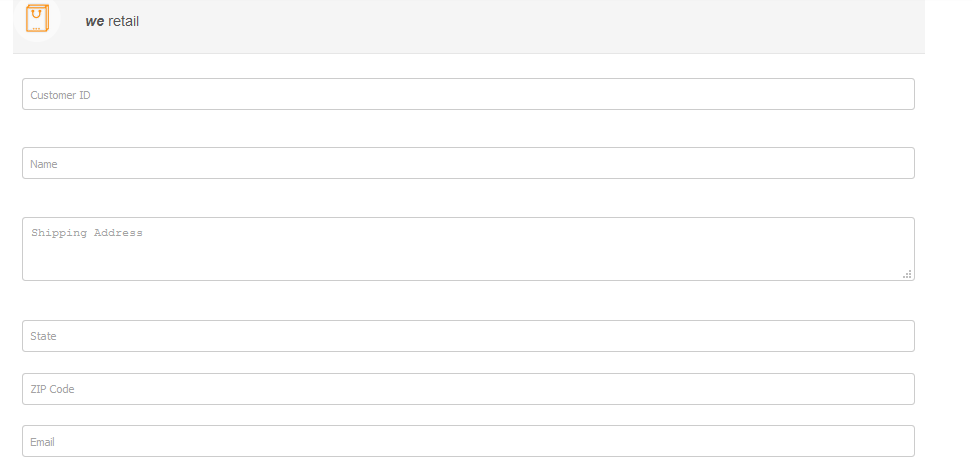
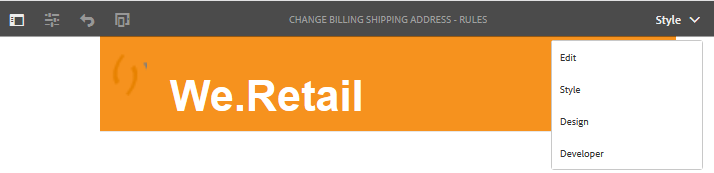

# Aplicar estilo a un formulario adaptable {#do-not-publish-style-your-adaptive-form}

Aprenda a crear una temática personalizada, aplicar estilo a componentes individuales y utilizar Web Fonts en una temática.

Este tutorial es un paso en la serie [Crear su primer formulario adaptable](Https://helpx.adobe.com/es/experience-manager/6-3/forms/using/create-your-first-adaptive-form.html). El Adobe recomienda seguir la serie en secuencia cronológica para comprender, realizar y mostrar el caso de uso completo del tutorial.

## Información sobre el tutorial  {#about-the-tutorial}

Puede utilizar temáticas para proporcionar una apariencia y un estilo únicos a un formulario adaptable. Puede aplicar temáticas predeterminadas con el editor de formularios adaptables o crear temáticas personalizadas propias. AEM [!DNL Forms] proporciona un [editor de temáticas](https://helpx.adobe.com/es/experience-manager/6-3/forms/using/themes.html) para crear temáticas personalizadas. Una sola temática puede proporcionar una apariencia diferente al mismo formulario adaptable abierto en dispositivos móviles, tabletas o de escritorio. No es necesario tener conocimientos previos de CSS o LESS para utilizar el editor de temáticas, pero es preferible tenerlos.

Al final del tutorial, debería poder hacer lo siguiente:

* Aplicar una temática predeterminada a un formulario adaptable
* Crear una temática para un formulario adaptable mediante el editor de temáticas
* Aplicar estilo a los componentes individuales
* Sección bonus: usar Web Fonts en una temática personalizada

El formulario debe ser similar al siguiente después de completar el tutorial:

## Antes de comenzar {#before-you-start}

Descargue las siguientes imágenes de estilo de encabezado y logotipo en su equipo local. El encabezado del formulario adaptable `shipping-address-add-update-form` utiliza las imágenes de estilo de encabezado y logotipo. La imagen de estilo de encabezado aparece a la derecha del encabezado.

[Obtener archivo](assets/header-style.png)

[Obtener archivo](assets/logo-1.png)

## Paso 1: Aplicar una temática a un formulario adaptable {#step-apply-a-theme-to-your-adaptive-form}

El editor de formularios adaptables proporciona varias temáticas predeterminadas. Si no pretende utilizar un estilo personalizado para el formulario adaptable, también puede publicar los formularios adaptables con una temática incorporada. Las temáticas son independientes de los formularios adaptables. Puede aplicar la misma temática a varios formularios adaptables.

**Para aplicar una temática al formulario adaptable, haga lo siguiente:**

1. Abra el formulario adaptable para editarlo.

   [http://localhost:4502/editor.html/content/forms/af/shipping-address-add-update-form.html](http://localhost:4502/editor.html/content/forms/af/shipping-address-add-update-form.html)

1. Abra las propiedades del **[!UICONTROL Contenedor de formularios adaptables]**. En el explorador de propiedades, navegue hasta **[!UICONTROL Básico]** > **[!UICONTROL Temática del formulario adaptable]**. El campo **[!UICONTROL Temática del formulario adaptable]** enumera todas las temáticas predeterminadas y personalizadas. De forma predeterminada, se aplica la temática Lienzo.
1. Seleccione una temática del campo **[!UICONTROL Temática del formulario adaptable]**. Por ejemplo, **Temática de encuesta**. Seleccionar  para que pueda aplicar la temática seleccionada.

   

   **Figura:** *formulario adaptable con la temática predeterminada*

   

   **Figura:** *formulario adaptable con la temática de encuesta*

## Paso 2: Actualizar el formulario adaptable {#step-update-your-adaptive-form}

El diseño que se muestra más arriba requiere cambios en el texto del marcador de posición y en el logotipo de su formulario adaptable.

**Para actualizar el formulario adaptable, haga lo siguiente:**

1. Cambie el logotipo y el texto existentes del encabezado. Para eliminar el logotipo, haga lo siguiente:

   1. Abra el formulario en el editor de formularios.

      [http://localhost:4502/editor.html/content/forms/af/shipping-address-add-update-form.html](http://localhost:4502/editor.html/content/forms/af/shipping-address-add-update-form.html)

   1. Seleccione la imagen del logotipo en la [!UICONTROL encabezado] Componente y seleccione  **[!UICONTROL propiedades]**. En el [!UICONTROL imagen] , seleccione X para eliminar la imagen del logotipo existente.
   1. Seleccionar **[!UICONTROL cargar]**, seleccione el logo.png y seleccione  para guardar los cambios. La imagen se descargó en la sección [Antes de comenzar](/help/forms/using/style-your-adaptive-form.md#before-you-start).
   1. Seleccionar texto de encabezado, `We.Retail`y seleccione  **[!UICONTROL editar]**. Cambie el texto del encabezado a `we retail`. Aplique formato de negrita solo a `we`en `we retail`.

      

1. Elimine el título y agregue un texto de marcador de posición:

   1. Seleccione el campo ID de cliente y luego seleccione  propiedades.
   1. Copie el contenido del campo **[!UICONTROL Título]** en el campo **[!UICONTROL Texto del marcador de posición]**.
   1. Eliminar el contenido del **[!UICONTROL Título]** y seleccione .
   1. Repita los tres pasos anteriores para todos los cuadros de texto, cuadros numéricos y campos de correo electrónico del formulario.

      

## Paso 3: Crear una temática personalizada para el formulario adaptable {#step-create-a-custom-theme-for-your-adaptive-form}

Puede usar el complemento [editor de temáticas](/help/forms/using/themes.md) para crear temáticas personalizadas. El editor de temáticas es un poderoso editor WYSIWYG. Es un método visual para aplicar CSS a varios componentes de un formulario adaptable. Proporciona controles más precisos para aplicar estilo a los componentes y los paneles de un formulario adaptable.

Una temática es una entidad independiente como los formularios adaptables. Contiene estilos (CSS) para los componentes y paneles de un formulario adaptable. Los estilos incluyen propiedades CSS como colores de fondo, colores de estado, transparencia, alineación y tamaño. Al aplicar una temática, el estilo especificado se aplica a los componentes correspondientes de un formulario adaptable.

En este tutorial, aplicará estilo al encabezado y al pie de página, a los componentes numéricos y de texto, al componente de datos adjuntos y a los botones. Empecemos por crear una temática:

### Crear una temática {#create-a-theme}

1. Inicie sesión en la instancia de autor de AEM y navegue hasta **[!UICONTROL Adobe Experience Manager]** > **[!UICONTROL Formularios]** > **[!UICONTROL Temáticas]**. La dirección URL predeterminada es [http://localhost:4502/aem/forms.html/content/dam/formsanddocuments-themes](http://localhost:4502/aem/forms.html/content/dam/formsanddocuments-themes).
1. Seleccionar **[!UICONTROL Crear]** y seleccione **[!UICONTROL Tema]**. Aparecerá la página [!UICONTROL Crear temática] con los campos necesarios para crear una temática. Los campos **[!UICONTROL Título]** y **[!UICONTROL Nombre]** son obligatorios:

   * **Título:** especifique un título para la temática. Por ejemplo, **Temática Global.** El título le ayuda a identificar la temática en la lista de temáticas.
   * **Nombre:** especifique el nombre de la temática. Por ejemplo, **Temática Global.** Se crea un nodo con el nombre especificado en el repositorio. A medida que empieza a escribir un título, el valor del campo de nombre se genera automáticamente. Puede cambiar el valor sugerido. El campo de nombre solo puede incluir caracteres alfanuméricos, guiones y guiones bajos. Todas las entradas no válidas se sustituyen por guiones.

1. Seleccione **[!UICONTROL Crear]**. Se crea una temática y aparece un cuadro de diálogo para abrir el formulario y editarlo. Seleccionar **[!UICONTROL Abrir]** para abrir la temática recién creada en una pestaña nueva. La temática se abre en el editor de temáticas. Para aplicar estilo, el editor de temáticas utiliza un formulario adaptable incorporado que se incluye con AEM [!DNL Forms].

   Para obtener información sobre el uso de la interfaz de usuario del editor de temáticas, consulte [Acerca del editor de temáticas](/help/forms/using/themes.md#aboutthethemeeditor).

1. Seleccionar **[!UICONTROL Opciones del tema]**  > **[!UICONTROL Configurar]**. En el **[!UICONTROL Previsualizar formulario]** , seleccione el campo **shipping-address-add-update-form** formulario adaptable, seleccione , seleccione **[!UICONTROL Guardar]**. Ahora, el editor de temáticas está configurado para usar su propio formulario adaptable en lugar del formulario adaptable predeterminado. Seleccionar **[!UICONTROL Cancelar]** para volver al editor de temáticas.

   

   **Figura:** *editor de temáticas con el formulario adaptable shipping-address-add-update-form*

   

   **Figura:** *formulario adaptable con el formulario predeterminado*

### Aplicar estilo al encabezado y al pie de página {#style-header-and-footer}

El encabezado y el pie de página proporcionan una apariencia coherente y distintiva a un formulario adaptable. Por lo general, el encabezado contiene el logotipo y el nombre de la organización, el pie de página contiene información sobre los derechos de autor y estos datos son idénticos en varias formas de organización. Para aplicar estilo al encabezado y al pie de página del formulario adaptable Formulario-actualizar-agregar-dirección-envío:

1. Navegue hasta la opción **[!UICONTROL Encabezado]** > **[!UICONTROL Texto]** en el panel Selectores. El panel Selectores se encuentra a la izquierda del editor de temáticas. Si el panel no está visible, seleccione  Alternar panel lateral.

1. Establezca las siguientes propiedades en la **[!UICONTROL Texto]** acordeón y seleccione .

   | Propiedad | Valor |
   |---|---|
   | Familia de fuentes | Arial® |
   | Color de fuente | FFFFFF |
   | Tamaño de fuente | 54 px |

1. Seleccione el [!UICONTROL encabezado] widget y seleccionar **[!UICONTROL Header]**. Las opciones para aplicar estilo al widget de encabezado aparecen a la izquierda. Expanda el **[!UICONTROL Dimension y posición]** acordeón, configure el **[!UICONTROL Altura]** hasta `120px`y seleccione .
1. Expanda el acordeón del widget de encabezado **[!UICONTROL Fondo]**, establezca el **[!UICONTROL Color de fondo]** a `F6921E.`

   Pase el ratón sobre **[!UICONTROL Imagen y degradación]** > **[!UICONTROL + Agregar]**, seleccione **[!UICONTROL Imagen]**. Establezca las siguientes propiedades y seleccione .

   | Propiedad | Valor |
   |---|---|
   | image | Cargue header-style.png. La imagen se descargó en la sección [Antes de comenzar](/help/forms/using/style-your-adaptive-form.md#before-you-start). |
   | Posición | Inferior Derecha |
   | Mosaico | No repetir |

1. En el editor de temáticas, seleccione el logotipo en el encabezado y seleccione **[!UICONTROL Logotipo de encabezado]**. Expanda el acordeón Dimension y posición, establezca las siguientes propiedades y seleccione .

   <table> 
    <tbody> 
     <tr> 
      <td><b>Margen</b></td> 
      <td><b>Valor</b></td> 
     </tr> 
     <tr> 
      <td>Margen</td> 
      <td> 
       <ul> 
        <li>Superior: 1,5 rem</li> 
        <li>Inferior: -35 px</li> 
        <li>Izquierda: 1rem<strong>  </strong></li> 
       </ul> 
<strong>Sugerencia:</strong> Seleccione el  icono de vínculo para proporcionar un valor diferente a cada campo.  
 </td> 
     </tr> 
     <tr> 
      <td>Altura</td> 
      <td>4,75 rem</td> 
     </tr> 
    </tbody> 
   </table>

1. Seleccione el widget de pie de página y seleccione **[!UICONTROL Pie]**. Expanda el **[!UICONTROL Fondo]** acordeón, configure el **[!UICONTROL Color de fondo]** hasta `F6921E`y seleccione .

### Aplicar un estilo al componente de captura de datos y un fondo al formulario adaptable {#style-the-data-capture-component-and-apply-a-background-to-the-adaptive-form}

Puede utilizar varios componentes en un formulario adaptable para capturar datos. Por ejemplo, cuadro de texto y cuadro numérico. Puede proporcionar un estilo idéntico a todos los componentes de captura de datos o a uno independiente para cada componente. En este tutorial, se aplica un estilo idéntico a los cuadros numéricos (ID de cliente, código postal) y los cuadros de texto (ID de cliente, nombre, dirección de envío, estado, correo electrónico). Para aplicar estilo a los componentes de captura de datos, haga lo siguiente:

1. Seleccione el **[!UICONTROL ID de cliente]** y seleccione el campo **[!UICONTROL Widget del campo]** opción. Establezca las siguientes propiedades y seleccione .

   <table> 
    <tbody> 
     <tr> 
      <td><b>Acordeón</b></td> 
      <td><b>Propiedad</b></td> 
      <td><b>Valor</b></td> 
     </tr> 
     <tr> 
      <td>Borde</td> 
      <td>Color del borde</td> 
      <td>A7A9AC</td> 
     </tr> 
     <tr> 
      <td>Borde</td> 
      <td>Radio de borde </td> 
      <td> 
       <ul> 
        <li>Superior: 7 px  </li> 
        <li>Derecha: 7 px  </li> 
        <li>Inferior: 7 px  </li> 
        <li>Izquierda: 7 px  </li> 
       </ul> </td> 
     </tr> 
     <tr> 
      <td>Texto</td> 
      <td>Familia de fuentes</td> 
      <td>Arial®</td> 
     </tr> 
     <tr> 
      <td>Texto</td> 
      <td>Color de fuente</td> 
      <td>939598  </td> 
     </tr> 
     <tr> 
      <td>Texto</td> 
      <td>Tamaño de fuente</td> 
      <td>18 px</td> 
     </tr> 
     <tr> 
      <td>Dimensiones y posición</td> 
      <td>Anchura</td> 
      <td>60 %</td> 
     </tr> 
     <tr> 
      <td>Dimensiones y posición</td> 
      <td>Margen</td> 
      <td> 
       <ul> 
        <li>Izquierda: 10 rem</li> 
       </ul> </td> 
     </tr> 
    </tbody> 
    </table>

1. Seleccione el área vacía encima de **[!UICONTROL ID de cliente]** y seleccione **[!UICONTROL Contenedor del panel interactivo]**. Configure el **[!UICONTROL Contexto]** > **[!UICONTROL Color de fondo]** a F1F2F2. Seleccionar .

   

### Aplicar estilo a los botones {#style-the-buttons}

Puede utilizar una temática personalizada para aplicar un estilo idéntico a todos los botones del formulario adaptable y [aplicar estilo dentro de la línea](/help/forms/using/inline-style-adaptive-forms.md) para aplicar un estilo a un botón específico. Para aplicar estilo a los botones, haga lo siguiente:

1. Seleccione el **[!UICONTROL Enviar]** y seleccione el botón **[!UICONTROL Botón]** opción. Establezca las siguientes propiedades y seleccione .

   <table> 
    <tbody> 
     <tr> 
      <td><b>Acordeón</b></td> 
      <td><b>Propiedad</b></td> 
      <td><b>Valor</b></td> 
     </tr> 
     <tr> 
      <td>Fondo</td> 
      <td>Color de fondo</td> 
      <td>F6921E</td> 
     </tr> 
     <tr> 
      <td>Borde  </td> 
      <td>Color del borde</td> 
      <td>F6921E</td> 
     </tr> 
     <tr> 
      <td>Borde</td> 
      <td>Radio de borde </td> 
      <td> 
       <ul> 
        <li>Superior: 7 px  </li> 
        <li>Derecha: 7 px  </li> 
        <li>Inferior: 7 px  </li> 
        <li>Izquierda: 7 px</li> 
       </ul> </td> 
     </tr> 
     <tr> 
      <td>Texto  </td> 
      <td>Familia de fuentes</td> 
      <td>Arial®</td> 
     </tr> 
     <tr> 
      <td>Texto</td> 
      <td>Color de fuente</td> 
      <td>FFFFFF</td> 
     </tr> 
     <tr> 
      <td>Texto</td> 
      <td>Tamaño de fuente</td> 
      <td>18 px</td> 
     </tr> 
    </tbody> 
   </table>

1. [Aplicar la temática personalizada](/help/forms/using/style-your-adaptive-form.md#step-apply-a-theme-to-your-adaptive-form), Temática global, a su formulario adaptable. Si el estilo no se refleja en el formulario adaptable, limpie la memoria caché del explorador y vuelva a intentarlo.

   

## Paso 4: Aplicar estilo a componentes individuales {#step-style-individual-components}

Algunos estilos solo se aplican a un componente específico. Estos componentes están diseñados en el editor de formularios adaptables.

1. Abra el formulario adaptable para editarlo. [http://localhost:4502/editor.html/content/forms/af/shipping-address-add-update-form.html](http://localhost:4502/editor.html/content/forms/af/change-billing-shipping-address.html)
1. En la barra superior, seleccione la opción **[!UICONTROL Estilo]**.

   

1. Seleccione el **[!UICONTROL Adjuntar]** y seleccione el botón icono. Establezca las siguientes propiedades en el acordeón **[!UICONTROL Dimensiones y posición]**:

   | Propiedad | Valor |
   |---|---|
   | Flotante | Izquierda |
   | Anchura | 10 % |

1. Seleccione el **[!UICONTROL Prueba de dirección aprobada por el gobierno]** y seleccione la opción icono. Establezca las siguientes propiedades:

   <table> 
    <tbody> 
     <tr> 
      <td><b>Acordeón</b></td> 
      <td><b>Propiedad</b></td> 
      <td><b>Valor</b></td> 
     </tr> 
     <tr> 
      <td>Dimensiones y posición</td> 
      <td>Flotante</td> 
      <td>Izquierda</td> 
     </tr> 
     <tr> 
      <td>Dimensiones y posición</td> 
      <td>Anchura</td> 
      <td>73 %</td> 
     </tr> 
     <tr> 
      <td>Dimensiones y posición</td> 
      <td>Espacio</td> 
      <td> 
       <ul> 
        <li>Izquierda: 10 px</li> 
       </ul> </td> 
     </tr> 
     <tr> 
      <td>Dimensiones y posición</td> 
      <td>Altura</td> 
      <td>40 px</td> 
     </tr> 
     <tr> 
      <td>Dimensiones y posición  </td> 
      <td>Margen</td> 
      <td>  
       <ul> 
        <li>Derecha: 2 rem</li> 
        <li>Izquierda: 10 rem </li> 
       </ul> </td> 
     </tr> 
     <tr> 
      <td>Fondo</td> 
      <td>Color de fondo</td> 
      <td>FFFFFF</td> 
     </tr> 
     <tr> 
      <td>Borde</td> 
      <td>Anchura de borde</td> 
      <td>1 px</td> 
     </tr> 
     <tr> 
      <td>Borde</td> 
      <td>Estilo de borde</td> 
      <td>Sólido</td> 
     </tr> 
     <tr> 
      <td>Borde</td> 
      <td>Color del borde</td> 
      <td>A7A9AC</td> 
     </tr> 
     <tr> 
      <td>Borde</td> 
      <td>Radio de borde</td> 
      <td>7 px</td> 
     </tr> 
     <tr> 
      <td>Texto</td> 
      <td>Familia de fuentes</td> 
      <td>Arial®</td> 
     </tr> 
     <tr> 
      <td>Texto</td> 
      <td>Color de fuente</td> 
      <td>BCBEC0</td> 
     </tr> 
     <tr> 
      <td>Texto</td> 
      <td>Tamaño de fuente</td> 
      <td>18 px</td> 
     </tr> 
     <tr> 
      <td>Texto</td> 
      <td>Altura de la línea</td> 
      <td>2</td> 
     </tr> 
     </tr> 
    </tbody> 
   </table>

1. Seleccione el **[!UICONTROL Enviar]** y seleccione el botón  icono. Establezca las siguientes propiedades:

   <table> 
    <tbody> 
     <tr> 
      <td><b>Acordeón</b></td> 
      <td><b>Propiedad</b></td> 
      <td><b>Valor</b></td> 
     </tr> 
     <tr> 
      <td>Dimensiones y posición</td> 
      <td>Flotante</td> 
      <td>Derecha</td> 
     </tr> 
     <tr> 
      <td>Dimensiones y posición</td> 
      <td>Margen</td> 
      <td> 
       <ul> 
        <li>Superior: 5 rem</li> 
        <li>Derecha: 14 rem</li> 
        <li>Inferior: 20 píxeles</li> 
        <li>Izquierda: 20 px  </li> 
       </ul> </td> 
     </tr> 
     <tr> 
      <td>Fondo</td> 
      <td>Color de fondo</td> 
      <td>F6921E</td> 
     </tr> 
     <tr> 
      <td>Borde</td> 
      <td>Color del borde</td> 
      <td>F6921E</td> 
     </tr> 
    </tbody> 
   </table>

   

## Paso 5: Sección Bonus: usar Web Fonts en una temática personalizada {#step-bonus-section-using-web-fonts-in-a-custom-theme}

Puede utilizar varias fuentes para diseñar un formulario adaptable. Es posible que no todos los dispositivos en los que se visualiza el formulario adaptable tengan las fuentes utilizadas para diseñar el formulario adaptable. Puede utilizar un servicio de fuentes web para enviar las fuentes necesarias al dispositivo de destino.

[!DNL Adobe Fonts] es un servicio de Web Fonts. Puede configurar y utilizar el servicio con formularios adaptables. Para usar [!DNL Adobe Fonts] en un formulario adaptable, haga lo siguiente:
1. Examine la [biblioteca de fuentes de Adobe](https://fonts.adobe.com/) y elija una fuente para aplicar estilo al formulario.
<!--
>[!NOTE]
>
> [!DNL Typekit] is now called Adobe Fonts and is included with Creative Cloud and other subscriptions. [Learn more](https://fonts.adobe.com/).-->

>[!NOTE]
>
> Puede añadir etiquetas o filtros para restringir la lista de fuentes.

1. Haga clic en el botón &lt;/> para añadir la familia a un proyecto web, en caso de que encuentre una fuente que le guste.

   

   Aparecerá la pantalla de diálogo Agregar fuentes a un proyecto web.

   >[!NOTE]
   >
   > Solo puede añadir fuentes al proyecto web si tienen el botón &lt;/> disponible.

2. Asigne un nombre al proyecto web.
3. Seleccione las casillas de verificación para seleccionar los pesos y estilos de fuente que desee incluir.

   

4. Seleccionar **Clic** para crear el proyecto.
5. Copie el código incrustado y la dirección URL desde la pantalla.
   

6. Clic **Listo** para cerrar la ventana del proyecto web.
7. AEM Inicie sesión en la instancia de y vaya a la dirección URL `http://server:port/crx/de/index.jsp#`
8. Cree una estructura de carpetas en CRXDE, por ejemplo `/apps/[fontslibrary]/[customlibrary(clientlibrary)]`.
9. Vaya al recién creado `clientlibs` y añada la `allowProxy` y `categories` propiedades.
10. Vaya a `/apps/[fontslibrary]/[customlibrary(clientlibrary)]` y cree una carpeta css.
11. Vaya a la carpeta CSS creada y cree un archivo. Por ejemplo, cree un archivo como `fonts.css` y pegue el código de incrustación junto con la dirección URL.
   
12. Guarde los cambios.

>[!NOTE]
>
> Para utilizar las fuentes personalizadas agregadas en un formulario adaptable, asegúrese de que el nombre de la biblioteca de cliente en la variable **[!UICONTROL Categoría de biblioteca de cliente]** se alinea con el nombre especificado en la opción categories de la carpeta clientlib.

Ahora el formulario adaptable puede acceder a las fuentes incluidas a través de la siguiente biblioteca de cliente de fuentes personalizada.

<!--
Create Adobe Fonts Configuration

1. To create a API Token, go to **login** > **API Token** > **Make me a new API token**.

   

2. Once, you click **Make me a new API token**, a new token is generated. 
3. Copy the generated token for future use.
4. Now login to your AEM  author instance. On the author instance, go to **[!UICONTROL Tools]**>**[!UICONTROL Cloud Services]**> **[!UICONTROL Adobe Fonts]**.
5. Select the configuration container and click **Create**. **[UICONTROL Create Adobe Fonts Configuration]** screen appears.
    

6. Spceify the name and paste the API token in the **[!UICONTROL Kit ID]** textbox.
7. Click **Create**.

The fonts added to the **[!UICONTROL Adobe Fonts]** are available for selection in the **[!UICONTROL Text]** accordion of all the components.
1. In the theme editor, navigate to **[!UICONTROL Theme Options]**  > **[!UICONTROL Configure]**. 
2. In the **[!UICONTROL Adobe Fonts Configuration]** field, select the kit, and click **[!UICONTROL Save]**.

1. Create an [Adobe Fonts](https://fonts.adobe.com/?ref=tk.com) account, create a kit, add font Myriad Pro to the kit, publish the kit, and obtain the Kit ID. It is required to use [!DNL Adobe Fonts] (Web Fonts) in an adaptive form. 
1. In the AEM [!DNL Forms] Server, navigate to  **[!UICONTROL Adobe Experience Manager]** > **[!UICONTROL Tools]**  > **[!UICONTROL Adobe Fonts]**. Now, open a configuration folder. If a configuration is already available, click the **[!UICONTROL Create]** button to create an instance.

   On the Create Configuration dialog, specify a **Title** for the configuration, and click **[!UICONTROL Create]**. You are redirected to the configuration page. In the [!UICONTROL Edit Component] dialog that appears, provide your **Kit ID** and click **[!UICONTROL OK]**. -->

