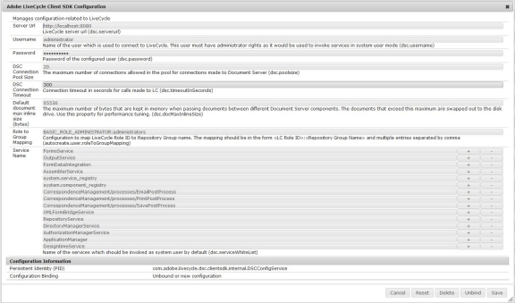

# Configuración de AEM Forms para enviar datos de formulario a un AEM Forms en un proceso JEE{#configuring-aem-forms-to-submit-form-data-to-an-aem-forms-on-jee-process}

Los formularios adaptables admiten el envío de datos a un proceso AEM Forms en JEE para un procesamiento posterior. Permite el déclencheur de un proceso de AEM Forms en JEE con los datos disponibles en el formulario enviado. Realice los siguientes pasos para permitir que la instancia de AEM Forms envíe un formulario adaptable a AEM Forms en el proceso JEE:

## Configure el servidor de AEM Forms {#configure-your-aem-forms-server}

Realice los siguientes pasos para permitir que el servidor de AEM formularios envíe datos a un AEM Forms en un servidor JEE:

1. Vaya a AEM consola de configuración web en https://[*host*]:[*puerto*]/system/console/configMgr.

1. Busque y haga clic en el componente **Configuración del SDK del cliente de Adobe LiveCycle**.
1. Haga clic para editar la dirección URL, el nombre de usuario y la contraseña del servidor de configuración para AEM Forms en el servidor JEE.
1. Revise la configuración y haga clic en **Guardar**.

## Asignar datos con campos de proceso {#map-data-with-process-fields}

Una vez configurado el AEM Forms, asigne el XML de datos y los archivos adjuntos del formulario enviado a los campos del proceso AEM Forms en JEE. Para ello:

1. En la consola de configuración web de AEM, haga clic para editar la configuración **Localizador de procesos de LiveCycle de guía y la configuración de Invoker**.
1. Especifique los siguientes parámetros:

   * **Nombre del parámetro**  xml de datos (obligatorio): Especifique el archivo de propiedad XML del proceso AEM Forms en JEE que necesita procesar los datos enviados. El valor predeterminado es **dataxml**.

   * **Nombre del parámetro**  de archivos adjuntos (opcional): Especifique la lista de los objetos de documento que el proceso AEM Forms en JEE debe procesar. El valor predeterminado es **fileAttachmentsList**.

1. Revise la configuración y haga clic en **Guardar**.

Una vez configurada, la acción Enviar al Forms Workflow envía listas de AEM Forms en los procesos del servidor JEE que contienen el parámetro xml de datos especificado.
