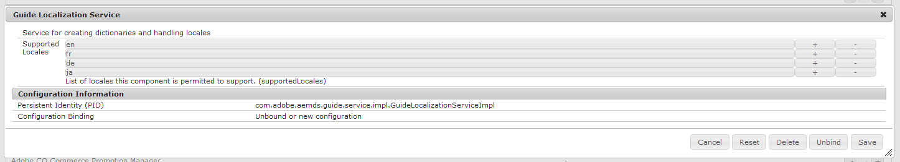

# Compatibilidad con configuraciones regionales nuevas para la localización de formularios adaptables{#supporting-new-locales-for-adaptive-forms-localization}

| Versión | Vínculo del artículo |
| -------- | ---------------------------- |
| AEM as a Cloud Service | [Haga clic aquí](https://experienceleague.adobe.com/docs/experience-manager-cloud-service/content/forms/adaptive-forms-authoring/authoring-adaptive-forms-foundation-components/supporting-new-language-localization.html?lang=es) |
| AEM 6.5 | Este artículo |

## Acerca de los diccionarios de configuración regional {#about-locale-dictionaries}

La localización de formularios adaptables se basa en dos tipos de diccionarios de configuración regional:

**El diccionario específico del formulario**: contiene cadenas utilizadas en formularios adaptables. Por ejemplo, etiquetas, nombres de campo, mensajes de error, descripciones de ayuda, etc. Se administra como un conjunto de archivos XLIFF para cada configuración regional y puede acceder a él en `https://<host>:<port>/libs/cq/i18n/translator.html`.

**Los diccionarios globales**: hay dos diccionarios globales, administrados como objetos JSON en la biblioteca de cliente de AEM. Estos diccionarios contienen mensajes de error predeterminados, nombres de mes, símbolos de moneda, patrones de fecha y hora, etc. Puede encontrar estos diccionarios en CRXDe Lite en /libs/fd/xfaforms/clientlibs/I18N. Estas ubicaciones contienen carpetas independientes para cada configuración regional. Dado que los diccionarios globales no suelen actualizarse con frecuencia, utilizar archivos JavaScript independientes para cada configuración regional permite a los exploradores almacenarlos en caché y reducir el uso del ancho de banda de red al acceder a diferentes formularios adaptables en el mismo servidor.

### Funcionamiento de la localización del formulario adaptable {#how-localization-of-adaptive-form-works}

Existen dos métodos para identificar la configuración regional del formulario adaptable. Cuando se procesa un formulario adaptable, este identifica la configuración regional solicitada de las siguientes formas:

* Al consultar el selector `[local]` de la URL del formulario adaptable. El formato de la URL es el siguiente `http://host:port/content/forms/af/[afName].[locale].html?wcmmode=disabled`. Usar el selector `[local]` permite almacenar en caché un formulario adaptable.

* observando los siguientes parámetros en el orden especificado:

   * Parámetro de solicitud `afAcceptLang`
Para anular la configuración regional del explorador de los usuarios, puede pasar el parámetro de solicitud `afAcceptLang` para forzar la configuración regional. Por ejemplo, la siguiente URL obligó a procesar el formulario en la configuración regional japonesa:
     `https://'[server]:[port]'/<contextPath>/<formFolder>/<formName>.html?wcmmode=disabled&afAcceptLang=ja`

   * La configuración regional del explorador establecida para el usuario, que se especifica en la solicitud utilizando el encabezado `Accept-Language`.

   * La configuración de idioma del usuario especificada en AEM.

   * La configuración regional del explorador está habilitada de forma predeterminada. Para cambiar la configuración regional del explorador,
      * Abra el Administrador de configuración. La URL es `http://[server]:[port]/system/console/configMgr`.
      * Busque y abra la configuración del **[!UICONTROL Canal web de formularios adaptables y comunicaciones interactivas]**.
      * Cambie el estado de la opción **[!UICONTROL Usar configuración regional del explorador]** y pulse **[!UICONTROL Guardar]** para guardar la configuración.

Una vez identificada la configuración regional, el formulario adaptable selecciona el diccionario específico del formulario. Si no se encuentra el diccionario específico del formulario para la configuración regional solicitada, utiliza el diccionario del idioma en el que se creó el formulario adaptable.

Si no hay información de configuración regional, el formulario adaptable se entrega en el idioma original del formulario. El idioma original es el idioma utilizado al desarrollar el formulario adaptable.

Si no existe una biblioteca de cliente para la configuración regional solicitada, se busca una biblioteca de cliente para el código de idioma presente en la configuración regional. Por ejemplo, si la configuración regional solicitada es `en_ZA` (Inglés sudafricano) y la biblioteca de cliente de `en_ZA` no existe, el formulario adaptable utilizará la biblioteca de cliente de `en` (Inglés), si existe. Sin embargo, si no existe ninguna biblioteca, el formulario adaptable utilizará el diccionario de la configuración regional `en`.

## Agregar compatibilidad con la localización para configuraciones regionales no admitidas {#add-localization-support-for-non-supported-locales}

AEM Forms admite actualmente la localización del contenido de los formularios adaptables en las configuraciones regionales de Inglés (en), Español (es), Francés (fr), Italiano (it), Alemán (de), Japonés (ja), Portugués brasileño (pt-BR), Chino (zh-CN), Chino taiwanés (zh-TW) y Coreano (ko-KR).

Para agregar compatibilidad con una nueva configuración regional en el tiempo de ejecución de un formulario adaptable, haga lo siguiente:

1. [Añada una configuración regional al servicio GuideLocalizationService.](../../forms/using/supporting-new-language-localization.md#p-add-a-locale-to-the-guide-localization-service-br-p)

1. [Agregar una biblioteca de cliente XFA para una configuración regional.](../../forms/using/supporting-new-language-localization.md#p-add-xfa-client-library-for-a-locale-br-p)

1. [Agregue la biblioteca de cliente del formulario adaptable para una configuración regional.](../../forms/using/supporting-new-language-localization.md#p-add-adaptive-form-client-library-for-a-locale-br-p)
1. [Agregar la compatibilidad con la configuración regional del diccionario.](../../forms/using/supporting-new-language-localization.md#p-add-locale-support-for-the-dictionary-br-p)
1. [Reiniciar el servidor](../../forms/using/supporting-new-language-localization.md#p-restart-the-server-p)

### Añadir una configuración regional al servicio de localización de guías {#add-a-locale-to-the-guide-localization-service-br}

1. Vaya a `https://'[server]:[port]'/system/console/configMgr`.
1. Haga clic en para editar el componente **Servicio de localización de guías**.
1. Agregue la configuración regional que desee añadir a la lista de configuraciones regionales admitidas.



### Agregar una biblioteca de cliente XFA para una configuración regional. {#add-xfa-client-library-for-a-locale-br}

Cree un nodo de tipo `cq:ClientLibraryFolder` en `etc/<folderHierarchy>` con la categoría `xfaforms.I18N.<locale>` y agregue los siguientes archivos a la biblioteca de cliente:

* **I18N.js** definiendo `xfalib.locale.Strings` para `<locale>`, tal como se define en `/etc/clientlibs/fd/xfaforms/I18N/ja/I18N`.

* **js.txt**, que contiene lo siguiente:

```text
/libs/fd/xfaforms/clientlibs/I18N/Namespace.js
I18N.js
/etc/clientlibs/fd/xfaforms/I18N/LogMessages.js
```

### Agregue la biblioteca de cliente del formulario adaptable para una configuración regional. {#add-adaptive-form-client-library-for-a-locale-br}

Cree un nodo de tipo `cq:ClientLibraryFolder` en `etc/<folderHierarchy>`, con categoría como `guides.I18N.<locale>` y dependencias como `xfaforms.3rdparty`, `xfaforms.I18N.<locale>` y `guide.common`. &quot;

Agregue los siguientes archivos a la biblioteca de cliente:

* **i18n.js**, definiendo `guidelib.i18n` con los patrones de “calendarSymbols” `datePatterns`, `timePatterns`, `dateTimeSymbols`, `numberPatterns`, `numberSymbols`, `currencySymbols` y `typefaces` para `<locale>` según las especificaciones XFA descritas en [Especificación de la configuración regional](https://helpx.adobe.com/content/dam/Adobe/specs/xfa_spec_3_3.pdf). También puede ver cómo se define para otras configuraciones regionales compatibles en `/etc/clientlibs/fd/af/I18N/fr/javascript/i18n.js`.
* **LogMessages.js**, definiendo `guidelib.i18n.strings` y `guidelib.i18n.LogMessages` para `<locale>` tal como se define en `/etc/clientlibs/fd/af/I18N/fr/javascript/LogMessages.js`.
* **js.txt**, que contiene lo siguiente:

```text
i18n.js
LogMessages.js
```

### Agregar la compatibilidad con la configuración regional del diccionario. {#add-locale-support-for-the-dictionary-br}

Realice este paso solo si la configuración regional `<locale>` que está agregando que no está entre `en`, `de`, `es`, `fr`, `it`, `pt-br`, `zh-cn`, `zh-tw`, `ja` y `ko-kr`.

1. Cree un nodo `languages` `nt:unstructured` en `etc`, si no está presente.

1. Agregue una propiedad de cadena de varios valores `languages` al nodo, si no está presente ya.
1. Agregue los valores de configuración regional predeterminados `<locale>`&#x200B;`de`, `es`, `fr`, `it`, `pt-br`, `zh-cn`, `zh-tw`, `ja` y `ko-kr`, si no están presentes.

1. Agregue `<locale>` a los valores de la propiedad `languages` de `/etc/languages`.

`<locale>` aparecerá en `https://'[server]:[port]'/libs/cq/i18n/translator.html`.

### Reiniciar el servidor {#restart-the-server}

Reinicie el servidor de AEM para aplicar la configuración regional añadida.

>[!NOTE]
>
> Se recomienda utilizar el comando &quot;Ctrl + C&quot; para reiniciar el SDK. El reinicio del SDK de AEM mediante métodos alternativos, como detener los procesos de Java, puede generar incoherencias en el entorno de desarrollo de AEM.

## Bibliotecas de ejemplo para agregar compatibilidad con Español {#sample-libraries-for-adding-support-for-spanish}

Bibliotecas de cliente de ejemplo para agregar compatibilidad con Español

[Obtener archivo](assets/sample.zip)
