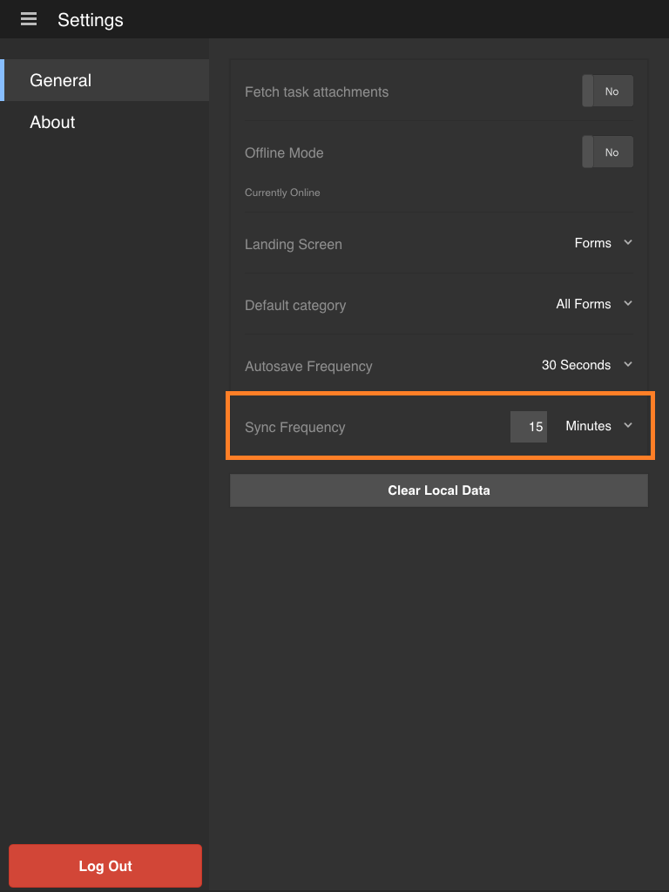

# Sincronización de la aplicación{#synchronizing-the-app}

## Sincronización de la aplicación {#synchronizing-the-app-1}

Los formularios de su aplicación se descargan del servidor de AEM Forms. Los formularios se descargan en las fichas Tareas y Forms. Los borradores creados a partir de formularios se descargan en la ficha Borradores y los borradores creados a partir de tareas se descargan en la ficha tareas. Para un formulario independiente en el servidor OSGi, los formularios y borradores se descargan en las fichas Forms y Borrador, respectivamente.

Cuando se completa y envía un formulario, éste se vuelve a cargar en el servidor de AEM Forms instantáneamente si la aplicación está en línea. Los formularios se recuperan del servidor cuando se sincroniza la aplicación. Sin embargo, los borradores se sincronizan con el servidor instantáneamente si la aplicación está en línea.

Cuando está conectado con el servidor de AEM Forms, de forma predeterminada, la aplicación se sincroniza cada 15 minutos. Sin embargo, tiene la opción de cambiar la frecuencia de sincronización. Como alternativa, puede sincronizar manualmente la aplicación en cualquier momento.

**Para sincronizar la aplicación manualmente**

Toque el botón Sincronizar  en la esquina inferior derecha de la pantalla principal.

**Para alterar la frecuencia de sincronización**

1. Para ir a la pantalla Configuración, toque el botón de menú en la esquina superior izquierda de la pantalla Inicio y, a continuación, toque **Configuración**.
1. En la pantalla Configuración, toque la ficha General.

   

1. En la opción Sincronizar frecuencia, toque el valor a la derecha de la frecuencia de sincronización.
1. En la lista desplegable, seleccione la nueva frecuencia de sincronización.

### Especificaciones técnicas {#technical-specifications}

* La lógica principal del envío de datos de la aplicación sin conexión al servidor de AEM Forms se incluye en runtime/offline/util/offline.js.
* En el archivo .js, la llamada a la función processOfflineSubmissionSavedTasks(...) envía las tareas guardadas o enviadas al servidor. También se ocupa de los errores o conflictos en el proceso de sincronización. Si se produce un error al enviar una tarea, la tarea de la aplicación se marca como errónea. Además, la tarea permanece en su Bandeja de salida.
* Las funciones syncSubmissionTask() y syncSavedTask() realizan operaciones en tareas individuales.
* El componente de lista de tarea inicia la llamada a la función processOfflineSubmissionSavedTasks() después de que un usuario selecciona sincronizar el estado sin conexión con el servidor o una sincronización automática por el subproceso en segundo plano.
