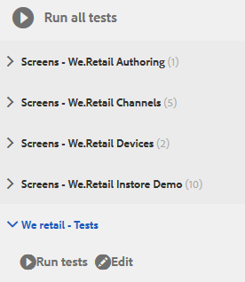
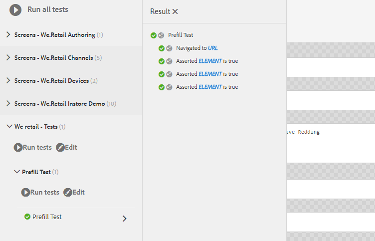

# Tutorial: Prueba del formulario adaptable {#tutorial-testing-your-adaptive-form}


Este tutorial es un paso de la serie [Create Your First Adaptive Form](https://helpx.adobe.com/es/experience-manager/6-3/forms/using/create-your-first-adaptive-form.html). Se recomienda seguir la serie en secuencia cronológica para comprender, realizar y demostrar el caso de uso completo del tutorial.

Una vez que el formulario adaptable esté listo, es importante probar el formulario adaptable antes de presentarlo a los usuarios finales. Puede probar manualmente (pruebas funcionales) cada campo o automatizar las pruebas del formulario adaptable. Cuando tiene varios formularios adaptables, probar manualmente cada campo de todos los formularios adaptables se convierte en una tarea ingente.

AEM [!DNL Forms] proporciona un marco de pruebas, Calvin, para automatizar las pruebas de los formularios adaptables. Con el marco, se escriben y ejecutan pruebas de IU directamente en un explorador web. El marco de trabajo proporciona API de JavaScript para la creación de pruebas. La prueba automatizada permite probar la experiencia de cumplimentación previa de un formulario adaptable, enviar experiencia de un formulario adaptable, reglas de expresión, validaciones, carga diferida e interacciones con la interfaz de usuario. Este tutorial le guía por los pasos para crear y ejecutar pruebas automatizadas en un formulario adaptable. Al final de este tutorial, podrá:

* [Crear un grupo de pruebas para el formulario adaptable](../../forms/using/testing-your-adaptive-form.md#step-create-a-test-suite)
* [Cree pruebas para el formulario adaptable](../../forms/using/testing-your-adaptive-form.md#step-create-a-test-case-to-prefill-values-in-an-adaptive-form)
* [Ejecute el grupo de pruebas y las pruebas creadas para el formulario adaptable](#step-run-all-the-tests-in-a-suite-or-individual-tests-cases)

## Paso 1: Crear un grupo de pruebas {#step-create-a-test-suite}

Los grupos de pruebas tienen una colección de casos de prueba. Puede tener varios grupos de pruebas. Se recomienda disponer de un grupo de pruebas independiente para cada formulario. Para crear un grupo de pruebas:

1. Inicie sesión en AEM instancia de autor [!DNL Forms] como administrador. Abra [!UICONTROL CRXDE Lite]. Puede pulsar AEM logotipo > **[!UICONTROL Herramientas]** > **[!UICONTROL General]** > **[!UICONTROL CRXDE Lite]** o abrir la dirección URL [https://localhost:4502/crx/de/index.jsp](https://localhost:4502/crx/de/index.jsp) en un navegador para abrir el CRXDE Lite.

1. Vaya a /etc/clientlibs en [!UICONTROL CRXDE Lite]. Haga clic con el botón derecho en la subcarpeta /etc/clientlibs y haga clic en **[!UICONTROL Crear]** > **[!UICONTROL Crear nodo]**. En el campo **[!UICONTROL Name]** escriba **WeRetailFormTestCases**. Seleccione el tipo como **cq:ClientLibraryFolder** y haga clic en **[!UICONTROL OK]**. Crea un nodo. Puede usar cualquier nombre en lugar de `WeRetailFormTestCases`.
1. Agregue las siguientes propiedades al nodo `WeRetailFormTestCases` y pulse **[!UICONTROL Guardar todo]**.

   <table>
    <tbody>
     <tr>
      <td><strong>Propiedad</strong></td>
      <td><strong>Tipo</strong></td>
      <td><strong>Multi</strong></td>
      <td><strong>Value</strong></td>
     </tr>
     <tr>
      <td>categorías</td>
      <td>Cadena</td>
      <td>Activado</td>
      <td>
       <ul>
        <li>granite.testing.hobbes.tests<br /> </li>
        <li>granite.testing.calvin.tests</li>
       </ul> </td>
     </tr>
     <tr>
      <td>dependencias</td>
      <td>Cadena</td>
      <td>Activado</td>
      <td>
       <ul>
        <li>granite.testing.hobbes.testrunner <br /> </li>
        <li>granite.testing.calvin <br /> </li>
        <li>apps.testframework.all</li>
       </ul> </td>
     </tr>
    </tbody>
   </table>

   Asegúrese de que cada propiedad se agrega a un cuadro independiente como se muestra a continuación:

   

1. Haga clic con el botón derecho en el nodo **[!UICONTROL WeRetailFormTestCases]** y haga clic en **[!UICONTROL Crear]** > **[!UICONTROL Crear archivo]**. En el campo **[!UICONTROL Name]**, escriba `js.txt` y haga clic en **[!UICONTROL OK]**.
1. Abra el archivo js.txt para editarlo, añada el siguiente código y guarde el archivo:

   ```text
   #base=.
    init.js
   ```

1. Cree un archivo, init.js, en el nodo `WeRetailFormTestCases`. Agregue el código siguiente al archivo y pulse **[!UICONTROL Guardar todo]**.

   ```javascript
   (function(window, hobs) {
       'use strict';
       window.testsuites = window.testsuites || {};
     // Registering the test form suite to the sytem
     // If there are other forms, all registration should be done here
       window.testsuites.testForm3 = new hobs.TestSuite("We retail - Tests", {
           path: '/etc/clientlibs/WeRetailFormTestCases/init.js',
           register: true
       });
    // window.testsuites.testForm2 = new hobs.TestSuite("testForm2");
   }(window, window.hobs));
   ```

   El código anterior crea un grupo de pruebas denominado **We retail - Tests**.

1. Abra AEM interfaz de usuario de prueba (AEM > **[!UICONTROL Tools]** > **[!UICONTROL Operations]** > **[!UICONTROL Testing]**). El grupo de pruebas **We retail - Tests** - se muestra en la interfaz de usuario.

   

## Paso 2: Cree un caso de prueba para rellenar previamente los valores en un formulario adaptable {#step-create-a-test-case-to-prefill-values-in-an-adaptive-form}

Un caso de prueba es un conjunto de acciones para probar una funcionalidad específica. Por ejemplo, anteponga todos los campos de un formulario y valide unos pocos campos para asegurarse de que se introducen los valores correctos.

Una acción es una actividad específica de un formulario adaptable, como hacer clic en un botón. Para crear un caso de prueba y acciones para validar los datos introducidos por el usuario en cada campo de formulario adaptable:

1. En [!UICONTROL CRXDE lite], vaya a la carpeta `/content/forms/af/create-first-adaptive-form`. Haga clic con el botón derecho en el nodo de carpeta **[!UICONTROL create-first-adaptive-form]** y haga clic en **[!UICONTROL Create]** **[!UICONTROL Create File]**. En el campo **[!UICONTROL Name]**, escriba `prefill.xml` y haga clic en **[!UICONTROL OK]**. Añada el siguiente código al archivo:

   ```xml
   <?xml version="1.0" encoding="UTF-8"?><afData>
     <afUnboundData>
       <data>
         <customer_ID>371767</customer_ID>
         <customer_Name>John Jacobs</customer_Name>
         <customer_Shipping_Address>1657 1657 Riverside Drive Redding</customer_Shipping_Address>
         <customer_State>California</customer_State>
         <customer_ZIPCode>096001</customer_ZIPCode>
        </data>
     </afUnboundData>
     <afBoundData>
       <data xmlns:xfa="https://www.xfa.org/schema/xfa-data/1.0/"/>
     </afBoundData>
   </afData>
   ```

1. Ir a `/etc/clientlibs`. Haga clic con el botón derecho en la subcarpeta `/etc/clientlibs` y haga clic en **[!UICONTROL Crear]**> **[!UICONTROL Crear nodo]**.

   En el campo **[!UICONTROL Name]** escriba `WeRetailFormTests`. Seleccione el tipo como `cq:ClientLibraryFolder` y haga clic en **[!UICONTROL OK]**.

1. Agregue las siguientes propiedades al nodo **[!UICONTROL WeRetailFormTests]**.

   <table>
    <tbody>
     <tr>
      <td><strong>Propiedad</strong></td>
      <td><strong>Tipo</strong></td>
      <td><strong>Multi</strong></td>
      <td><strong>Valor</strong></td>
     </tr>
     <tr>
      <td>categorías</td>
      <td>Cadena</td>
      <td>Activado</td>
      <td>
       <ul>
        <li>granite.testing.hobbes.tests<br /> </li>
        <li>granite.testing.hobbes.tests.testForm</li>
       </ul> </td>
     </tr>
     <tr>
      <td>dependencias</td>
      <td>Cadena</td>
      <td>Activado</td>
      <td>
       <ul>
        <li>granite.testing.calvin.tests</li>
       </ul> </td>
     </tr>
     </tbody>
   </table>

1. Cree un archivo, js.txt, en el nodo **[!UICONTROL WeRetailFormTests]**. Agregue lo siguiente al archivo :

   ```shell
   #base=.
   prefillTest.js
   ```

   Haga clic en **[!UICONTROL Guardar todo]**.

1. Cree un archivo, `prefillTest.js`, en el nodo **[!UICONTROL WeRetailFormTests]**. Agregue el código siguiente al archivo . El código crea un caso de prueba. El caso de prueba fija como prefijo todos los campos de un formulario y valida algunos campos para garantizar que se introducen los valores correctos.

   ```javascript
   (function (window, hobs) {
       'use strict';
   
       var ts = new hobs.TestSuite("Prefill Test", {
           path: '/etc/clientlibs/WeRetailFormTests/prefillTest.js',
           register: false
       })
   
       .addTestCase(new hobs.TestCase("Prefill Test")
           // navigate to the testForm which is to be test
           .navigateTo("/content/forms/af/create-first-adaptive-form/shipping-address-add-update-form.html?wcmmode=disabled&dataRef=crx:///content/forms/af/create-first-adaptive-form/prefill.xml")
           // check if adaptive form is loaded
           .asserts.isTrue(function () {
               return calvin.isFormLoaded()
           })
           .asserts.isTrue(function () {
               return calvin.model("customer_ID").value == 371767;
           })
           .asserts.isTrue(function () {
               return calvin.model("customer_ZIPCode").value == 96001;
           })
       );
   
       // register the test suite with testForm
       window.testsuites.testForm3.add(ts);
   
   }(window, window.hobs));
   ```

   El caso de prueba se crea y está listo para ejecutarse. Puede crear casos de prueba para validar varios aspectos de un formulario adaptable, como comprobar la ejecución de la secuencia de comandos de cálculo, validar patrones y validar la experiencia de envío de un formulario adaptable. Para obtener información sobre varios aspectos de la prueba de formularios adaptables, consulte Automatización de pruebas de formularios adaptables.

## Paso 3: Ejecute todas las pruebas en un grupo o en casos de pruebas individuales {#step-run-all-the-tests-in-a-suite-or-individual-tests-cases}

Un grupo de pruebas puede tener varios casos de prueba. Puede ejecutar todos los casos de prueba en un grupo de pruebas de una vez o individualmente. Al ejecutar una prueba, los iconos indican los resultados:

* Un icono de marca de verificación indica una prueba pasada: 
* El icono &quot;X&quot; indica una prueba fallida: 

1. Vaya al icono AEM > **[!UICONTROL Herramientas]** **[!UICONTROL Operaciones]** **[!UICONTROL Pruebas]**
1. Para ejecutar todas las pruebas del grupo de pruebas:

   1. En el panel [!UICONTROL Pruebas], pulse **[!UICONTROL Pruebas minoristas: 1)]**. Se amplía el grupo para mostrar la lista de pruebas.
   1. Pulse el botón **[!UICONTROL Run testing]**. El área en blanco a la derecha de la pantalla se reemplaza por el formulario adaptable a medida que se ejecuta la prueba.

      

1. Para ejecutar una sola prueba desde el grupo de pruebas:

   1. En el panel Pruebas, pulse **[!UICONTROL We retail - Tests (1)]**. Se amplía el grupo para mostrar la lista de pruebas.
   1. Pulse **[!UICONTROL Prefill Test]** y pulse el botón **[!UICONTROL Run testing]**. El área en blanco a la derecha de la pantalla se reemplaza por el formulario adaptable a medida que se ejecuta la prueba.

1. Pulse el nombre de la prueba, Prueba de relleno previo, para revisar los resultados del caso de prueba. Abre el panel [!UICONTROL Resultado]. Pulse el nombre del caso de prueba en el panel [!UICONTROL Result] para ver todos los detalles de la prueba.

   

Ahora el formulario adaptable está listo para su publicación.
