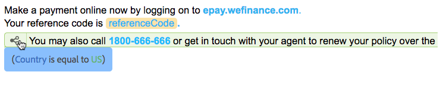

# Textos en comunicaciones interactivas{#texts-in-interactive-communications}

## Información general {#overview}

Un fragmento de documento de texto consta de uno o varios párrafos de texto. Un párrafo puede ser estático o dinámico. Un párrafo dinámico puede contener propiedades y variables del modelo de datos de formulario. También puede aplicar reglas y repetirlas en un fragmento de documento de texto. Por ejemplo, el nombre de cliente en una liquidación podría ser una propiedad del Modelo de datos de formulario (FDM) con su valor disponible en tiempo de ejecución. Al cambiar estos valores, se puede utilizar la misma comunicación interactiva para preparar la comunicación interactiva para distintos clientes mediante la interfaz de usuario del agente.

El fragmento de documento de texto de Comunicación interactiva admite el siguiente tipo de datos dinámicos:

* **Objetos** del modelo de datos: Las propiedades de datos utilizan un origen de datos back-end.
* **Contenido** basado en reglas: Partes del contenido de un texto que aparecen u ocultan según una regla. Una regla también puede basarse en propiedades y variables del modelo de datos de formulario.
* **Variables**: En el fragmento de documento de texto, las variables no están enlazadas a un origen de datos back-end. El agente rellena o selecciona valores en variables o enlaza las variables a fuentes de datos mientras prepara la comunicación interactiva para enviarla a un proceso de anuncio.
* **Repetir**: Es posible que tenga información dinámica en la comunicación interactiva, como las transacciones en un extracto de tarjeta de crédito, cuyo número de incidencias puede seguir cambiando con cada comunicación interactiva generada. Si utiliza la opción de repetición, puede dar formato y estructurar dicha información dinámica. Para obtener más información, consulte Condición [en línea y repetición](https://helpx.adobe.com/experience-manager/6-3/forms/using/cm-inline-condition.html).

## Create text {#createtext}

1. Seleccione **[!UICONTROL Formularios]** > Fragmentos **[!UICONTROL de Documento]**.
1. Seleccione **[!UICONTROL Crear]** > **[!UICONTROL Texto]**.
1. Especifique la siguiente información:

   * **[!UICONTROL Título]**: (Opcional) Introduzca el título del fragmento de documento de texto. Los títulos no tienen que ser únicos y pueden tener caracteres especiales y caracteres que no son del inglés. Los textos se remiten por sus títulos (cuando están disponibles), como en miniaturas y propiedades.
   * **[!UICONTROL Nombre]**: Nombre exclusivo del texto, dentro de una carpeta. No pueden existir dos fragmentos de documento (texto, condición o lista) en ningún estado con el mismo nombre en una carpeta. En el campo Nombre, solo puede introducir caracteres, números y guiones en inglés. El campo Nombre se rellena automáticamente según el campo Título. Los caracteres especiales, espacios, números y caracteres no ingleses introducidos en el campo Título se sustituyen por guiones en el campo Nombre. Aunque el valor del campo Título se copia automáticamente en el Nombre, puede editarlo.

   * **[!UICONTROL Descripción]**: Escriba una descripción del texto.
   * **[!UICONTROL Modelo]** de datos de formulario: De forma opcional, seleccione el botón de opción Modelo de datos de formulario para crear el texto basado en un modelo de datos de formulario. Al seleccionar el botón de opción Modelo de datos de formulario, aparece el campo Modelo de datos **[!UICONTROL de formulario]** . Examine y seleccione un modelo de datos de formulario. Al crear texto y condiciones para una comunicación interactiva, asegúrese de utilizar el mismo modelo de datos que desea utilizar en la comunicación interactiva. Para obtener más información sobre el modelo de datos de formulario, consulte Integración [de datos](/help/forms/using/data-integration.md).

   * **[!UICONTROL Etiquetas]**: De forma opcional, para crear un valor de introducción de etiquetas personalizado en el campo de texto y pulse Intro. Al guardar este texto, se crean las etiquetas recientemente agregadas.

1. Puntee **[!UICONTROL Siguiente]**.

   Aparece la página Crear texto. Si ha elegido crear un texto basado en un modelo de datos de formulario, las propiedades del modelo de datos de formulario aparecen en el panel izquierdo.

1. Escriba el texto y utilice las siguientes opciones para dar formato, condicionalizar e insertar propiedades y variables del modelo de datos de formulario en el texto:

   * [Modelo de datos de formulario](#formdatamodel)
   * [Variables](#variables)
   * [Editor de reglas](#rules)
   * [Opciones de formato](#formatting)

      * [Copiar y pegar texto con formato de otras aplicaciones](#paste)

      * [Resaltar partes del texto](#highlight)
   * [Repetir](/help/forms/using/cm-inline-condition.md)
   * [Caracteres especiales](#special)
   * [Búsqueda y reemplazo de texto](#searching)
   * [Métodos abreviados de teclado](/help/forms/using/keyboard-shortcuts.md)
   >[!NOTE]
   >
   >Puede agregar elementos del Modelo de datos de formulario, elementos del diccionario de datos y variables mediante el símbolo @ en el editor de texto. Cuando se introduce una cadena precedida por @ en el editor de texto, se buscan todos los elementos del modelo de datos, los elementos del diccionario de datos y las variables y se muestran los elementos o variables que contienen la cadena buscada. Puede navegar por los resultados de búsqueda y seleccionar un elemento o una variable. Si no hay ningún resultado coincidente, se muestra el mensaje *No se encontraron* resultados coincidentes.

1. Toque **[!UICONTROL Guardar]**.

   Se crea el texto. Ahora puede utilizar el texto como un bloque de creación al crear una comunicación interactiva.

## Editar texto {#edittext}

Puede editar un fragmento de documento de texto existente mediante los siguientes pasos. También puede editar un fragmento de documento de texto desde un editor de comunicación interactiva.

1. Seleccione **[!UICONTROL Formularios]** > Fragmentos **[!UICONTROL de Documento]**.
1. Vaya a un fragmento de documento de texto y selecciónelo.
1. Toque **[!UICONTROL Editar]**.
1. Realice los cambios necesarios. Para obtener más información sobre las opciones de texto, consulte [Creación de texto](#createtext).
1. Toque **[!UICONTROL Guardar]** y, a continuación, **[!UICONTROL Cerrar]**.

## Personalización de un fragmento de documento de texto mediante las propiedades del modelo de datos de formulario {#formdatamodel}

Puede personalizar los fragmentos de documento de texto insertando las propiedades del modelo de datos de formulario. Al insertar propiedades del modelo de datos de formulario en el texto, puede recuperar y rellenar datos específicos del destinatario del origen de datos asociado mientras previsualiza una comunicación interactiva. Para obtener más información sobre el modelo de datos de formulario, consulte Integración [de datos de formularios](/help/forms/using/data-integration.md)AEM.

Si ha especificado un modelo de datos de formulario al crear un texto, las propiedades del modelo de datos de formulario aparecen en el panel izquierdo del editor de texto. El modelo de datos de formulario especificado debe ser el mismo para el fragmento de documento de texto que para la comunicación interactiva que lo incluye.

* Para insertar una propiedad del modelo de datos de formulario en el texto, coloque el cursor donde desee insertar la propiedad y, a continuación, seleccione la propiedad **[A]** en el panel izquierdo tocando sobre ella y toque **[!UICONTROL [B]Añadir seleccionados]**. También puede tocar con el doble la propiedad para insertarla en la posición del cursor en**[ C ]**. Las propiedades del modelo de datos de formulario se resaltan en un color de fondo parduzco.

También puede buscar y agregar la propiedad del modelo de datos de formulario utilizando el símbolo @ en el editor de texto. Coloque el cursor donde desee insertar la propiedad. Escriba @ seguido de la cadena de búsqueda. La operación de búsqueda se realiza en todas las propiedades y variables del modelo de datos de formulario disponibles en el fragmento de documento. Las propiedades o variables que contienen la cadena de búsqueda se recuperan y se muestran como una lista desplegable. Navegue por los resultados de la búsqueda y haga clic en la propiedad que desee insertar en la ubicación del cursor. Pulse Esc para ocultar los resultados de la búsqueda.

* Para permitir que los agentes editen el valor de una propiedad de modelo de datos de formulario en la interfaz de usuario del agente mientras [preparan y envían comunicaciones](/help/forms/using/prepare-send-interactive-communication.md) interactivas mediante la interfaz de usuario del agente, toque el icono de bloqueo **[D]** de esa propiedad y asegúrese de que está en un estado desbloqueado. El estado predeterminado de la propiedad está bloqueado y un agente no puede editar la propiedad en la interfaz de usuario del agente.

También puede utilizar las propiedades del modelo de datos de formulario para crear reglas para mostrar u ocultar partes del contenido. Para obtener más información, consulte [Creación de reglas en texto](#rules).

## Creación y uso de variables en un fragmento de documento de texto {#variables}

Las variables son marcadores de posición que se pueden enlazar al crear una comunicación interactiva. Las variables se pueden enlazar a una propiedad del modelo de datos de formulario o a un fragmento de texto. También se pueden dejar variables para que el agente las rellene.

Puede utilizar variables en lugar de propiedades del modelo de datos de formulario cuando:

* Un fragmento de documento de texto se va a utilizar en varias comunicaciones interactivas, donde el enlace debe ser diferente para diferentes comunicaciones interactivas.
* El fragmento de documento de texto no tiene un modelo de datos de formulario en el momento de crearlo. Puede insertar variables y posteriormente enlazarlas a las propiedades del modelo de datos de formulario en el momento de la creación de la comunicación interactiva.
* Debe enlazar y recuperar texto de un fragmento de documento de texto. Solo los fragmentos de documento de texto pueden enlazarse a variables que no tengan variables dentro.

Al crear o editar un fragmento de documento de texto, puede crear e insertar variables. Las variables que cree aparecerán en la ficha Datos de la interfaz de usuario del agente. El agente especifica los valores de las variables mientras se [prepara y envía la comunicación interactiva mediante la interfaz de usuario](/help/forms/using/prepare-send-interactive-communication.md)del agente.

### Crear variables {#createvariables}

1. En el panel izquierdo, toque **[!UICONTROL Variables]**.

   Aparece el panel Variables.

   

1. Toque **[!UICONTROL Crear]**.

   Aparece el panel Crear variables.

1. Introduzca la siguiente información y toque **[!UICONTROL Crear]**:

   * **[!UICONTROL Nombre]** : Nombre de la variable.
   * **[!UICONTROL Descripción]** : De forma opcional, introduzca una descripción de la variable.
   * **[!UICONTROL Tipo]** : Seleccione un tipo de variable: Cadena, Número, Booleano o Fecha.
   * **[!UICONTROL Permitir sólo]** valores específicos: En el caso de las variables String y Number, puede asegurarse de que el agente elige entre un conjunto específico de valores para un marcador de posición en la interfaz de usuario del agente. Para especificar el conjunto de valores, seleccione esta opción y, a continuación, especifique los valores separados por comas que se permiten en el campo **[!UICONTROL Valores]** .

1. Toque **[!UICONTROL Crear]**.

   La variable se crea y se enumera en el panel Variables.

1. Para insertar una variable en el texto, coloque el cursor en el lugar adecuado, seleccione la variable y toque **[!UICONTROL Añadir selección]**.

   

   Las variables se resaltan en color de fondo azul claro, mientras que las propiedades del modelo de datos de formulario se resaltan en color pardo.

   También puede buscar y agregar variables utilizando el símbolo @ en el editor de texto. Coloque el cursor donde desee insertar la variable. Escriba @ seguido de la cadena de búsqueda. La operación de búsqueda se realiza en todas las propiedades y variables del modelo de datos de formulario disponibles en el fragmento de documento. Las propiedades y variables que contienen la cadena de búsqueda se recuperan y se muestran como una lista desplegable. Navegue por los resultados de búsqueda y haga clic en la variable que desee insertar en la ubicación del cursor. Pulse Esc para ocultar los resultados de la búsqueda.

1. Toque **[!UICONTROL Guardar]**.

## Crear reglas en el texto {#rules}

Con el editor de reglas en un texto, puede crear reglas para mostrar u ocultar cadenas de texto o fragmentos de contenido en función de condiciones **** preestablecidas. Estas condiciones pueden construirse sobre la base de:

* Cadenas
* Números
* expresión matemática
* Fechas
* Propiedades del modelo de datos de formulario asociado
* Cualquier variable que haya creado en el texto

### Crear reglas en el texto {#create-rules-in-text}

1. Durante la creación o edición de un texto, seleccione la cadena de texto, el párrafo o el contenido que desea condicionalizar mediante la regla.

   

1. Toque **[!UICONTROL Crear regla]**.

   Aparece el cuadro de diálogo Crear regla. Además de la cadena, el número, la expresión matemática y la fecha, en el Editor de reglas también se encuentran disponibles las siguientes opciones para crear instrucciones de las reglas:

   * Propiedades del modelo de datos de formulario asociado
   * Cualquier variable que haya creado
   Seleccione la opción adecuada para evaluar.

    

   >[!NOTE]
   >
   >La propiedad Collection no se admite para crear reglas que condicionen y muestren texto.

1. Seleccione el operador apropiado para evaluar la regla, como Es igual a, Contiene y Inicios con.

   

1. Inserte la expresión, el valor, la propiedad del modelo de datos o la variable de evaluación.

   

   Regla para mostrar el texto seleccionado si la ubicación del destinatario es EE.UU. según los datos de origen de FDM

   * Al crear o editar una regla, también puede tocar  (Redimensionar) para expandir el cuadro de diálogo Crear regla/Editar regla. El cuadro de diálogo ampliado de ventana completa permite arrastrar y soltar propiedades y variables del modelo de datos de formulario para crear reglas. Vuelva a tocar Cambiar tamaño para volver al cuadro de diálogo Crear regla.
   * También puede crear varias condiciones en una regla.
   * También puede crear reglas superpuestas, en las que una regla se aplica a una parte de un contenido que ya tiene una regla aplicada.

1. Puntee **[!UICONTROL Listo]**.

   Se aplica la regla. El texto o el contenido al que se aplica la regla se resalta en verde. Al pasar el ratón sobre el controlador izquierdo del resaltado, aparece la regla aplicada.

   

   Al hacer clic en el controlador izquierdo de la regla aplicada, se obtienen las opciones para editar o eliminar la regla.

## Formato del texto {#formatting}

Durante la creación o edición de texto, la barra de herramientas cambia según el tipo de edición que elija: Párrafo, alineación o Lista:
[ 

Seleccionar tipo de barra de herramientas: Párrafo, alineación o lista

](assets/toolbarselection.png) Barra de herramientas de edición 

Barra de herramientas de edición de fuentes

Barra de herramientas de alineación

Lista, barra de herramientas

### Resaltar/enfatizar partes del texto {#highlight}

Para resaltar o resaltar partes del texto en un fragmento de documento editable, seleccione el texto y toque Color de resaltado.

Puede tocar directamente un color básico `**[A]**` presente en la paleta Colores básicos o tocar **Seleccionar** después de utilizar el control deslizante `**[B]**` para elegir la sombra adecuada del color.

De forma opcional, también puede ir a la ficha Avanzado para seleccionar el tono, la luminosidad y la saturación adecuados `**[C]**` para crear el color preciso y, a continuación, tocar Seleccionar `**[D]**` para aplicar el color para resaltar el texto.

### Pegar texto con formato {#paste}

Para reutilizar uno o varios párrafos de texto que existen en otra aplicación, como los de páginas de Microsoft® Word o HTML, copie y pegue el texto en el editor de texto. El formato del texto copiado se conserva en el editor de texto.

Puede copiar y pegar uno o varios párrafos de texto en un fragmento de documento de texto editable. Por ejemplo, puede tener un documento de Microsoft® Word con una lista con viñetas de pruebas de residencia aceptables como, por ejemplo:

Puede copiar y pegar directamente el texto del documento de Microsoft® Word en un fragmento de documento de texto editable. El formato, como la lista con viñetas, la fuente y el color del texto, se conserva en el fragmento de documento de texto.

>[!NOTE]
>
>Sin embargo, el formato del texto pegado tiene algunas [limitaciones](https://helpx.adobe.com/aem-forms/kb/cm-copy-paste-text-limitations.html).

## Insertar caracteres especiales en el texto {#special}

Si es necesario, inserte caracteres especiales en el fragmento de documento. Por ejemplo, puede utilizar la paleta Caracteres especiales para insertar:

* Símbolos monetarios como €, ¥y £
* Matemáticas como la adrenalina, el rey, el rey, el rey y el símbolo ^
* Símbolos de puntuación como ‟ y&quot;

El editor de texto ha incorporado compatibilidad con 210 caracteres especiales. El administrador puede [añadir compatibilidad con más caracteres especiales personalizados personalizándolos](/help/forms/using/custom-special-characters.md).

## Búsqueda y reemplazo de texto {#searching}

Cuando se trabaja con fragmentos de documento de texto que contienen una gran cantidad de texto, es necesario buscar una cadena de texto específica. También es posible que tenga que reemplazar una cadena de texto específica por una cadena alternativa.

La función Buscar y reemplazar permite buscar (y reemplazar) cualquier cadena de texto en un fragmento de documento de texto. La función también incluye una potente búsqueda de expresión regular.

1. Abra un fragmento de documento de texto para [editarlo](#edittext).
1. Toque **[!UICONTROL Buscar y reemplazar]**.

1. Escriba el texto que desea buscar en el cuadro de texto **[!UICONTROL Buscar]** y el nuevo texto (texto de reemplazo) en el cuadro de texto **[!UICONTROL Reemplazar]** y toque **[!UICONTROL Reemplazar]**.

1. Si se encuentra el texto buscado, el texto se reemplaza por el texto de reemplazo.

   * Si se encuentra otra instancia del texto de búsqueda, esa instancia se resalta en el fragmento de documento de texto. Si vuelve a tocar **[!UICONTROL Reemplazar]** , se reemplaza la instancia resaltada y el cursor se mueve hacia adelante, si se encuentra una tercera instancia.
   * Si no se encuentra otra instancia, el cuadro de diálogo Buscar y reemplazar muestra un mensaje: Se llegó al final del módulo.
   También puede tocar Reemplazar todo para reemplazar todas las coincidencias de una sola vez.

   Buscar y reemplazar también incluye una potente búsqueda de expresión regular. Para usar regex en la búsqueda, seleccione **[!UICONTROL Reg ex]** y luego toque **[!UICONTROL Buscar]** o **[!UICONTROL Reemplazar]**.

