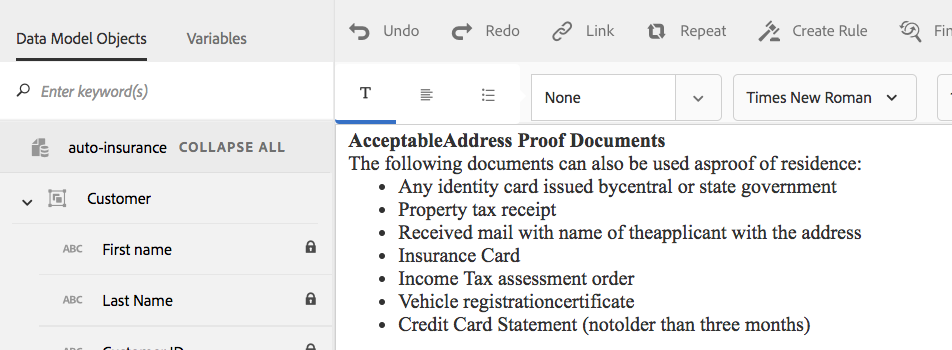

# Textos en comunicaciones interactivas{#texts-in-interactive-communications}

## Información general {#overview}

Un fragmento de documento de texto consta de uno o más párrafos de texto. Un párrafo puede ser estático o dinámico. Un párrafo dinámico puede contener propiedades y variables del modelo de datos de formulario. También puede aplicar reglas y repetirlas dentro de un fragmento de documento de texto. Por ejemplo, el nombre del cliente de una solución podría ser una propiedad del modelo de datos de formulario (FDM) con su valor disponible durante la ejecución. Al cambiar estos valores, se puede utilizar la misma comunicación interactiva para preparar la comunicación interactiva para diferentes clientes mediante la interfaz de usuario del agente.

El fragmento del documento de texto de la comunicación interactiva admite el siguiente tipo de datos dinámicos:

* **Objetos del modelo de datos**: las propiedades de datos utilizan una fuente de datos back-end.
* **Contenido basado en reglas**: partes de contenido de un texto que aparecen o se ocultan según una regla. Una regla también puede basarse en las propiedades y variables del modelo de datos de formulario.
* **Variables**: en el fragmento del documento de texto, las variables no están enlazadas a una fuente de datos back-end. El agente rellena o selecciona valores en variables o enlaza las variables a fuentes de datos mientras prepara la comunicación interactiva para enviarla a un proceso posterior.
* **Repetir**: es posible que tenga información dinámica en la comunicación interactiva, como transacciones en un extracto de tarjeta de crédito, cuyo número de incidencias puede cambiar con cada comunicación interactiva generada. Si se utiliza la repetición, puede aplicar formato y estructurar dicha información dinámica. Para obtener más información, consulte [Condición y repetición dentro de la línea](https://helpx.adobe.com/es/experience-manager/6-3/forms/using/cm-inline-condition.html).

## Crear texto {#createtext}

1. Seleccione **[!UICONTROL Forms]** > **[!UICONTROL Fragmentos de documento]**.
1. Seleccione **[!UICONTROL Crear]** > **[!UICONTROL Texto]**.
1. Especifique la siguiente información:

   * **[!UICONTROL Título]**: (Opcional) escriba el título del fragmento del documento de texto. Los títulos no tienen que ser únicos, y pueden tener caracteres especiales y caracteres que no sean de inglés. Los textos se refieren por sus títulos (cuando están disponibles), como en miniaturas y propiedades.
   * **[!UICONTROL Nombre]**: nombre exclusivo del texto, dentro de una carpeta. No pueden existir dos fragmentos de documento (texto, condición o lista) con el mismo nombre en una misma carpeta. En el campo Nombre, solo se pueden introducir caracteres, números y guiones en inglés. El campo Nombre se rellena automáticamente en función del campo Título. Los caracteres especiales, espacios, números y caracteres que no sean de inglés introducidos en el campo Título se sustituyen por guiones en el campo Nombre. Aunque el valor del campo Título se copia automáticamente en Nombre, puede editarlo.

   * **[!UICONTROL Descripción]**: escriba una descripción del texto.
   * **[!UICONTROL Modelo de datos de formulario]**: de forma opcional, seleccione el botón de radio Modelo de datos de formulario para crear el texto basado en un modelo de datos de formulario. Al seleccionar el botón Modelo de datos de formulario, aparecerá el campo **[!UICONTROL Modelo de datos de formulario]**. Busque y seleccione un modelo de datos de formulario. Al crear texto y condiciones para una comunicación interactiva, asegúrese de utilizar el mismo modelo de datos que desea utilizar en la comunicación interactiva. Para obtener información sobre el modelo de datos de formulario, consulte [Integración de datos](/help/forms/using/data-integration.md).

   * **[!UICONTROL Etiquetas]**: si lo prefiere, puede crear una etiqueta personalizada introduciendo el valor en el campo de texto y pulsando Intro. Al guardar este texto, se crean las etiquetas agregadas recientemente.

1. Pulse **[!UICONTROL Siguiente]**.

   Aparece la página Crear texto. Si ha elegido crear un texto basado en el modelo de datos de formulario, las propiedades del modelo de datos de formulario aparecerán en el panel izquierdo.

1. Escriba el texto y utilice las siguientes opciones para aplicar formato, condicionar e insertar propiedades y variables del modelo de datos de formulario en el texto:

   * [Modelo de datos de formulario](#formdatamodel)
   * [Variables](#variables)
   * [Editor de reglas](#rules)
   * [Opciones de formato](#formatting)

      * [Copiar y pegar texto con formato desde otras aplicaciones](#paste)

      * [Resaltar fragmentos del texto](#highlight)

   * [Repetir](/help/forms/using/cm-inline-condition.md)
   * [Caracteres especiales](#special)
   * [Buscar y reemplazar texto](#searching)
   * [Métodos abreviados de teclado](/help/forms/using/keyboard-shortcuts.md)

   >[!NOTE]
   >
   >Puede agregar elementos del modelo de datos de formulario, elementos del diccionario de datos y variables mediante el símbolo @ en el editor de texto. Cuando se introduce una cadena precedida por @ en el editor de texto, se buscan todos los elementos del modelo de datos, los elementos del diccionario de datos y las variables y se muestran los elementos o variables que contienen la cadena buscada. Puede navegar por los resultados de búsqueda y seleccionar un elemento o variable. Si no hay ningún resultado coincidente, se mostrará el mensaje *No se encontraron resultados coincidentes*.

1. Pulse **[!UICONTROL Guardar]**.

   El texto se crea. Ahora puede usar el texto como un bloque de creación al crear una comunicación interactiva.

## Editar texto {#edittext}

Puede editar un fragmento de documento de texto existente mediante los siguientes pasos. También puede editar un fragmento de documento de texto desde un editor de comunicaciones interactivas.

1. Seleccione **[!UICONTROL Forms]** > **[!UICONTROL Fragmentos de documento]**.
1. Navegue hasta un fragmento de documento de texto y selecciónelo.
1. Pulse **[!UICONTROL Editar]**.
1. Efectúe las modificaciones necesarias. Para obtener más información sobre las opciones en el texto, consulte [Crear texto](#createtext).
1. Pulse **[!UICONTROL Guardar]** y, a continuación, pulse **[!UICONTROL Cerrar]**.

## Personalizar un fragmento de documento de texto mediante las propiedades del modelo de datos de formulario {#formdatamodel}

Puede personalizar los fragmentos de documento de texto al insertar las propiedades del modelo de datos de formulario. Al insertar las propiedades del modelo de datos de formulario en texto, se pueden recuperar y rellenar datos específicos del destinatario de la fuente de datos asociado con la vista previa de una comunicación interactiva. Para obtener más información sobre el modelo de datos de formulario, consulte [Integración de datos de AEM Forms](/help/forms/using/data-integration.md).

Si ha especificado un modelo de datos de formulario al crear un texto, las propiedades del modelo de datos de formulario aparecerán en el panel izquierdo del editor de texto. El modelo de datos de formulario especificado debe ser el mismo para el fragmento de documento de texto, así como para la comunicación interactiva que lo incluye.

* Para insertar una propiedad del modelo de datos de formulario en el texto, coloque el cursor donde desee insertar la propiedad y, a continuación, seleccione la propiedad **[A]** en el panel izquierdo al pulsar en ella y pulse **[!UICONTROL [B] Agregar selección]**. También puede pulsar dos veces la propiedad para insertarla en la posición del cursor **[C]**. Las propiedades del modelo de datos de formulario se resaltan en un color de fondo parduzco.

También puede buscar y agregar la propiedad del modelo de datos de formulario con el símbolo @ en el editor de texto. Coloque el cursor donde desee insertar la propiedad. Escriba @ seguido de la cadena de búsqueda. La operación de búsqueda se realiza en todas las propiedades y variables del modelo de datos de formulario disponibles en el fragmento de documento. Las propiedades o variables que contienen la cadena de búsqueda se recuperan y se muestran como una lista desplegable. Desplácese por los resultados de la búsqueda y haga clic en la propiedad que desee insertar en la ubicación del cursor. Pulse Esc para ocultar los resultados de la búsqueda.

* Para permitir que los agentes editen el valor de la propiedad de un modelo de datos de formulario en la interfaz de usuario del agente mientras [Preparan y envían comunicaciones interactivas](/help/forms/using/prepare-send-interactive-communication.md) con la interfaz de usuario del agente, pulse el icono de candado **[D]** para esa propiedad y asegúrese de que esté en estado desbloqueado. El estado predeterminado de la propiedad es bloqueado y el agente no podrá editar la propiedad en la interfaz de usuario del agente.

También puede utilizar las propiedades del modelo de datos de formulario para construir reglas para mostrar u ocultar partes del contenido. Para obtener más información, consulte [Crear reglas en el texto](#rules).

## Crear y usar variables en un fragmento de documento de texto {#variables}

Las variables son marcadores de posición que se pueden enlazar al crear una comunicación interactiva. Las variables se pueden enlazar a una propiedad del modelo de datos de formulario o a un fragmento de texto. También se pueden dejar variables para que el agente las rellene.

Puede utilizar variables en lugar de propiedades del modelo de datos de formulario cuando:

* Un fragmento de documento de texto se va a utilizar en varias comunicaciones interactivas, donde el enlace debe ser diferente para diferentes comunicaciones interactivas.
* El fragmento de documento de texto no tiene un modelo de datos de formulario en el momento de su creación. Puede insertar variables y posteriormente enlazarlas a las propiedades del modelo de datos de formulario en el momento de la creación de la comunicación interactiva.
* Es necesario enlazar y recuperar el texto de un fragmento de documento de texto. Solo los fragmentos de documento de texto pueden enlazarse a variables que no deben tener variables dentro.

Al crear o editar un fragmento de documento de texto, puede crear e insertar variables. Las variables que cree aparecerán en la pestaña Datos de la interfaz de usuario del agente. El agente especifica los valores de las variables mientras [Prepara y envía comunicaciones interactivas mediante la interfaz de usuario del agente](/help/forms/using/prepare-send-interactive-communication.md).

### Crear variables {#createvariables}

1. En el panel izquierdo, pulse **[!UICONTROL Variables]**.

   Aparecerá el panel Variables.

   

1. Pulse **[!UICONTROL Crear]**.

   Aparecerá el panel Crear variables.

1. Escriba la siguiente información y pulse **[!UICONTROL Crear]**:

   * **[!UICONTROL Nombre]**: nombre de la variable.
   * **[!UICONTROL Descripción]**: Opcionalmente, escriba una descripción sobre la variable.
   * **[!UICONTROL Tipo]**: seleccione un tipo de variable: Cadena, Número, Booleano o Fecha.
   * **[!UICONTROL Permitir solo valores específicos]**: para las variables Cadena y Número, puede asegurarse de que el agente elija entre un conjunto específico de valores para un marcador de posición en la interfaz de usuario del agente. Para especificar el conjunto de valores, seleccione esta opción y, a continuación, especifique los valores separados por coma que están permitidos en el campo **[!UICONTROL Valores]**.

1. Pulse **[!UICONTROL Crear]**.

   La variable se crea y se enumera en el panel Variables.

1. Para insertar una variable en el texto, coloque el cursor en el lugar apropiado, seleccione la variable y pulse **[!UICONTROL Agregar selección]**.

   

   Las variables se resaltan con un color de fondo azul claro, mientras que las propiedades del modelo de datos de formulario se resaltan con un color parduzco.

   Como alternativa, puede buscar y agregar variables mediante el símbolo @ en el editor de texto. Coloque el cursor donde desee insertar la variable. Escriba @ seguido de la cadena de búsqueda. La operación de búsqueda se realiza en todas las propiedades y variables del modelo de datos de formulario disponibles en el fragmento de documento. Las propiedades y variables que contienen la cadena de búsqueda se recuperan y se muestran como una lista desplegable. Desplácese por los resultados de la búsqueda y haga clic en la variable que desee insertar en la ubicación del cursor. Pulse Esc para ocultar los resultados de la búsqueda.

1. Pulse **[!UICONTROL Guardar]**.

## Crear reglas en el texto {#rules}

Con el editor de reglas de un texto, puede crear reglas para mostrar u ocultar cadenas de texto o fragmentos de contenido basados en **condiciones preestablecidas**. Estas condiciones se pueden construir en función de lo siguiente:

* Cadenas
* Números
* Expresiones matemáticas
* Fechas
* Propiedades del modelo de datos de formulario asociado
* Todas las variables que haya creado en el texto

### Crear reglas en el texto {#create-rules-in-text}

1. Al crear o editar un texto, seleccione la cadena de texto, el párrafo o el contenido que desea condicionalizar con la regla.

   

1. Pulse **[!UICONTROL Crear regla]**.

   Aparecerá el cuadro de diálogo Crear regla. Además de Cadena, Número, Expresión matemática y Fecha, también están disponibles las siguientes reglas en el editor de reglas para crear instrucciones:

   * Propiedades del modelo de datos de formulario asociado
   * Cualquier variable que haya creado

   Seleccione la opción adecuada que desea evaluar.

    

   >[!NOTE]
   >
   >La propiedad Colección no es compatible con la creación de reglas para condicionalizar y mostrar texto.

1. Seleccione el operador apropiado para evaluar la regla, como Es igual a, Contiene y Comienza con.

   

1. Inserte la expresión, valor, propiedad o variable del modelo de datos de evaluación.

   

   Regla para mostrar el texto seleccionado si la ubicación del destinatario es EE. UU. según la fuente de datos de FDM

   * Al crear o editar una regla, también puede pulsar  (Cambiar tamaño) para expandir el cuadro de diálogo Crear regla/Editar regla. El cuadro de diálogo expandido a ventana completa le permite arrastrar y soltar propiedades y variables del modelo de datos de formulario para construir reglas. Pulse de nuevo Cambiar tamaño para volver al cuadro de diálogo Crear regla.
   * También puede crear varias condiciones en una regla.
   * También puede crear reglas superpuestas, en las que se aplica una regla a una parte de un contenido que ya tiene una regla aplicada.

1. Pulse **[!UICONTROL Listo]**.

   La regla se aplica. El texto o el contenido al que se aplica la regla se resalta en verde. Cuando pasa el ratón sobre el controlador izquierdo del resaltado, aparece la regla aplicada.

   

   Al hacer clic en el controlador izquierdo de la regla aplicada, se obtienen las opciones para editar o eliminar la regla.

## Aplicar formato al texto {#formatting}

Al crear o editar texto, la barra de herramientas cambia según el tipo de ediciones que elija realizar: párrafo, alineación o lista:

Seleccione el tipo de barra de herramientas: párrafo, alineación o lista

Barra de herramientas de edición de fuentes

Barra de herramientas de alineación

Barra de herramientas de lista

### Resaltar partes del texto {#highlight}

Para resaltar partes de texto en un fragmento de documento editable, seleccione el texto y pulse Resaltar con color.

Puede pulsar directamente en un color básico `**[A]**` presentes en la paleta Colores básicos o pulsar **Seleccionar** después de usar el regulador `**[B]**` para elegir la sombra adecuada de color.

Alternativamente, también puede ir a la pestaña Avanzado para seleccionar el tono, la luminosidad y la saturación adecuados `**[C]**` para crear el color preciso y, a continuación, pulsar Seleccionar `**[D]**` para aplicar el color para resaltar el texto.

### Pegar texto con formato {#paste}

Para reutilizar uno de los párrafos de texto que existen en otra aplicación, como en páginas de Microsoft® Word o HTML, copie y pegue el texto en el editor de texto. El formato del texto copiado se mantiene en el Editor de texto.

Puede copiar y pegar uno o varios párrafos de texto en un fragmento de documento de texto editable. Por ejemplo, puede tener un documento Microsoft® Word con una lista con viñetas de pruebas de residencia aceptables como las siguientes:

Puede copiar y pegar directamente el texto del documento de Microsoft® Word en un fragmento de documento de texto editable. El formato, como la lista con viñetas, la fuente y el color del texto, se conservará en el fragmento del documento de texto.

>[!NOTE]
>
>Sin embargo, el formato del texto pegado tiene algunas [limitaciones](https://helpx.adobe.com/es/aem-forms/kb/cm-copy-paste-text-limitations.html).

## Insertar caracteres especiales en el texto {#special}

Si es necesario, inserte caracteres especiales en el fragmento de documento. Por ejemplo, puede utilizar la paleta Caracteres especiales para insertar:

* Símbolos monetarios como €, ￥ y £
* Símbolos matemáticos como ∑, √, ∂ y ^
* Símbolos de puntuación como ‟ y &quot;

El editor de texto es compatible con 210 caracteres especiales. El administrador puede [agregar compatibilidad con caracteres especiales adicionales o personalizados usando la personalización](/help/forms/using/custom-special-characters.md).

## Buscar y reemplazar texto {#searching}

Cuando se trabaja con fragmentos de documento de texto que contienen una gran cantidad de texto, es necesario buscar una cadena de texto específica. También es posible que tenga que reemplazar una cadena de texto específica por una cadena alternativa.

La función Buscar y reemplazar permite buscar (y reemplazar) cualquier cadena de texto en un fragmento de documento de texto. La función también incluye una eficaz opción de búsqueda de expresiones regulares.

1. Abra un fragmento de documento de texto para [editarlo](#edittext).
1. Pulse **[!UICONTROL Buscar y reemplazar]**.

1. Escriba el texto que desea buscar en el cuadro de texto **[!UICONTROL Buscar]** y el nuevo texto (texto de reemplazo) en el cuadro de texto **[!UICONTROL Reemplazar]** y pulse **[!UICONTROL Reemplazar]**.

1. Si se encuentra el texto buscado, se reemplazará por el texto de reemplazo.

   * Si se encuentra otra instancia del texto de búsqueda, esa instancia se resaltará en el fragmento del documento de texto. Si pulsa **[!UICONTROL Reemplazar]** de nuevo, la instancia resaltada se reemplazará y el cursor se moverá hacia adelante, si se encuentra una tercera instancia.
   * Si no se encuentra otra instancia, el cuadro de diálogo Buscar y reemplazar mostrará el mensaje: Final del módulo.

   También puede pulsar Reemplazar todo para reemplazar todas las coincidencias de una sola vez.

   Buscar y reemplazar también incluye una poderosa búsqueda de expresiones regulares. Para usar regex en la búsqueda, seleccione **[!UICONTROL Reg ex]** y, a continuación, pulse **[!UICONTROL Buscar]** o **[!UICONTROL Reemplazar]**.
