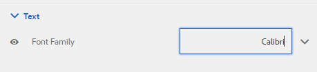

# Creación y uso de temáticas {#creating-and-using-themes}

## Introducción {#introduction}

Puede crear y aplicar temáticas para diseñar un formulario adaptable o una comunicación interactiva. Un tema contiene detalles de estilo para los componentes y paneles. Los estilos incluyen propiedades como colores de fondo, colores de estado, transparencia, alineación y tamaño. Al aplicar un tema, el estilo especificado se refleja en los componentes correspondientes. Los temas se gestionan de forma independiente sin hacer referencia a un formulario adaptable o a una comunicación interactiva.

Puede hacer lo siguiente:

* Crear un tema
* Editar y copiar un tema existente
* Descargar y cargar un tema existente en el servidor de AEM Forms
* Administrar dependencias para un tema

## Creación, descarga o carga de un tema {#creating-downloading-or-uploading-a-theme}

Con AEM Forms, puede crear, descargar o cargar temáticas. Se crea un tema como otros recursos, como formularios, documentos y letras. El tema se guarda como una entidad independiente, con metapropiedades como los formularios. El hecho de que las temáticas sean una entidad independiente permite su reutilización en varios formularios adaptables y comunicaciones interactivas. También puede mover un tema a otra instancia de AEM Forms y reutilizarlo.

### Creación de un tema {#creating-a-theme}

Realice los siguientes pasos para crear un tema:

1. Haga clic en **Adobe Experience Manager**, haga clic en **Forms** y, a continuación, haga clic en **Temáticas**.

1. En la página Temáticas, haga clic en **Crear > Tema**.
Se inicia un asistente para crear un tema.

1. En la ficha Básico del asistente Crear tema, proporcione **Título** y **Nombre** del tema. Son campos obligatorios.

1. En la ficha Avanzado, se obtienen dos campos:

   * **Ubicación** de la biblioteca de clientes: Ubicación en el repositorio que almacena los clientlibs para el tema.

   * **Categoría** de Clientlib: Proporciona un campo de texto para introducir el nombre de categoría clientlib para el tema.

1. Haga clic en **Crear** y, a continuación, haga clic en **Editar** para abrir el tema en el Editor de temas, o haga clic en **Listo** para volver a la página temáticas.

### Descarga de un tema {#downloading-a-theme}

Puede exportar temáticas como archivo zip y utilizarlas en otros proyectos o instancias de AEM. Para descargar un tema:

1. Haga clic en **Adobe Experience Manager**, haga clic en **Forms** y, a continuación, haga clic en **Temáticas**.

1. En la página Temáticas, **seleccione** un tema y haga clic en **Descargar**. Se muestra un cuadro de diálogo con los detalles del tema.

1. Haga clic en **Descargar**. El tema se descarga como archivo zip.

>[!NOTE]
>
>Si descarga un tema que tiene asociado un formulario adaptable y el formulario adaptable asociado se basa en una plantilla personalizada, descargue también la plantilla personalizada. Al cargar el tema descargado y el formulario adaptable en un servidor de AEM Forms, cargue también la plantilla personalizada relacionada.

### Carga de un tema {#uploading-a-theme}

Puede utilizar temáticas creadas con ajustes preestablecidos de estilo en el proyecto. Puede importar los paquetes de temas que otros creen cargándolos en el proyecto.

Para cargar un tema:

1. Haga clic en **Adobe Experience Manager**, haga clic en **Forms** y, a continuación, haga clic en **Temáticas**.

1. En la página Temáticas, haga clic en **Crear > Carga de archivo**.
1. En el mensaje de carga de archivos, busque y seleccione un paquete de temas en el equipo y haga clic en **Cargar**.
El tema cargado está disponible en la página temáticas.

## Metadatos de un tema {#metadata-of-a-theme}

Lista de metapropiedades de un tema (se encuentra en la página de propiedades de un tema).

<table>
 <tbody>
  <tr>
   <th>
<strong>ID</strong>
 
 
 </th>
   <th><strong>Nombre</strong></th>
   <th><strong>Se puede editar</strong></th>
   <th><strong>Descripción de la propiedad</strong></th>
  </tr>
  <tr>
   <td>1.</td>
   <td>Título</td>
   <td>Sí</td>
   <td>Nombre para mostrar del tema.</td>
  </tr>
  <tr>
   <td>2.</td>
   <td>Descripción</td>
   <td>Sí</td>
   <td>Descripción del tema.</td>
  </tr>
  <tr>
   <td>3.</td>
   <td>Tipo</td>
   <td>No</td>
   <td>
    <ul>
     <li>Tipo de recurso.</li>
     <li>El valor es siempre tema.</li>
    </ul> </td>
  </tr>
  <tr>
   <td>4.</td>
   <td>Creado</td>
   <td>No</td>
   <td>Fecha de creación del tema</td>
  </tr>
  <tr>
   <td>5.</td>
   <td>Nombre del autor</td>
   <td>Sí</td>
   <td>Autor del tema. Se calcula en el momento de la creación del tema.</td>
  </tr>
  <tr>
   <td>6.</td>
   <td>Fecha de la última modificación</td>
   <td>No</td>
   <td>Fecha en la que se modificó el tema por última vez.</td>
  </tr>
  <tr>
   <td>7.</td>
   <td>Estado</td>
   <td>No</td>
   <td>Estado del tema (Modificado/Publicado).</td>
  </tr>
  <tr>
   <td>8.</td>
   <td>Publicar a tiempo</td>
   <td>Sí</td>
   <td>Hora de publicar automáticamente el tema.</td>
  </tr>
  <tr>
   <td>9.</td>
   <td>Tiempo de inactividad de publicación</td>
   <td>Sí</td>
   <td>Hora de cancelar la publicación del tema automáticamente.</td>
  </tr>
  <tr>
   <td>10.</td>
   <td>Etiquetas</td>
   <td>Sí</td>
   <td>Etiqueta adjunta al tema de identificación utilizada para mejorar la búsqueda.</td>
  </tr>
  <tr>
   <td>11.</td>
   <td>Referencias</td>
   <td>Vínculos</td>
   <td>
    <ul>
     <li>Contiene la sección 'Referido por'. Lista los formularios que utilizan el tema.</li>
     <li>Dado que el tema no hace referencia a ningún otro recurso, no hay ninguna sección "Referencias".</li>
    </ul> </td>
  </tr>
  <tr>
   <td>12.</td>
   <td>Ubicación de biblioteca de cliente</td>
   <td>Sí</td>
   <td>
    <ul>
     <li>Ruta de repositorio definida por el usuario dentro de '/etc' donde se almacenan los clientlibs correspondientes a este tema.</li>
     <li>Valor predeterminado: '/etc/clientlibs/fd/temáticas + ruta relativa del recurso del tema.</li>
     <li>Si la ubicación no existe, la jerarquía de carpetas se genera automáticamente.</li>
     <li>Cuando se cambia este valor, la estructura de nodos clientlib se mueve a la nueva ubicación especificada.  <em><strong>Nota:</strong> Si cambia la ubicación predeterminada de clientlib, en el repositorio CRXDE asigne  <code>crx:replicate, rep:write, rep:glob:*, rep:itemNames:: js.txt, jcr:read </code>a  <code>forms-users</code> y  <code>crx:replicate</code>,  <code>jcr:read </code>a  <code>fd-service</code> la nueva ubicación. También adjunte otra ACL agregando <code>deny jcr:addChildNodes</code> para <code>forms-user</code></em></li>
    </ul> </td>
  </tr>
  <tr>
   <td>13.</td>
   <td>Nombre de categoría de biblioteca de cliente</td>
   <td>Sí</td>
   <td>
    <ul>
     <li>Nombre de categoría clientlib definido por el usuario para este tema.</li>
     <li>Se muestra un error si el nombre ya está siendo utilizado por otro tema existente.</li>
     <li>Valor predeterminado: se calcula mediante la ubicación del tema.</li>
     <li>Cuando se cambia este valor, el nombre de la categoría se actualiza en el nodo clientlib correspondiente. No es necesario actualizar el nombre de la Categoría de Clientlib en los archivos jsp porque el nombre de la categoría clientlib se utiliza como referencia.</li>
    </ul> </td>
  </tr>
 </tbody>
</table>

## Acerca del Editor de temas {#about-the-theme-editor}

AEM Forms se envía con el Editor de temas. Es una interfaz fácil de usar para empresas y diseñadores web y desarrolladores que proporciona las funcionalidades necesarias para especificar fácilmente el estilo de varios elementos de comunicación interactivos y formularios adaptables. Cuando se crea un tema, se almacena como una entidad independiente, como formularios, comunicaciones interactivas, letras, fragmentos de documento y diccionarios de datos.

El Editor de temas permite personalizar estilos de los componentes con estilo en un tema. Puede personalizar el aspecto de un formulario o una comunicación interactiva en un dispositivo.

El Editor de temas se divide en dos paneles:

* **Lienzo** : aparece en el lado derecho. Muestra un formulario adaptable de muestra o una comunicación interactiva en la que todos los cambios de estilo se reflejan instantáneamente. También puede seleccionar objetos directamente desde el lienzo para buscar los estilos asociados a ellos y editar estos estilos. Una regla de resolución de dispositivo en la parte superior gobierna el lienzo. Al seleccionar un punto de interrupción de resolución en la regla, se muestra la previsualización del formulario de ejemplo o la comunicación interactiva para la resolución correspondiente. El lienzo se analiza en detalle [más adelante](../../forms/using/themes.md#using-canvas).

* **Barra lateral**: aparece en el lado izquierdo. Tiene los siguientes elementos:

   * **Selector:** muestra el componente seleccionado para el estilo y sus propiedades de estilo. El selector representa todos los componentes de un tipo. Si selecciona un componente de cuadro de texto en un tema para aplicar estilo, todos los cuadros de texto del formulario o la comunicación interactiva heredarán el estilo. Los selectores permiten seleccionar un componente genérico o un componente específico para el estilo. Por ejemplo, un componente de campo es un componente genérico y un cuadro de texto es un componente específico.

      **Componente genérico de estilo:**
Un campo puede ser un campo de cuadro numérico, como edad, o un campo de cuadro de texto, como dirección.
Al aplicar estilo a un campo, se aplican estilo a todos los campos, como edad, nombre y dirección.

      **Estilo de componente** específico: Un componente específico afecta a los objetos de la categoría específica. Al aplicar estilo al componente de cuadro numérico en el tema, solo el objeto de cuadro numérico heredará el estilo.

      Por ejemplo, un campo de cuadro de texto como la dirección tiene una longitud mayor y un campo de cuadro numérico como la edad tiene una longitud menor. Puede seleccionar un campo de cuadro numérico, reducir su longitud y aplicarlo al formulario. El ancho de todos los campos numéricos de cuadro se reduce en el formulario.

      Al personalizar todos los componentes de campo con un color de fondo específico, todos los campos, como edad, nombre y dirección, heredan el color de fondo. Al seleccionar un cuadro numérico, como la edad, y reducir su anchura, se reduce el ancho de todos los cuadros numéricos, como la edad, el número de personas de una familia. No se cambia la anchura de los cuadros de texto.

   * **Estado:** permite personalizar estilos de un objeto en un estado específico. Por ejemplo, puede especificar el aspecto que tendrá un objeto cuando esté en estado predeterminado, de enfoque, deshabilitado, de desplazamiento o de error.
   * **Categorías de propiedades:las propiedades** de estilo se dividen en varias categorías. Por ejemplo, Dimension y posición, Texto, Fondo, Borde y Efectos. En cada categoría, se proporciona información sobre el estilo. Por ejemplo, en Fondo, puede proporcionar Color de fondo e Imagen y degradado.

   * **Avanzado:** permite agregar CSS personalizada a un objeto, que anula las propiedades que los controles visuales definen si hay una superposición.

   * **CSS** de vista: Permite la vista de CSS del componente seleccionado
   Además, en la barra lateral, en la parte inferior hay una flecha. Al hacer clic en la flecha, se obtienen dos opciones más: **Simular éxito** y **Simular error.** Estas opciones, junto con las opciones descritas anteriormente, se analizan en detalle  [a continuación](../../forms/using/themes.md#using-rail).

 **A.** Sidebar  **B.** Canvas

### Componentes de estilo {#styling-components}

Puede utilizar un tema en varios formularios adaptables y comunicaciones interactivas, lo que importa el formato de componente que haya especificado en el tema. Puede aplicar estilo a varios componentes, como títulos, descripciones, paneles, campos, iconos y cuadros de texto. Utilice widgets para configurar las propiedades de los componentes en un tema. No se requiere un conocimiento previo de CSS o MENOS, pero se desea, aunque la sección Anulaciones de CSS permite escribir código CSS o proporcionar selectores personalizados. La sección Anulaciones de CSS aparece al seleccionar un componente en la barra lateral.

Opciones en la barra lateral que permiten seleccionar y aplicar estilo a diferentes componentes.

Al hacer clic en el botón de edición de un componente en la barra lateral, se selecciona el componente en Lienzo y se le permite aplicar estilo al componente mediante las opciones de la barra lateral.

Algunos componentes, como cuadro de texto, cuadro numérico, botón de radio y casilla de verificación, se clasifican en componentes genéricos como Campo. Por ejemplo, desea personalizar el estilo de los botones de radio. Para seleccionar botones de radio para estilo, seleccione **Campo > Utilidad > Botón de radio**.

Haga clic en **EXPANDIR TODO** en la barra lateral para la vista, seleccione y aplique estilo a los componentes clasificados que no están visibles en primer plano.

### Diseños de paneles de estilo {#styling-panel-layouts-br}

Las temáticas de AEM Forms admiten el estilo de los elementos en la presentación de paneles en los formularios y las comunicaciones interactivas. Se admite el estilo de los elementos en diseños y diseños personalizados integrados.

Los paneles integrados incluyen:

* Fichas izquierda
* Fichas arriba
* Acordeón
* Interactiva
* Asistente
* Diseño móvil

   * Títulos del panel en el encabezado
   * Sin títulos de panel en el encabezado

Los selectores varían para cada diseño.
El diseño de diseños personalizados desde el Editor de temas implica:

* Definición de los componentes de un diseño que se puede diseñar, y de los selectores CSS para identificar de forma exclusiva estos componentes
* Definición de las propiedades CSS que se pueden aplicar a estos componentes
* Defina el estilo de estos componentes de forma interactiva desde la interfaz de usuario

### Diferentes estilos para diferentes tamaños de pantalla {#different-styles-for-different-screen-sizes-br}

Los diseños de escritorio y móviles pueden tener estilos ligeramente o totalmente diferentes. En el caso de los dispositivos móviles, la tablet y el teléfono comparten diseños similares, excepto en el caso de los tamaños de los componentes.

Utilice los puntos de interrupción del Editor de temas para definir estilos alternativos para diferentes tamaños de pantalla. Puede seleccionar un dispositivo base o una resolución en la que inicio crear el tema, y las variaciones de estilo de otras resoluciones se generan automáticamente. Puede modificar explícitamente el estilo de todas las resoluciones.

>[!NOTE]
>
>El tema se crea primero mediante un formulario o una comunicación interactiva y, a continuación, se aplica en diferentes formularios o comunicaciones interactivas. Los puntos de interrupción utilizados en la creación del tema pueden ser diferentes del formulario o la comunicación interactiva en la que se aplica el tema. Las consultas de medios CSS se basan en el formulario o la comunicación interactiva que se utiliza en la creación del tema, y no en el formulario o la comunicación interactiva en la que se aplica el tema.

### Cambio de contexto de propiedades de estilo en la barra lateral al seleccionar objetos {#styling-properties-context-changes-in-sidebar-on-selecting-objects}

Al seleccionar un componente en el Lienzo, sus propiedades de estilo se muestran en la barra lateral. Seleccione el tipo de objeto y su estado y, a continuación, proporcione su estilo.

### Estilos usados recientemente en el Editor de temas {#recently-used-styles-in-theme-editor}

El editor de temas almacena en caché hasta 10 estilos aplicados a un componente. Puede utilizar los estilos en caché con otros componentes de un tema. Los estilos usados recientemente están disponibles justo debajo del componente seleccionado en la barra lateral como un cuadro de lista. Inicialmente, la lista de estilos utilizada recientemente está vacía.

Al aplicar estilo a un componente, los estilos se almacenan en caché y se enumeran en el cuadro lista. En este ejemplo, el estilo de la etiqueta del cuadro de texto cambia el tamaño y el color de la fuente. Puede seguir pasos similares para elegir una imagen o cambiar los colores para aplicar estilo a un componente. Observe cómo se almacena en caché el estilo y se muestra en el cuadro lista cuando se cambia el estilo de la etiqueta de campo.

En este ejemplo, se cambia el estilo de la etiqueta de campo y, cuando se selecciona Descripción del panel interactivo para el estilo, se agrega una entrada de lista en la biblioteca de recursos. La entrada de la biblioteca de recursos se puede utilizar para cambiar el estilo de Descripción del panel interactivo.

Cuando se agrega un estilo a la biblioteca de recursos, está disponible para otras temáticas y en el modo [de estilo](../../forms/using/inline-style-adaptive-forms.md) del editor de formularios o la interfaz de usuario del editor de comunicaciones interactivo. Del mismo modo, cuando se utiliza el modo de estilo del editor de formularios o la interfaz de usuario del editor de comunicaciones interactivo para aplicar estilo a un componente, el estilo se almacena en caché y está disponible en temáticas.

El botón más de la biblioteca de recursos le permite guardar de forma permanente el estilo con el nombre que proporcione. El botón más guarda el estilo aunque no haga clic en el botón Guardar de la barra lateral para aplicarlo a un componente. El botón más para guardar un estilo para utilizarlo posteriormente no está disponible en el modo de estilo.

Cuando se proporciona un nombre personalizado para un estilo, este se asocia a un tema y ya no está disponible para otras temáticas. Para eliminar un estilo guardado:

1. En la barra de herramientas CANVAS, haga clic en **Opciones de tema**  > **Administrar estilos**.
1. En el cuadro de diálogo Administrar estilos, seleccione un estilo guardado y haga clic en **Eliminar**.

   

### Previsualización en vivo, guardar y descartar cambios {#live-preview-save-and-discard-changes}

Las modificaciones realizadas en el estilo se reflejan instantáneamente en el formulario o en la comunicación interactiva cargada en el Lienzo. La previsualización en directo permite definir y ver de forma interactiva el impacto del estilo. Cuando se cambia el estilo de un componente, el botón **Listo** se activa en la barra lateral. Para conservar los cambios, utilice el botón **Listo**.

>[!NOTE]
>
>Cuando se introduce un carácter no válido en un campo, el color del límite del campo cambia a rojo y aparece un mensaje de error en la esquina superior izquierda de la pantalla. Por ejemplo, si introduce alfabetos en un cuadro de texto que acepta caracteres numéricos como entradas, el color del límite del cuadro de entrada cambiará a rojo. No puede guardar un tema de este tipo sin resolver el error mostrado en la parte superior.

### Tema con otro formulario adaptable o comunicación interactiva {#theme-with-another-adaptive-form-or-interactive-communication}

Cuando se crea un tema, se crea con un formulario que se envía con el Editor de temas. Se proporciona estilo para los componentes de este formulario. En lugar del formulario enviado con el Editor de temas, puede seleccionar un formulario o comunicación interactiva de su elección para proporcionar estilo y previsualización de los resultados.

Para reemplazar el formulario actual o la comunicación interactiva en el Lienzo del editor de temas:

1. En el panel EDITOR DE TEMAS, haga clic en **Opciones de tema**  > **Configurar**.

1. En la ficha General, busque y seleccione un formulario o una comunicación interactiva para el campo **Formulario/Documento adaptable**.

### Rehacer/Deshacer {#redo-undo}

Puede deshacer o rehacer los cambios no deseados que se producen accidentalmente. Utilice los botones Rehacer/Deshacer del Lienzo.

Botones Deshacer/Rehacer en Lienzo

Los botones Rehacer/Deshacer aparecen al aplicar estilo a un componente en el Editor de temas.

## Uso del Editor de temas {#using-the-theme-editor}

El Editor de temas permite editar un tema que haya creado o cargado. Vaya a **Forms &amp; Documentos > Temáticas**, seleccione un tema y ábralo. El tema se abre en el Editor de temas.

Como se ha explicado anteriormente, el Editor de temas tiene dos paneles: Barra lateral y Lienzo.

Personalización del estilo de estado de éxito del componente Widget de cuadro de texto en el Editor de temas. El componente está seleccionado en Lienzo y su estado está seleccionado en la barra lateral. Las opciones de estilo disponibles en la barra lateral se utilizan para personalizar el aspecto de un componente.

### Uso de Lienzo {#using-canvas}

El tema se crea mediante el formulario predeterminado o mediante un formulario o una comunicación interactiva de su elección. El lienzo muestra la previsualización del formulario o la comunicación interactiva utilizada para crear el tema con las personalizaciones especificadas en el tema. La regla que se encuentra encima del formulario se utiliza para determinar la presentación en función del tamaño de visualización del dispositivo.

En la barra de herramientas Lienzo, verá:

* **Alternar** : Permite mostrar u ocultar la barra lateral.
* **Opciones de**  de tema: Proporciona tres opciones

   * Configurar: Proporciona opciones para seleccionar el formulario de previsualización o la comunicación interactiva, clientlib base y la configuración de Adobe Fonts.
   * CSS de tema de vista: Genera CSS para el tema seleccionado.
   * Administrar estilos: Proporciona opciones para administrar estilos de texto e imagen
   * Ayuda: Ejecuta una visita guiada de imagen del Editor de temas.

* **** : Emula el aspecto del tema para diferentes tamaños de pantalla. Un tamaño de visualización se trata como un punto de interrupción en el emulador. Puede seleccionar un punto de interrupción y especificar un estilo para él. Por ejemplo, Escritorio y Tablet son dos puntos de interrupción. Puede especificar diferentes estilos para cada punto de interrupción.

Cuando se selecciona un componente en el Lienzo, se ve la barra de herramientas de componentes en la parte superior. La barra de herramientas de componentes permite seleccionar componentes o cambiar a componentes genéricos. Por ejemplo, se selecciona un cuadro de texto numérico en un panel. Se ven las siguientes opciones en la barra de herramientas de componentes:

* **Utilidad** de cuadro numérico: Permite seleccionar el componente para personalizar su aspecto en la barra lateral.
* **Utilidad** de campo: Permite seleccionar el componente genérico para aplicar estilo. En este ejemplo, todos los componentes de entrada de texto (cuadro de texto/cuadro numérico/paso numérico/entrada de fecha) están seleccionados para el estilo.

*  de campo: Permite cambiar a un componente genérico para aplicar estilo. Si selecciona un cuadro numérico y toca este icono, se selecciona el componente de campo. Si selecciona un componente de campo y toca este icono, se selecciona el panel. Si sigue tocando este icono para seleccionarlo, acabará seleccionando el diseño para el estilo.

>[!NOTE]
>
>Las opciones disponibles en la barra de herramientas de componentes varían según el componente seleccionado.

Barra de herramientas de componentes del cuadro numérico del Lienzo

### Uso de la barra lateral {#using-rail}

La barra lateral del editor de temas ofrece opciones para personalizar estilos para los componentes de un tema y utilizar selectores. Los selectores permiten seleccionar un grupo de componentes o componentes individuales, y se pueden buscar selectores en la barra lateral. Puede escribir selectores para componentes personalizados.

Cuando se selecciona un componente del Lienzo o los selectores en la barra lateral, la barra lateral muestra todas las opciones que le permiten personalizar los estilos.
A continuación se muestran las opciones que se ven en la barra lateral al seleccionar un componente:

* Estado
* Hoja de propiedades
* Simular error/éxito

#### Estado {#state}

Un estado es un indicador de la interacción del usuario con un componente. Por ejemplo, cuando un usuario introduce datos de error en un cuadro de texto, el estado del cuadro de texto cambia a un estado de error. El editor de temas permite especificar el estilo de un estado concreto.

Las opciones para personalizar estilos de estado varían para los diferentes componentes.

#### Hoja de propiedades {#property-sheet}

<table>
 <tbody>
  <tr>
   <td><strong>Propiedad</strong></td>
   <td><strong>Uso</strong></td>
  </tr>
  <tr>
   <td>
Dimensiones y posición
 </td>
   <td>
Permite aplicar estilo a la alineación, el tamaño, la colocación y la colocación de los componentes en el tema. 
 
Las opciones son configuración de visualización, relleno, margen, anchura, altura e índice Z.
 
También puede utilizar el modo Diseño para definir la anchura de los componentes con una sencilla interfaz de arrastrar y soltar. Para obtener más información, consulte <a href="../../forms/using/resize-using-layout-mode.md">Uso del modo Diseño para cambiar el tamaño de los componentes</a>.
 </td>
  </tr>
  <tr>
   <td>
Texto
 </td>
   <td>
Permite personalizar los estilos de texto en el componente del tema.
 
Por ejemplo, desea cambiar el aspecto del texto introducido en el cuadro de texto.
 
Las opciones son familia de fuentes, peso, color, tamaño, altura de línea, alineación de texto, interlineado de letras, sangría de texto, subrayado, cursiva, transformación de texto, alineación vertical, línea de base y dirección. 
 </td>
  </tr>
  <tr>
   <td>
Fondo 
 </td>
   <td>
Permite rellenar el fondo del componente con una imagen o un color. 
 </td>
  </tr>
  <tr>
   <td>
Borde
 </td>
   <td>
Permite elegir el aspecto del borde del componente. Por ejemplo, desea que el cuadro de texto tenga un borde grueso y rojo profundo con una línea de puntos. 
 
Las opciones son ancho, estilo, radio y color del borde.
 </td>
  </tr>
  <tr>
   <td>
Efectos
 </td>
   <td>
Permite agregar efectos especiales a los componentes, como opacidad, modo de mezcla y sombras. 
 </td>
  </tr>
  <tr>
   <td>
Avanzado 
 </td>
   <td>
Permite agregar:

    <ul>
     <li>Propiedades para los pseudoelementos <code>::before</code> y <code>::after</code> para agregar contenido después o antes del contenido predeterminado en el selector y aplicarle estilo.  Consulte  <a href="https://www.w3schools.com/css/css_pseudo_elements.asp" target="_blank">Pseudoelementos</a> CSS.</li>
     <li>Código CSS personalizado en línea a un componente y escribir selectores personalizados. </li>
    </ul> 
Cuando se agrega un código CSS personalizado, se anula la personalización que se ha agregado con las opciones de la barra lateral. 
 </td>
  </tr>
 </tbody>
</table>

#### Simular error/éxito {#simulate-error-success}

Las opciones Simular error y Éxito están disponibles en la parte inferior de la barra lateral. Puede verlos con una flecha de mostrar u ocultar visible en la parte inferior de la barra lateral. Con el Editor de temas, puede aplicar estilo a varios estados de un componente.

Por ejemplo, se agrega un campo numérico al formulario y se especifica su estilo en el editor de temas. Cuando un usuario escribe un valor alfanumérico en el campo, desea que cambie el color de fondo del cuadro de texto. Seleccione el campo numérico en el tema y utilice la opción de estado en la barra lateral. Seleccione el estado Error en la barra lateral y cambie el color de fondo a rojo. Para previsualización del comportamiento, puede utilizar la opción Simular error disponible en la barra lateral. Las opciones Simular error y Éxito se describen en detalle a continuación:

* **Simular el éxito**: Permite ver el aspecto de un componente si se especifica su estilo para el estado de éxito. Por ejemplo, en un formulario, los clientes definen la contraseña. Los usuarios pueden establecer la contraseña según las directrices que proporcione. Cuando un usuario escribe una contraseña siguiendo todas las directrices que proporcione, el cuadro de texto cambia a verde. Cuando el cuadro de texto se vuelve verde, está en estado de éxito. Puede especificar el estilo de un componente en estado de éxito y simular su aspecto mediante la opción Simular éxito.

* **Error** de simulación: Permite ver el aspecto de un componente si se especifica su estilo para el estado de error. Por ejemplo, en un formulario, los clientes definen la contraseña. Los usuarios pueden establecer la contraseña según las directrices que proporcione. Cuando un usuario escribe una contraseña que no sigue todas las directrices proporcionadas, el cuadro de texto se vuelve rojo. Cuando el cuadro de texto se vuelve rojo, se encuentra en estado de error. Puede especificar el estilo de un componente en estado de error y simular su aspecto mediante la opción Simular error.

### Estilo de un componente {#styling-a-component}

Por ejemplo, en el formulario, tiene dos tipos de cuadros de texto: una que solo acepta valores numéricos y otra que acepta valores alfanuméricos. Puede personalizar el estilo del cuadro de texto que solo acepta valores numéricos (un cuadro numérico).

Siga estos pasos para personalizar el estilo de un componente concreto (un cuadro numérico en este ejemplo):

1. En el Editor de temas, seleccione el cuadro numérico en el Lienzo.
1. Al seleccionar el cuadro numérico, puede ver la barra de herramientas de componentes con tres opciones:

   * **Widget del cuadro numérico**
   * **Campo** 

1. Seleccione **Utilidad de cuadro numérico**.
1. El título de la barra lateral cambia a Utilidad de cuadro numérico y muestra opciones para personalizar su aspecto.
Utilice la opción **Dimension y posición** en la barra lateral para personalizar el tamaño del componente. Asegúrese de que el estado sea **Predeterminado**.

En lugar de seleccionar **Utilidad de cuadro numérico**, seleccione **Utilidad de campo** en la barra de herramientas de componentes y realice los pasos anteriores. Cuando selecciona dimensiones para la opción **Utilidad de campo**, todos los cuadros de texto excepto el cuadro numérico tienen el mismo tamaño.

### Aplicar estilo a los campos de un estado determinado {#styling-fields-given-state}

Con la barra de herramientas de componentes, también puede especificar el estilo de los componentes para sus distintos estados. Por ejemplo, si un componente está deshabilitado, entonces está en estado deshabilitado. Los estados más utilizados de un componente al que se puede aplicar estilo en el editor de temas son: Predeterminado, Enfoque, Desactivado, Error, Éxito y Pasar el ratón por encima. Puede seleccionar un componente en el lienzo y utilizar la opción Estado de la barra lateral para personalizar su aspecto.

Siga estos pasos para personalizar el estilo de un componente en un estado específico:

1. Seleccione un componente en el Lienzo y seleccione la opción adecuada en la barra de herramientas de componentes.
La barra lateral muestra opciones para personalizar el estilo del componente.
1. Seleccione un estado en la barra lateral. Por ejemplo, Estado de error.
1. Utilice opciones como **Borde, Fondo** en la barra lateral para personalizar el aspecto del componente.
1. Utilice la opción **Simular error** en la parte inferior de la barra lateral para ver el aspecto del estilo en la edición.

Al personalizar el estilo de un componente después de especificar su estado, la personalización aparece para el componente solo para el estado especificado. Por ejemplo, si personaliza el estilo del componente cuando se selecciona el estado al pasar el ratón por encima. La personalización aparece para el componente cuando mueve el puntero sobre el componente en el formulario procesado o en la comunicación interactiva al que se aplica el tema.

Para simular el comportamiento de estados que no sean errores y éxitos, utilice el modo de Previsualización. Para utilizar el modo de Previsualización, haga clic en **Previsualización** en la barra de herramientas de la página.

### Diseños de estilo para pantallas más pequeñas {#styling-layouts-for-smaller-displays}

Utilice la regla en Lienzo para seleccionar puntos de interrupción para dispositivos con pantallas más pequeñas. Haga clic en el emulador  en Lienzo a la regla de vista y puntos de interrupción. Los puntos de interrupción permiten la previsualización de un formulario o comunicación interactiva para tamaños de pantalla pertenecientes a diferentes dispositivos, como teléfonos y tablets. El Editor de temas admite varios tamaños de visualización.

Para aplicar estilo a los componentes de diferentes puntos de interrupción:

1. En el Lienzo, seleccione un punto de interrupción encima de la regla.
Un punto de interrupción representa un dispositivo móvil y su tamaño de visualización.
1. Utilice la barra lateral para personalizar el estilo de los componentes de formulario o comunicación interactiva en el tema para el tamaño de visualización seleccionado.
1. Asegúrese de guardar la personalización.

Puede aplicar estilo a los componentes de formulario o comunicación interactiva para varios dispositivos. Los componentes de formulario y comunicación interactiva para equipos de escritorio y dispositivos móviles pueden tener estilos totalmente diferentes.

### Uso de fuentes web en un tema {#using-web-fonts-in-a-theme}

Ahora puede utilizar fuentes disponibles en un servicio Web en un formulario adaptable o en una comunicación interactiva. El servicio de fuentes web de Adobe, [Adobe Fonts](https://fonts.adobe.com/), predeterminado, está disponible como configuración. Para usar Adobe Fonts, cree un kit, agregue fuentes y obtenga el ID del kit de [Adobe Fonts](https://fonts.adobe.com/).

Siga estos pasos para configurar Adobe Fonts en AEM:

1. En la instancia de autor, haga clic en Adobe Experience Manager > Herramientas  > Implementación > Cloud Services.
1. En la página **Cloud Services**, navegue hasta la opción **Adobe Fonts** y ábrala. Abra la carpeta de configuración y haga clic en **Crear**.
1. En el cuadro de diálogo **Crear configuración**, especifique un título para la configuración y haga clic en **Crear**.

   Se le redirige a la página de configuración.

1. En el cuadro de diálogo Editar componente que aparece, proporcione el ID del kit y haga clic en **Aceptar**.

Realice los siguientes pasos para configurar un tema para utilizar la configuración de Adobe Fonts:

1. En la instancia de autor, abra un tema en el editor de temas.
1. En el editor de temas, vaya a **Opciones de tema**  > **Configurar**.
1. En el campo **Configuración de Adobe Fonts**, seleccione un kit y haga clic en **Guardar**.

   Ahora puede ver que las fuentes se agregan en la propiedad font-family del tema.

### Lista y selección de fuentes en el editor de temas {#listing-and-selecting-fonts-in-theme-editor}

Puede utilizar el servicio de configuración de temas para agregar más fuentes al editor de temas. Siga estos pasos para agregar fuentes:

1. Inicie sesión en AEM consola web con privilegios administrativos. La dirección URL de la consola web de AEM es `https://'[server]:[port]'/system/console/configMgr`.
1. Abra **Servicio de configuración del tema del formulario adaptable**.

   

1. Haga clic en +, especifique el nombre de la fuente y haga clic en **Guardar**. La fuente se agrega y está disponible en el editor de temas.

#### Selección de fuentes en el editor de temas {#selecting-fonts-in-theme-editor}

Puede utilizar el botón + para añadir una fuente. Cuando agrega una fuente, aparece en la barra lateral.

Además de la opción de configuración del tema, también puede agregar la fuente desde el editor del tema. Escriba la fuente que desee utilizar en el campo de familia de fuentes situado debajo de la barra lateral y pulse la tecla de retorno del teclado.

Al seleccionar una fuente, ésta se agrega bajo la lista de familia de fuentes. Puede utilizar la opción Máscara del editor de temas para deshabilitar o habilitar las fuentes de la lista.

Puede ver el cambio de fuente del componente.

El campo Familia de fuentes admite varias fuentes. Al escribir una fuente, el navegador la busca y la aplica al componente seleccionado. Si el navegador no puede encontrar una fuente, busca una que esté junto a ella en la familia. Puede tener inicios al escribir la fuente específica que está buscando. Si no encuentra la fuente que desea utilizar, puede escribir una fuente genérica en la familia y utilizarla.

#### Estilos de máscara aplicados en el editor de temas {#mask-styles-applied-in-theme-editor}

Puede enmascarar estilos aplicados en un tema. En la barra lateral del editor de temas, puede utilizar el icono para deshabilitar un estilo aplicado. Por ejemplo, si cambiares dimensión de un componente en un formulario o una comunicación interactiva, puede utilizar el botón de máscara de la izquierda de una propiedad para desactivarlo. Al guardar un tema, se conservan las opciones de máscara seleccionadas.

El ejemplo siguiente muestra estilos enmascarados y sin máscara en un tema.

## Aplicación de un tema a un formulario o comunicación interactiva {#applying-a-theme-to-a-form-or-interactive-communication-br}

Para aplicar un tema a un formulario adaptable:

1. Abra el formulario en modo de edición. Para abrir un formulario en modo de edición, seleccione un formulario y haga clic en **Abrir**.
1. En el modo de edición, seleccione un componente, luego haga clic en  > **Formulario adaptable** y, a continuación, haga clic en .

   Puede editar las propiedades del formulario en la barra lateral.

1. En la barra lateral, haga clic en **Estilo**.
1. Seleccione el tema en la lista desplegable **Tema del formulario adaptable** y haga clic en **Listo** .

Para aplicar un tema a una comunicación interactiva:

1. Abra la comunicación interactiva en modo de edición. Para abrir una comunicación interactiva en modo de edición, seleccione un formulario y haga clic en **Abrir**.
1. En el modo de edición, seleccione un componente, haga clic en  >**Contenedor** y, a continuación, haga clic en .

   Puede editar las propiedades del formulario en la barra lateral.

1. En la barra lateral, en **Básico**, seleccione el tema en la lista desplegable **Tema** y haga clic en **Listo** 

### Cambiar el tema de un formulario en tiempo de ejecución {#change-theme-of-a-form-at-runtime}

Un tema estilos diferentes componentes de un formulario. Puede utilizar la propiedad `themeOverride` para cambiar dinámicamente el tema de un formulario. Una dirección URL típica de un formulario es:

`https://<server>:<port>/content/forms/af/test.html`

Puede utilizar el parámetro topicOverride para aplicar un tema en tiempo de ejecución.

`https://<server>:<port>/content/forms/af/test.html?themeOverride=/content/dam/formsanddocuments-themes/simpleEnrollmentTheme`

La opción `themeOverride` le permite proporcionar una ruta a un tema. Cambia el tema del formulario y lo actualiza con estilos actualizados.

## Obtención de un aspecto específico mediante Temáticas {#specific-af-appearance}

Con AEM Forms, junto con el tema predeterminado del lienzo, hay muchas otras temáticas. Si desea diseñar el formulario o la comunicación interactiva con otras temáticas, junto con cambios adicionales, copie el tema de la carpeta Biblioteca de temas. Pegue las temáticas copiadas fuera de la carpeta Biblioteca de temas y edite el tema copiado según los cambios que desee.

Para copiar un tema, realice los siguientes pasos:

1. En la instancia de creación, vaya a **Adobe Experience Manager > Forms > Temáticas**.
1. Abra la carpeta Biblioteca de temas.
1. En la carpeta Biblioteca de temas, coloque el puntero sobre el tema predeterminado correspondiente y toque **Copiar**.
1. Pegue el tema copiado fuera de la carpeta Biblioteca de temas.
1. Personalice el tema copiado.

Después de personalizar el tema, aplíquelo a su formulario o comunicación interactiva.

>[!NOTE]
>
>No modifique las temáticas disponibles en la carpeta Biblioteca de temas. Esta carpeta contiene temáticas del sistema. Cualquier cambio realizado en estas temáticas se sobrescribe al instalar una versión más reciente o una corrección urgente de AEM Forms.

## Impacto en otros casos de uso de formularios adaptables {#impact-on-other-adaptive-form-use-cases}

* **Publicar/cancelar la publicación de un formulario:** Al publicar un formulario, el tema aplicado también se publica (si aún no se ha publicado)
* **Importar/Exportar un formulario:** Al importar o exportar un formulario, su tema asociado también se importa o exporta automáticamente.
* **Referencias de un formulario:** la sección Referencias de las referencias de formulario contiene una entrada adicional para el tema.
* **Hora de la última modificación de un formulario:** Se actualiza cuando se cambia el tema asociado.
* **Prueba A/B:** puede aplicar un tema diferente a dos versiones del formulario en la prueba A/B. La información de las dos temáticas se almacena individualmente en los dos contenedores de guía.

## Secuencia de generación de CSS {#css-generation-sequence}

Al seleccionar CSS de vista, el Editor de temas recopila toda la información de estilo y genera una CSS. Recopila información en el siguiente orden:

1. Estilo definido en la biblioteca de cliente base del tema.
1. Estilo definido por el usuario, especificado con las propiedades de la barra lateral.
1. Estilo CSS proporcionado mediante la opción Anulación de CSS.

Por ejemplo, el color de fondo de un cuadro de texto es azul en la biblioteca del cliente base. Puede cambiarlo a rosa con las propiedades de la barra lateral. Cuando se genera CSS, el color de fondo del cuadro de texto se muestra como rosa. Después de cambiar el color de fondo con las propiedades, otro autor utiliza la opción de anulación de CSS para cambiar el cuadro de texto de color de fondo como blanco. Al generar CSS, el color de fondo se muestra como blanco en la CSS generada.

## Depuración de estilos {#debugging-styles}

Cuando se especifican estilos para los componentes en el Editor de temas, se genera una CSS. Al aplicar estilo a un componente genérico, también se le aplica estilo a varios componentes incluidos en él. Por ejemplo, al aplicar estilo a un campo, el cuadro de texto y la etiqueta también tienen estilo. Al aplicar estilo al cuadro de texto dentro del campo, obtiene su propia CSS. Si desea depurar la CSS generada para el campo y el componente, el Editor de temas proporciona opciones que permiten la vista de CSS.

Puede ver la CSS generada mediante las siguientes opciones:

* **Vista** CSSoption en la barra lateral: Cuando selecciona un componente en el tema, puede ver la opción CSS de VISTA en la barra lateral. Muestra la CSS generada, incluida la CSS para los pseudoelementos `::before` y `::after`.
* **Tema de vista** CSSoption en la barra de herramientas del lienzo: En la barra de herramientas del lienzo, haga clic en   >  **Vista Tema CSS**. Puede ver todo el tema CSS generado a partir de las propiedades definidas en el Editor de temas.

## Solución de problemas, recomendaciones y prácticas recomendadas {#troubleshooting-recommendations-and-best-practices}

* **Evitar recursos de otro tema**

   Al editar un tema, puede examinar y añadir recursos (como imágenes) de otras temáticas. Por ejemplo, está editando el fondo de una página. Por ejemplo, cuando selecciona **Página**  **Fondo** > **Añadir** > **Imagen**, verá un cuadro de diálogo que le permite examinar y agregar imágenes en otro tema.

* Puede tener problemas con el tema actual si se agrega un recurso de otro tema y éste se mueve o elimina. Se recomienda evitar la exploración y la adición de recursos de otras temáticas.
* **Uso de clientlib base, editor de temas y estilo en línea**

   * **Base clientlib**:

      La biblioteca de cliente base contiene información de estilo. Para utilizar información de estilo en bibliotecas del lado del cliente en temáticas.

      1. Vaya a **Experience Manager > Forms > Temáticas**.
      1. En la página Temáticas, seleccione un tema y haga clic en **Propiedades de la Vista**.
      1. En la página Propiedades que se abre, haga clic en **Avanzado**.
      1. En la ficha Avanzadas, en el campo Ubicación de biblioteca de clientes, busque y seleccione la biblioteca de clientes que desee utilizar.
      1. Haga clic en **Guardar**.

      El estilo que especifique en la biblioteca del cliente se importa en el tema que lo utiliza. Por ejemplo, puede especificar el estilo para el cuadro de texto, el cuadro numérico y el conmutador en la biblioteca del cliente. Al importar la biblioteca de cliente en el tema, se importa el estilo del cuadro de texto, el cuadro numérico y el conmutador. A continuación, puede aplicar estilo a otros componentes mediante el editor de temas.
También puede crear un tema, crear copias de él y, a continuación, modificar el estilo proporcionado en las temáticas copiadas para casos de uso similares.
Consulte [Obtención de una apariencia específica mediante Temáticas](#specific-af-appearance)

   * **Editor de temas:**

      El Editor de temas permite crear temáticas para aplicar estilo al formulario o a la comunicación interactiva. Puede especificar el estilo de los componentes de un tema, que permiten la coherencia en el aspecto de los distintos formularios o comunicaciones interactivas que se desarrollen. Se recomienda especificar información de estilo en un tema y aplicar el tema a un formulario.

   * **Estilo en línea:**

      Puede aplicar estilo a los componentes con el modo Estilo en el formulario o con el editor multicanal de comunicaciones interactivo cuando trabaje con un formulario. El uso del modo de estilo para cambiar el estilo de un componente de formulario anula el estilo especificado en el tema. Si desea cambiar el estilo de determinados componentes de un formulario concreto, consulte [Estilo en línea de componentes](../../forms/using/inline-style-adaptive-forms.md).

* **Uso de bibliotecas del lado del cliente**

   Si desea crear bibliotecas de cliente para importar información de estilo, consulte [Uso de bibliotecas de cliente](/help/sites-developing/clientlibs.md). Después de crear una biblioteca de cliente, puede importarla en el tema siguiendo los pasos mencionados anteriormente.

* **Cambio del ancho de la maquetación del panel contenedor**

   No se recomienda cambiar la anchura del diseño del panel contenedor. Cuando se especifica la anchura de un panel contenedor, se convierte en estático y no se adapta a pantallas diferentes.

* **Cuándo utilizar el editor de formularios o el editor de temas para trabajar con encabezado y pie de página**

   Utilice el editor de temas si desea aplicar estilo al encabezado y al pie de página mediante opciones de estilo como estilo de fuente, fondo y transparencia.
Si desea proporcionar información como una imagen de logotipo, un nombre de compañía en el encabezado e información de copyright en el pie de página, utilice las opciones del editor de formularios.
