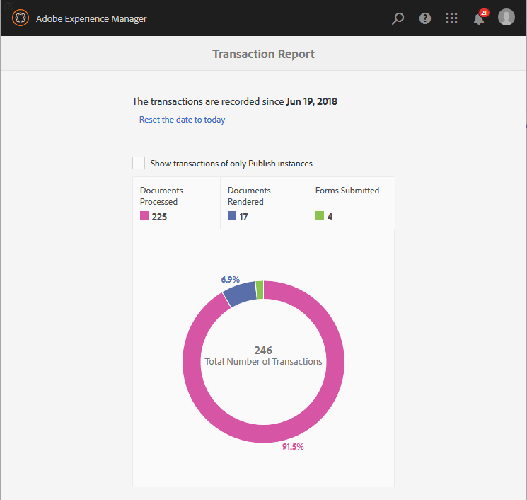

# Información general de los informes de transacciones{#transaction-reports-overview}

## Introducción {#introduction}

Los informes de transacciones de AEM Forms permiten mantener un recuento de todas las transacciones realizadas desde una fecha especificada en la implementación de AEM Forms. El objetivo es proporcionar información sobre el uso de los productos y ayudar a los interesados comerciales a comprender sus volúmenes de procesamiento digital. Algunos ejemplos de transacciones son:

* Envío de un formulario adaptable, un formulario HTML5 o un conjunto de formularios
* Representación de una impresión o una versión web de una comunicación interactiva
* Conversión de un documento de un formato de archivo a otro

Para obtener más información sobre lo que se considera una transacción, consulte [API facturables](../../forms/using/transaction-reports-billable-apis.md).

El registro de transacciones está deshabilitado de forma predeterminada. Puede [habilitar el registro de transacciones](../../forms/using/viewing-and-understanding-transaction-reports.md#setting-up-transaction-reports) desde AEM consola web. Puede vista de informes de transacciones en instancias de autor, procesamiento o publicación. La transacción de vista informa sobre instancias de creación o procesamiento para una suma agregada de todas las transacciones. La transacción de vista informa sobre las instancias de publicación para un recuento de todas las transacciones que se producen únicamente en esa instancia de publicación desde la que se ejecuta el informe.

No cree contenido (cree formularios adaptables, comunicación interactiva, temáticas y otras actividades de creación) ni documentos de proceso (utilice flujos de trabajo, servicios de documento y otras actividades de procesamiento) en la misma instancia de AEM. Mantenga deshabilitada la grabación de transacciones para los servidores de AEM Forms utilizados para crear contenido. Mantenga habilitado el registro de transacciones para los servidores de AEM Forms utilizados para procesar documentos.

Una transacción permanece en el búfer durante un período especificado (tiempo de vaciado del búfer + tiempo de replicación inverso). De forma predeterminada, el recuento de transacciones tarda aproximadamente 90 segundos en reflejarse en el informe de transacciones.

Las acciones como enviar un formulario PDF, utilizar la interfaz de usuario del agente para realizar la previsualización de una comunicación interactiva o utilizar métodos de envío de formularios no estándar no se contabilizan como transacciones. AEM Forms proporciona una API para registrar dichas transacciones. Llame a la API desde sus implementaciones personalizadas para registrar una transacción.

## Topología admitida {#supported-topology}

Los informes de transacciones solo están disponibles en AEM Forms en entorno OSGi. Admite las topologías de autor-publicación, autor-procesamiento-publicación y solo procesamiento. Por ejemplo, topologías, consulte [Topologías de arquitectura e implementación para AEM Forms](../../forms/using/transaction-reports-overview.md).

El recuento de transacciones se replica en sentido inverso de instancias de publicación a instancias de creación o procesamiento. A continuación se muestra una topología indicativa de creación y publicación:

>[!NOTE]
>
>Los informes de transacciones de AEM Forms no admiten topologías que solo contienen instancias de publicación.

### Directrices para el uso de informes de transacciones {#guidelines-for-using-transaction-reports}

* Desactive los informes de transacciones en todas las instancias de autor, ya que los informes de instancias de autor incluyen las transacciones registradas durante la creación de actividades.
* Habilite la opción **Mostrar transacciones de solo publicación** en la instancia de creación para vista de transacciones acumulativas de todas las instancias de publicación. También puede realizar vistas en los informes de transacciones de cada instancia de publicación para transacciones reales solo en esa instancia de publicación concreta.
* No utilice instancias de autor para ejecutar flujos de trabajo y documentos de proceso.
* Antes de utilizar el sistema de informes de transacciones, si dispone de una toplogía con servidores de publicación, asegúrese de que la replicación inversa está habilitada para todas las instancias de publicación.
* Los datos de transacción se replican de forma inversa desde una instancia de publicación a la instancia de creación o procesamiento correspondiente. El autor o la instancia de procesamiento no pueden replicar más datos en otra instancia. Por ejemplo, si tiene topología de creación, procesamiento y publicación, los datos de transacción agregados se replican solamente en la instancia de procesamiento.

## Artículos relacionados {#related-articles}

* [Visualización y comprensión de los informes de transacciones](../../forms/using/viewing-and-understanding-transaction-reports.md)
* [Informes de transacciones API facturables](../../forms/using/transaction-reports-billable-apis.md)
* [Registrar una transacción para implementaciones personalizadas](/help/forms/using/record-transaction-custom-implementation.md)

