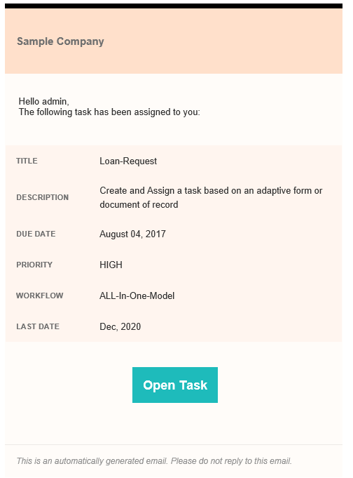

# Usar plantillas de correo electrónico personalizadas en un paso Asignar tarea{#use-custom-email-templates-in-an-assign-task-step}

Puede utilizar el paso Asignar tarea para crear y asignar tareas a un usuario o grupo. Cuando se asigna una tarea a un usuario o grupo, se envía una notificación por correo electrónico al usuario definido o a cada miembro del grupo definido. Una notificación típica por correo electrónico contiene un vínculo de la tarea asignada e información relacionada con la tarea. La siguiente imagen muestra un ejemplo de notificación por correo electrónico:

Puede personalizar el aspecto y utilizar metadatos personalizados en una notificación por correo electrónico. AEM Forms proporciona una plantilla predeterminada para las notificaciones por correo electrónico. Puede personalizar la plantilla predeterminada o crear una plantilla desde cero.

Las plantillas de notificación de correo electrónico se basan en el [correo electrónico HTML](https://es.wikipedia.org/wiki/Correo_HTML). Estos correos electrónicos se adaptan a diferentes clientes de correo electrónico y tamaños de pantalla. Además, el estilo del correo electrónico se define dentro de la plantilla.

La siguiente imagen muestra una notificación por correo electrónico personalizada:

## Personalizar la plantilla existente {#customize-the-existing-template}

De forma predeterminada, AEM Forms ofrece una plantilla para las notificaciones por correo electrónico. La plantilla proporciona la descripción del título, la fecha de vencimiento, la prioridad, el nombre del flujo de trabajo y el vínculo de la tarea asignada. Puede personalizar la plantilla para cambiar el aspecto. Siga estos pasos para personalizar la plantilla:

1. Inicie sesión en CRXDE con cuenta de administrador.

1. Vaya a /libs/fd/dashboard/templates/email.

1. Abra el archivo htmlEmailTemplate.txt. Contiene la plantilla predeterminada.

1. Reemplace el contenido del archivo htmlEmailTemplate.txt por contenido personalizado.

   Una plantilla de notificación de correo electrónico es un [correo electrónico HTML](https://es.wikipedia.org/wiki/Correo_HTML). Puede reemplazar el código HTML existente con el código personalizado para cambiar el aspecto de la plantilla.

1. Guarde el archivo. Ahora, la plantilla personalizada está lista para su uso.

## Crear una plantilla de correo electrónico {#create-an-email-template}

De forma predeterminada, AEM Forms ofrece una plantilla para las notificaciones por correo electrónico. La plantilla proporciona la descripción del título, la fecha de vencimiento, la prioridad, el nombre del flujo de trabajo y el vínculo de la tarea asignada. También puede agregar una plantilla de correo electrónico personalizada (su propia plantilla) para los pasos Asignar tarea. Siga estos pasos para agregar una plantilla de correo electrónico personalizada:

1. Inicie sesión en CRXDE con cuenta de administrador.

1. Vaya a /libs/fd/dashboard/templates/email.

1. Cree un archivo .txt. Por ejemplo, EmailOnTaskAssign.txt.

1. Agregue código HTML personalizado al archivo.

   Una plantilla de notificación de correo electrónico es un [correo electrónico HTML](https://es.wikipedia.org/wiki/Correo_HTML). Puede agregar código de HTML personalizado al archivo para crear una plantilla.

1. Guarde el archivo. La plantilla está lista para utilizarse en el paso Asignar tarea.

## Usar una plantilla de correo electrónico en un paso Asignar tarea {#use-an-email-template-in-an-assign-task-step}

De forma predeterminada, el paso Asignar tarea está configurado para utilizar la plantilla predeterminada, htmlEmailTemplate.txt. Puede elegir utilizar una plantilla personalizada. Para cambiar la plantilla:

1. Abra el paso Asignar tarea.

1. Vaya a Usuario asignado > Plantilla de correo electrónico HTML.

1. Seleccione la plantilla de correo electrónico HTML recién creada.

1. Haga clic en Aceptar. Se cambia la plantilla.

Una notificación por correo electrónico también utiliza [metadatos](../../forms/using/use-metadata-in-email-notifications.md). Por ejemplo, fecha de vencimiento, prioridad, nombre del flujo de trabajo, etc. También puede configurar la plantilla para usar [metadatos personalizados](../../forms/using/use-metadata-in-email-notifications.md#using-custom-metadata-in-an-email-notification).
