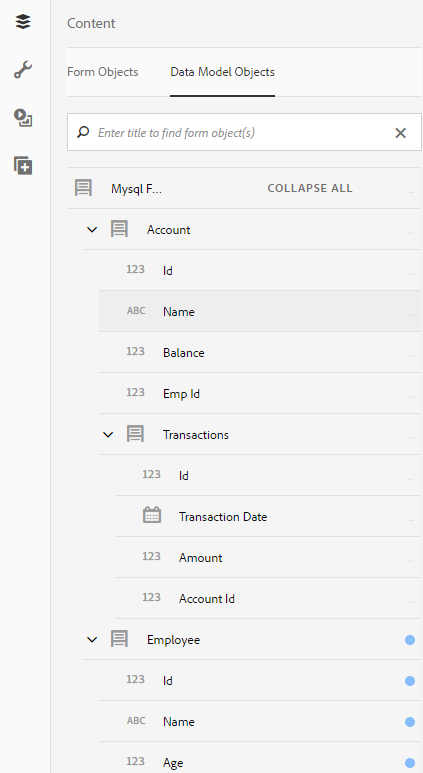

# Uso del modelo de datos de formulario{#use-form-data-model}

La integración de datos de AEM Forms permite utilizar orígenes de datos de backend diferentes para crear un modelo de datos de formulario que se puede utilizar como esquema en varios formularios adaptables y flujos de trabajo de comunicaciones interactivos. Requiere configurar los orígenes de datos y crear un modelo de datos de formulario basado en los objetos y servicios del modelo de datos disponibles en los orígenes de datos. Para obtener más información, consulte:

* [Integración de datos de AEM Forms](../../forms/using/data-integration.md)
* [Configurar fuentes de datos](../../forms/using/configure-data-sources.md)
* [Crear modelo de datos de formulario](../../forms/using/create-form-data-models.md)
* [Trabajar con el modelo de datos de formulario](../../forms/using/work-with-form-data-model.md)

Un modelo de datos de formulario es una extensión del esquema JSON que puede utilizar para:

* [Creación de formularios y fragmentos adaptables](#create-af)
* [Crear comunicaciones interactivas y bloques de creación como fragmentos de texto, lista y condición](#create-ic)
* [Previsualizar comunicaciones interactivas con datos de ejemplo](#preview-ic)
* [Rellene previamente formularios adaptables y comunicaciones interactivas](#prefill)
* [Escribir datos de formulario adaptable enviados de nuevo en orígenes de datos](#write-af)
* [Invocar servicios mediante reglas de formulario adaptables](#invoke-services)

## Creación de formularios y fragmentos adaptables {#create-af}

Puede crear [formularios adaptables](../../forms/using/creating-adaptive-form.md) y [fragmentos de formulario adaptables](../../forms/using/adaptive-form-fragments.md) basado en un modelo de datos de formulario. Para utilizar un modelo de datos de formulario al crear un formulario adaptable o un fragmento de formulario adaptable, haga lo siguiente:

1. En la pestaña modelo de formulario de la pantalla Agregar propiedades, seleccione **[!UICONTROL Modelo de datos de formulario]** en la lista desplegable **[!UICONTROL Seleccionar desde]**.

   

1. Pulse para expandir **[!UICONTROL Seleccionar modelo de datos de formulario]**. Se muestran todos los modelos de datos de formulario disponibles.

   Seleccione un modelo de datos de formulario.

   

1. (**Solo fragmentos de formulario adaptables**) Puede crear un fragmento de formulario adaptable basado en un único objeto de modelo de datos en un modelo de datos de formulario. Expanda la lista desplegable **[!UICONTROL Definiciones del modelo de datos de formulario]**. Esta lista enumera todos los objetos de modelo de datos del modelo de datos de formulario especificado. Seleccione un objeto de modelo de datos de la lista.

   

Una vez creado el formulario adaptable o el fragmento de formulario adaptable basado en un modelo de datos de formulario, los objetos del modelo de datos de formulario aparecen en el **[!UICONTROL Objetos del modelo de datos]** del navegador de contenido en el editor de formularios adaptables.

>[!NOTE]
>
>Para un fragmento de formulario adaptable, solo el objeto de modelo de datos seleccionado en el momento de la creación y sus objetos de modelo de datos asociados aparecen en la ficha Objetos del modelo de datos.

Puede arrastrar y soltar objetos del modelo de datos en el formulario adaptable o fragmento para agregar campos de formulario. Los campos de formulario agregados conservan las propiedades de metadatos y el enlace con las propiedades del objeto de modelo de datos. El enlace garantiza que los valores de los campos se actualicen en las fuentes de datos correspondientes al enviar el formulario y se prerrellenen cuando se representa el formulario.

## Crear comunicaciones interactivas {#create-ic}

Puede crear una comunicación interactiva basada en un modelo de datos de formulario que puede utilizar para rellenar previamente la comunicación interactiva con datos de orígenes de datos configurados. Además, los componentes básicos de una comunicación interactiva, como los fragmentos de documento de texto, lista y condición, pueden basarse en un modelo de datos de formulario.

Puede elegir un modelo de datos de formulario al crear una comunicación interactiva o un fragmento de documento. La siguiente imagen muestra la ficha General del cuadro de diálogo Crear comunicación interactiva .

Pestaña General del cuadro de diálogo Crear comunicación interactiva

Para obtener más información, consulte:

[Crear una comunicación interactiva](../../forms/using/create-interactive-communication.md)

[Texto en comunicaciones interactivas](/help/forms/using/texts-interactive-communications.md)

[Condiciones de las comunicaciones interactivas](/help/forms/using/conditions-interactive-communications.md)

[Enumerar fragmentos](/help/forms/using/lists.md)

## Usar una vista previa con datos de ejemplo; {#preview-ic}

El editor del modelo de datos de formulario permite generar y editar datos de ejemplo para objetos del modelo de datos en el modelo de datos de formulario. Puede utilizar estos datos para obtener una vista previa y probar las comunicaciones interactivas y los formularios adaptables. Debe generar los datos de ejemplo antes de obtener la vista previa, tal como se describe en [Trabajo con el modelo de datos de formulario](../../forms/using/work-with-form-data-model.md#sample).

Para previsualizar una comunicación interactiva con datos del modelo de datos de formulario de ejemplo:

1. En AEM instancia de autor, vaya a **[!UICONTROL Forms > Forms y documentos]**.
1. Seleccione una comunicación interactiva y pulse **[!UICONTROL Vista previa]** en la barra de herramientas para seleccionar **[!UICONTROL Canal web]**, **[!UICONTROL Canal de impresión]** o **[!UICONTROL Ambos canales]** para previsualizar la comunicación interactiva.
1. En la vista previa [*canal*] , asegúrese de que **[!UICONTROL Prueba de datos del modelo de datos de formulario]** está seleccionado y pulse **[!UICONTROL Vista previa]**.

La comunicación interactiva se abre con datos de ejemplo precompletados.

Del mismo modo, para obtener una vista previa de un formulario adaptable con datos de ejemplo, abra el formulario adaptable en modo de autor y pulse **[!UICONTROL Vista previa]**.

## Relleno previo mediante el servicio del modelo de datos de formulario {#prefill}

AEM Forms proporciona el servicio de rellenado previo del modelo de datos de formulario integrado que se puede activar para formularios adaptables y comunicaciones interactivas basadas en el modelo de datos de formulario. El servicio de prerelleno consulta los orígenes de datos para los objetos del modelo de datos en el formulario adaptable y la comunicación interactiva y, en consecuencia, antepone los datos al procesar el formulario o la comunicación.

Para habilitar el servicio de cumplimentación previa del modelo de datos de formulario para un formulario adaptable, abra las propiedades del contenedor de formularios adaptables y seleccione **[!UICONTROL Servicio de relleno previo del modelo de datos de formulario]** de la variable **[!UICONTROL Servicio de precarga]** en el acordeón Básico . A continuación, guarde las propiedades.

Para configurar el servicio de cumplimentación previa del modelo de datos de formulario en una comunicación interactiva, puede seleccionar Servicio de rellenado previo del modelo de datos de formulario en la lista desplegable Servicio de rellenado previo al crearlo o posteriormente modificando las propiedades.

Cuadro de diálogo Editar propiedades para una comunicación interactiva

## Escribir datos de formulario adaptable enviados en fuentes de datos {#write-af}

Cuando un usuario envía un formulario basado en un modelo de datos de formulario, se puede configurar el formulario para que escriba los datos enviados de un objeto de modelo de datos en sus fuentes de datos. Para lograr este caso de uso, AEM Forms proporciona [Acción de envío del modelo de datos de formulario](../../forms/using/configuring-submit-actions.md), disponible de forma predeterminada solo para formularios adaptables basados en un modelo de datos de formulario. Escribe los datos enviados de un objeto de modelo de datos en su fuente de datos.

Para configurar la acción de envío del Modelo de datos de formulario, abra las propiedades del contenedor de formularios adaptables y seleccione **[!UICONTROL Enviar mediante el modelo de datos de formulario]** en la lista desplegable Enviar acción , en el acordeón Envío . A continuación, examine y seleccione un objeto de modelo de datos en la lista desplegable **[!UICONTROL Nombre del objeto de modelo de datos que se va a enviar]**. Guarde las propiedades.

Al enviar el formulario, los datos del objeto de modelo de datos configurado se escriben en la fuente de datos correspondiente.

También puede enviar los archivos adjuntos del formulario a una fuente de datos mediante la propiedad de objeto del modelo de datos binaria. Haga lo siguiente para enviar archivos adjuntos a una fuente de datos JDBC:

1. Agregue un objeto de modelo de datos que incluya una propiedad binaria al modelo de datos de formulario.
1. En el formulario adaptable, arrastre y suelte el **[!UICONTROL Archivo adjunto]** del navegador Componentes al formulario adaptable.
1. Pulse para seleccionar el componente añadido y pulse  para abrir el Explorador de propiedades del componente.
1. En el campo Referencia de enlace, pulse  y desplácese hasta seleccionar la propiedad binaria añadida en el modelo de datos de formulario. Configure otras propiedades según corresponda.

   Pulse  para guardar las propiedades. El campo Datos adjuntos ahora está enlazado a la propiedad binaria del modelo de datos de formulario.

1. En la sección Envío de las propiedades del contenedor de formulario adaptable, active **[!UICONTROL Enviar archivos adjuntos del formulario]**. Esto envía el archivo adjunto del campo de propiedad binaria a la fuente de datos al enviar el formulario.

## Invocar servicios en formularios adaptables mediante reglas {#invoke-services}

En un formulario adaptable basado en un modelo de datos de formulario, puede [crear reglas](../../forms/using/rule-editor.md) para invocar servicios configurados en el modelo de datos de formulario. La variable **[!UICONTROL Invocar servicios]** en una regla, enumera todos los servicios disponibles en el modelo de datos de formulario y le permite seleccionar campos de entrada y salida para el servicio. También puede usar la variable **Definir valor** tipo de regla para invocar un servicio del modelo de datos de formulario y establecer el valor de un campo en el resultado devuelto por el servicio.

Por ejemplo, la siguiente regla invoca un servicio de obtención que toma el ID de empleado como entrada, y los valores devueltos se rellenan en los campos correspondientes ID de la persona dependiente, Apellidos, Nombre y Género del formulario.

Además, puede usar la API `guidelib.dataIntegrationUtils.executeOperation` para escribir un JavaScript en el Editor de código del Editor de reglas. Para obtener más información sobre API, consulte [API para invocar el servicio del modelo de datos de formulario](/help/forms/using/invoke-form-data-model-services.md).
