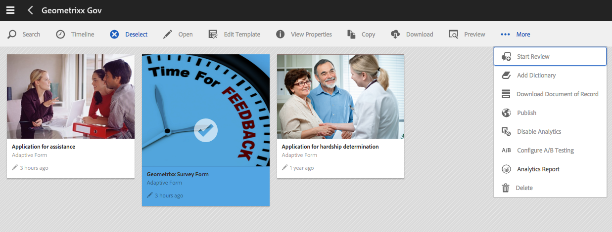
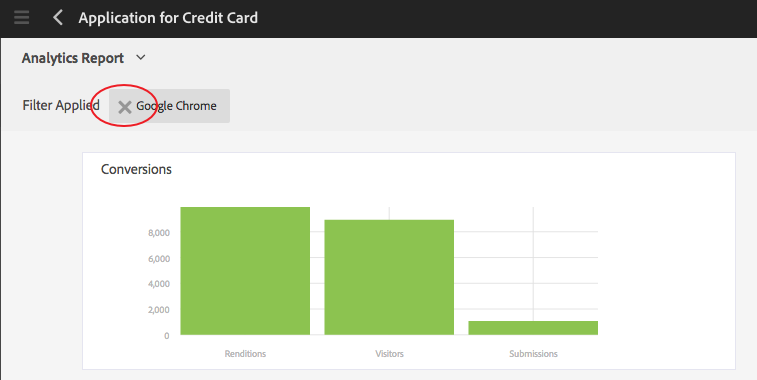

# Vista y comprensión de los informes de análisis de AEM Forms {#view-and-understand-aem-forms-analytics-reports}

Adobe Experience Manager Forms se integra con Adobe Analytics que le permite capturar y rastrear las métricas de rendimiento de los formularios y documentos publicados. El objetivo detrás del análisis de estas métricas es tomar decisiones informadas en base a los datos sobre los cambios necesarios para que los formularios o documentos sean más utilizables.

## Configuración de análisis {#setting-up-analytics}

La función de análisis de AEM Forms está disponible como parte del paquete del complemento AEM Forms. Para obtener información sobre la instalación del paquete de complemento, consulte [Instalación y configuración de AEM Forms](../../forms/using/installing-configuring-aem-forms-osgi.md).

Además del paquete de complemento, necesita una cuenta de Adobe Analytics. Para obtener información sobre la solución, consulte [Adobe Analytics](https://www.adobe.com/solutions/digital-analytics.html).

Una vez que tenga el paquete de complementos de AEM Forms y una cuenta de Adobe Analytics, integre la cuenta de Adobe Analytics con AEM Forms y habilite el seguimiento en los formularios o documentos como se describe en [Configuración de análisis e informes](../../forms/using/configure-analytics-forms-documents.md).

### Cómo se registra la información de interacción del usuario {#how-user-interaction-information-is-recorded}

Cuando un usuario interactúa con el formulario, las interacciones se registran y envían al servidor de Analytics. La siguiente lista indica las llamadas al servidor para varias actividades de usuario:

* 2 llamadas por campo por visita
* 1 para la visita al panel
* 1 para guardar
* 2 para envío
* 2 para guardar
* 1 para obtener ayuda
* 1 para cada error de validación
* 1 para la representación de formulario + 1 para la visita predeterminada al panel + 1 para la primera visita de campo predeterminada
* 2 para abandono de formulario

>[!NOTE]
>
>Esta lista no es exhaustiva.

### Visualización de informes de análisis {#summary-report}

Realice los siguientes pasos para los informes de análisis de vista:

1. Inicie sesión en el portal de AEM en `https://[hostname]:'port'`
1. Haga clic en **Forms > Forms y Documentos**.
1. Seleccione el formulario para el que desea realizar la vista de los informes de análisis.
1. Seleccione **Más > Informes de Analytics**.

**A.Informe** de Analytics, comando

AEM Forms muestra los informes de análisis del formulario y de cada panel del formulario, como se muestra a continuación.

**A.** Conversiones  **B.Resumen a nivel de** formulario  **C.** Resumen a nivel de panel  **D.** Exploradores de visitantes - filtro  **E.** OS de visitantes - filtro  **** F.Lenguaje de visitantes - filtro

De forma predeterminada, se muestra el informe de análisis de los últimos siete días. Puede vista de informes de los últimos 15 días, de un último mes, etc., o especificar un intervalo de fechas.

>[!NOTE]
>
>Las opciones como Últimos 7 días y Últimos 15 días no incluyen datos del día en que se está generando el informe de análisis. Para incluir los datos del día actual, debe especificar el intervalo de fechas, incluido el día actual, y luego ejecutar el informe.

### Gráfico de conversiones para formularios adaptables y HTML5 {#conversions-graph-for-adaptive-and-html-forms}

El gráfico de conversiones de nivel de formulario proporciona una visión detallada del rendimiento del formulario en los siguientes indicadores de rendimiento clave (KPI):

* **Representaciones**: Número de veces que se abre un formulario
* **Visitantes**: El número de visitantes al formulario
* **Envíos**: Número de veces que se envía el formulario

### Informe de Analytics para formularios adaptables y HTML5 {#analytics-report-for-adaptive-and-html-forms}

La sección de resumen de nivel de formulario proporciona una visión detallada del rendimiento del formulario en los siguientes indicadores de rendimiento clave (KPI):

* **Tiempo** de relleno promedio: Tiempo promedio empleado en rellenar el formulario. Cuando los usuarios invierten tiempo en el formulario pero no lo envían, ese tiempo no se incluye en este cálculo.
* **Representaciones**: Número de veces que se ha procesado o abierto el formulario
* **Borradores**: Número de veces que el formulario se ha guardado como borrador
* **Envíos**: Número de veces que se ha enviado el formulario
* **Anular**: Número de veces que los usuarios empezaron a rellenar el formulario y luego se fueron sin cumplimentar el formulario
* **Visitantes** únicos: Número de veces que el formulario se &quot;procesa mediante visitantes únicos. Para obtener más información sobre visitantes únicos, consulte [Visitantes únicos, visitas y comportamiento del cliente](https://helpx.adobe.com/analytics/kb/unique-visitors-visitor-behavior.html).

### Informe de panel {#bottom-summary-report}

La sección de resumen de nivel de panel proporciona la siguiente información sobre cada panel del formulario:

* **Tiempo** de relleno promedio: Tiempo promedio empleado en el panel, se envíe o no el formulario
* **Errores encontrados**: Promedio de errores encontrados por los usuarios en los campos de un panel. Los errores encontrados se obtienen dividiendo el total de errores de un campo por el número de representaciones del formulario.
* **Ayuda a la que se accede**: Promedio de veces que los usuarios accedieron a la ayuda en contexto para los campos del panel. Ayuda Accedida se obtiene dividiendo el número total de veces que se accede a la Ayuda de un campo por el número de representaciones del formulario.

#### Informe detallado del panel {#detailed-panel-report}

También puede hacer clic en el nombre de un panel en Informe de panel para ver los detalles de vista de cada panel.

El informe detallado muestra los valores de todos los campos del panel.

El informe de panel tiene tres fichas:

* **Informe** de tiempo (predeterminado): Muestra el tiempo, en número de segundos, empleado en rellenar cada uno de los campos del panel
* **Informe** de errores: Muestra el número de errores encontrados por los usuarios al rellenar los campos
* **Informe** de ayuda: Número de veces que se ha accedido a la ayuda de un campo concreto

Puede desplazarse entre los paneles si hay varios paneles disponibles.

### Filtros: Explorador, sistema operativo e idioma {#filters-browser-os-and-language}

Las tablas Distribución del explorador, Distribución del sistema operativo y Distribución de idioma muestran las representaciones, visitantes y envíos según los exploradores, el sistema operativo y el idioma de los usuarios del formulario. De forma predeterminada, estas tablas muestran un máximo de cinco entradas. Puede hacer clic en Mostrar más para mostrar más entradas y hacer clic en Mostrar menos para volver a las cinco entradas normales o menos.

Para filtrar más los datos de análisis, puede hacer clic en una entrada de cualquiera de las tablas. Por ejemplo, si hace clic en Google Chrome en la tabla de distribución del explorador, el informe se procesa nuevamente con datos relevantes para el explorador Google Chrome de la siguiente manera:

Si vista el informe del panel después de aplicar un filtro, los datos del informe del panel también se muestran según el filtro aplicado.

Una vez aplicado el filtro:

* Las tablas de distribución pasan a ser de solo lectura, ya que sólo se puede aplicar un filtro a la vez.
* La tabla del filtro aplicado desaparece.
* Puede hacer clic en el botón Cerrar (resaltado abajo) para eliminar el filtro aplicado.

### Prueba A/B {#a-b-testing}

Si tiene habilitadas las pruebas A/B y configuradas para el formulario, la página del informe tiene una lista desplegable que puede utilizar para mostrar el informe de prueba A/B. El informe de prueba A/B muestra el rendimiento comparativo de dos versiones del formulario según se ha configurado.

Para obtener más información sobre la prueba A/B, consulte [Creación y administración de pruebas A/B para formularios adaptables](../../forms/using/ab-testing-adaptive-forms.md).
