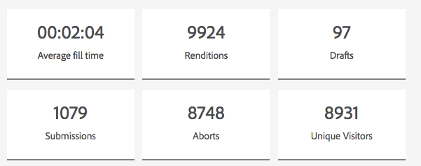

# Ver y comprender los informes de análisis de AEM Forms {#view-and-understand-aem-forms-analytics-reports}

Adobe Experience Manager Forms se integra con Adobe Analytics para permitirle capturar y realizar un seguimiento de las métricas de rendimiento de los formularios y documentos publicados. El objetivo detrás del análisis de estas métricas es tomar decisiones informadas basadas en los datos sobre los cambios necesarios para que los formularios o documentos sean más utilizables.

## Configurar los análisis {#setting-up-analytics}

La función de análisis de AEM Forms está disponible como parte del paquete de complementos de AEM Forms. Para obtener información sobre la instalación del paquete de complementos, consulte [Instalar y configurar AEM Forms](../../forms/using/installing-configuring-aem-forms-osgi.md).

Además del paquete de complementos, necesita una cuenta de Adobe Analytics. Para obtener información sobre la solución, consulte [Adobe Analytics](https://www.adobe.com/es/solutions/digital-analytics.html).

Una vez que tenga el paquete de complementos de AEM Forms y una cuenta de Adobe Analytics, integre la cuenta de Adobe Analytics con AEM Forms y habilite el seguimiento en sus formularios o documentos, tal como se describe en [Configurar análisis e informes](../../forms/using/configure-analytics-forms-documents.md).

### Registro de la información de interacción del usuario {#how-user-interaction-information-is-recorded}

Cuando un usuario interactúa con el formulario, las interacciones se registran y se envían al servidor de Analytics. La siguiente lista indica las llamadas al servidor para varias actividades de usuario:

* 2 llamadas por campo por visita
* 1 para la visita del panel
* 1 para guardar
* 2 para enviar
* 2 para guardar
* 1 para obtener ayuda
* 1 para cada error de validación
* 1 para la representación de formularios + 1 para la visita predeterminada al panel + 1 para la primera visita predeterminada al campo
* 2 para abandono de formulario

>[!NOTE]
>
>Esta lista no es exhaustiva.

### Ver informes de análisis {#summary-report}

Siga estos pasos para ver los informes de análisis:

1. Inicie sesión en el portal de AEM en `https://[hostname]:'port'`
1. Haga clic en **Formularios > Formularios y documentos**.
1. Seleccione el formulario para el que desea ver los informes de Analytics.
1. Seleccione **Más > Informes de Analytics**.

**A.** Comando de informe de Analytics

AEM Forms muestra los informes de análisis del formulario y de cada panel del formulario, como se muestra a continuación.

**A.** Conversiones **B.** Resumen de nivel de formulario **C.** Resumen a nivel de panel **D.** Exploradores de visitantes: filtro **E.** SO de los visitantes: filtro **F.** Idioma de los visitantes: filtro

De forma predeterminada, se muestra el informe de análisis de los últimos siete días. Puede ver los informes de los últimos 15 días, el último mes, etc., o especificar un intervalo de fechas.

>[!NOTE]
>
>Las opciones como Últimos 7 días y Últimos 15 días no incluyen datos del día en que genera el informe de análisis. Para incluir los datos del día actual, debe especificar el intervalo de fechas, incluido el día actual, y luego ejecutar el informe.

### Gráfico de conversiones para formularios adaptables y HTML5 {#conversions-graph-for-adaptive-and-html-forms}

El gráfico de conversiones a nivel de formulario le ofrece una perspectiva del rendimiento del formulario en los siguientes indicadores clave de rendimiento (KPI):

* **Representaciones**: Número de veces que se abre un formulario
* **Visitantes**: El número de visitantes en el formulario
* **Envíos**: Número de veces que se envía un formulario

### Informe de Analytics para formularios adaptables y HTML5 {#analytics-report-for-adaptive-and-html-forms}

La sección de resumen a nivel de formulario le ofrece una perspectiva del rendimiento del formulario en los siguientes indicadores clave de rendimiento (KPI):

* **Tiempo de relleno promedio**: Tiempo promedio empleado en rellenar el formulario. Cuando los usuarios pasan tiempo en el formulario pero no lo envían, ese tiempo no se incluye en este cálculo.
* **Representaciones**: el número de veces que se ha representado o abierto el formulario
* **Borradores**: el número de veces que el formulario se ha guardado como borrador.
* **Envíos**: el número de veces que se ha enviado el formulario.
* **Anulación**: Número de veces que los usuarios empezaron a rellenar el formulario y luego lo abandonaron sin completarlo
* **Visitantes únicos**: Número de veces que el formulario se representa por visitantes únicos. Para obtener más información sobre los visitantes únicos, consulte [Visitantes únicos, visitas y comportamiento del cliente](https://helpx.adobe.com/es/analytics/kb/unique-visitors-visitor-behavior.html).

### Informe de panel {#bottom-summary-report}

La sección de resumen a nivel de panel ofrece la siguiente información sobre cada panel del formulario:

* **Tiempo de relleno promedio**: Tiempo promedio empleado en el panel, independientemente de si el formulario se envía o no
* **Errores encontrados**: Número promedio de errores encontrados por los usuarios en los campos de un panel. Los errores encontrados se obtienen dividiendo el total de errores de un campo por el número de representaciones del formulario.
* **Se accedió a Ayuda**: Cantidad media de veces que los usuarios accedieron a la ayuda en contexto para los campos del panel. Se accede a Se accedió a Ayuda dividiendo el número total de veces que se accede a la Ayuda de un campo por el número de representaciones del formulario.

#### Informe detallado del panel {#detailed-panel-report}

También puede ver los detalles de cada panel haciendo clic en el nombre de un panel en el informe de panel.

El informe detallado muestra los valores de todos los campos del panel.

El informe del panel tiene tres pestañas:

* **Informe de tiempo** (Predeterminado): Muestra el tiempo, en número de segundos, empleado en rellenar cada uno de los campos del panel
* **Informe de errores**: Muestra el número de errores identificados por los usuarios al rellenar los campos
* **Informe de ayuda**: Número de veces que se accedió a la ayuda de un campo determinado

Puede desplazarse entre los paneles si hay varios paneles disponibles.

### Filtros: Explorador, SO e idioma {#filters-browser-os-and-language}

Las tablas Distribución del explorador, Distribución del SO y Distribución de idioma muestran las representaciones, visitantes y envíos según los exploradores, el SO y el idioma de los usuarios del formulario. De forma predeterminada, estas tablas muestran un máximo de cinco entradas. Puede hacer clic en Mostrar más para mostrar más entradas y hacer clic en Mostrar menos para volver a las cinco entradas normales o menos.

Para filtrar más los datos de análisis, puede hacer clic en una entrada de cualquiera de las tablas. Por ejemplo, si hace clic en Google Chrome en la tabla de distribución del explorador, el informe se vuelve a representar con datos relevantes para el explorador Google Chrome de la siguiente forma:

Si ve el informe del panel tras aplicar un filtro, los datos del informe del panel también se muestran según el filtro aplicado.

Una vez se aplique el filtro:

* Las tablas de distribución pasan a ser de solo lectura, ya que solo se puede aplicar un filtro a la vez.
* La tabla del filtro aplicado desaparece.
* Puede hacer clic en el botón Cerrar (resaltado abajo) para quitar el filtro aplicado.

### Pruebas A/B {#a-b-testing}

Si tiene habilitadas y configuradas las pruebas A/B para el formulario, la página del informe dispone de un menú desplegable que puede utilizar para mostrar el informe de pruebas A/B. El informe de pruebas A/B muestra el rendimiento comparativo de dos versiones del formulario que ha configurado.

Para obtener más información sobre las pruebas A/B, consulte [Crear y administrar pruebas A/B para formularios adaptables](../../forms/using/ab-testing-adaptive-forms.md).
