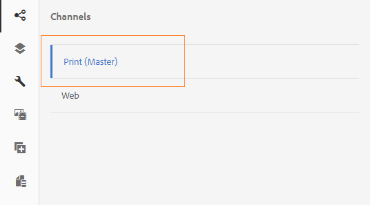

# Canal de impresión y canal web{#print-channel-and-web-channel}

Interactive Communications puede entregarse a través de dos canales: impresión y web. El canal de impresión se utiliza para crear documentos PDF y comunicaciones en papel, como una carta impresa como recordatorio de pago de primas de seguro, mientras que el canal web se utiliza para ofrecer experiencias en línea, como un extracto de tarjetas de crédito en un sitio web.

Los autores de comunicación interactiva pueden reutilizar recursos como fragmentos de documento e imágenes para crear versiones impresas y web de comunicación interactiva.

Uno de los requisitos previos para [crear una comunicación](../../forms/using/create-interactive-communication.md) interactiva es tener las plantillas para impresión y/o canal web disponibles en el servidor. Mientras los creadores de plantillas crean la plantilla de canal web en AEM, la plantilla de canal de impresión XDP se crea en Adobe Forms Designer y se carga en el servidor.

## Print channel {#printchannel}

El canal de impresión de una comunicación interactiva utiliza una plantilla de formulario XFA, XDP. Un XDP está diseñado en Adobe Forms Designer. Para obtener más información sobre la creación de plantillas de canal de impresión, consulte Diseño [de maquetación](../../forms/using/layout-design-details.md). Para utilizar una plantilla de canal de impresión en Interactive Communication, debe cargar la plantilla en el servidor de AEM Forms.

### Cargar plantilla de canal de impresión de Interactive Communication {#upload-interactive-communication-print-channel-template}

Para cargar la plantilla, debe ser miembro del grupo de usuarios de formularios. Siga los pasos siguientes para cargar la plantilla de canal de impresión (XDP) en AEM Forms:

1. Seleccione **[!UICONTROL Formularios]** > **[!UICONTROL Formularios y documentos]**.

1. Toque **[!UICONTROL Crear]** > Cargar **[!UICONTROL archivo]**.

   Desplácese y seleccione la plantilla de canal de impresión (XDP) correspondiente y toque **[!UICONTROL Abrir]**.

## Web channel {#web-channel}

Los creadores y administradores de plantillas pueden crear, editar y habilitar plantillas web. Para permitir que otros usuarios creen plantillas web, debe otorgarles derechos. Para obtener más información, consulte Administración [de derechos de usuario, grupo y acceso](/help/sites-administering/user-group-ac-admin.md).

### Creación de plantillas de canal web {#authoring-web-channel-template}

Para crear una plantilla de canal web, primero debe crear una carpeta de plantilla. Una vez que haya creado una plantilla web dentro de una carpeta de plantilla, deberá activar la plantilla para permitir que los usuarios de los formularios creen un canal web de una comunicación interactiva basada en la plantilla.

Para crear una plantilla de canal web Complete los siguientes pasos:

1. Cree una carpeta Plantilla para mantener las plantillas web de comunicación interactiva, si aún no dispone de una. Para obtener más información, consulte Carpetas de plantilla en Plantillas de [página - Editable](/help/sites-developing/page-templates-editable.md).

   1. Toque **[!UICONTROL Herramientas]**  > **[!UICONTROL Navegador]** de configuración.
   1. En la página Navegador de configuración, toque **[!UICONTROL Crear]**.
   1. En el cuadro de diálogo Crear configuración, especifique un título para la carpeta, marque Plantillas **[!UICONTROL editables y toque]** Crear ****.

      La carpeta se crea y se enumera en la página Navegador de configuración.

1. Vaya a la carpeta de plantillas adecuada y cree una plantilla web.

   1. Vaya a la carpeta de plantillas adecuada seleccionando **[!UICONTROL Herramientas]** > **[!UICONTROL Plantillas]** > **`[Folder]`**.
   1. Toque **[!UICONTROL Crear]**.
   1. Seleccione Comunicación **[!UICONTROL interactiva - Canal]** web y toque **[!UICONTROL Siguiente]**.
   1. Introduzca un título y una descripción de plantilla y, a continuación, toque **[!UICONTROL Crear]**.

      Se crea la plantilla y aparece un cuadro de diálogo.

   1. Toque **[!UICONTROL Abrir]** para abrir la plantilla que ha creado en el editor de plantillas.

      Aparecerá el Editor de plantillas.

      

      Al crear o editar una plantilla, puede definir varios aspectos que puede definir un autor de la plantilla. La creación o edición de una plantilla es similar a la creación de páginas. Para obtener más información, consulte Edición de plantillas - Autores de plantillas en [Creación de plantillas](/help/sites-authoring/templates.md)de página.

1. Para permitir el uso de esta plantilla para la creación de comunicación interactiva, habilite la plantilla.

   1. Toque **[!UICONTROL Herramientas]**  > **[!UICONTROL Plantillas]**.
   1. Vaya a la plantilla adecuada, selecciónela y toque **[!UICONTROL Habilitar]** y, en el mensaje de alerta, toque **[!UICONTROL Habilitar]**.

      La plantilla está habilitada y su estado se muestra como Habilitada. Ahora puede continuar creando una comunicación interactiva en la que puede utilizar la plantilla de canal web recién creada.

### Print channel as master for web channel {#print-channel-as-master-for-web-channel}

Durante la creación de una comunicación interactiva, los autores pueden seleccionar esta opción para crear el canal web en sincronización con el canal de impresión. El uso del canal de impresión como maestro para el canal web garantiza que el contenido, la herencia y el enlace de datos del canal web se deriven del canal de impresión y que los cambios realizados en el canal de impresión se puedan reflejar en el canal web. Sin embargo, los autores de Comunicación interactiva pueden romper la herencia de componentes específicos en el canal web, según sea necesario.

 Web maestro 

