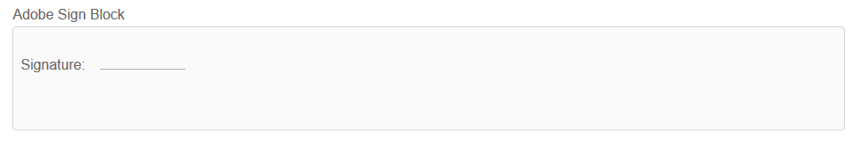

# Uso [!DNL Adobe Sign] en forma adaptable{#using-adobe-sign-in-an-adaptive-form}

[!DNL Adobe Sign] activa los flujos de trabajo de firma electrónica para formularios adaptables. Las firmas electrónicas mejoran los flujos de trabajo para procesar documentos para áreas legales, de ventas, de nómina, de administración de recursos humanos y más.

En un [!DNL Adobe Sign] y los formularios adaptables, un usuario rellena un formulario adaptable para solicitar un servicio. Por ejemplo, una solicitud de hipoteca y tarjeta de crédito requiere firmas legales de todos los prestatarios y cosolicitantes. Para habilitar los flujos de trabajo de firma electrónica para situaciones similares, se puede integrar [!DNL Adobe Sign] con AEM [!DNL Forms]. Algunos ejemplos más. Puede usar [!DNL Adobe Sign] para lo siguiente:

* Cerrar acuerdos desde cualquier dispositivo con procesos de propuesta, presupuesto y contrato totalmente automatizados.
* Finalizar los procesos de Recursos Humanos más rápido y ofrecer a sus empleados las experiencias digitales.
* Reducir los tiempos de ciclo de contrato e incorporar a sus proveedores más rápido.
* Crear flujos de trabajo digitales que automaticen procesos comunes.

[!DNL Adobe Sign] integración con AEM [!DNL Forms] admite:

* Flujos de trabajo de firma de usuarios únicos y múltiples
* Flujos de trabajo de firma secuenciales y simultáneos
* Experiencias de firma dentro y fuera de formulario
* Firma de formularios como usuario anónimo o con sesión iniciada
* Procesos de firma dinámica (integración con AEM [!DNL Forms] workflow)
* Autenticación a través de una base de conocimiento, un teléfono y perfiles sociales

Conozca las [prácticas recomendadas de uso de Adobe Sign con formularios adaptables](https://medium.com/adobetech/using-adobe-sign-to-e-sign-an-adaptive-form-heres-the-best-way-to-do-it-dc3e15f9b684) para crear mejores experiencias de firma.

## Requisitos previos {#prerequisites}

Antes de usar [!DNL Adobe Sign] en forma adaptativa:

* AEM [!DNL Forms] el servicio en la nube está configurado para usar [!DNL Adobe Sign]. Para obtener más información, consulte [Integración de Adobe Sign con AEM Forms](../../forms/using/adobe-sign-integration-adaptive-forms.md).
* Mantenga lista de firmantes lista. Se requiere al menos una dirección de correo electrónico para cada firmante.

## Configurar [!DNL Adobe Sign] para un formulario adaptable {#configure-adobe-sign-for-an-adaptive-form}

Siga estos pasos para configurar [!DNL Adobe Sign] para un formulario adaptable:

1. [Edición de las propiedades de formulario adaptables para el signo de Adobe](../../forms/using/working-with-adobe-sign.md#enableadobesign)
1. [Adición de campos de Adobe Sign a un formulario adaptable](../../forms/using/working-with-adobe-sign.md#addadobesignfieldstoanadaptiveform)
1. [Habilitar Adobe Sign para un formulario adaptable](../../forms/using/working-with-adobe-sign.md#enableadobsignforanadaptiveform)
1. [Seleccione Adobe Sign Cloud Service para un formulario adaptable](../../forms/using/working-with-adobe-sign.md#selectadobesigncloudserviceforanadaptiveform)

1. [Agregar firmantes de Adobe Sign a un formulario adaptable](../../forms/using/working-with-adobe-sign.md#addsignerstoanadaptiveform)
1. [Seleccione Enviar acción para un formulario adaptable](../../forms/using/working-with-adobe-sign.md#selectsubmitactionforanadaptiveform)

### Editar propiedades de formulario adaptables para [!DNL Adobe Sign] {#enableadobesign}

Configuración de propiedades de formulario adaptables para [!DNL Adobe Sign] para un formulario adaptable existente o nuevo.

[Creación de un formulario adaptable para Adobe Sign](../../forms/using/working-with-adobe-sign.md#create-an-adaptive-form-for-adobe-sign) describe los pasos para crear un formulario adaptable básico. Consulte [Creación de un formulario adaptable](../../forms/using/creating-adaptive-form.md) para otras opciones disponibles al crear un formulario adaptable.

#### Cree un formulario adaptable para [!DNL Adobe Sign] {#create-an-adaptive-form-for-adobe-sign}

Siga estos pasos para crear un formulario adaptable con firma habilitada:

1. Vaya a **[!UICONTROL Adobe Experience Manager]** > **[!UICONTROL Forms]** > **[!UICONTROL Formularios y documentos]**.
1. Pulse **[!UICONTROL Crear]** y seleccione **[!UICONTROL Formulario adaptable]**. Aparecerá una lista de plantillas. Seleccione la plantilla y pulse **[!UICONTROL Siguiente]**.
1. En la pestaña **[!UICONTROL Básico]**:

   1. Especifique la variable **[!UICONTROL Nombre]** y **[!UICONTROL Título]** para el formulario adaptable.

   1. Seleccione el [contenedor de configuración](../../forms/using/adobe-sign-integration-adaptive-forms.md#configure-adobe-sign-with-aem-forms) creado al configurar [!DNL Adobe Sign] con AEM [!DNL Forms].

      >[!NOTE]
      >
      >La variable **[!UICONTROL Adobe Sign Cloud Service]** la lista desplegable muestra los servicios de nube que están configurados en el contenedor de configuración que seleccione en este campo. La variable **[!UICONTROL Adobe Sign Cloud Service]** la lista desplegable está disponible en la **[!UICONTROL Firma electrónica]** de las propiedades del formulario adaptable al seleccionar la **[!UICONTROL Habilitar Adobe Sign]** .

1. En la pestaña **[!UICONTROL Modelo de formulario]**, seleccione una de las siguientes opciones:

   * Seleccione el **[!UICONTROL Asociar plantilla de formulario como la plantilla Documento de registro]** y seleccione una plantilla Documento de registro. Si utiliza un formulario adaptable basado en una plantilla de formulario, los documentos enviados para firmar sólo mostrarán aquellos campos basados en la plantilla de formulario asociada. No muestra todos los campos del formulario adaptable.

   * Seleccione el **[!UICONTROL Generar documento de registro]** . Si utiliza la opción Documento de registro habilitado para el formulario adaptable, el documento enviado para firmar muestra todos los campos del formulario adaptable.

1. Pulse **[!UICONTROL Crear.]** Se crea un formulario adaptable con firma, que se puede utilizar para agregar [!DNL Adobe Sign] campos.

#### Editar un formulario adaptable para [!DNL Adobe Sign] {#editafsign}

Siga estos pasos para usar [!DNL Adobe Sign] en un formulario adaptable existente:

1. Vaya a **[!UICONTROL Adobe Experience Manager]** > **[!UICONTROL Forms]** > **[!UICONTROL Formularios y documentos]**.
1. Seleccione el formulario adaptable y pulse **[!UICONTROL Propiedades]**.
1. En el **[!UICONTROL Básico]** , seleccione [contenedor de configuración](../../forms/using/adobe-sign-integration-adaptive-forms.md#configure-adobe-sign-with-aem-forms) creado al configurar [!DNL Adobe Sign] con AEM [!DNL Forms].
1. En la pestaña **[!UICONTROL Modelo de formulario]**, seleccione una de las siguientes opciones:

   * Seleccione el **[!UICONTROL Asociar plantilla de formulario como la plantilla Documento de registro]** y seleccione una plantilla Documento de registro. Si utiliza un formulario adaptable basado en una plantilla de formulario, los documentos enviados para firmar sólo mostrarán aquellos campos basados en la plantilla de formulario asociada. No muestra todos los campos del formulario adaptable.

   * Seleccione el **[!UICONTROL Generar documento de registro]** . Si utiliza la opción Documento de registro habilitado para el formulario adaptable, el documento enviado para firmar muestra todos los campos del formulario adaptable.

1. Pulse **[!UICONTROL Guardar y cerrar]**. El formulario adaptable está habilitado para [!DNL Adobe Sign].

### Adición de campos de Adobe Sign a un formulario adaptable {#addadobesignfieldstoanadaptiveform}

[!DNL Adobe Sign] tiene varios campos que se pueden colocar en un formulario adaptable. Estos campos aceptan varios tipos de datos, como firmas, iniciales, empresa o título, y ayudan a recopilar información adicional durante la firma, junto con las firmas. Puede usar la variable [!DNL Adobe Sign] Bloque el componente a colocar [!DNL Adobe Sign] campos en varias ubicaciones en un formulario adaptable.

Siga estos pasos para agregar campos a un formulario adaptable y personalizar diversas opciones relacionadas con estos campos:

1. Arrastrar y soltar **[!UICONTROL Bloque de Adobe Sign]** del navegador de componentes al formulario adaptable. El componente [!DNL Adobe Sign] Block cuenta con los campos [!DNL Adobe Sign] compatibles. De forma predeterminada, agrega un **Firma** al formulario adaptable.

   

   De forma predeterminada, la variable [!DNL Adobe Sign] El bloque no está visible en el formulario adaptable publicado. Solo se ve en los documentos de firma. Puede cambiar la visibilidad de [!DNL Adobe Sign] Block en las propiedades del componente [!DNL Adobe Sign] Block.

   >[!NOTE]
   >
   >    * Uso [!DNL Adobe Sign] el bloque no es obligatorio para usar [!DNL Adobe Sign] en forma adaptativa. Si no usa [!DNL Adobe Sign] bloquear y agregar campos para los firmantes, el campo de firma predeterminado se muestra en la parte inferior de los documentos de firma.
   >    * Uso [!DNL Adobe Sign] solo se bloquea para los formularios adaptables que generan automáticamente el documento de registro. Si utiliza un XDP personalizado para generar un documento de registro o un formulario adaptable basado en una plantilla de formulario, [!DNL Adobe Sign] no es compatible.

1. Seleccione el **[!UICONTROL Bloque de Adobe Sign]** y toque el **Editar**  icono. Muestra las opciones para agregar campos y formatear la apariencia de un campo.

   

   **A.** Seleccione y agregue campos de [!DNL Adobe Sign]. **B.** Amplíe el bloque de [!DNL Adobe Sign] a vista de pantalla completa.

1. Toque . **[!UICONTROL Adobe Sign] Campo**  icono. Muestra las opciones para seleccionar y agregar campos de [!DNL Adobe Sign].

   Expanda el **[!UICONTROL Tipo]** campo desplegable para seleccionar un [!DNL Adobe Sign] pulse el campo Listo  para añadir el campo seleccionado a [!DNL Adobe Sign] bloque. La variable **[!UICONTROL Tipo]** el campo desplegable incluye los tipos de campo Firma, Información del firmante y Datos. La integración de [!DNL Adobe Sign] con AEM [!DNL Forms] admite campos enumerados solo en el cuadro desplegable [!UICONTROL Tipo]. Para obtener información detallada sobre los campos de [!DNL Adobe Sign], consulte [Documentación de Adobe Sign](https://helpx.adobe.com/es/sign/help/field-types.html).

   

   Es obligatorio proporcionar un nombre único para un campo. También puede seleccionar la opción necesaria para marcar un campo como obligatorio. Además de las opciones **[!UICONTROL Nombre]** y **[!UICONTROL Requerido]**, otros campos de [!DNL Adobe Sign] cuentan con más donde elegir. Por ejemplo, máscara y líneas múltiples. Además, especifique un nombre único para cada [!DNL Adobe Sign] campo si los campos residen en el mismo o en diferentes [!DNL Adobe Sign] bloques.

   Si selecciona **[!UICONTROL Firma digital]** en la lista desplegable, puede aplicar firmas digitales al formulario adaptable:

   * En línea, se usan firmas de la nube para firmar con un [ID digital](https://helpx.adobe.com/es/sign/kb/digital-certificate-providers.html) alojado por un proveedor de servicios de confianza.
   * De forma local, se descarga el documento con Adobe Acrobat o Reader usando una tarjeta inteligente, un token USB o un ID digital basado en archivos.

### Habilitar [!DNL Adobe Sign] para un formulario adaptable {#enableadobsignforanadaptiveform}

Fuera de la caja, [!DNL Adobe Sign] no está habilitado para un formulario adaptable. Siga estos pasos para habilitarlo:

1. En el navegador de contenido, pulse **[!UICONTROL Contenedor de formulario]** y haga clic en el icono **[!UICONTROL Configurar]** . Se abrirá el explorador de propiedades, donde verá las propiedades del contenedor de formularios adaptables.
1. En el navegador de propiedades, amplíe el acordeón **[!UICONTROL Firma electrónica]** y seleccione la opción **[!UICONTROL Habilitar Adobe Sign]**. Habilita [!DNL Adobe Sign] para un formulario adaptable.

### Seleccione [!DNL Adobe Sign] Cloud Service y la petición de firma {#selectadobesigncloudserviceforanadaptiveform}

Puede configurar varios servicios de [!DNL Adobe Sign] para una instancia de AEM [!DNL Forms]. Es aconsejable tener un conjunto de servicios separados para cada función (Recursos Humanos, Finanzas, etc.). Facilita el seguimiento y la creación de informes de documentos firmados. Por ejemplo, un banco tiene varios departamentos. Puede tener una configuración separada para cada departamento para realizar un mejor seguimiento de los documentos.

Un documento también puede tener varios firmantes. Por ejemplo, una solicitud de tarjeta de crédito puede tener varios solicitantes. Un banco requiere firmas de todos los solicitantes antes de iniciar la solicitud de procesamiento. En el caso de los casos de multifirmante, puede seleccionar firmar el documento en orden secuencial o simultáneo.

Siga estos pasos para seleccionar un servicio en la nube y el orden de firma:

1. En el navegador de contenido, pulse **[!UICONTROL Contenedor de formulario]** y haga clic en el icono **[!UICONTROL Configurar]** . Se abrirá el explorador de propiedades, donde verá las propiedades del contenedor de formularios adaptables.
1. En el navegador de propiedades, amplíe el acordeón **[!UICONTROL Firma electrónica]** y seleccione la opción **[!UICONTROL Habilitar Adobe Sign]**. Habilita [!DNL Adobe Sign] para un formulario adaptable.
1. Seleccione un servicio en la nube de la lista ya configurada de [!DNL Adobe Sign] Cloud Services.

   Si la variable **[!UICONTROL Adobe Sign Cloud Service]** está vacía, siga la [Configuración de Adobe Sign con AEM Forms](../../forms/using/adobe-sign-integration-adaptive-forms.md) para configurar el servicio.

   La lista desplegable muestra los servicios de nube que existen en la `global` carpeta en Herramientas > **[!UICONTROL Cloud Services]** > **[!UICONTROL Adobe Sign]**. Además, la lista desplegable también enumera los servicios de nube que existen en la carpeta seleccionada en la **[!UICONTROL Contenedor de configuración]** al crear un formulario adaptable.

1. Seleccione el orden de firma de la lista **[!UICONTROL Los firmantes pueden firmar]** para abrir el Navegador. [!DNL Adobe Sign] los cantantes pueden firmar un formulario adaptable **[!UICONTROL Secuencialmente]** - uno tras otro firmante, o **[!UICONTROL Simultáneamente]** - en cualquier orden.

   En orden secuencial, un firmante recibe el formulario para firmar a la vez. Una vez que un firmante completa la firma del documento, el formulario se envía al siguiente firmante, etc.

   En orden simultáneo, varios firmantes pueden firmar un formulario a la vez.

1. [Agregar firmantes a un formulario adaptable](../../forms/using/working-with-adobe-sign.md#addsignerstoanadaptiveform) y pulse Listo  para guardar los cambios.

### Agregar firmantes a un formulario adaptable {#addsignerstoanadaptiveform}

Solo se puede tener un firmante o varios firmantes para un formulario adaptable. Al agregar un firmante, también puede configurar los detalles de autenticación del firmante. También puede seleccionar si el usuario que rellena el formulario y el cantante son la misma persona. Realice los siguientes pasos para agregar y proporcionar varios detalles sobre un firmante:

1. En el navegador de contenido, pulse **[!UICONTROL Contenedor de formulario]** y haga clic en el icono **[!UICONTROL Configurar]** . Se abrirá el explorador de propiedades con las propiedades del contenedor de formularios adaptables.
1. En el navegador de propiedades, amplíe el acordeón **[!UICONTROL Firma electrónica]** y seleccione la opción **[!UICONTROL Habilitar Adobe Sign]**. Habilita [!DNL Adobe Sign] para un formulario adaptable.
1. Toque **[!UICONTROL Agregar firmante]** under **[!UICONTROL Configuración del firmante]**. Agrega un firmante al formulario adaptable. Puede agregar varias [!DNL Adobe Sign] firmantes de un formulario adaptable.
   

1. Haga clic en el **Editar**  para especificar la siguiente información sobre el firmante:

   * **[!UICONTROL Título]:** Especifique un título para identificar de forma exclusiva a un firmante.

   * **[!UICONTROL ¿El signatario y quien rellena el formulario son la misma persona?]:** Select **Sí**, si el usuario que rellena el formulario y el primer firmante son la misma persona. Si la opción está definida en **No,** a continuación, no utilice el componente paso de firma en el formulario adaptable. Si el formulario contiene un componente Paso de firma, el campo se establece automáticamente como Sí.

   * **[!UICONTROL Dirección de correo electrónico del firmante]:** Especifique la dirección de correo electrónico del firmante. El firmante recibe los documentos o formularios firmados en la dirección de correo electrónico especificada. Puede elegir utilizar una dirección de correo electrónico proporcionada en un campo de formulario, en AEM perfil de usuario del usuario que ha iniciado sesión o escribir manualmente una dirección de correo electrónico. Es un paso obligatorio. Asegúrese de que la dirección de correo electrónico del primer firmante o del único firmante (en el caso de un firmante único) no sea idéntica a [!DNL Adobe Sign] cuenta utilizada para configurar los servicios en la nube de AEM.

   * **[!UICONTROL Método de autenticación del firmante]:** Especifique el método para autenticar a un usuario antes de abrir un formulario para firmar. Puede elegir entre teléfono, base de conocimientos y autenticación social basada en identidad.
   >[!NOTE]
   >
   >    * De forma predeterminada, la autenticación basada en la identidad social proporciona una opción para autenticarse con Facebook, Google y LinkedIn. Puede ponerse en contacto con la ayuda técnica de [!DNL Adobe Sign] para habilitar otros proveedores de autenticación social.

   * **[!DNL Adobe Sign]campos para rellenar o firmar:** Select [!DNL Adobe Sign] para el firmante. Un formulario adaptable puede tener varios [!DNL Adobe Sign] campos. Puede elegir habilitar campos específicos para un firmante. El campo muestra todos los bloques de [!DNL Adobe Sign] Block disponibles. Al seleccionar un bloque, se seleccionan todos los campos del bloque. Puede utilizar el icono X para anular la selección de un campo.

   

   La imagen anterior tiene dos ejemplos de [!DNL Adobe Sign] Block: Información personal y detalles de Office

   Puntee en Listo  icono. Se agrega y configura el firmante.

### Seleccione Enviar acción para un formulario adaptable {#selectsubmitactionforanadaptiveform}

Después de agregar [!DNL Adobe Sign] campos a un formulario adaptable, activar [!DNL Adobe Sign] en el contenedor de formularios, seleccione [!DNL Adobe Sign] Cloud Service y agregar [!DNL Adobe Sign] Firmantes, seleccione una acción de envío adecuada para el formulario adaptable. Para obtener información detallada sobre las acciones de envío de formularios adaptables, consulte [Configuración de la acción Enviar](../../forms/using/configuring-submit-actions.md).

Además, un [!DNL Adobe Sign] el formulario adaptable habilitado solo se envía después de que todos los firmantes firmen el formulario. Puede encontrar formularios parcialmente firmados en la sección Firma pendiente del portal de formularios. [!DNL Adobe Sign] El servicio de configuración sigue sondeando [!DNL Adobe Sign] servidor en [intervalos regulares](../../forms/using/adobe-sign-integration-adaptive-forms.md) para verificar el estado de las firmas. Si todos los firmantes completan la firma del formulario, se inicia el servicio de acción de envío y se envía el formulario. Si utiliza una acción de envío personalizada y el formulario utiliza [!DNL Adobe Sign], actualice la acción de envío personalizada para utilizar el servicio de acción de envío.

<!-- Remove when forms portal goes live
>[!NOTE]
>
>Data of the adaptive form is stored temporarily on Forms Portal. It is recommended to use [custom storage for Forms Portal](/help/forms/using/configuring-draft-submission-storage.md). It ensures that the PII (personally identifiable information) data is not stored on AEM servers. 
-->

La experiencia de firma de formularios está lista. Puede obtener una vista previa del formulario para comprobar la experiencia de firma. En el formulario publicado, [!DNL Adobe Sign] Los campos de bloque se muestran cuando un firmante recibe el formulario para firmar a través de un correo electrónico. Esta experiencia también se conoce como experiencia de firma fuera de formulario. También puede configurar una experiencia de firma en el formulario para el primer firmante; para ver los pasos detallados, consulte [Crear experiencia de firma en formularios](../../forms/using/working-with-adobe-sign.md#create-in-form-signing-experience).

## Configuración de firmas de nube para un formulario adaptable {#configure-cloud-signatures-for-an-adaptive-form}

Las firmas digitales o remotas basadas en la nube son una nueva generación de firmas digitales que funcionan en equipos de escritorio, dispositivos móviles y la web, y cumplen con los niveles más altos de cumplimiento y seguridad para la autenticación de firmantes. Puede firmar un formulario adaptable con firmas digitales basadas en la nube.

Después [edición de propiedades de formulario adaptables para el signo de Adobe](../../forms/using/working-with-adobe-sign.md#enableadobesign), realice los siguientes pasos para agregar el campo de firma en la nube a un formulario adaptable:

1. Arrastrar y soltar **[!UICONTROL Bloque de Adobe Sign]** del navegador de componentes al formulario adaptable. El componente [!UICONTROL Adobe Sign Block] cuenta con los campos de [!DNL Adobe Sign] compatibles. De forma predeterminada, agrega un **[!UICONTROL Firma]** al formulario adaptable.

   

1. Seleccione el **[!UICONTROL Bloque de Adobe Sign]** y toque el **Editar**  icono. Muestra las opciones para agregar campos y formatear la apariencia de un campo.

   

   **A.** Seleccione y agregue campos de [!DNL Adobe Sign]. **B.** Amplíe el bloque de [!DNL Adobe Sign] a vista de pantalla completa.

1. Toque . **[!UICONTROL Campo Adobe Sign]**  icono. Muestra las opciones para seleccionar y agregar campos de [!DNL Adobe Sign].

   Amplíe el campo desplegable **[!UICONTROL Tipo]** para seleccionar **[!UICONTROL Firma digital]** y pulse el icono de **Listo** para agregar el campo seleccionado al bloque de [!DNL Adobe Sign].

   

   Es obligatorio proporcionar un nombre único para un campo.

   Aplique firmas digitales al formulario adaptable utilizando:

   * Firmas en la nube: firme con un [ID digital](https://helpx.adobe.com/sign/kb/digital-certificate-providers.html) alojado por un proveedor de servicios de confianza.
   * Adobe Acrobat o Reader: descargue y abra el documento con Adobe Acrobat o Reader para firmarlo con una tarjeta inteligente, un token USB o un ID digital basado en archivos.

   Después de agregar el campo de firma de nube al formulario adaptable, realice los siguientes pasos para completar el proceso de configuración:

   * [Habilitar Adobe Sign para un formulario adaptable](../../forms/using/working-with-adobe-sign.md#enableadobsignforanadaptiveform)
   * [Seleccione Adobe Sign Cloud Service para un formulario adaptable](../../forms/using/working-with-adobe-sign.md#selectadobesigncloudserviceforanadaptiveform)
   * [Agregar firmantes de Adobe Sign a un formulario adaptable](../../forms/using/working-with-adobe-sign.md#addsignerstoanadaptiveform)
   * [Seleccione Enviar acción para un formulario adaptable](../../forms/using/working-with-adobe-sign.md#selectsubmitactionforanadaptiveform)

## Crear experiencia de firma en formularios {#create-in-form-signing-experience}

Un usuario también puede firmar un formulario adaptable mientras lo rellena. Esta experiencia también se conoce como experiencia de firma en formularios. La experiencia de firma en el formulario solo está disponible para el primer cantante en un entorno de varios firmantes. Siga estos pasos para crear una experiencia de firma en formularios para un formulario adaptable:

1. [Añadir y configurar el componente Paso de firma](../../forms/using/working-with-adobe-sign.md#add-and-configure-the-signature-step-component).
1. [Añadir el componente Paso de resumen](../../forms/using/working-with-adobe-sign.md#configure-the-thank-you-page-or-summary-step-component).

### Añadir y configurar el componente Paso de firma {#add-and-configure-the-signature-step-component}

Utilice el componente Paso de firma para proporcionar un área donde firmar electrónicamente el formulario rellenado. Cuando se representa la sección que contiene el componente Paso de firma, muestra una versión PDF identificable del formulario rellenado. El componente Paso de firma ocupa el ancho completo disponible en el formulario. Se recomienda no colocar ningún otro componente en la sección que contiene el componente Paso de firma.

Realice los siguientes pasos para configurar el componente Paso de firma:

1. Arrastre y suelte la **[!UICONTROL Paso de firma]** del explorador de componentes al formulario.
1. Seleccione el componente del paso Firma recién agregado y pulse el botón **Configurar**  icono. Se abrirá el explorador de propiedades, donde verá las propiedades del Paso de firma. Configure las siguientes propiedades:

   * **[!UICONTROL Nombre]**: Especifique el nombre del componente.

   * **[!UICONTROL Título]:** Especifique el título único del componente.
   * **[!UICONTROL Mensaje de plantilla]:** Especifique el mensaje que se mostrará mientras se carga el PDF de firma. [!DNL Adobe Sign]Los servicios de tardan algún tiempo en preparar y cargar el PDF de firma.
   * **[!UICONTROL Servicio de firma]:** Seleccione el **[!DNL Adobe Sign]** .

   * **[!UICONTROL Uso del componente de firma electrónica heredado]**: Si utiliza el formulario adaptable correspondiente en [AEM Forms Workspace](../../forms/using/introduction-html-workspace.md), AEM [!DNL Forms] o el formulario adaptable subyacente tiene un componente de firma electrónica heredado, seleccione la opción **Uso del componente de firma electrónica heredado** .

   * **[!UICONTROL Configuración]**: Seleccione una configuración ([!DNL Adobe Sign] Cloud Service). El cuadro desplegable solo está disponible si la variable **Uso del componente de firma electrónica heredado** está activada.

   * **[!UICONTROL Clase CSS]**: Especifique la clase CSS para el componente.

   Puntee en Listo  para guardar los cambios.

   

   >[!NOTE]
   >
   > * Cuando arrastra y suelta la variable **[!UICONTROL Paso de firma]** al formulario, la variable **[!UICONTROL ¿Son iguales el firmante y la persona que rellena el formulario?]** se configura automáticamente como **Sí**. Es necesario mantener el formulario en funcionamiento.
   >
   > * Utilice el componente Paso de resumen después del componente Paso de firma para obtener la mejor experiencia. El paso Resumen envía el formulario de forma automática e inmediata después de completar la firma de un formulario en el componente Paso de firma. Si no utiliza el paso de resumen, se activa un envío automático solo después del intervalo establecido mediante la función [Servicio de configuración de Adobe Sign](../../forms/using/adobe-sign-integration-adaptive-forms.md#configure-adobe-sign-scheduler-to-sync-the-signing-status).
      > Algunas prácticas recomendadas son:
   > * El panel de formulario adaptable que contiene el paso Firma siempre se encuentra en el último o el segundo último panel de un formulario adaptable. Puede ser el segundo último panel solo cuando el último panel contiene el paso Resumen.
   > * El panel que contiene el componente de paso Firma o Resumen no puede contener ningún otro componente.
   > * Los formularios adaptables que contienen Paso de firma no pueden tener botón de envío.
   > * El envío de los formularios adaptables que contienen el paso Firma se gestiona mediante un servicio en segundo plano o el paso Resumen. Si hay un firmante configurado que también esté rellenando el formulario, la ventaja de gestionar el envío del formulario adaptable mediante el paso Resumen es que evalúa inmediatamente que el firmante ha firmado el formulario e invoca la acción de envío. Un servicio en segundo plano tarda más en evaluar si todos los firmantes configurados han firmado el formulario y retrasa la presentación del formulario adaptable.
   > * Diseñe el formulario para que el usuario no pueda volver atrás desde un panel que contenga el paso Firma o Resumen.

### Configurar la página de agradecimiento o el componente de paso de resumen {#configure-the-thank-you-page-or-summary-step-component}

El componente **Paso de resumen** envía automáticamente el formulario, rellena la información dentro de la página Resumen personalizada y muestra el resumen del formulario enviado. También obtiene la información necesaria en el mapa de retorno. El componente Paso de resumen ocupa el ancho completo disponible para el formulario. Se recomienda no tener ningún otro componente en la sección que contenga el componente Paso de resumen.

Ahora, la experiencia de firma de formularios en está lista. Puede obtener una vista previa del formulario para comprobar la experiencia de firma.

## Preguntas frecuentes {#frequently-asked-questions}

**P:** Puede incrustar un formulario adaptable en otro formulario adaptable. ¿Puede el formulario adaptable incrustado ser [!DNL Adobe Sign] activado?
**Ans:** No, AEM [!DNL Forms] no admite el uso de un formulario adaptable que incruste un [!DNL Adobe Sign] formulario adaptable habilitado para firmar

**P:** Cuando creo un formulario adaptable utilizando la plantilla avanzada y lo abro para editarlo, aparece un mensaje de error &quot;La firma electrónica o los firmantes no están correctamente configurados&quot;. . ¿Cómo se resuelve el mensaje de error?
**Ans:** El formulario adaptable creado con la plantilla avanzada está configurado para utilizarse [!DNL Adobe Sign]. Para resolver el error, cree y seleccione un [!DNL Adobe Sign] configuración de nube y configurar un [!DNL Adobe Sign] firmante del formulario adaptable.

**P:** ¿Puedo usar [!DNL Adobe Sign] etiquetas de texto en un componente de texto estático de un formulario adaptable?
**Ans:** Sí, puede utilizar etiquetas de texto en un componente de texto para agregar [!DNL Adobe Sign] campos a [Documento de registro](../../forms/using/generate-document-of-record-for-non-xfa-based-adaptive-forms.md) (Solo la opción de documento de registro generado automáticamente) se ha habilitado el formulario adaptable. Para obtener más información sobre el procedimiento y las reglas para crear una etiqueta de texto, consulte [Documentación de Adobe Sign](https://helpx.adobe.com/es/sign/using/text-tag.html). Tenga en cuenta también que los formularios adaptables tienen una compatibilidad limitada con las etiquetas de texto. Puede utilizar las etiquetas de texto para crear solo los campos compatibles con [Adobe Sign Block](../../forms/using/working-with-adobe-sign.md#configure-cloud-signatures-for-an-adaptive-form).

**P:** AEM [!DNL Forms] proporciona ambas [!UICONTROL Bloque de Adobe Sign] y componentes del paso Firma. ¿Se pueden utilizar simultáneamente en una forma adaptativa?
**Ans:** Puede utilizar ambos componentes simultáneamente en un formulario. Estas son algunas recomendaciones para utilizar estos componentes:

**Bloque de Adobe Sign:** Puede usar la variable [!UICONTROL Bloque de Adobe Sign] para agregar [!UICONTROL Adobe Sign] campos en cualquier parte del formulario adaptable. También ayuda a asignar campos específicos a los firmantes. Cuando se previsualiza o publica un formulario adaptable [!UICONTROL Adobe Sign] El bloque no está visible de forma predeterminada. Estos bloques solo están habilitados en el documento de firma. En el documento de firma, solo se activan los campos asignados a un firmante. [!UICONTROL Adobe Sign] se puede utilizar con firmantes primero y siguientes.

**Componente del paso de firma:** Puede utilizar el componente paso de firma para crear una experiencia de firma en el formulario. Solo permite que el primer firmante firme mientras se rellena el formulario. Cuando se representa la sección que contiene el componente Paso de firma, muestra una versión del formulario con PDF que se puede firmar. Generalmente es la última o la penúltima sección seguida del componente de resumen de un formulario.

## Solución de problemas {#troubleshoot}

### Errores del acuerdo de [!DNL Adobe Sign] {#adobe-sign-agreement-failures}

**Problema**
When [!DNL Adobe Sign] está configurado para un formulario adaptable, el servicio no crea un [!DNL Adobe Sign] acuerdo sobre el formulario adaptable subyacente.

**Resolución**

* Marque la [configuración del servicio en la nube de Adobe Sign](../../forms/using/adobe-sign-integration-adaptive-forms.md) se utiliza en el formulario adaptable.
* Asegúrese de que la aplicación API está activada. [!DNL Adobe Sign] servidor utilizado para configurar [!DNL Adobe Sign] El servicio de nube tiene los permisos necesarios.
* Si utiliza varias [!DNL Adobe Sign] Cloud services, señale el **[!UICONTROL URL oAuth]** de todos los servicios a la misma **[!UICONTROL Compartimiento de Adobe Sign]**.

* Usar direcciones de correo electrónico independientes para configurar [!DNL Adobe Sign] y para el primer firmante y el primer firmante. La dirección de correo electrónico del primer firmante o del único firmante (en el caso del firmante único) no puede ser idéntica a [!DNL Adobe Sign] cuenta utilizada para configurar los servicios en la nube de AEM.

### AEM [!DNL Forms] flujo de trabajo configurado para un [!DNL Adobe Sign] el formulario adaptable habilitado no se inicia {#adobe-sign-aem-form-workflow-failures}

**Problema**
When [!DNL Adobe Sign] está configurado para un formulario adaptable, el flujo de trabajo configurado con la opción Invocar [!DNL Forms] La opción Flujo de trabajo no se inicia.

**Resolución**

* Cuando utilice [!DNL Adobe Sign] sin el paso Firma o el formulario requiere firmas de varias personas, AEM [!DNL Forms] espera a que el planificador confirme que todas las personas han firmado el formulario. El planificador envía el formulario adaptable solo después de que todas las personas hayan completado la firma y el flujo de trabajo se inicie solo después de que se haya enviado correctamente el formulario adaptable. Puede acortar el intervalo del [planificador](adobe-sign-integration-adaptive-forms.md) para comprobar el estado de la firma del formulario a intervalos rápidos y el envío rápido del formulario.

## Artículos relacionados {#related-articles}

* [Integración de Adobe Sign con AEM Forms](../../forms/using/adobe-sign-integration-adaptive-forms.md)
* [Prácticas recomendadas para utilizar Adobe Sign con formularios adaptables](https://medium.com/adobetech/using-adobe-sign-to-e-sign-an-adaptive-form-heres-the-best-way-to-do-it-dc3e15f9b684)
* [Uso de Adobe Sign con AEM Forms (vídeo)](https://helpx.adobe.com/experience-manager/kt/forms/using/adobe-sign-integration-feature-video.html)
