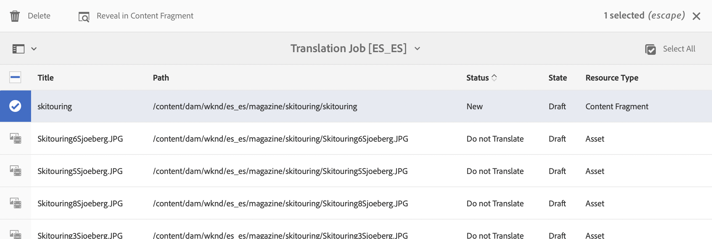
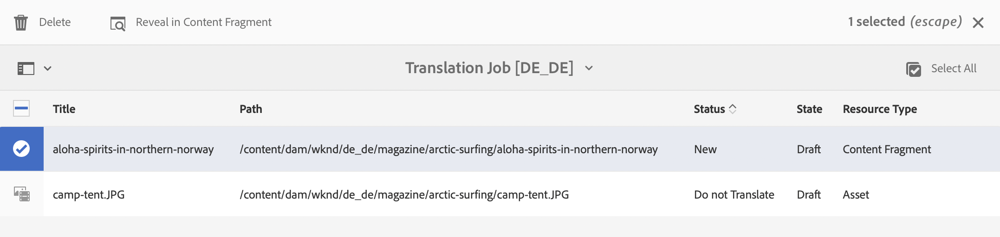

# Traducir contenido {#translate-content}

Utilice la integración de traducción y las reglas para traducir el contenido sin encabezado.

## La historia hasta ahora {#story-so-far}

AEM En el documento anterior del recorrido AEM de traducción sin encabezado de la, [Configuración de reglas de traducción](translation-rules.md), ha aprendido a utilizar las reglas de traducción de la traducción de la aplicación para identificar el contenido de la traducción. Ahora debería hacer lo siguiente:

* Comprender lo que hacen las reglas de traducción.
* Poder definir sus propias reglas de traducción.

Ahora que el conector y las reglas de traducción están configurados, este artículo le guía por el siguiente paso de traducción del contenido sin encabezado.

## Objetivo {#objective}

Este documento le ayuda a comprender cómo utilizar los proyectos de traducción de AEM junto con el conector y las reglas de traducción para traducir contenido. Después de leer este documento, debería poder hacer lo siguiente:

* Comprender qué es un proyecto de traducción.
* Crear proyectos de traducción.
* Utilice los proyectos de traducción para traducir el contenido sin encabezado.

## Creación de un proyecto de traducción {#creating-translation-project}

Los proyectos de traducción le permitirán administrar la traducción del contenido sin encabezado de AEM. Un proyecto de traducción reúne el contenido que se traduce a otros idiomas en una ubicación para obtener una vista central del esfuerzo de traducción.

Cuando se añade contenido a un proyecto de traducción, se crea un trabajo de traducción para este. Los trabajos proporcionan comandos e información de estado que se utilizan para administrar los flujos de trabajo de traducción humana y traducción automática que se ejecutan en los recursos.

Los proyectos de traducción se pueden crear de dos formas:

1. Seleccione la raíz de idioma del contenido y deje que AEM cree automáticamente el proyecto de traducción en función de la ruta de contenido.
1. Cree un proyecto vacío y seleccione manualmente el contenido que desee añadir al proyecto de traducción

Ambos son enfoques válidos que solo difieren según el usuario que realice la traducción:

* El gestor de proyectos de traducción (TPM) suele necesitar la flexibilidad de seleccionar manualmente el contenido del proyecto de traducción.
* Si el propietario del contenido también es responsable de la traducción, dejar que AEM cree automáticamente el proyecto en función de la ruta de contenido seleccionada suele ser más fácil.

Ambos enfoques se analizan en las secciones siguientes.

### Creación automática de un proyecto de traducción basado en la ruta de contenido {#automatically-creating}

Para los propietarios de contenido que también son responsables de la traducción, a menudo es más fácil dejar que AEM cree automáticamente el proyecto de traducción. Para que AEM cree automáticamente un proyecto de traducción basado en la ruta de contenido:

1. Vaya a **Navegación** > **Recursos** > **Archivos**. Recuerde que el contenido sin encabezado de AEM se almacena como recursos conocidos como Fragmentos de contenido.
1. Seleccione la raíz de idioma del proyecto. En este caso, `/content/dam/wknd/en` está seleccionado.
1. Haga clic en el selector de carril y muestre el panel **Referencias**.
1. Haga clic en **Copias de idioma**.
1. Marque la casilla de verificación **Copias de idioma**.
1. Expanda la sección **Actualizar copias de idioma** en la parte inferior del panel de referencias.
1. En el menú desplegable **Proyecto**, seleccione **Crear proyecto(s) de traducción**.
1. Proporcione un título adecuado para el proyecto de traducción.
1. Haga clic en **Iniciar**.


Recibirá un mensaje que indica que se creó el proyecto.

>[!NOTE]
>
>Se supone que ya se ha creado la estructura lingüística necesaria para los idiomas de traducción como parte de la [definición de la estructura de contenido.](getting-started.md#content-structure) Esto debería hacerse en colaboración con el arquitecto de contenido.
>
>Si las carpetas de idioma no se crean con antelación, no podrá crear copias de idioma como se describió en los pasos anteriores.

### Creación manual de un proyecto de traducción seleccionando su contenido {#manually-creating}

Para los gestores de proyectos de traducción, a menudo es necesario seleccionar manualmente contenido específico para incluirlo en un proyecto de traducción. Para crear un proyecto de traducción manual de este tipo, debe empezar creando un proyecto vacío y luego seleccionar el contenido que desea añadir.

1. Vaya a **Navegación** > **Proyectos**.
1. Haga clic en **Crear** > **Carpeta** para crear una carpeta para sus proyectos.
   * Esto es opcional, pero resulta útil para organizar los esfuerzos de traducción.
1. En la ventana **Crear carpeta**, agregue un **Título** para la carpeta y haga clic en **Crear**.

   

1. Haga clic en la carpeta para abrirla.
1. En la nueva carpeta del proyecto, haz clic en **Crear** > **Proyecto**.
1. Los proyectos se basan en plantillas. Haga clic en la plantilla **Proyecto de traducción** para seleccionarla y luego haga clic en **Siguiente**.

   

1. En la pestaña **Básico**, escriba un nombre para el nuevo proyecto.

   

1. En la ficha **Avanzado**, use el menú desplegable **Idioma de destino** para seleccionar los idiomas a los que se debe traducir el contenido. Haga clic en **Crear**.

   

1. Haga clic en **Abrir** en el cuadro de diálogo de confirmación.

   

El proyecto se ha creado, pero no contiene contenido para traducir. La siguiente sección detalla cómo se estructura el proyecto y cómo añadir contenido.

## Uso de un proyecto de traducción {#using-translation-project}

Los proyectos de traducción están diseñados para recopilar todo el contenido y las tareas relacionadas con un esfuerzo de traducción en un solo lugar para que la traducción sea sencilla y fácil de administrar.

Para ver el proyecto de traducción, haga lo siguiente:

1. Vaya a **Navegación** > **Proyectos**.
1. Haga clic en el proyecto creado en la sección anterior.


El proyecto se divide en varias tarjetas.

* **Resumen** - Esta tarjeta muestra la información básica del encabezado del proyecto, incluido el propietario, el idioma y el proveedor de traducción.
* **Trabajo de traducción**: esta tarjeta o estos programas de tarjetas proporcionan una descripción general del trabajo de traducción real, incluido el estado, el número de recursos, etc. Generalmente, hay un trabajo por idioma con el código de idioma ISO-2 anexado al nombre del trabajo.
* **Equipo** - Esta tarjeta muestra los usuarios que están colaborando en este proyecto de traducción. Este recorrido no cubre este tema.
* **Tareas**: Tareas adicionales asociadas con la traducción del contenido, como hacer elementos o elementos de flujo de trabajo. Este recorrido no cubre este tema.

El uso de un proyecto de traducción depende de cómo se creó: automáticamente por AEM o manualmente.

### Uso de un proyecto de traducción creado automáticamente {#using-automatic-project}

AEM Al crear automáticamente el proyecto de traducción, el contenido sin encabezado se evalúa en la ruta seleccionada en función de las reglas de traducción que haya definido anteriormente. Basándose en esa evaluación, extrae el contenido que requiere traducción en un nuevo proyecto de traducción.

Para ver los detalles del contenido sin encabezado incluidos en este proyecto, haga lo siguiente:

1. Haga clic en el botón de los tres puntos de la parte inferior de la tarjeta **Trabajo de traducción**.
1. La ventana **Trabajo de traducción** lista todos los elementos del trabajo.
   
1. Haga clic en una línea para ver el detalle de esa línea, teniendo en cuenta que una línea puede representar varios elementos de contenido para traducir.
1. Haga clic en la casilla de verificación de selección de un elemento de línea para ver más opciones, como la opción de eliminarlo del trabajo o verlo en los fragmentos de contenido o las consolas de Assets.
   

Normalmente, el contenido del trabajo de traducción se inicia en el estado **Borrador** tal como indica la columna **Estado** en la ventana **Trabajo de traducción**.

Para iniciar el trabajo de traducción, vuelva a la descripción general del proyecto de traducción y haga clic en las comillas angulares en la parte superior de la tarjeta **Trabajo de traducción** y seleccione **Iniciar**.


Ahora, AEM se comunica con la configuración de traducción y con el conector para enviar el contenido al servicio de traducción. Para ver el progreso de la traducción, vuelva a la ventana **Trabajo de traducción** y visualice la columna **Estado** de las entradas.


Las traducciones automáticas se devuelven automáticamente con un estado de **Aprobado**. La traducción humana permite una mayor interacción, pero está fuera del alcance de este recorrido.

### Uso de un proyecto de traducción creado manualmente {#using-manual-project}

Al crear manualmente un proyecto de traducción, AEM crea los trabajos necesarios, pero no selecciona automáticamente ningún contenido para incluirlo. Al hacerlo, el administrador del proyecto de traducción tiene la flexibilidad de elegir qué contenido traducir.

Para añadir contenido a un trabajo de traducción:

1. Haga clic en el botón de los tres puntos de la parte inferior de una de las **tarjetas de Trabajo de traducción**.
1. Compruebe que el trabajo no incluya contenido. Haga clic en el botón **Agregar** en la parte superior de la ventana y, a continuación, **Assets/Páginas** en la lista desplegable.

   

1. Se abre un navegador de rutas que le permite seleccionar específicamente qué contenido añadir. Busque el contenido y haga clic para seleccionar.

   

1. Haga clic en **Seleccionar** para agregar el contenido seleccionado al trabajo.
1. En el cuadro de diálogo **Traducir**, especifique que desea **Crear copia de idioma**.

   

1. El contenido ahora se incluye en el trabajo.

   

1. Haga clic en la casilla de verificación de selección de un elemento de línea para ver más opciones, como la opción de eliminarlo del trabajo o verlo en los fragmentos de contenido o las consolas de Assets.
   

1. Repita estos pasos para incluir todo el contenido necesario en el trabajo.

>[!TIP]
>
>El navegador de rutas es una potente herramienta que le permite buscar, filtrar y navegar por el contenido. Haga clic en el botón **Solo contenido/Filtros** para alternar el panel lateral y mostrar filtros avanzados como **Fecha de modificación** o **Estado de la traducción**.
>
>Puede obtener más información sobre el navegador de rutas en la [sección de recursos adicionales.](#additional-resources)

Puede utilizar los pasos anteriores para agregar el contenido necesario a todos los idiomas (trabajos) del proyecto. Una vez seleccionado todo el contenido, puede iniciar la traducción.

Normalmente, el contenido del trabajo de traducción se inicia en el estado **Borrador** tal como indica la columna **Estado** en la ventana **Trabajo de traducción**.

Para iniciar el trabajo de traducción, vuelva a la descripción general del proyecto de traducción y haga clic en las comillas angulares en la parte superior de la tarjeta **Trabajo de traducción** y seleccione **Iniciar**.


Ahora, AEM se comunica con la configuración de traducción y con el conector para enviar el contenido al servicio de traducción. Para ver el progreso de la traducción, vuelva a la ventana **Trabajo de traducción** y visualice la columna **Estado** de las entradas.


Las traducciones automáticas se devuelven automáticamente con un estado de **Aprobado**. La traducción humana permite una mayor interacción, pero está fuera del alcance de este recorrido.

## Revisión del contenido traducido {#reviewing}

AEM [Como se ha visto anteriormente,](#using-translation-project) el contenido traducido por el equipo vuelve a aparecer en el estado de **Aprobado**, ya que se supone que debido a que se está utilizando la traducción automática, no se requiere ninguna intervención humana. Sin embargo, todavía es posible revisar el contenido traducido.

Simplemente, vaya al trabajo de traducción completado y seleccione un elemento de línea tocando o haciendo clic en la casilla de verificación. El icono **Revelar en Fragmento de contenido** se muestra en la barra de herramientas.


Haga clic en ese icono para abrir el fragmento de contenido traducido en su consola de editor para ver los detalles del contenido traducido.


Puede modificar todavía más el contenido traducido necesario, siempre que tenga el permiso adecuado, pero la edición de fragmentos de contenido está fuera del ámbito de este recorrido. Consulte la sección [Recursos adicionales](#additional-resources) al final de este documento para obtener más información sobre este tema.

El propósito del proyecto es reunir todos los recursos relacionados con una traducción en un solo lugar para facilitar el acceso y una visión general clara. Sin embargo, como puede ver al visualizar el detalle de un elemento traducido, las propias traducciones vuelven a la carpeta de recursos del idioma de traducción. En este ejemplo, la carpeta es:

```text
/content/dam/wknd/es
```

Si va a esta carpeta a través de **Navegación** > **Assets** > **Archivos**, verá el contenido traducido.


El marco de trabajo de traducción de AEM recibe las traducciones del conector de traducción y, a continuación, crea automáticamente la estructura de contenido en función de la raíz del idioma y utilizando las traducciones proporcionadas por el conector.

Es importante comprender que este contenido no está publicado y, por consiguiente, no está disponible para los servicios sin encabezado. Aprenderá sobre esta estructura de creación y publicación y verá cómo publicar el contenido traducido en el siguiente paso del recorrido de traducción.

## Traducción humana {#human-translation}

Si el servicio de traducción proporciona traducción humana, el proceso de revisión ofrece más opciones. Por ejemplo, las traducciones vuelven al proyecto con el estado **Borrador** y deben revisarse y aprobarse o rechazarse manualmente.

La traducción humana está fuera del alcance de este recorrido de localización. Consulte la sección [Recursos adicionales](#additional-resources) al final de este documento para obtener más información sobre este tema. Sin embargo, más allá de las opciones de aprobación adicionales, el flujo de trabajo para las traducciones humanas es el mismo que las traducciones automáticas, tal como se describe en este recorrido.

## Siguientes pasos {#what-is-next}

Ahora que ha completado esta parte del recorrido de traducción sin encabezado, debe poder hacer lo siguiente:

* Comprender qué es un proyecto de traducción.
* Crear proyectos de traducción.
* Utilice los proyectos de traducción para traducir el contenido sin encabezado.

Amplíe este conocimiento y continúe con su recorrido de traducción sin encabezado de AEM revisando el documento [Publicar contenido traducido](publish-content.md). Aquí aprenderá a publicar su contenido traducido y a actualizar esas traducciones a medida que cambie el contenido raíz del idioma.

## Recursos adicionales {#additional-resources}

Aunque se recomienda pasar a la siguiente parte del recorrido de traducción sin encabezado revisando el documento [Publicar contenido traducido](publish-content.md), los siguientes son algunos recursos opcionales adicionales que profundizan en varios conceptos mencionados en este documento, pero no son necesarios para continuar el recorrido sin encabezado.

* [Administración de proyectos de traducción](/help/sites-administering/tc-manage.md): Conozca los detalles de los proyectos de traducción y las funciones adicionales, como flujos de trabajo de traducción humana y proyectos en varios idiomas.
* [Herramientas y entorno de creación](/help/sites-authoring/author-environment-tools.md#path-selection): AEM ofrece varios mecanismos para organizar y editar el contenido, incluido un explorador de rutas robusto.
