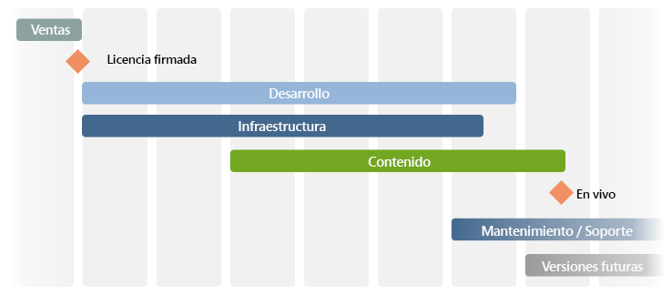

# Lista de comprobación: referencia adicional{#the-checklist-further-reference}

Esta página proporciona más detalles para obtener más información y/o ampliar los documentos y principios que se tratan en la [lista de comprobación de Administración de proyectos - prácticas recomendadas](/help/managing/best-practices.md).

## AEM - ¿Qué va a usar? {#aem-what-will-you-be-using}

>[!CAUTION]
>
>Las listas de esta subsección no son exhaustivas, sino que tienen por objeto ser una introducción.

### Funciones dentro de AEM {#features-within-aem}

Al implementar AEM (especialmente por primera vez), deberá revisar las [capacidades y flujos de trabajo de AEM](https://www.adobe.com/es/marketing/experience-manager.html) para asegurarse de qué áreas desea o necesita.

Tenga en cuenta las características de AEM que utilizará y el impacto en su diseño; por ejemplo:

* [Comercio](/help/commerce/cif-classic/administering/ecommerce.md)
* [Pantallas](https://docs.adobe.com/content/help/es-ES/experience-manager-screens/user-guide/aem-screens-introduction.html)
* [Assets](/help/assets/assets.md)
* [Etiquetas](/help/sites-administering/tags.md)
* [Traducción y administración de varios sitios](/help/sites-administering/msm-and-translation.md)
* [Forms](/help/forms/home.md)
* [Communities](/help/communities/deploy-communities.md)
* [Livefyre](https://answers.livefyre.com/product/livefyre-for-adobe-experience-manager-aem/livefyre-for-adobe-experience-manager/)

Además, consulte las [Notas de la versión](/help/release-notes/release-notes.md) para ver las distintas versiones de AEM, para ver cuándo se agregaron nuevas funciones.

### Integraciones {#integrations}

AEM puede integrarse con otros productos de Adobe y/o servicios de terceros. Esto puede aumentar la potencia y funcionalidad a su disposición.

Consulte [Integración de soluciones](/help/sites-administering/integration.md) para obtener información completa.

## ¿Migrar o actualizar? {#migrate-or-upgrade}

Una consideración importante es si desea:

* Actualice la instalación existente en su lugar.
* Migre el contenido del sistema actual a una nueva instalación.

Al pasar de una versión anterior a la versión actual hay dos opciones:

* Utilice el [Administrador de paquetes](/help/sites-administering/package-manager.md) para exportar todo el contenido y el código de aplicación del sistema antiguo al nuevo.
*  Actualice el sistema antiguo en su lugar. Esta es la opción recomendada en la mayoría de los casos.

## Reglas básicas de terreno {#basic-ground-rules}

Al igual que con cualquier proyecto, es fundamental establecer normas básicas lo antes posible. Entre estas características se incluyen:

>[!NOTE]
>
>Estos puntos son genéricos, la [lista de comprobación de prácticas recomendadas](/help/managing/best-practices.md) trata los aspectos específicos relacionados con AEM.

* **Funciones**

   Estas deberían definirse claramente y darse a conocer a todos los participantes en el proyecto. Además, es aconsejable destacar:

   * Responsables de tomar decisiones
   * Puntos de contacto

* **Responsabilidades**

   * Para cada función, una definición clara de las responsabilidades relacionadas con su proyecto ayuda a evitar confusiones.

* **Participación**

   Al hacer participar a las partes interesadas lo antes posible, puede alentarlas a que se conviertan en *partes interesadas* en el proyecto, aumentando así su compromiso con el éxito de éste.

   * En el lado del cliente esto incluye a los autores, que tendrán que trabajar con el sistema día a día.
   * Dentro de su propio equipo de proyectos, esto también incluirá a las personas responsables de la garantía de calidad. Cuanto más comprendan los requisitos del cliente, mejor podrán planificar las pruebas.

* **Rutas de comunicación**

   * Aunque no se deben formalizar excesivamente, las definiciones específicas deben garantizar que las personas clave estén siempre informadas y, por lo tanto, se mantengan actualizadas. Debe prestarse especial atención a la comunicación con partes externas.

* **Procesos**

   Los procesos que se definan dependerán del proyecto individual. Vuelva a intentar que sean simples, teniendo en cuenta:

   * Definición de procesos (y vías de comunicación) para interactuar con terceros; Por ejemplo, agencias de diseño y proveedores de software de terceros, entre otros.
   * A menudo, el cliente tendrá sus propios procedimientos y herramientas de administración de proyectos e informes.

* **Herramientas de seguimiento**

   Hay muchas herramientas disponibles para realizar el seguimiento de información sobre errores, tareas y otros aspectos de su proyecto. Consulte [Información general de las posibles herramientas](#overview-of-potential-tools) para obtener más información.

   * El punto clave a tener en cuenta aquí es mantener solo una copia de la información y compartir la información (y, por lo tanto, el acceso a la herramienta que se está utilizando). Esto facilitará el mantenimiento y ayudará a evitar discrepancias.

* **Ámbito**

   Defina claramente lo que se cubrirá con el proyecto en varios niveles:

   * las versiones individuales (si se utiliza un proceso de versión iterativo y sin importar si se entregan a los clientes o al equipo de prueba interno).
   * el proyecto AEM.
   * todo el proyecto; incluye cualquier software de terceros, su impacto en pruebas, problemas organizativos y muchos otros.
   * Para ciertos aspectos, también puede resultar útil indicar qué es *no* dentro del ámbito del proyecto. Esto puede ayudar a evitar confusiones y suposiciones incorrectas, aunque debería limitarse a cuestiones esenciales.

* **Informes**

   Defina claramente qué información presentará, en qué forma, con qué frecuencia y a quién.

* **Terminología**

   * Defina las abreviaciones y la terminología específica del cliente que se utilizarán.

* **Suposiciones**

   * Defina las suposiciones que se están realizando.

Esta información se puede definir en un Manual de proyecto; el uso de una wiki también puede ayudar a asegurar que los cambios en curso se manejen de manera eficiente. Donde se definan, los factores clave son que:

* La información se define y se mantiene
* La información se comunica claramente a todas las personas interesadas. Aunque la práctica estándar de la gestión de proyectos no se puede repetir con suficiente frecuencia como para que una definición clara de funciones y una buena comunicación puedan crear o romper un proyecto.
* Solo se conserva una versión de cualquier información que se esté rastreando; por ejemplo, seguimiento de errores, seguimiento de problemas, etc.

## Indicadores de rendimiento clave y métricas de Target {#key-performance-indicators-and-target-metrics}

Las organizaciones utilizan indicadores de rendimiento clave (KPI) para evaluar su éxito a la hora de alcanzar los objetivos. Estos indicadores son valores mensurables que pueden utilizarse para demostrar la eficacia con que se cumplen los objetivos específicos.

Estos indicadores pueden ser:

* Negocios:

   * Se utiliza para medir objetivos clave del negocio.
   * Es importante elegir los KPI adecuados para su negocio o escenario con definiciones claras de cuáles son, cómo se medirán, cómo se utilizarán y quién los usará.

* Actuación:

   * Defina cómo medir el rendimiento del sistema.
   * Algunos ejemplos son el tiempo de carga de la página, el tiempo de respuesta del servidor y el rendimiento de la consulta de la base de datos.

Algunos indicadores, pero no todos, pueden basarse en las métricas de objetivo que identifique y defina.

### Métricas de Target {#target-metrics}

Las métricas se utilizan para definir mediciones cuantitativas de la calidad del sitio web: son básicamente una definición de los objetivos de rendimiento que desea alcanzar y pueden utilizarse para definir los [KPI (indicadores de rendimiento clave)](#key-performance-indicators-and-target-metrics).

Se pueden definir muchas métricas, pero a menudo las que defina cubren sus objetivos de rendimiento y concurrencia. En particular, factores que pueden ser difíciles de cuantificar y que a menudo son propensos a la *evaluación emocional*:

* &quot;nuestro sitio web es *demasiado lento* hoy&quot; - ¿cuándo califica *lento*?

* &quot;todo *se paraliza* cuando mi colega inicia sesión&quot;: ¿cuántos usuarios simultáneos puede admitir el sistema?
* &quot;cuando busco, el sistema *se paraliza* &quot;, ¿qué tipo de solicitudes de búsqueda afectan al sistema?
* &quot;se necesita *ages* para descargar el archivo&quot;: ¿cuáles son los tiempos de descarga aceptables (en condiciones normales de red)?

Las métricas de Target se definen al principio de un proyecto para:

* indicar las dimensiones esperadas del sitio web que ofrecerá
* indicar la calidad mínima que desea alcanzar
* definir cómo se medirán realmente estos factores
* se utilizará como base para los [Indicadores clave de rendimiento](#key-performance-indicators-and-target-metrics)

Como siempre se debe tener cuidado al definir las métricas de objetivo:

* si son demasiado altas, pueden ser completamente inalcanzables
* si se establece una fluctuación demasiado baja, puede que no se resalte
* para garantizar que puedan medirse de forma repetida y coherente
* proporcionar un equilibrio entre los diferentes factores que se miden
* determinadas métricas están relacionadas con un entorno de prueba, pero algunas deberían reflejar los escenarios reales, ya que deben ser mensurables y reproducibles en el sitio web de producción
* priorizar las métricas según su importancia para el sitio web
* limitar las métricas a un conjunto que pueda monitorizarse de forma realista

Durante el desarrollo del proyecto se pueden actualizar y ajustar según corresponda. Una vez que el proyecto se haya implementado correctamente, se pueden utilizar para ayudarle a controlar la instalación y supervisar/mantener los niveles de servicio necesarios para el funcionamiento continuo.

Cuando se utilizan correctamente, estas métricas pueden proporcionar una herramienta útil; cuando se utilizan irresponsablemente, pueden ser una distracción que desperdicia tiempo. Como siempre, es necesario entender lo que se mide, cómo se mide y por qué.

>[!NOTE]
>
>En esta sección se tratarán los principios básicos y las cuestiones que deben examinarse. Cada instalación es diferente, por lo que los valores reales que se van a medir diferirán.

### Todo depende del diseño del proyecto {#everything-rests-on-your-project-design}

Todas las métricas que se van a medir se verán afectadas, de alguna manera, por el diseño del proyecto. Por el contrario, muchos problemas se solucionarán mejor mediante cambios de diseño.

Por lo tanto, debe definir las métricas de objetivo *antes de* decidir el diseño. Esto le permite optimizar el diseño en función de estos factores. Una vez que el proyecto se haya desarrollado, será difícil realizar cambios en los principios básicos de diseño.

Cuando cree la estructura para el sitio web, siga la estructura recomendada para AEM sitios web. Asegúrese de comprender los siguientes problemas y/o principios:

* Cómo estructurar el contenido del sitio web.
* Cómo funcionan las plantillas y los componentes.
* Cómo funciona el almacenamiento en caché.
* Impacto del contenido personalizado.
* Cómo funciona la función de búsqueda.
* Cómo puede utilizar CSS y tecnologías relacionadas para crear código HTML compacto y no redundante.

Si cree que el diseño no sigue las directrices o si no está seguro de algunas de las implicaciones, aclare estos problemas antes de comenzar la fase de programación o de rellenar el contenido.

### Infraestructura {#infrastructure}

Para definir o evaluar la infraestructura, ayudará a definir valores objetivo como:

* visitantes/día; media y pico
* visitas individuales/día; media y pico
* número de páginas web disponibles
* volumen de contenido web

Dependiendo de su situación y de la importancia estratégica del sitio web, esto le ayudará a evaluar y elegir su infraestructura:

* número de servidores
* número de instancias de AEM (autor y publicación)

### Actuación {#performance}

Hay varios factores de rendimiento que se pueden evaluar:

* tiempos de respuesta para páginas individuales, teniendo en cuenta:

   * tiempos de respuesta en un entorno de creación
   * tiempos de respuesta en el entorno de publicación

* tiempos de respuesta para solicitudes de búsqueda

Esta sección se puede leer junto con [Optimización del rendimiento](/help/sites-deploying/configuring-performance.md) que amplía los detalles técnicos para medir el rendimiento.

#### Tiempos de respuesta para páginas individuales {#response-times-for-individual-pages}

Un problema clave es el tiempo que tarda el sitio web en responder a las solicitudes de los visitantes.

Aunque este valor variará para cada solicitud, se puede definir un valor de objetivo promedio. Una vez comprobado que este valor es alcanzable y mantenible, puede utilizarse para monitorear el rendimiento del sitio web e indicar el desarrollo de posibles problemas

Diferentes objetivos en entornos de autor y publicación

Los tiempos de respuesta que se fijarán serán diferentes en los entornos de autor y publicación, lo que refleja la audiencia objetivo:

* **Entorno de creación**

   Este entorno lo utilizan los autores que introducen y actualizan contenido, por lo que debe:

   * se adapta a un pequeño número de usuarios que generan un número elevado de solicitudes al actualizar páginas de contenido y a los elementos individuales de esas páginas
   * sea lo más rápido posible para maximizar su productividad con el fin de incorporar el contenido a su sitio web

* **Entorno de publicación**

   Este entorno contiene contenido que puede poner a disposición de los usuarios:

   * la velocidad sigue siendo vital, pero a menudo es más lenta que un entorno de creación
   * a menudo se aplican mecanismos adicionales de mejora del rendimiento:

      * el contenido se almacena en caché
      * se aplica el equilibrio de carga

#### Configuración de los tiempos de respuesta de destino {#setting-target-response-times}

Entonces, ¿cómo puede decidir los tiempos de respuesta (promedio) alcanzables? A menudo se trata de una cuestión de experiencia:

* experiencias anteriores en su sitio web
* experiencia con AEM
* reconocimiento de páginas complejas que tienen tiempos de respuesta superiores a la media (estos deben optimizarse individualmente si es posible)

Sin embargo, en circunstancias controladas, pueden aplicarse las siguientes directrices:

* El 70 % de las solicitudes de páginas deben responder en menos de 100 ms.
* El 25% de las solicitudes de páginas deben responder en menos de 100 ms-300 ms.
* El 4 % de las solicitudes de páginas deben responder en menos de 300 ms-500 ms.
* El 1% de las solicitudes de páginas deben responder en menos de 500 ms-1000 ms.
* Ninguna página debe responder más lentamente que 1 segundo.

Los números anteriores asumen las siguientes condiciones:

* medida en la publicación (sin entorno de creación y/o sobrecarga de CFC)
* medida en el servidor (sin sobrecarga de red)
* no almacenado en caché (sin caché de salida de AEM, sin caché de Dispatcher)
* solo para elementos complejos con muchas dependencias (HTML, JS, PDF, ...)
* no hay otra carga en el sistema

Hay varios mecanismos que puede utilizar para supervisar los tiempos de respuesta:

* **Monitorización de los tiempos de respuesta con AEM request.log**

   Un buen punto de partida para el análisis de rendimiento es el registro de solicitudes. Entre otra información, puede utilizarla para ver los tiempos de respuesta de las solicitudes individuales. Consulte [Optimización del rendimiento](/help/sites-deploying/configuring-performance.md) para obtener más información.

* **Supervisión de los tiempos de respuesta con comentarios HTML**

   Los comentarios HTML se pueden utilizar para incluir información sobre el tiempo de respuesta en el origen de cada página:

   `</body> </html>v <-- Page took 58 milliseconds to be rendered by the server --> Response times for search requests`

#### Solicitudes de búsqueda {#search-requests}

Las solicitudes de búsqueda pueden tener un impacto significativo en el sitio web, en términos de:

* Tiempo de respuesta de la búsqueda real

   * Una función de búsqueda rápida es un objetivo de calidad para su sitio web

* Impacto en el rendimiento general

   * Como una función de búsqueda debe analizar (potencialmente grandes) secciones del contenido, o un índice extraído especialmente, esto puede afectar al rendimiento de todo el sistema si no está optimizado

La configuración de objetivos para solicitudes de búsqueda es, de nuevo, una cuestión de experiencia según:

* experiencia de AEM
* una evaluación de la frecuencia con la que se utilizará la búsqueda en comparación con otros objetivos
* su gestor de persistencia
* su índice de búsqueda
* la complejidad de la función de búsqueda; una función de búsqueda básica que solo permite introducir 1 término de búsqueda será más rápida que una búsqueda avanzada que permita al usuario crear afirmaciones de búsqueda complejas utilizando AND/OR/NOT.

Estas deberían planificarse e integrarse desde el inicio del proyecto. Entre los mecanismos disponibles para la vigilancia figuran:

* **Monitorización de los tiempos de respuesta de búsqueda con AEM request.log**

   De nuevo, el archivo request.log se puede utilizar para controlar los tiempos de respuesta de las solicitudes de búsqueda; consulte [Optimización del rendimiento](/help/sites-deploying/configuring-performance.md) para obtener más información.

* **Mecanismos programados para medir los tiempos de respuesta de búsqueda**

   Para personalizar la información que recopila sobre las solicitudes de búsqueda y su rendimiento, se recomienda incluir la recopilación de información en el código fuente del proyecto; consulte [Optimización del rendimiento](/help/sites-deploying/configuring-performance.md) para obtener más información.

### Concurrencia {#concurrency}

El sitio web estará disponible para varios usuarios/visitantes, tanto en el entorno de autor como de publicación. Los números son a menudo más de lo que usaba en las pruebas, pero también fluctúan y son difíciles de predecir. El sitio web deberá estar diseñado para un número promedio de usuarios/visitantes simultáneos sin notar un impacto negativo en el rendimiento. De nuevo, el `request.log` puede utilizarse para realizar pruebas de concurrencia; consulte [Optimización del rendimiento](/help/sites-deploying/configuring-performance.md) para obtener más información.

Los objetivos para el número de usuarios simultáneos dependen del tipo de entorno:

* **Entorno de creación**

   * Por lo general, el número de usuarios simultáneos puede estimarse con precisión. En total, sabrá cuántos autores tiene, aunque (probablemente) no todos estarán activos al mismo tiempo.

* **Entorno de publicación**

   * Esto es más difícil de predecir, por lo que debe seleccionar un valor de objetivo. De nuevo, esto debería basarse en la experiencia de su sitio web actual junto con expectativas realistas de su nuevo sitio web.
   * Los eventos especiales (por ejemplo, cuando publica contenido nuevo y muy popular) pueden superar las expectativas, o incluso las capacidades (como a veces se informa en la prensa cuando se ponen a la venta entradas para determinados eventos).

### Capacidad y volumen {#capacity-and-volume}

Antes de analizar las métricas relacionadas, una definición rápida de los términos:

* **Volumen**

   * Cantidad de salida que procesa y entrega el sistema.

* **Capacidad**

   * La capacidad del sistema para entregar el volumen.
   * En cada paso, la capacidad y el volumen se miden de forma diferente, como se muestra en la siguiente tabla. Para obtener el mejor rendimiento, asegúrese de que la capacidad coincide con el volumen en cada paso y de que tanto la capacidad como el volumen se comparten en todos los pasos. Por ejemplo, es posible que pueda calcular la navegación en el equipo cliente o colocarla en la caché, en lugar de calcularla en el servidor para cada solicitud.

* **Capacidad y volumen**

   | Qué / Dónde | Capacidad | Volumen |
   |---|---|---|
   | Cliente | Potencia computacional del equipo del usuario. | Complejidad del diseño de página. |
   | Red | Ancho de banda de la red. | Tamaño de la página (código, imágenes, etc.). |
   | Caché de Dispatcher | Memoria de servidor del servidor web (memoria principal y disco duro). | Servidor web (memoria principal y disco duro). Número y tamaño de las páginas en caché. |
   | Caché de salida | Memoria del servidor AEM (memoria principal y disco duro). | Número y tamaño de las páginas en la caché de salida, número de dependencias por página. La caché de Dispatcher reduce este volumen. |
   | Servidor web | Potencia computacional del servidor web. | Cantidad de solicitudes. El almacenamiento en caché reduce este volumen. |
   | Plantilla | Potencia computacional del servidor web. | Complejidad de las plantillas. |
   | Repositorio | Rendimiento del repositorio. | Número de páginas cargadas desde el repositorio. |

### Otras métricas {#other-metrics}

Las secciones anteriores detallan las principales métricas que se van a definir.

En función de sus necesidades específicas, puede resultar útil definir métricas adicionales, ya sea de forma aislada o teniendo en cuenta las clasificaciones anteriores.

Sin embargo, es preferible tener un pequeño conjunto de métricas principales y precisas que funcionen de forma fácil y fiable, en lugar de intentar medir y definir cada aspecto del sitio web. Por su naturaleza, su sitio web empezará a cambiar y evolucionar tan pronto como se entregue a sus usuarios.

## Seguridad {#security}

La seguridad es crucial y un desafío cada vez mayor. ***debe*** considerarse y planificarse desde las primeras etapas del proyecto.

La [Lista de comprobación de seguridad](/help/sites-administering/security-checklist.md) detalla los pasos que debe seguir para garantizar que la instalación de AEM sea segura cuando se implemente. Otros aspectos de seguridad se tratan en [Seguridad (al desarrollar)](/help/sites-developing/security.md) y [Administración de usuarios y seguridad](/help/sites-administering/security.md).

## Tareas paralelas e iterativas {#parallel-and-iterative-tasks}

>[!NOTE]
>
>Lo siguiente:
>
>* Ofrece una descripción general relacionada con la implementación *first* de un proyecto AEM.
>* Se concibe como una descripción general abstracta; consulte la [lista de comprobación del proyecto](/help/managing/best-practices.md) para ver fases, hitos o tareas específicos.
>* Cualquier escala de tiempo es teórica.

>

Para una nueva implementación de un proyecto de AEM estándar, tendrá que considerar tareas como:

* Entrega desde el proceso de ventas.
* Implementación de la aplicación del cliente (**Development**).
* Instalación y configuración de la infraestructura (y procesos relacionados) en el sitio del cliente (**Infraestructura**).
* Creación (o migración) del contenido (**Contenido**).
* Entrega a operaciones (**Mantenimiento/Soporte**).
* Versiones de seguimiento.

Para todos los aspectos se recomienda utilizar un enfoque iterativo:

>[!NOTE]
>
>Divida el lanzamiento del proyecto en **Soft Launch(s)** (disponibilidad reducida, varias iteraciones) y **Hard Launch** (disponibilidad completa - Activo) para permitir el ajuste, la optimización y la formación del usuario en condiciones realistas en el entorno de producción.

>[!NOTE]
>
>Consulte la [lista de comprobación del proyecto](/help/managing/best-practices.md) para ver ejemplos de tareas que debe realizar (o evaluar) durante el ciclo de vida del proyecto.

Algunos puntos a tener en cuenta para cada categoría son:

* **Desarrollo**

   * Defina primero la arquitectura base.
   * Utilice varias iteraciones (sprints) para el desarrollo:

      * La primera velocidad equivale al primer ciclo de desarrollo completo.
      * La primera impresión resulta en la primera implementación en el entorno de prueba.
      * Cada sprint tiene un resultado ejecutable.
      * Cada sprint obtiene una firma del cliente (prueba estructurada mínima con comentarios).
   * Planifique la eventualidad de una actualización de la versión de AEM disponible durante el proyecto.
   * Planifique pruebas y optimización durante las pruebas.
   * Planifique las fases de estabilización y optimización.
   * Cree un registro de elementos para planificarlos para versiones posteriores.
   * Plan para la participación y entrega de socios.

* **Infraestructura**

   * Defina primero la arquitectura base:

      * Defina los requisitos de rendimiento.
      * Defina los objetivos de rendimiento (es decir, defina claramente las expectativas).
      * Definir la arquitectura de hardware e infraestructura; incluido el tamaño.
      * Defina la implementación.
   * Usar varias iteraciones; para el primer sprint y la configuración inicial prepare:

      * Entorno de desarrollo.
      * Proceso de desarrollo.
      * Entorno de prueba.
      * Proceso de implementación (incluida la administración de la configuración).
   * Planifique varias pruebas de carga.
   * Planifique pruebas y optimización durante las pruebas.
   * Planifique una fase de estabilización y optimización.
   * Implemente en el entorno de producción lo antes posible (permita que el equipo de operaciones configure el sistema para obtener experiencia).
   * Utilice usuarios con nombre y funciones definidas lo antes posible.
   * Planifique la formación (por ejemplo, la formación de administradores).
   * Planifique el traspaso a las operaciones.

* **Contenido**

   * La arquitectura base:
      * Controla la jerarquía de contenido.
      * Ayuda a definir el concepto de contenido.
      * Define el uso y el diseño de MSM.
      * Define funciones, grupos, flujos de trabajo y permisos.
   * Considere la utilidad de crear páginas sin conexión.
   * Planifique la creación temprana de primeras páginas y contenido (para su uso en pruebas y comentarios).
   * Planifique la migración del contenido existente.
   * Planifique la &quot;migración dentro de la velocidad&quot; después de la refactorización.
   * Planifique la &quot;descarga de contenido&quot; (mapa del sitio para el contenido de lanzamiento).

## Calcular el tiempo y el esfuerzo {#estimating-time-and-effort}

En función de la lista de tareas resultante, puede realizar estimaciones iniciales del tiempo y el esfuerzo para las definiciones de tareas (de alto nivel). Estas deben incluir una indicación de quién (cliente o socio) hará qué y cuándo.

En la siguiente lista se muestran las aproximaciones estándar y las interrelaciones de esfuerzo implicadas y, por lo tanto, los costes:

>[!CAUTION]
>
>Estas cifras sólo pueden utilizarse para las estimaciones iniciales. Un desarrollador AEM experimentado debe realizar el análisis detallado.

| Fase | Esfuerzo |
|---|---|
| Desarrollo | Una estimación aproximada de 2 a 4 horas para cada nodo de componente cubrirá todos los requisitos de desarrollo. |
| Pruebas para desarrolladores | 15% del desarrollo |
| Seguimiento | 10% del desarrollo |
| Documentación | 15% del desarrollo |
| Documentación de JavaDoc | 10% del desarrollo |
| Corrección de errores | 15% del desarrollo |
| Administración de proyectos | 20% de los costos de los proyectos para la gestión y gobernanza de proyectos en curso |

A continuación, la planificación detallada puede relacionar los recursos disponibles o necesarios con los plazos y los costos.

## Arquitectura de referencia {#reference-architecture}

La arquitectura de referencia sirve para proporcionar una solución de plantilla para la arquitectura de AEM. La arquitectura de referencia aborda los problemas que se encuentran con frecuencia en los sistemas empresariales, incluidos el escalamiento, la fiabilidad y la seguridad.

Se deben definir las siguientes métricas del sitio:

| Clasificación | Definición |
|---|---|
| Número de sitios de Internet |  |
| Número de sitios de intranet |  |
| Número de bases de código (por ejemplo, si Internet y la intranet son diferentes) |  |
| Número de páginas individuales |  |
| Número de visitas al sitio/día |  |
| Número de vistas de página/día |  |
| Volumen (en GB) de transferencia de datos por día |  |
| Número de usuarios simultáneos (grupo de usuarios cerrado) |  |
| Número de visitantes simultáneos (publicación) |  |
| Número de autores simultáneos |  |
| Número de autores registrados |  |
| Número de activaciones de página/día laborable |  |
| Número de activaciones de página durante la implementación |  |

## Descripción general de las posibles herramientas {#overview-of-potential-tools}

La siguiente lista se proporciona para informarle sobre las herramientas que se pueden utilizar. Se trata de una introducción, no de una lista de recomendaciones extensa, y no debería impedir que utilice otras herramientas que prefiera.

<table>
 <tbody>
  <tr>
   <td><strong>Producto</strong></td>
   <td><strong>Descripción</strong></td>
  </tr>
  <tr>
   <td>AEM</td>
   <td>
AEM proporciona una serie de mecanismos para ayudarle a supervisar, probar, investigar y depurar su aplicación; incluido:

    <ul>
     <li><a href="/help/sites-developing/developer-mode.md">Modo de desarrollador</a></li>
     <li>La <a href="/help/sites-developing/hobbes.md">Consola de pruebas</a></li>
     <li><a href="/help/sites-administering/operations-dashboard.md">Tablero de operaciones</a></li>
     <li><a href="/help/sites-authoring/content-insights.md">Perspectiva de contenido</a></li>
     <li>El <a href="/help/sites-authoring/author-environment-tools.md#content-tree">árbol de contenido</a></li>
    </ul> </td>
  </tr>
  <tr>
   <td> </td>
   <td> </td>
  </tr>
  <tr>
   <td>Selenio</td>
   <td> Seleniumis es una herramienta de prueba de código abierto. Las pruebas se ejecutan directamente en el explorador, emulando cómo funcionan los usuarios.</td>
  </tr>
  <tr>
   <td>Microsoft Project</td>
   <td>Herramienta de administración de proyectos que se utiliza con frecuencia.</td>
  </tr>
  <tr>
   <td>Jira</td>
   <td> Jirais es una herramienta de código abierto para rastrear y administrar detalles de sus errores de software. Los flujos de trabajo se pueden imponer a los detalles del error según sea necesario.</td>
  </tr>
  <tr>
   <td>Git</td>
   <td> Gitis un software de control de revisiones.</td>
  </tr>
  <tr>
   <td>Eclipse</td>
   <td>
Eclipse es un IDE de código abierto, compuesto por varios proyectos. Se centran en la creación de una plataforma de desarrollo abierta compuesta por marcos, herramientas y tiempos de ejecución ampliables para la creación, implementación y administración de software a lo largo del ciclo de vida.
 
Consulte <a href="/help/sites-developing/howto-projects-eclipse.md">Cómo desarrollar proyectos AEM usando Eclipse</a> para obtener más información.
 </td>
  </tr>
  <tr>
   <td>IntelliJ</td>
   <td>
Un IDE profesional (y, por lo tanto, responsable de los costes de licencia) que ofrece una amplia gama de funciones. 
 
Consulte <a href="/help/sites-developing/ht-intellij.md">Cómo desarrollar proyectos AEM usando IntelliJ IDEA</a> para obtener más información.
 </td>
  </tr>
  <tr>
   <td>Maven</td>
   <td> Mavenis es una herramienta de planificación y gestión de proyectos de software que puede administrar el proceso de creación de un proyecto (software y documentación).</td>
  </tr>
 </tbody>
</table>

## Lectura adicional {#further-reading}

Además, las secciones siguientes revisten especial interés:

* [Introducción](/help/sites-deploying/deploy.md#getting-started)
* [Requisitos técnicos](/help/sites-deploying/technical-requirements.md)
* [Supervisión y mantenimiento de la instancia](/help/sites-deploying/monitoring-and-maintaining.md)

### Prácticas recomendadas   {#best-practices}

Adobe proporciona otras Prácticas recomendadas para todas las fases y audiencias:

* [Implementación](/help/sites-deploying/best-practices.md)
* [Creación  ](/help/sites-authoring/best-practices.md)
* [Administración](/help/sites-administering/administer-best-practices.md)
* [Desarrollo de](/help/sites-developing/best-practices.md)
* [Administración de proyectos](/help/managing/best-practices.md)
