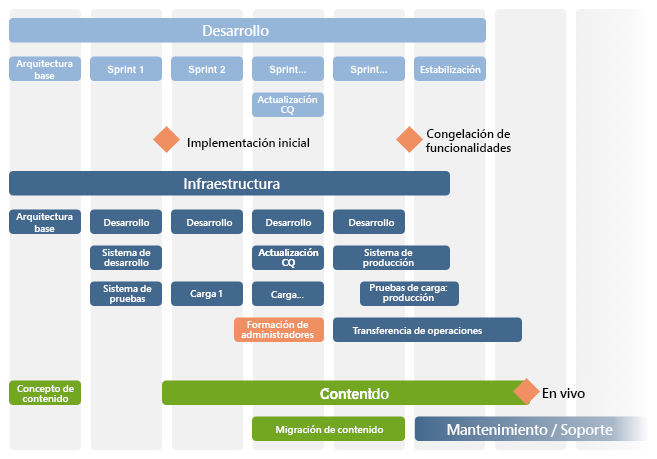

# La lista de comprobación: referencia adicional{#the-checklist-further-reference}

Esta página proporciona más información sobre los detalles que amplían o complementan los documentos y principios tratados en la [lista de verificación de prácticas recomendadas para la administración de proyectos](/help/managing/best-practices.md).

## AEM: ¿Qué va a utilizar? {#aem-what-will-you-be-using}

>[!CAUTION]
>
>Las listas de esta subsección no son exhaustivas, sino que pretenden ser una introducción.

### Funciones en AEM {#features-within-aem}

Al implementar AEM (sobre todo por primera vez), revise las [capacidades y flujos de trabajo de AEM](https://business.adobe.com/es/products/experience-manager/adobe-experience-manager.html?lang=es) para asegurarse de qué áreas quiere o necesita.

Tenga en cuenta las funciones de AEM que está utilizando y el impacto en el diseño; por ejemplo:

* [Comercio](/help/commerce/cif-classic/administering/ecommerce.md)
* [Screens](https://experienceleague.adobe.com/docs/experience-manager-screens/user-guide/aem-screens-introduction.html?lang=es)
* [Recursos](/help/assets/assets.md)
* [Etiquetas](/help/sites-administering/tags.md)
* [Traducción y administración de varios sitios](/help/sites-administering/msm-and-translation.md)
* [Formularios](/help/forms/using/introduction-aem-forms.md)
* [Comunidades](/help/communities/deploy-communities.md)

Además, consulte las [notas de la versión](/help/release-notes/release-notes.md) de las distintas versiones de AEM para ver cuándo se añadieron nuevas funciones.

### Integraciones {#integrations}

AEM se puede integrar con otros productos de Adobe, con servicios de terceros o con ambos. Estos flujos de trabajo pueden aumentar la potencia y la funcionalidad a su disposición.

Consulte [Integración de soluciones](/help/sites-administering/integration.md) para obtener información completa.

## ¿Migrar o actualizar? {#migrate-or-upgrade}

Una consideración importante es si desea realizar una de las siguientes acciones:

* Actualizar la instalación existente in situ.
* Migrar el contenido del sistema actual a una instalación nueva.

Al pasar de una versión anterior a la versión actual, hay dos opciones:

* Usar el [administrador de paquetes](/help/sites-administering/package-manager.md) para exportar todo el contenido y el código de aplicación del sistema antiguo al nuevo.
* [Actualizar](/help/sites-deploying/upgrade.md) el sistema antiguo in situ. Este método suele ser la opción recomendada.

## Reglas básicas fundamentales {#basic-ground-rules}

Al igual que con cualquier proyecto, es esencial establecer unas normas básicas lo antes posible. Estas normas incluyen lo siguiente:

>[!NOTE]
>
>Estos puntos son genéricos y la [lista de comprobación de prácticas recomendadas](/help/managing/best-practices.md) trata aspectos específicos relacionados con AEM.

* **Funciones**

  Las funciones deben definirse con claridad y darse a conocer a todas las personas involucradas en el proyecto. Además, es aconsejable destacar lo siguiente:

   * Responsables
   * Puntos de contacto

* **Responsabilidades**

   * Para cada función, una definición clara de las responsabilidades relacionadas con el proyecto ayuda a evitar confusiones.

* **Implicación**

  Si involucra a los interesados lo antes posible, puede alentarlos a convertirse en *partes interesadas* en el proyecto. Hacerlo aumenta su compromiso con que tenga éxito.

   * En el lado del cliente, esta función incluye a los autores que trabajan con el sistema a diario
   * Dentro de su propio equipo de proyecto, esta implicación también incluye a las personas responsables del control de calidad. Cuanto más comprendan los requisitos del cliente, mejor podrán planificar las pruebas.

* **Rutas de comunicación**

   * Aunque las vías de comunicación no deben formalizarse en exceso, las definiciones específicas deben garantizar que las personas clave estén siempre informadas y, por lo tanto, actualizadas. Debe prestar especial atención a la comunicación con las partes externas.

* **Procesos**

  Los procesos definidos dependen del proyecto individual. Intente de nuevo que estos procesos sigan siendo simples, teniendo en cuenta lo siguiente:

   * Definir procesos (y rutas de comunicación) para interactuar con terceros; por ejemplo, agencias de diseño y proveedores de software de terceros, entre otros.
   * A menudo, el cliente tiene sus propios procedimientos y herramientas de administración y creación de informes de proyectos.

* **Seguimiento de herramientas**

  Hay muchas herramientas disponibles para realizar el seguimiento de información sobre errores, tareas y otros aspectos del proyecto: consulte [Información general sobre herramientas potenciales](#overview-of-potential-tools) para obtener más detalles.

   * Lo principal a tener en cuenta aquí es mantener solo una copia de la información y compartirla (y por lo tanto, el acceso a la herramienta que se utiliza). Este flujo de trabajo facilita el mantenimiento y evita discrepancias.

* **Ámbito**

  Defina claramente lo que abarca el proyecto a varios niveles:

   * las versiones individuales (si se utiliza un proceso de versión iterativo e independientemente de si se entregan a los clientes o al equipo de prueba interno).
   * el proyecto de AEM.
   * todo el proyecto; incluido cualquier software de terceros, su impacto en las pruebas, problemas de organización y muchos otros.
   * Para ciertos aspectos, también puede ser útil indicar qué es lo que *no* está dentro del ámbito del proyecto. Esta idea puede evitar confusiones y suposiciones incorrectas, aunque debería limitarse a cuestiones esenciales.

* **Creación de informes**

  Defina claramente qué información desea que se notifique, en qué forma, con qué frecuencia y a quién.

* **Terminología**

   * Defina las abreviaciones o la terminología específica del cliente que desee utilizar.

* **Suposiciones**

   * Defina cualquier suposición que se haga.

Esta información se puede definir dentro de un manual de proyecto; el uso de una Wiki también puede ayudar a asegurar que los cambios en curso se gestionen de manera eficiente. Dondequiera que se definan estas suposiciones, los factores principales son los siguientes:

* La información se define y mantiene.
* La información se comunica de manera clara a todas las personas involucradas. Aunque se trata de una práctica estándar de administración de proyectos, conviene recordar que una definición clara de las funciones y una buena comunicación pueden determinar el éxito o el fracaso de un proyecto.
* Solo se conserva una versión de la información de la que se está realizando un seguimiento; por ejemplo, el seguimiento de errores y el seguimiento de problemas.

## Indicadores de rendimiento clave y métricas de destino {#key-performance-indicators-and-target-metrics}

Las organizaciones utilizan indicadores clave de rendimiento (KPI) para evaluar su éxito en la consecución de los objetivos. Estos indicadores son valores mensurables que pueden utilizarse para demostrar la eficacia con que se cumplen los objetivos específicos.

Estos indicadores pueden ser los siguientes:

* Negocio:

   * Se utiliza para medir principales objetivos comerciales.
   * Es importante elegir los KPI adecuados para su negocio/escenario, con definiciones claras de cuáles son, cómo se miden, cómo se utilizan y quién los utiliza.

* Rendimiento:

   * Defina cómo medir el rendimiento del sistema.
   * Algunos ejemplos son el tiempo de carga de la página, el tiempo de respuesta del servidor y el rendimiento de las consultas de base de datos.

Algunos indicadores, aunque no todos, pueden basarse en las métricas de destino que identifique y defina.

### Métricas de destino {#target-metrics}

Las métricas se utilizan para definir mediciones cuantitativas para la calidad del sitio web. Básicamente se trata de una definición de los objetivos de rendimiento que desea alcanzar y que se pueden usar para definir los [KPI (indicadores de rendimiento clave)](#key-performance-indicators-and-target-metrics).

Se pueden definir muchas métricas, pero a menudo las que defina cubrirán sus objetivos de rendimiento y concurrencia. En particular, los factores que pueden ser difíciles de cuantificar y que a menudo son propensos a una evaluación *emocional*:

* “el sitio web es *demasiado lento* hoy”: ¿cuándo puede catalogarse como *lento*?

* “todo *se bloquea* cuando mi compañero inicia sesión”: ¿cuántos usuarios simultáneos puede admitir el sistema?
* “cuando realizo una búsqueda, el sistema *se bloquea*”: ¿qué solicitudes de búsqueda están afectando al sistema?
* “El archivo tarda *mucho tiempo* en descargarse”: ¿cuáles son los tiempos de descarga aceptables (en condiciones de red normales)?

Las métricas de destino se definen al principio de un proyecto para:

* indique las dimensiones esperadas del sitio web que puede ofrecer
* indique la calidad mínima que desea alcanzar
* defina cómo se miden estos factores
* se utilizará como base para [Indicadores clave de rendimiento](#key-performance-indicators-and-target-metrics)

Como siempre, se debe ir con precaución al definir las métricas de destino:

* si se establecen demasiado altas, es posible que no se puedan alcanzar
* si se configuran demasiado bajas, es posible que las fluctuaciones no destaquen
* para garantizar que puedan medirse de forma repetida y coherente
* para proporcionar un equilibrio entre los diferentes factores que se miden
* algunas métricas están relacionadas con un entorno de prueba, pero otras deben reflejar escenarios reales, ya que deben ser medibles y reproducibles en el sitio web de producción
* priorice las métricas según su importancia para el sitio web
* limitar las métricas a un conjunto que pueda ser monitorizado

Durante el desarrollo del proyecto, se pueden actualizar y ajustar según corresponda. Una vez que el proyecto se ha implementado correctamente, se pueden utilizar para ayudarle a controlar la instalación y monitorizar o mantener los niveles de servicio necesarios para un funcionamiento continuo.

Cuando se utilizan correctamente, estas métricas resultan una herramienta útil; cuando se utilizan de forma inadecuada, pueden resultar una pérdida de tiempo. Como siempre, debe entender lo que está midiendo, cómo lo está midiendo y por qué.

>[!NOTE]
>
>En esta sección se analizan los principios básicos y las cuestiones que deben tenerse en cuenta. Cada instalación es diferente, por lo que los valores reales que se van a medir tienden a diferir.

### Todo está sujeto al diseño del proyecto {#everything-rests-on-your-project-design}

El diseño del proyecto afecta a todas las métricas medidas. Por el contrario, muchos problemas se resuelven mejor con cambios de diseño.

Por lo tanto, defina sus métricas de destino *antes de* tomar una decisión sobre su diseño. Al hacerlo, puede optimizar el diseño en función de estos factores. Una vez desarrollado el proyecto, resulta difícil aplicar los principios básicos de diseño.

Cuando cree la estructura del sitio web, siga la estructura recomendada para los sitios web de AEM. Asegúrese de comprender los siguientes problemas o principios:

* Cómo estructurar el contenido del sitio web.
* Cómo funcionan las plantillas y los componentes.
* ¿Cómo funciona el almacenamiento en caché?
* El potencial del contenido personalizado.
* Cómo funciona la función de búsqueda.
* Cómo puede utilizar CSS y tecnologías relacionadas para crear código HTML compacto y que no sea repetitivo.

Si cree que el diseño no sigue las directrices o si no está seguro de algunas de las implicaciones, aclare estas cuestiones. Hágalo antes de iniciar la fase de programación o de incluir el contenido.

### Infraestructura {#infrastructure}

Para definir o evaluar la infraestructura, ayuda a definir valores objetivo como:

* visitantes/día; promedio y pico
* visitas individuales/día; promedio y pico
* número de páginas web puestas a disposición
* volumen de contenido web

En función de su situación y de la importancia estratégica del sitio web, la definición de la infraestructura puede ayudarle a evaluar y elegir su infraestructura:

* número de servidores
* número de instancias de AEM (creación y publicación)

### Rendimiento {#performance}

Existen varios factores de rendimiento que se pueden evaluar:

* tiempos de respuesta para páginas individuales, teniendo en cuenta:

   * tiempos de respuesta en un entorno de creación
   * tiempos de respuesta en el entorno de publicación

* tiempos de respuesta para solicitudes de búsqueda

Esta sección puede leerse junto a [Optimización del rendimiento](/help/sites-deploying/configuring-performance.md), que amplía los detalles técnicos sobre cómo medir realmente el rendimiento.

#### Tiempos de respuesta para páginas individuales {#response-times-for-individual-pages}

Uno de los principales problemas es el tiempo que tarda el sitio web en responder a las solicitudes de los visitantes.

Aunque este valor varía según la solicitud, se puede definir un valor de objetivo promedio. Una vez que se demuestra que este valor es alcanzable y puede mantenerse, se puede utilizar para supervisar el rendimiento del sitio web e indicar el desarrollo de posibles problemas

Diferentes objetivos en los entornos de creación y publicación

Los tiempos de respuesta que busca son diferentes en los entornos de creación y publicación, y reflejan el público de destino:

* **Entorno de creación**

  Los autores que introducen y actualizan contenido utilizan este entorno, por lo que debe:

   * atender a unos pocos usuarios que generan un número elevado de solicitudes al actualizar las páginas de contenido y los elementos individuales de esas páginas
   * ser lo más rápido posible para maximizar su productividad y crear su contenido en el sitio web

* **Entorno de publicación**

  Este entorno incluye contenido que usted pone a disposición de los usuarios:

   * la velocidad sigue siendo de vital importancia, pero a menudo es más lenta que un entorno de creación
   * a menudo se aplican mecanismos adicionales de mejora del rendimiento:

      * el contenido se almacena en caché
      * se aplica el equilibrio de carga

#### Configuración de tiempos de respuesta de destinatario {#setting-target-response-times}

¿Cómo puede decidir los tiempos de respuesta alcanzables (promedio)? Tanto la pregunta como la respuesta son a menudo una cuestión de experiencia:

* experiencia en el sitio web
* experiencia con AEM
* reconocimiento de páginas complejas que tienen tiempos de respuesta superiores a la media (estas páginas deben optimizarse individualmente, si es posible)

Sin embargo, en circunstancias controladas, se pueden aplicar las siguientes directrices:

* El 70 % de las solicitudes de páginas deben responder en menos de 100 ms.
* El 25 % de las solicitudes de páginas deben responder en menos de 100 ms-300 ms.
* El 4 % de las solicitudes de páginas deben responder en menos de 300 ms-500 ms.
* El 1% de las solicitudes de páginas debe responder en menos de 500 ms-1000 ms.
* Ninguna página debe tardar más de 1 segundo en responder.

Los números anteriores dan por hecho las siguientes condiciones:

* medido en el momento de la publicación (sin entorno de creación ni sobrecarga de CFC)
* medido en el servidor (sin sobrecarga de red)
* sin almacenar en caché (sin caché de salida de AEM ni caché de Dispatcher)
* solo para elementos complejos con muchas dependencias (HTML, JS, PDF, etc.)
* no hay otra carga en el sistema

Existen varios mecanismos que puede utilizar para monitorizar los tiempos de respuesta:

* **Monitorizar los tiempos de respuesta con AEM request.log**

  Un buen punto de partida para el análisis del rendimiento es el registro de solicitudes. Entre otra información, puede ver los tiempos de respuesta de las solicitudes individuales. Consulte [la optimización de rendimiento](/help/sites-deploying/configuring-performance.md) para obtener más detalles.

* **Supervisar los tiempos de respuesta con los comentarios de HTML**

  Los comentarios de HTML pueden utilizarse para incluir información sobre el tiempo de respuesta dentro del origen de cada página:

  `</body> </html>v <-- Page took 58 milliseconds to be rendered by the server --> Response times for search requests`

#### Buscar solicitudes {#search-requests}

Las solicitudes de búsqueda pueden tener un impacto significativo en el sitio web, tanto en términos de:

* Tiempo de respuesta de la búsqueda real

   * Una función de búsqueda rápida es un objetivo de valor para su sitio web

* Impacto en el rendimiento general

   * Dado que una función de búsqueda debe escanear secciones (potencialmente grandes) del contenido, o un índice extraído especialmente, esta capacidad puede afectar el rendimiento de todo el sistema, si este no está optimizado

Establecer objetivos para solicitudes de búsqueda es, de nuevo, una cuestión de experiencia en función de lo siguiente:

* la experiencia con AEM
* una evaluación de la frecuencia con la que se utilizan las búsquedas en comparación con otros objetivos
* su administrador de persistencia
* su índice de búsqueda
* la complejidad de su función de búsqueda; una función de búsqueda básica que permite introducir un término de búsqueda es más rápida que una búsqueda avanzada que permite al usuario crear instrucciones de búsqueda complejas mediante AND/OR/NOT.

Estas solicitudes de búsqueda deben planificarse e integrarse desde el principio del proyecto. Los mecanismos disponibles para la monitorización incluyen:

* **Monitorizar los tiempos de respuesta de búsqueda con el request.log de AEM**

  De nuevo, request.log puede usarse para monitorizar los tiempos de respuesta para las solicitudes de búsqueda; consulte [Optimización del rendimiento](/help/sites-deploying/configuring-performance.md) para obtener más detalles.

* **Mecanismos programados para medir los tiempos de respuesta de búsqueda**

  Para personalizar la información recopilada acerca de las solicitudes de búsqueda y su rendimiento, se recomienda incluir la recopilación de información en el código fuente del proyecto; consulte [Optimización del rendimiento](/help/sites-deploying/configuring-performance.md) para obtener más detalles.

### Concurrencia {#concurrency}

Ponga el sitio web a disposición de algunos usuarios y visitantes, tanto en el entorno de creación como de publicación. Los números suelen ser superiores a las utilizadas en las pruebas, pero también fluctúan y resultan difíciles de predecir. Diseñe su sitio web para un número promedio de usuarios y visitantes simultáneos sin notar un impacto negativo en el rendimiento. De nuevo, use `request.log` para realizar pruebas de concurrencia. Consulte [Optimización de rendimiento](/help/sites-deploying/configuring-performance.md) para obtener más detalles.

Los objetivos para el número de usuarios simultáneos dependen del tipo de entorno:

* **Entorno de creación**

   * Por lo general, puede hacerse una estimación con cierta precisión del número de usuarios simultáneos. Puede saber cuántos autores tiene en total, aunque (probablemente) no todos están activos a la vez.

* **Entorno de publicación**

   * El entorno de publicación es más difícil de predecir, por lo que debe seleccionar un valor de destino. Una vez más, debe basarse en la experiencia de su sitio web actual junto con expectativas realistas de su nuevo sitio web.
   * Los eventos especiales (por ejemplo, cuando publica contenido nuevo y popular) pueden superar las expectativas o incluso las capacidades (como a veces se publica en la prensa cuando se ponen a la venta entradas para ciertos eventos).

### Capacidad y volumen {#capacity-and-volume}

Antes de hablar de las métricas relacionadas, definiremos brevemente los términos:

* **Volumen**

   * Cantidad de resultados que el sistema procesa y entrega.

* **Capacidad**

   * La capacidad del sistema para entregar el volumen.
   * En cada paso, la capacidad y el volumen se miden de forma diferente, como se muestra en la tabla siguiente. Para obtener el mejor rendimiento, asegúrese de que la capacidad coincida con el volumen en cada paso y de que tanto la capacidad como el volumen se comparten en cada paso. Por ejemplo, es posible que pueda calcular la navegación en el equipo cliente o guardarla en la caché en lugar de calcularla en el servidor para cada solicitud.

* **Capacidad y volumen**

  | Qué/dónde | Capacidad | Volumen |
  |---|---|---|
  | Cliente | Potencia de cálculo del equipo del usuario. | Complejidad del diseño de página. |
  | Red | Ancho de banda de red. | Tamaño de la página (código, imágenes, etc.). |
  | Caché del Dispatcher | Memoria del servidor web (memoria principal y disco duro). | Servidor web (memoria principal y disco duro). Número y tamaño de las páginas almacenadas en la caché. |
  | Caché de salida | Memoria del servidor de AEM (memoria principal y disco duro). | Número y tamaño de las páginas almacenadas en la caché de salida, el número de dependencias por página. La caché de Dispatcher reduce este volumen. |
  | Servidor web | Potencia de cálculo del servidor web. | Número de solicitudes. El almacenamiento en caché reduce este volumen. |
  | Plantilla | Potencia de cálculo del servidor web. | Complejidad de las plantillas. |
  | Repositorio | Rendimiento del repositorio. | Número de páginas cargadas desde el repositorio. |

### Otra métrica {#other-metrics}

Las secciones anteriores detallan las métricas principales que se deben definir.

En función de sus necesidades específicas, puede resultar útil definir métricas adicionales, ya sea de forma aislada o teniendo en cuenta las clasificaciones anteriores.

Sin embargo, es preferible tener un pequeño conjunto de métricas básicas y precisas que funcionen de forma fácil y fiable, en lugar de intentar medir y definir cada aspecto del sitio web. Por su propia naturaleza, su sitio web comienza a cambiar y evolucionar cuando se pone a disposición de sus usuarios.

## Seguridad {#security}

La seguridad es crucial y un desafío cada vez mayor. Se ***debe*** considerar y planificar desde las primeras etapas del proyecto.

La [lista de comprobación de seguridad](/help/sites-administering/security-checklist.md) detalla los pasos que debe seguir para asegurarse de que la instalación de AEM sea segura cuando se implemente. Se tratan otros aspectos de seguridad en [Seguridad (al desarrollar)](/help/sites-developing/security.md) y [Administración de usuarios y seguridad](/help/sites-administering/security.md).

## Tareas paralelas e iterativas {#parallel-and-iterative-tasks}

>[!NOTE]
>
>Lo siguiente:
>
>* Ofrece información general relacionada con la *primera* implementación de un proyecto de AEM.
>* Se trata de una información general resumida; consulte la [Lista de comprobación del proyecto](/help/managing/best-practices.md) para ver las fases, hitos o tareas específicos.
>* Cualquier escala de tiempo es teórica.
>

Para una nueva implementación de un proyecto de AEM estándar, tenga en cuenta tareas como las siguientes:

* Traspaso desde el proceso de ventas.
* Implementación de la aplicación del cliente (**Desarrollo**).
* Instalación y configuración de la infraestructura (y procesos relacionados) en el sitio del cliente (**Infraestructura**).
* Creación (o migración) del contenido (**Contenido**).
* Traspaso a operaciones (**Mantenimiento/Soporte**).
* Versiones de seguimiento.

Para todos los aspectos, se recomienda utilizar un enfoque iterativo:

>[!NOTE]
>
>Para permitir el ajuste, la optimización y la formación de usuarios en condiciones realistas en el entorno de producción, divida el lanzamiento del proyecto en **Lanzamiento piloto** (disponibilidad reducida, varias iteraciones) y **Lanzamiento completo** (disponibilidad completa: activo).

>[!NOTE]
>
>Consulte la [Lista de comprobación del proyecto](/help/managing/best-practices.md) para ver ejemplos de tareas que debe realizar (o evaluar) durante el ciclo de vida del proyecto.

Algunos puntos a tener en cuenta para cada categoría son:

* **Desarrollo**

   * Defina primero la arquitectura base.
   * Utilice varias iteraciones (sprints) para el desarrollo:

      * El primer sprint equivale al primer ciclo de desarrollo completo.
      * El primer sprint genera la primera implementación en el entorno de prueba.
      * Cada sprint tiene un resultado ejecutable.
      * Cada sprint obtiene la conformidad de un cliente (mínimo de prueba estructurada con comentarios).

   * Planifique la posibilidad de que se actualice la versión de AEM disponible durante el proyecto.
   * Planifique las pruebas y la optimización durante los sprints.
   * Planifique las fases de estabilización y optimización.
   * Cree un registro de elementos que se planificarán para versiones posteriores.
   * Planifique la implicación y el traspaso de socios.

* **Infraestructura**

   * Defina primero la arquitectura base:

      * Defina los requisitos de rendimiento.
      * Defina los objetivos de rendimiento (es decir, defina claramente las expectativas).
      * Defina la arquitectura de hardware e infraestructura, incluido el tamaño.
      * Defina la implementación.

   * Utilice varias iteraciones; para el primer sprint y la configuración inicial, prepare lo siguiente:

      * Entorno de desarrollo.
      * Proceso de desarrollo.
      * Entorno de prueba.
      * Proceso de implementación (incluida la administración de la configuración).

   * Planifique varias pruebas de carga.
   * Planifique las pruebas y la optimización durante los sprints.
   * Planifique una fase de estabilización y optimización.
   * Impleméntelo en el entorno de producción lo antes posible (permita que el equipo de operaciones configure el sistema para obtener experiencia).
   * Utilice usuarios con nombre y funciones definidas lo antes posible.
   * Planifique la formación (por ejemplo, la formación de administradores).
   * Plan de traspaso a operaciones.

* **Contenido**

   * La arquitectura base:
      * Determina la jerarquía de contenido.
      * Ayuda a definir el concepto de contenido.
      * Define el uso y el diseño de MSM.
      * Define funciones, grupos, flujos de trabajo y permisos.
   * Considere si la creación de páginas sin conexión resulta útil.
   * Planifique la creación anticipada de las primeras páginas y del contenido (para su uso en pruebas y comentarios).
   * Planifique la migración del contenido existente.
   * Planifique la “migración en sprint” después de la refactorización.
   * Planifique la “evolución del contenido” (mapa del sitio para contenido de lanzamiento).

## Estimación del tiempo y el esfuerzo {#estimating-time-and-effort}

Según la lista de tareas resultante, puede realizar estimaciones iniciales de tiempo y esfuerzo para las definiciones de tareas (de alto nivel). Estas estimaciones deben incluir una indicación de quién (cliente o socio) hace qué y cuándo.

La siguiente lista muestra las aproximaciones estándar y las interrelaciones del esfuerzo implicado y, por lo tanto, los costes:

>[!CAUTION]
>
>Estas cifras solo pueden utilizarse para estimaciones iniciales. Un desarrollador de AEM experimentado debe realizar el análisis detallado.

| Fase | Esfuerzo |
|---|---|
| Desarrollo | Una estimación aproximada de 2 a 4 horas para cada nodo componente que cubra todos los requisitos de desarrollo. |
| Pruebas de desarrollador | 15% de desarrollo |
| Seguimiento | 10 % del desarrollo |
| Documentación | 15% de desarrollo |
| Documentación de JavaDoc | 10 % del desarrollo |
| Corrección de errores | 15% de desarrollo |
| Administración de proyectos | El 20% de los costes del proyecto para la gestión y la gobernanza continuas del proyecto |

Una planificación detallada puede entonces relacionar los recursos disponibles o necesarios con los plazos y los costes.

## Arquitectura de referencia {#reference-architecture}

La arquitectura de referencia se proporciona para ofrecer una solución de plantilla para la arquitectura de AEM. La arquitectura de referencia aborda los problemas que suelen surgir en los sistemas empresariales, como la escalabilidad, la fiabilidad y la seguridad.

Se deben definir las siguientes métricas del sitio:

| Clasificación | Definición |
|---|---|
| Número de sitios de Internet |  |
| Número de sitios de intranet |  |
| Número de bases de código (por ejemplo, si Internet e intranet son diferentes) |  |
| Número de páginas individuales |  |
| Número de visitas al sitio por día |  |
| Número de vistas a la página por día |  |
| Volumen (en GB) de transferencia de datos por día |  |
| Número de usuarios simultáneos (grupo de usuarios cerrado) |  |
| Número de visitantes simultáneos (publicación) |  |
| Número de autores simultáneos |  |
| Número de autores registrados |  |
| Número de activaciones de la página por día laborable |  |
| Número de activaciones de la página durante la implementación |  |

## Información general de las herramientas potenciales {#overview-of-potential-tools}

La siguiente lista se proporciona para informarle de las herramientas disponibles para su uso. Está diseñada como una introducción, no como una extensa lista de recomendaciones, y no debe disuadirle de utilizar otras herramientas.

<table>
 <tbody>
  <tr>
   <td><strong>Producto</strong></td>
   <td><strong>Descripción</strong></td>
  </tr>
  <tr>
   <td>AEM</td>
   <td>
AEM proporciona una serie de mecanismos para ayudarle a monitorizar, probar, investigar y depurar su aplicación, entre los que se incluyen:

    <ul>
     <li><a href="/help/sites-developing/developer-mode.md">Modo de desarrollador</a></li>
     <li>La <a href="/help/sites-developing/hobbes.md">consola de lanzamientos</a></li>
     <li><a href="/help/sites-administering/operations-dashboard.md">Tablero de operaciones</a></li>
     <li><a href="/help/sites-authoring/content-insights.md">Perspectiva de contenido</a></li>
     <li>El <a href="/help/sites-authoring/author-environment-tools.md#content-tree">árbol de contenido</a></li>
    </ul> </td>
  </tr>
  <tr>
   <td> </td>
   <td> </td>
  </tr>
  <tr>
   <td>Selenium</td>
   <td><a href="https://www.selenium.dev/">Selenium</a> es una herramienta de prueba de código abierto. Las pruebas se ejecutan directamente en el explorador, emulando el modo de trabajar de los usuarios.</td>
  </tr>
  <tr>
   <td>Microsoft® Project</td>
   <td>Una herramienta de administración de proyectos de uso extendido.</td>
  </tr>
  <tr>
   <td>Jira</td>
   <td><a href="https://www.atlassian.com/software/jira">Jira</a> es una herramienta de código abierto que rastrea y administra los detalles de los errores de software. Los flujos de trabajo se pueden aplicar a los detalles del error según sea necesario.</td>
  </tr>
  <tr>
   <td>Git</td>
   <td><a href="https://git-scm.com/">Git</a> es un software de control de revisiones.</td>
  </tr>
  <tr>
   <td>Eclipse</td>
   <td>
Eclipse es un IDE de código abierto compuesto por varios proyectos. Se centra en la creación de una plataforma de desarrollo abierta compuesta por marcos, herramientas y tiempos de ejecución ampliables para crear, implementar y administrar software en todo el ciclo de vida.
 
Consulte <a href="/help/sites-developing/howto-projects-eclipse.md">Cómo desarrollar proyectos de AEM usando Eclipse</a> para obtener más información.
 </td>
  </tr>
  <tr>
   <td>IntelliJ</td>
   <td>
Un IDE profesional (y, por lo tanto, responsable de los costes de la licencia) que ofrece una amplia gama de funciones. 
 
Consulte <a href="/help/sites-developing/ht-intellij.md">Cómo desarrollar proyectos de AEM con IntelliJ IDEA</a> para obtener más información.
 </td>
  </tr>
  <tr>
   <td>Maven</td>
   <td><a href="https://maven.apache.org/">Maven</a> es una herramienta de comprensión y administración de proyectos de software capaz de administrar el proceso de creación de un proyecto (software y documentación).</td>
  </tr>
 </tbody>
</table>

## Lectura adicional {#further-reading}

Además, las siguientes secciones son de especial interés:

* [Introducción](/help/sites-deploying/deploy.md#getting-started)
* [Requisitos técnicos](/help/sites-deploying/technical-requirements.md)
* [Monitorización y mantenimiento de la instancia](/help/sites-deploying/monitoring-and-maintaining.md)

### Prácticas recomendadas {#best-practices}

Adobe proporciona más prácticas recomendadas para todas las fases y públicos:

* [Implementación](/help/sites-deploying/best-practices.md)
* [Creación](/help/sites-authoring/best-practices.md)
* [Administración ](/help/sites-administering/administer-best-practices.md)
* [Desarrollo](/help/sites-developing/best-practices.md)
* [Administración de proyectos](/help/managing/best-practices.md)
