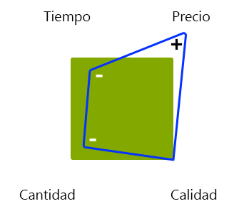

# Administración de proyectos - Lista de comprobación de optimizaciones{#managing-projects-best-practices-checklist}

La administración de un proyecto para implementar Adobe Experience Manager (AEM) requiere planificación y comprensión para asegurarse de que conoce los problemas y las decisiones (relacionadas) que debe tomar (tanto antes como durante la implementación del proyecto).

Para ayudarle, las prácticas recomendadas consisten en:

* Lista [de comprobación](/help/managing/best-practices-checklist.md) interactiva que le permite realizar un seguimiento y un seguimiento del progreso con estas prácticas recomendadas.

   * Define las entradas y los resultados según la fase, el hito y la persona.
   * Proporciona información general automatizada (calidad, salud e integridad) para indicar el progreso y el estado del proyecto.

* Documentación, basada directamente en la [lista](/help/managing/best-practices-checklist.md)de comprobación, que detalla:

   * [Análisis de Project Heartbeat](#projectheartbeat) .
   * [Información general de estado por función](#status-by-role) .
   * [Fases e hitos](#phases-and-milestones).
   * [Persona](#persona) clave y su participación en cada etapa (pertinente).
   * Un [Glosario](/help/managing/best-practices-glossary.md) de los Documentos y Entregables [Requeridos](#required-documents-and-deliverables).

* [Material de referencia](/help/managing/best-practices-further-reference.md) adicional para proporcionar más detalles sobre áreas específicas.

## Panel de latidos del proyecto {#project-heartbeat-dashboard}

La hoja de cálculo de **Project Heartbeat** proporciona una visión general gráfica de las métricas críticas de su proyecto:

* **Calidad de fase**

   * Indica la calidad de los documentos [requeridos y los elementos entregables](#required-documents-and-deliverables) en todo el proyecto.

* **Estado de fase**

   * Un indicador de estado de alto nivel para el proyecto; útil para destacar áreas que pueden estar en riesgo.

* **Finalización de fase**

   * En cualquier momento durante el proyecto esto indica cuánto se ha completado ya para cada fase del proyecto.

## Estado por función {#status-by-role}

La hoja de cálculo **Estado por Función** muestra un desglose detallado de [**Salud **,** Calidad **y** Completidad **](#projectheartbeat)por**[ Fase](#phases-and-milestones)** ****y Persona.

## Fases e hitos {#phases-and-milestones}

El plan del proyecto se divide en distintas fases (de alto nivel).

Cada fase contiene sus propios hitos. Para cada [persona](#persona) (o función), se enumeran los hitos pertinentes, junto con los documentos necesarios para producir los productos definidos.

>[!NOTE]
>
>No existe una relación directa 1:1 entre los documentos individuales requeridos y los entregables.

### Preparación {#preparation}

La preparación del proyecto constituye la base de todo el proyecto. Debe definir requisitos clave junto con objetivos y expectativas claros para:

* **Razones comerciales**

   * Las razones fundamentales y la justificación para llevar a cabo el proyecto.

* **Ámbito y programa**

   * Se debería disponer de un alcance básico y un calendario aproximado para definir lo que se necesita y en qué plazo; si ayuda a aclarar la situación, también puede definir lo que queda fuera del ámbito.

La forma en que prepare, planifique y ejecute el proyecto y la implementación de la solución se verá afectada por las restricciones que esté utilizando, por ejemplo, presupuesto fijo, cronología fija, cantidad de contenido y calidad requeridas.

Como siempre, ajustar cualquiera de los factores afectará a los demás. Por ejemplo, si se reduce el tiempo, pero se requiere el mismo nivel de calidad, probablemente se aumente el precio y se reduzca la cantidad de contenido que se puede satisfacer. El presupuesto es a menudo un factor clave, por lo que tales relaciones no pueden ser olvidadas.

Los Cuatro Factores:

#### Milestones {#milestones}

* **Validación**

   En esta fase debe validar y confirmar los objetivos del proyecto; por ejemplo:

   * ¿Qué desea lograr o proporcionar?
   * ¿Quién se beneficiará?
   * ¿Cuál es el alcance?

      * Si ayuda a aclarar la situación, también puede definir lo que queda fuera del ámbito.
   * ¿Cómo definirá el éxito?
   * ¿Cómo medirá el éxito?
   * ¿Cuáles son los requisitos, empresariales y técnicos?
   * ¿Hay sistemas heredados que reemplazar y, en caso afirmativo, hay datos que migrar?
   * ¿Quién estará involucrado?
   * ¿Cómo medirá el progreso?
   * ¿Con qué frecuencia revisará el progreso durante la vida del proyecto?

* **Presupuesto**

   Antes de comenzar cualquier proyecto, necesita una estimación confiable y realista de lo que costará implementar:

   * Utilice la información del hito de validación como base para las estimaciones.
   * Sea realista en sus estimaciones.
   * Considere y respete cualquier guía, proceso o restricción del cliente que pueda estar sujeta a él.
   * Considerar los procesos de contingencia y examen en caso de que sea necesario revisar o perfeccionar el presupuesto en una etapa posterior.
   * Recuerde que los costos se presentan de muchas formas; compras, uso de recursos y tarifas, entre otros.

### Planificación {#planning}

La planificación del proyecto consolida la preparación. Aquí tiene que empezar a convertir los objetivos y las expectativas en una hoja de ruta bien definida, compuesta de tareas concretas, unidas por una comunicación clara, con revisiones rigurosas para medir los progresos.

#### Milestones {#milestones-1}

* **Entrega**

   Una entrega limpia garantiza que la persona o los grupos apropiados sean conscientes de sus responsabilidades dentro del proyecto.

   Deben facilitarse o generarse detalles completos para garantizar que comprenden plenamente todos los aspectos pertinentes, incluida la hoja de ruta, el alcance, los objetivos, los requisitos y los KPI.

* **Evaluación de riesgos**

   Para evitar sorpresas desagradables, utilice la evaluación del riesgo para identificar y cuantificar cualquier riesgo potencial junto con su impacto y probabilidad.

   Esto debe hacerse al principio del ciclo de vida del proyecto para garantizar que se identifiquen y evalúen todas las vulnerabilidades. En base a las conclusiones, puede informar a los interesados si se pueden implementar todos los requisitos y, si es necesario, si es posible planificar las acciones adecuadas que se deben tomar y rastrear.

* **Comunicación**

   La comunicación es siempre clave para el éxito de cualquier proyecto. Debe comunicarse de forma clara y eficaz para asegurarse de que todos:

   * Trabajar por los mismos objetivos básicos
   * Desde la misma base de información
   * Con los mismos canales

* **Inicio desactivado**

   La reunión de lanzamiento se usa para crear conciencia de que el proyecto está empezando. Es una buena oportunidad para:

   * Invitar a todas las partes interesadas (o al menos a los representantes de grupos).
   * Presentar datos clave sobre el proyecto.
   * Responder preguntas.
   * Asegurarse de que todos tengan la misma base de conocimiento.
   * Obtén el compromiso de todos los que participarán, esto tendrá que ganarse.

      * Al involucrar a los principales jugadores (incluyendo a los posibles autores) al comienzo del proyecto, incrementas tus posibilidades de conseguir su compromiso con el proyecto.

### Preparación del desarrollo {#development-preparation}

Planificar el desarrollo es clave para garantizar que el proyecto se construya sobre un diseño sólido por parte de un equipo que tenga los conocimientos necesarios.

#### Milestones {#milestones-2}

* **Personal y capacitación del equipo de desarrollo**

   Antes de comenzar cualquier proyecto, debe asegurarse de que el equipo de desarrollo tenga el personal adecuado y de que todos los miembros del equipo estén formados para la tarea en cuestión.

* **Arquitectura del contenido**

   La arquitectura de contenido define y describe la arquitectura futura del contenido; incluyendo:

   * El árbol de contenido; incluir recursos
   * Estructuras básicas; incluyendo campañas, etc.
   * Estructuras multisitio y multiidioma (MSM, traducción, etc.)
   * Contenido de soporte (incluyendo etiquetas y conceptos de etiquetado)
   * Estrategias de almacenamiento en caché y reutilización de contenido

* **Arquitectura del sistema**

   La arquitectura del sistema define la vista conceptual del sistema; incluida (entre otros datos):

   * [Estructura](/help/sites-deploying/recommended-deploys.md#deployment-scenarios) del sistema para todos los entornos requeridos
   * Subsistemas
   * Sistemas de terceros
   * Interfaces; hardware, software e interacción humana
   * Servidores para cada entorno; consulte los requisitos [técnicos](/help/sites-deploying/technical-requirements.md) y las directrices de cambio de tamaño [de hardware](/help/managing/hardware-sizing-guidelines.md)

   * Procesos para cada entorno; por ejemplo, los requisitos de despliegue y mantenimiento
   * Actividades de mantenimiento (Almacén de datos GC, optimización de TarPM, etc.)
   * [Almacenamiento en caché de Dispatcher](https://helpx.adobe.com/experience-manager/dispatcher/user-guide.html)
   * [Publicación/Uso compartido autorizado de clústeres](/help/sites-deploying/recommended-deploys.md#deployment-scenarios)
   * Rendimiento del lado del cliente (JS minify, concat, sprites css, número total de solicitudes http y otras)

* **Arquitectura de aplicaciones**

   La arquitectura de la aplicación define y describe el comportamiento de las aplicaciones propuestas.

   Se centra en:

   * Cómo interactuarán entre sí y con los usuarios.
   * Los datos que deben ser consumidos y producidos por las aplicaciones, en lugar de su estructura interna.
   Las definiciones deberían abarcar:

   * Estructura básica del código para el proyecto
   * Artefactos de código (paquetes, paquetes, etc.)
   * Desgloses de las plantillas/componentes y sus relaciones
   * Detalles de alto nivel de las personalizaciones necesarias (posteriormente se realizarán superposiciones específicas)
   * Diseño de los flujos de trabajo requeridos por la solución (por ejemplo, creación de contenido, aprobación, publicación, transformaciones, importaciones, exportaciones, etc.)
   * Consideración especial para cualquier módulo complejo, como MSM, Comercio, integración de terceros

* **Integración de sistemas**

   La integración del sistema requiere que planifique (y luego implemente):

   * Cómo se unirán todos los subsistemas y las integraciones [de](/help/sites-administering/integration.md) soluciones para funcionar como un sistema coherente
   * c) Cómo se integrarán los sistemas de terceros; junto con cualquier consideración especial, como la administración sin conexión/en línea, del lado del cliente/del navegador o de la sustitución cuando un sistema de terceros está inactivo

* **Concepto de prueba**

   Antes de comenzar el desarrollo, debe elaborar un concepto exhaustivo y exhaustivo de todos los requisitos de [prueba](/help/sites-developing/planning.md) para su proyecto.

   Esto debería incluir (entre otros):

   * Detalles de todas las pruebas que deben realizarse
   * Preparación del contenido necesario para dichas pruebas
   * Información sobre las herramientas de ensayo que se utilizarán
   * Indicación de alto nivel de quién participará en los ensayos; grupos especiales fuera del equipo de control de calidad
   * Detalles de la automatización de pruebas; por ejemplo, con el modo de desarrollador Selenium o AEM

* **Diseño de experiencias**

   El diseño de experiencia (XD) implica diseñar la experiencia del usuario para su solución.

   La experiencia del usuario debe analizarse y desarrollarse tanto para los autores como para los usuarios finales del sitio web.

* **Configuración de asistencia**

   Antes del desarrollo, deben establecerse todos los procesos de soporte necesarios para implementar, lanzar, probar y notificar problemas.

   Consulte también el portal [de asistencia técnica de](https://helpx.adobe.com/marketing-cloud/contact-support.html)Adobe.

### Planificación y operaciones de operaciones {#operations-planning-and-operations}

De manera similar, las operaciones deben planificarse correctamente para asegurarse de que dispone de los entornos que necesita para todas las etapas del ciclo de vida del proyecto. También necesita los procesos adecuados para mantenerlos.

#### Milestones {#milestones-3}

* **Permisos**

   Debe planificar y luego implementar un concepto de roles y derechos para todos los usuarios o grupos que vayan a utilizar la solución.

   Por ejemplo:

   * Una lista de roles (es decir, grupos) con `read`/ `write` definiciones de acceso para cada

   * Definición del uso de privilegios que afectan al entorno de publicación; por ejemplo, `replicate`
   * Para los usuarios con privilegios mínimos, los flujos de trabajo deben definirse
   * Los usuarios del `editor` grupo no deben tener `admin` derechos ni formar parte del `administrators` grupo
   For more information, see [User Administration and Security](/help/sites-administering/security.md).

* **Supervisión y mantenimiento**

   El monitoreo y el mantenimiento son aspectos clave para garantizar el buen funcionamiento de la solución una vez que se pone en marcha. Para ello, debe definir:

   * Qué necesita supervisión
   * Tareas de mantenimiento; tanto en casos ordinarios como especiales
   Consulte también [Supervisión y mantenimiento](/help/sites-deploying/monitoring-and-maintaining.md) para obtener más información.

* **Migración**

   Cualquier contenido del sistema heredado debe revisarse y validarse para la migración.

* **Plan de recuperación**

   Asegúrese de que dispone de un plan de recuperación. En una situación de emergencia, esto debe estar disponible para garantizar el uso de AEM en la producción. Esto debería cubrir situaciones como backup, restore, failover y otras.

### Desarrollo {#development}

El desarrollo es una fase crucial que requiere algo más que simplemente codificación.

#### Milestones {#milestones-4}

* **Entorno de desarrollo**

   Planifique y documente su entorno de desarrollo, incluso:

   * Arquitectura
   * [Herramientas de desarrollo](/help/sites-developing/dev-tools.md)

      * Un entorno típico consiste en:

         * un sistema de seguimiento de problemas; como Jira
         * un IDE; como Eclipse
         * un instrumento de gestión de la construcción; como Maven
         * una herramienta para la integración continua; como Jenkins
         * una herramienta para el control de versiones; como GIT/SVN
         * un administrador de repositorio de artefactos de compilación; como Archiva/Nexus
   * Integración/dependencias de software de terceros
   * [Integración/dependencias de la solución](/help/sites-administering/integration.md)
   * Secuencia de implementación

* **Sistema de pruebas**

   Planifique y documente el entorno de prueba, incluso:

   * Arquitectura
   * d) La dependencia de las construcciones de desarrollo; incluyendo compilaciones nocturnas
   * Las posibilidades o limitaciones de probar la integración/dependencias de software de terceros
   * Herramientas de prueba
   * Estrategia de prueba automatizada

* **Sistema de producción**

   Planifique y documente su entorno de producción, incluso:

   * Arquitectura
   * Secuencia de implementación
   * Integración/dependencias de software de terceros
   * Configuración de seguridad
   * Rendimiento de línea de base verificado mediante la ejecución de pruebas [de día](/help/sites-developing/tough-day.md) duro en la configuración de producción
   * Requisitos para las pruebas de rendimiento; consulte Prácticas [recomendadas para garantizar la calidad](/help/sites-deploying/configuring-performance.md#best-practices-for-quality-assurance)

* **Integración**

   Planificar, documentar y probar todos los aspectos de la integración [del sistema y la](/help/sites-administering/integration.md)solución, incluidos:

   * Una estrategia de prueba automatizada
   * Procesos automatizados para [mover las aplicaciones de desarrollo a prueba y luego producción](/help/managing/enterprise-devops.md#code-movement)
   * Procesos automatizados para [mover contenido de producción a prueba y desarrollo](/help/managing/enterprise-devops.md#content-movement)

* **Migración**

   Planificar, documentar y probar todos los aspectos de la migración de contenido; incluyendo:

   * Arquitectura del contenido
   * Estrategia de migración

* **Comunicación**

   Asegúrese de que todos los miembros del equipo y el personaje del proyecto estén actualizados según sea necesario.

* **Documentación**

   Documentar completamente la solución; incluyendo:

   * Manual de operaciones
   * Cualquier personalización que pueda afectar a las actualizaciones
   * Notas de versión

### Rendimiento y pruebas {#performance-and-testing}

Una vez que la nueva aplicación esté disponible, tendrá que someterse a pruebas rigurosas, tanto de funcionalidad como de [rendimiento](/help/sites-deploying/configuring-performance.md).

>[!NOTE]
>
>Se debe permitir que cualquier equipo de prueba permanezca neutral y proporcione los resultados de la prueba.
>
>El director del proyecto tiene la responsabilidad de evaluar las consecuencias de los resultados y decidir las medidas apropiadas.

#### Milestones {#milestones-5}

* **Prueba de aceptación del usuario final**

   [La prueba](/help/sites-developing/acceptance-signoff.md) de aceptación del usuario (UAT) es crucial para garantizar que:

   * La solución cumple los requisitos de usuario y cliente
   * El cliente o los usuarios aceptan la solución (función, diseño y rendimiento)
   Debe haber una lista de comprobación formalizada para la entrega de los clientes; lo ideal es automatizar y ejecutar por la noche en una instantánea. Los resultados deben enviarse al director del proyecto y al equipo de desarrollo

* **Pruebas de rendimiento y carga**

   Las pruebas de rendimiento y carga se utilizan para garantizar que la solución cumple los niveles de rendimiento requeridos, en cargas medias y máximas.

   Para obtener más información sobre las pruebas de rendimiento, consulte:

   * [Prueba de rendimiento](/help/sites-deploying/configuring-performance.md)
   * [Cómo planificar y ejecutar pruebas](/help/sites-developing/planning.md)

   * [Directrices de rendimiento básicas](/help/sites-deploying/configuring-performance.md#basic-performance-guidelines)
   >[!NOTE]
   >
   >Este proceso tendrá que continuar durante el uso normal de AEM, pero estas etapas iniciales son las más cruciales.

### Despliegue {#rollout}

La implementación de la nueva aplicación requiere una planificación cuidadosa para garantizar una fácil puesta en marcha. Esto incluye confirmar un alto nivel de seguridad, capacitar a todos los usuarios potenciales y realizar múltiples pruebas para confirmar que todos los problemas han sido tratados.

#### Milestones {#milestones-6}

* **Preparación**

   La preparación y la planificación ayudarán a garantizar una implementación sin problemas.

* **Formación**

   Asegurarse de que todo el personal involucrado haya sido capacitado.

   Consulte [Adobe Experience Manager](https://training.adobe.com/training/courses.html#solution=adobeExperienceManager) en el catálogo de cursos.

* **Administradores formados**

   Asegúrese de que los administradores de soluciones tengan:

   * Ha recibido formación
   * Recibió el material de formación adecuado
   * Recibió la documentación apropiada

* **Usuarios formados**

   Asegúrese de que los autores tengan:

   * Ha recibido formación
   * Recibió el material de formación adecuado
   * Recibió la documentación apropiada; por ejemplo, la Guía del usuario

* **Pruebas de penetración**

   Las pruebas de penetración simulan un ataque a un sistema informático para identificar posibles deficiencias de seguridad.

* **Pruebas de penetración/seguridad**

   Para garantizar la seguridad de su solución, realice pruebas de penetración específicas, junto con una gama más amplia de pruebas de seguridad.

   Consulte la lista de comprobación [de seguridad](/help/sites-administering/security-checklist.md) para obtener más información.

### Go Live {#go-live}

Quieres que Go Live sea lo más suave posible. Nuevamente, los pasos finales necesitan planear una ejecución limpia.

#### Milestones {#milestones-7}

* **Preparación**

   La preparación y la planificación ayudarán a garantizar un lanzamiento sin problemas.

* **Seguridad**

   Confirme la seguridad de la solución para los usuarios internos y externos y su contenido.

* **Visitas en el orden previsto**

   Asegurarse de que todos los sistemas, procedimientos y mecanismos necesarios para la recuperación están en funcionamiento antes de la puesta en marcha.

* **Asistencia**

   Asegúrese de que los servicios de soporte estén instalados y listos.

* **Transición**

   Planifique y ejecute la transición a su entorno de producción y a los usuarios.

* **Despliegue**

   Prepara y ejecuta tus pruebas de humo.

## Grupo de usuarios {#persona}

Las listas de comprobación están diseñadas por persona. Estas son las funciones que tienen una participación significativa en el ciclo de vida del proyecto.

También hay [otra persona](#other-persona) involucrada en tareas específicas.

### Patrocinador del proyecto {#project-sponsor}

El patrocinador del proyecto es:

* Responsable de proporcionar/presentar el argumento comercial del proyecto.
* La clave para configurar y definir el alcance del proyecto; incluyendo:

   * la definición y los criterios para el éxito
   * los principales KPI

* Proporcione los hitos principales basados en la hoja de ruta del cliente.

### Administrador de proyectos {#project-manager}

El jefe de proyecto es:

* Responsable de la ejecución general del proyecto en función de los requisitos (por ejemplo, alcance, KPI, criterios de éxito y definición) proporcionados por el patrocinador del proyecto.
* Responsable de definir el presupuesto y de dotar de recursos al proyecto en función de dicho presupuesto.
* El principal punto de comunicación para toda persona involucrada en el proyecto.

### Arquitecto {#architect}

El arquitecto de la solución:

* Es responsable del diseño de alto nivel de la solución y del sistema.
* Ayuda a definir la estrategia de implementación para AEM. Por ejemplo, si se debe implementar una instalación en clúster, o una suspensión en frío o cuando se necesita una red de entrega de contenido (CDN).
* Defina también la arquitectura de la solución AEM en función de los requisitos del cliente. Esto puede incluir el concepto de funciones de usuario (con derechos relacionados), la relación entre plantillas y componentes o cuándo utilizar la administración de varios sitios.

### Analista de negocios {#business-analyst}

El analista de negocios:

* Es el principal responsable de reunir y analizar los requisitos de alto nivel, transformándolos luego en especificaciones:

   * para que el administrador del proyecto lo utilice al planificar el desarrollo
   * para que el equipo de desarrollo trabaje durante el diseño y el desarrollo.

* Trabaja estrechamente con el cliente para analizar los requisitos. Coinciden con esto:

   * La definición de éxito.
   * Criterios para el éxito.
   * KPI (basados tanto en el negocio como en el rendimiento).

### Líder en desarrollo {#development-lead}

La iniciativa de desarrollo:

* Es responsable de la ejecución técnica del proyecto.
* Es responsable de seleccionar una metodología de desarrollo que cumpla con los requisitos del cliente.
* Elabora la estrategia de desarrollo:

   * garantizar que esté alineado con los KPI de rendimiento y negocios
   * teniendo en cuenta los criterios y la definición de éxito

* Trabaja estrechamente con el arquitecto (especialmente al elaborar la estrategia de desarrollo para AEM) para definir aspectos como la relación entre plantillas y componentes, la estrategia de integración para aplicaciones de terceros y cualquier funcionalidad especializada.

### Líder de calidad {#quality-lead}

El plomo en la calidad:

* Es responsable de la calidad de la entrega; garantizar que cumple los criterios de éxito y los KPI definidos por el cliente.
* Define las métricas de calidad, se alinea con todas las partes interesadas, elabora los planes de prueba y garantiza su ejecución.
* Crea y envía informes a los interesados del proyecto.

### Ingeniero de sistemas {#system-engineer}

El ingeniero del sistema:

* Es responsable de supervisar la infraestructura del proyecto.
* Es responsable de:

   * la configuración de entornos de pruebas y desarrollo internos
   * para hacer coincidir esos sistemas con los sistemas cliente

* Proporciona recomendaciones de hardware, supervisa las distintas implementaciones y proporciona soporte de operaciones antes y después de su lanzamiento.

### Líder de seguridad {#security-lead}

El líder de seguridad:

* Es responsable del concepto general de seguridad de la solución, asegurándose de que esté alineada con cualquier requerimiento y política del cliente.
* Ofrece un concepto de seguridad, operaciones de seguridad y recomendaciones para cualquier concepto de seguridad basado en hardware; como zonas y servidores de seguridad.

### Otras personas {#other-persona}

* Partes interesadas

   * Personas (a menudo de la empresa) que tienen interés (en) en el éxito del proyecto. A menudo contribuyen al presupuesto.

* Oficio

   * Se requiere asesoramiento jurídico al negociar contratos.

* Formadores

   * Según la escala y la naturaleza del proyecto, se pueden utilizar instructores especializados para preparar y presentar sesiones de capacitación para los grupos pertinentes.

* Escritores técnicos

   * Según la escala y la naturaleza del proyecto, se pueden utilizar escritores técnicos especializados para redactar directrices y manuales para grupos específicos; Por ejemplo, un manual de mantenimiento para administradores del sistema o una guía del usuario para los autores.

* Administradores de sistemas

   * Responsable del funcionamiento continuo del sistema.

* Autores y usuarios finales

   * Personas que utilizarán el sistema para crear y mantener el contenido del sitio web.

## Documentos requeridos y productos entregables {#required-documents-and-deliverables}

Las listas de comprobación cubren los documentos **y** productos **** necesarios para cada hito.

* No hay una relación 1:1 entre estos; por ejemplo, un grupo de documentos requeridos puede resultar en una única entrega.
* Una entrega de una persona puede ser un documento requerido para otra persona durante el mismo hito.

### Documentos requeridos {#required-documents}

Los documentos **** requeridos son necesarios para la persona adecuada cuando se producen sus productos.

Para cada documento **requerido** , el usuario debe indicar:

* **Y/N**: si se ha recibido.
* **1-3**: una indicación de la calidad del documento recibido.

### Elementos que entregar {#deliverables}

Para cada hito, la persona adecuada es responsable de entregar documentos específicos y, por lo tanto, de cumplir con sus responsabilidades para un hito específico.

Para cada **entrega** , la persona debe indicar:

* **Y/N**: si se ha completado.

Los elementos entregables se utilizan a menudo como documentos **** requeridos para el hito actual o posterior.

## Prácticas recomendadas relacionadas {#related-best-practices}

Para conocer las prácticas recomendadas sobre la implementación, administración, desarrollo o creación, consulte:

* Otras prácticas recomendadas y directrices relacionadas con la administración de un proyecto de AEM:
   * [Pautas para configurar el tamaño del hardware](/help/managing/hardware-sizing-guidelines.md) 
   * [Operaciones de desarrollo empresarial](/help/managing/enterprise-devops.md)
   * [Recomendaciones para la administración de direcciones URL y SEO](/help/managing/seo-and-url-management.md) 
   * [AEM y las directrices de accesibilidad web](/help/managing/web-accessibility.md) 
   * [Reglamento](/help/managing/data-protection-and-privacy.md)general de protección de datos* [Implementación y mantenimiento de las mejores prácticas](/help/sites-deploying/best-practices.md)
* [Prácticas recomendadas sobre administración](/help/sites-administering/administer-best-practices.md)
* [Prácticas recomendadas sobre desarrollo](/help/sites-developing/best-practices.md)
* [Prácticas recomendadas de creación](/help/sites-authoring/best-practices.md)

## Áreas de documentación clave {#key-documentation-areas}

* Documentación de AEM Además, las siguientes secciones de la documentación de AEM son de particular interés (sin embargo, esta lista no es exhaustiva):

   * [Seguridad](/help/sites-developing/security.md)
   * [Implementaciones recomendadas](/help/sites-deploying/recommended-deploys.md)
   * [Operaciones de desarrollo empresarial](/help/managing/enterprise-devops.md)
   * [Tamaño de hardware](/help/managing/hardware-sizing-guidelines.md)
   * Conceptos de AEM:

      * [Desarrollo: lo básico](/help/sites-developing/the-basics.md)
      * [Conceptos de MSM](/help/sites-administering/msm.md)
      * [Lenguaje de plantilla HTML (HTL)](https://docs.adobe.com/content/help/en/experience-manager-htl/using/overview.html)

* Documentación relacionada

   * Adobe Experience Cloud: [Planificación de Adobe Experience Cloud](https://helpx.adobe.com/marketing-cloud/how-to/planning.html)

