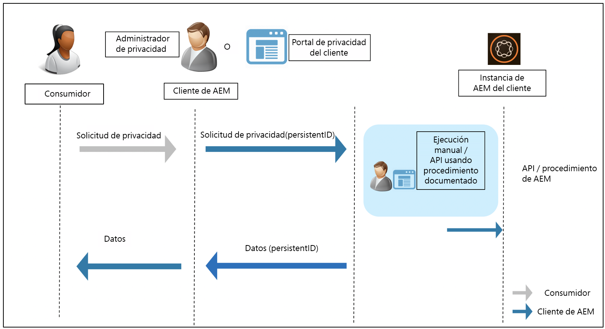

# Normas de preparación para la protección de datos y privacidad de datos de Adobe Experience Manager {#aem-readiness-for-data-protection-and-data-privacy-regulations}

>[!WARNING]
>
>El contenido del presente documento no constituye asesoramiento jurídico y no sustituye al asesoramiento jurídico.
>
>Consulte con el departamento legal de su compañía para obtener asesoramiento sobre las normas de protección de datos y privacidad de datos.

>[!NOTE]
>
>Para obtener más información sobre la respuesta del Adobe a los problemas de privacidad y lo que esto significa para usted como cliente de Adobe, consulte [Centro de privacidad de Adobe](https://www.adobe.com/privacy.html).

Adobe proporciona documentación y procedimientos (con API cuando están disponibles), para que el administrador de privacidad del cliente o AEM administrador se encargue de la protección de datos y las solicitudes de privacidad de datos y ayude a nuestros clientes a cumplir con estas normativas. Los procedimientos documentados permitirán a los clientes ejecutar las solicitudes reglamentarias manualmente o llamando a las API, cuando estén disponibles, desde un portal o servicio externo.

>[!CAUTION]
>
>Los detalles documentados aquí están restringidos a Adobe Experience Manager.
>
>Los datos de otro servicio a petición de Adobe, junto con las solicitudes de privacidad relacionadas, requerirán que se realicen acciones en ese servicio.
>
>Para obtener más información, consulte [Centro de privacidad de Adobe](https://www.adobe.com/privacy.html).

## Introducción {#introduction}

Las instancias de Adobe Experience Manager, y las aplicaciones que se ejecutan en ellas, son propiedad de nuestros clientes y son operadas por ellos.

En consecuencia, las regulaciones de protección de datos, como el RGPD, la CCPA y otras, son en gran medida responsabilidad de los clientes.

Como breve introducción, las regulaciones para la protección y la privacidad de los datos incluyen nuevas normas que deben ir seguidas de las funciones de:

* Entidades comerciales (CCPA) y/o controladores de datos (RGPD)

* proveedores de servicio (CCPA) y/o procesadores de datos (RGPD)

Las principales disposiciones de esos reglamentos son las siguientes:

1. Definición ampliada de datos personales para incluir todos los ID únicos; como en datos identificables directa e indirectamente.

2. Reforzar los requisitos de consentimiento.

3. Se ha aumentado el enfoque en los derechos de eliminación (Eliminación de datos).

4. Exclusión de la venta de datos.

Para Adobe Experience Manager:

* Las instancias, y las aplicaciones que se ejecutan en ellas, son propiedad del cliente y son operadas por él.

   * Esto significa que el cliente gestiona las funciones reglamentarias, incluidas las entidades comerciales y el Proveedor de servicio, el controlador de datos y el procesador de datos, entre otras.

   * El Adobe Experience Platform Privacy Service no formará parte del flujo de trabajo para AEM, como se ilustra en el diagrama siguiente.

* AEM incluye documentación y procedimientos para que el administrador de privacidad del cliente y/o AEM administrador ejecuten las solicitudes de regulación de privacidad; manualmente o a través de API, cuando esté disponible.

* No se ha agregado ningún servicio ni interfaz de usuario nuevos.

   * En su lugar, los procedimientos y las API están documentados para su uso por las UI/portales del cliente que gestionan solicitudes de regulación de privacidad.

* No AEM ninguna herramienta lista para usar para admitir el flujo de trabajo de las solicitudes de privacidad.

   * Adobe proporcionará documentación y procedimientos para el administrador de privacidad del cliente y/o AEM administrador, permitiéndole ejecutar manualmente las solicitudes relacionadas con las normativas de privacidad.

Adobe proporciona procedimientos para gestionar solicitudes de privacidad relacionadas con Acceso, Eliminación y Exclusión para Adobe Experience Manager. En algunos casos, hay API disponibles que se pueden llamar desde un portal desarrollado por el cliente o desde scripts para ayudar con la automatización.

El diagrama siguiente ilustra el aspecto que podría tener un flujo de trabajo de solicitud de privacidad (ilustrado con Adobe Experience Manager 6.5):

## Preparación para Adobe Experience Manager y Regulaciones {#aem-and-regulatory-readiness}

Consulte las secciones siguientes para obtener documentación reglamentaria sobre las áreas de producto de AEM.

## AEM Foundation {#aem-foundation}

Consulte [Administración de solicitudes de privacidad y protección de datos para la base de AEM](/help/sites-administering/handling-gdpr-requests-for-aem-platform.md).

## AEM Optando por la recopilación de estadísticas de uso Acumulado {#aem-opting-into-aggregate-usage-statistics-collection}

Consulte [Recopilación de estadísticas de uso agregadas](/help/sites-deploying/opt-in-aggregated-usage-statistics.md).

## AEM Sites {#aem-sites}

Consulte [AEM Sites - Protección de datos y preparación para la privacidad.](/help/sites-administering/gdpr-compliance-sites.md)

## AEM Commerce {#aem-commerce}

Consulte [Comercio AEM - Protección de datos y preparación para la privacidad](/help/sites-administering/gdpr-compliance-commerce.md).

## AEM Mobile {#aem-mobile}

Consulte [AEM Mobile - Protección de datos y preparación para la privacidad](/help/mobile/aem-mobile-gdpr-compliance.md).

## Integración AEM con Adobe Target y Adobe Analytics {#aem-integration-with-adobe-target-adobe-analytics}

Estas integraciones de Adobe Experience Manager se realizan con servicios listos para protección de datos y privacidad (por ejemplo, GDPR o CCPA). No se almacenan datos personales de Adobe Target o Adobe Analytics en AEM en relación con las integraciones.
Para obtener más información, consulte:

* [Adobe Target: Información general de privacidad](https://docs.adobe.com/content/help/en/target/using/implement-target/before-implement/privacy/privacy.html)

* [Flujo de trabajo de privacidad de datos de Adobe Analytics](https://docs.adobe.com/content/help/en/analytics/admin/data-governance/an-gdpr-workflow.html)

## AEM Communities {#aem-communities}

AEM Communities concede a los sujetos de datos el derecho a su portabilidad de datos, el derecho de acceso y el derecho a ser olvidados mediante [API integradas](/help/communities/user-ugc-management-service.md). Estas API permiten la eliminación masiva y la exportación masiva de contenido generado por el usuario, así como la desactivación de cuentas de usuario identificadas mediante sus ID autorizados. Sin embargo, la eliminación permanente de la cuenta de usuario es realizable mediante la eliminación del nodo de usuario en el CRXDE Lite, lo que responde a la necesidad de una fácil exclusión del sistema.

Además, AEM Communities oferta la privacidad mediante el diseño gracias a su consola de Moderación masiva, que permite a los miembros privilegiados encontrar y eliminar las contribuciones y los detalles de los usuarios. La consola de administración Miembros permite limitar hasta el punto de prohibir un colaborador. Además, autoriza a los interesados a suprimir las contribuciones que hayan aportado.

## AEM Forms {#aem-forms}

AEM Forms incluye componentes y flujos de trabajo que capturan, procesan y almacenan datos para orquestar procesos empresariales y realizar transacciones digitales. Los diferentes componentes utilizan diferentes almacenes de datos y permiten la integración con los almacenes de datos personalizados. En la siguiente documentación se explican los procedimientos y las directrices para acceder a los datos de usuario y gestionarlos a fin de que sean compatibles con los flujos de trabajo de protección de datos y privacidad (por ejemplo, RGPD o CCPA) de un componente.

* [Forms Portal](/help/forms/using/forms-portal-handling-user-data.md)
* [Administración de correspondencia](/help/forms/using/correspondence-management-handling-user-data.md)
* [Integración con Adobe Sign](/help/forms/using/integration-adobe-sign-handling-user-data.md)
* [Flujos de trabajo centrados en Forms en OSGi](/help/forms/using/forms-workflow-osgi-handling-user-data.md)
* [Flujos de trabajo](/help/forms/using/forms-workflow-jee-handling-user-data.md)  Forms JEE (solo AEM Forms JEE)
* [Seguridad](/help/forms/using/document-security-handling-user-data.md)  de documento (solo AEM Forms JEE)
* [Administración](/help/forms/using/user-management-handling-user-data.md)  de usuarios (solo AEM Forms JEE)
