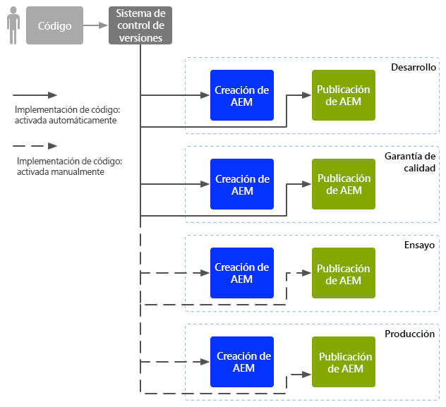
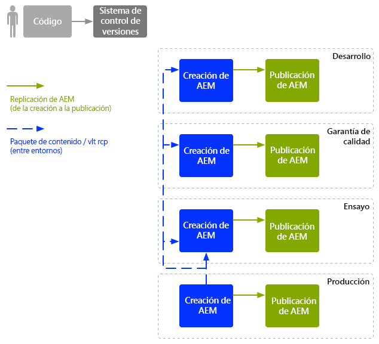

# Operaciones de desarrollo empresarial{#enterprise-devops}

Las operaciones de desarrollo empresarial abarcan los procesos, métodos y comunicaciones necesarios para lo siguiente:

* Facilitar la implementación del software en los distintos entornos.
* Simplificar la colaboración entre los equipos de desarrollo, prueba e implementación.

Las operaciones de desarrollo empresarial tienen como objetivo evitar problemas como los siguientes:

* Errores manuales.
* Elementos olvidados; por ejemplo, archivos, detalles de configuración.
* Discrepancias; por ejemplo, entre el entorno local de un desarrollador y otros entornos.

## Entornos {#environments}

Una implementación de Adobe Experience Manager (AEM) suele consistir en múltiples entornos, que se utilizan para diferentes propósitos en diferentes niveles:

* [Desarrollo](#development)
* [Garantía de calidad](#quality-assurance)
* [Ensayo](#staging)
* [Producción](#production-author-and-publish)

>[!NOTE]
>
>El entorno de producción debe tener al menos un autor y un entorno de publicación.
>
>Se recomienda que todos los demás entornos también consten de un entorno de creación y publicación para reflejar el entorno de producción y permitir las pruebas tempranas.

### Desarrollo {#development}

Los desarrolladores son responsables de desarrollar y personalizar el proyecto propuesto (ya sea sitio web, aplicaciones móviles, implementación de DAM, etc.), con toda la funcionalidad requerida. Estos procedimientos:

* desarrollan y personalizan los elementos necesarios; por ejemplo, plantillas, componentes, flujos de trabajo, aplicaciones.
* Realizan el diseño.
* Desarrollan los servicios y secuencias de comandos necesarias para implementar la funcionalidad requerida.

La configuración del entorno de [desarrollo](/help/sites-developing/best-practices.md) puede depender de diversos factores, aunque suele estar compuesta de:

* Un sistema de desarrollo integrado con control de versiones para proporcionar una base de código integrada. Se utiliza para combinar y consolidar código de los entornos de desarrollo individuales utilizados por cada desarrollador.
* Un entorno personal para cada desarrollador que normalmente reside en su equipo local. A intervalos adecuados, el código se sincroniza con el sistema de control de versiones.

Según la escala del sistema, el entorno de desarrollo puede tener instancias de creación y publicación.

### Garantía de calidad {#quality-assurance}

Este entorno lo utiliza el equipo de garantía de calidad para [probar](/help/sites-developing/test-plan.md) de forma completa el nuevo sistema; diseño y función. Debe tener entornos de creación y de publicación, con contenido adecuado, y proporcionar todos los servicios necesarios para permitir un conjunto de todas las aplicaciones de pruebas.

### Ensayo {#staging}

El entorno de ensayo debe ser un reflejo del entorno de producción: configuración, código y contenido:

* Se utiliza para probar las secuencias de comandos utilizadas para implementar la implementación real.
* Puede utilizarse para pruebas finales (diseño, funcionalidad e interfaces) antes de implementarse en los entornos de producción.
* Aunque no siempre es posible que el entorno de ensayo sea idéntico al entorno de producción, debería ser lo más parecido posible para permitir las pruebas de carga y rendimiento.

### Producción: creación y publicación {#production-author-and-publish}

El entorno de producción consiste en los entornos necesarios para [crear y publicar](/help/sites-authoring/author.md#concept-of-authoring-and-publishing) realmente la implementación.

Un entorno de producción consta de al menos una instancia de autor y una instancia de publicación:

* Instancia [de creación](#author) para la entrada de contenido.
* Una instancia de [publicación](#publish) para el contenido disponible para los visitantes y usuarios.

Según la escala del proyecto, a menudo consta de varias instancias de autor o publicación. En un nivel inferior, el repositorio también se puede agrupar en varios casos.

#### Autor {#author}

Las instancias de autor generalmente se encuentran detrás del servidor de seguridad interno. Este es el entorno en el que usted y sus colegas realizan las siguientes tareas de creación:

* administrar todo el sistema.
* Introducir el contenido.
* Configurar el diseño del contenido.
* Activar el contenido en el entorno de publicación.

El contenido que se activó se empaqueta y se coloca en la cola de replicación del entorno del autor. A continuación, el proceso de replicación transporta ese contenido al entorno de publicación.

Para volver a replicar los datos generados en un entorno de publicación en el entorno de creación, un detector de replicación del entorno de autor sondeará el entorno de publicación y recuperará dicho contenido del buzón de salida de replicación inversa del entorno de publicación.

#### Publicación {#publish}

Normalmente, un entorno de publicación se encuentra en la zona desmilitarizada (DMZ). Este es el entorno en el que los visitantes acceden al contenido (por ejemplo, a través de un sitio web o en forma de aplicación móvil) e interactuarán con él; ya sea pública o dentro de la intranet. El entorno de publicación:

* contiene el contenido replicado desde el entorno de creación.
* Pone ese contenido a disposición de los visitantes.
* Almacena los datos de usuario generados por sus visitantes, como comentarios u otros envíos de formularios.
* Puede configurarse para añadir esos datos de usuario a una bandeja de salida, para la replicación inversa de vuelta al entorno de creación.

El entorno de publicación genera el contenido dinámicamente en tiempo real y el contenido se puede personalizar para cada usuario.

## Movimiento de código {#code-movement}

El código siempre debe propagarse de abajo a arriba:

* el código se desarrolla inicialmente en el entorno de desarrollo local y luego en el entorno de desarrollo integrado.
* Seguido de pruebas exhaustivas en los entornos de control de calidad.
* A continuación, se vuelve a probar en los entornos de ensayo.
* Solo entonces debe implementarse el código en los entornos de producción.

El código (por ejemplo, las plantillas de diseño y la funcionalidad personalizada de la aplicación web) se transfiere generalmente con la exportación e importación de paquetes entre los distintos repositorios de contenido. Cuando es significativa, esta replicación puede configurarse como un proceso automático.

AEM proyectos suelen activar la implementación de código:

* Automáticamente: para su transferencia a los entornos de desarrollo y control de calidad.
* Manualmente: las implementaciones en los entornos de ensayo y producción se realizan de manera más controlada, a menudo manual; aunque la automatización es posible si es necesario.

## Movimiento de contenido {#content-movement}

El contenido que se esté creando para la producción **siempre** se debe crear en la instancia de creación de producción.

El contenido no debe seguir el movimiento del código de entornos inferiores a los superiores, ya que hacer que los autores creen contenido en máquinas locales o entornos inferiores y luego moverlo al entorno de producción no es una buena práctica y es probable que presente errores e incoherencias.

El contenido de producción debe trasladarse del entorno de producción al entorno de ensayo para garantizar que el entorno de ensayo proporcione un entorno de prueba eficaz y preciso.

>[!NOTE]
>
>Esto no significa que el contenido de ensayo tenga que sincronizarse continuamente con la producción; las actualizaciones regulares son suficientes, pero especialmente antes de probar una nueva iteración de código. El contenido en los entornos de control de calidad y desarrollo no necesita actualizarse con tanta frecuencia, solo debe ser una buena representación del contenido de producción.

El contenido se puede transferir de la siguiente manera:

* Entre los distintos entornos, mediante la exportación e importación de paquetes.
* Entre diferentes instancias: replicando directamente ([replicación de AEM](/help/sites-deploying/replication.md)) el contenido (utilizando una conexión HTTP o HTTPS).

