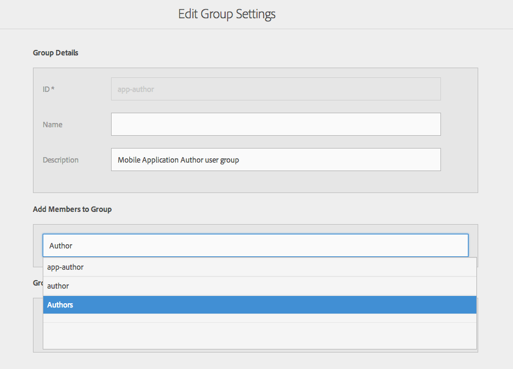

# Configurar usuarios y grupos de usuarios {#configure-your-users-and-user-groups}

>[!NOTE]
>
>Adobe recomienda utilizar el Editor de SPA para proyectos que requieren una representación del lado del cliente basada en el marco de aplicaciones de una sola página (por ejemplo, React). [Más información](/help/sites-developing/spa-overview.md).

En este capítulo se describen las funciones de usuario y cómo configurar los usuarios y grupos para que admitan la creación y administración de sus aplicaciones móviles.

## Usuarios de aplicaciones de AEM Mobile y administración de grupos {#aem-mobile-application-users-and-group-administration}

### Autores de contenido de aplicaciones de AEM Mobile (grupo de autores de aplicaciones) {#aem-mobile-application-content-authors-app-author-group}

Los miembros del grupo de creación de aplicaciones son responsables de la creación AEM contenido de aplicaciones móviles, incluidas páginas, texto, imágenes y vídeos.

#### Configuración de grupo: app-authors {#group-configuration-app-authors}

1. Cree un nuevo grupo de usuarios llamado &quot;app-authors&quot;:

   Vaya al Admin Console de usuario: [http://localhost:4502/libs/granite/security/content/groupadmin.html](http://localhost:4502/libs/granite/security/content/groupadmin.html)

   Desde la consola de grupos de usuarios, seleccione el botón &quot;+&quot; para crear un grupo.

   Establezca el ID de este grupo en &quot;autores de aplicaciones&quot; para indicar que es un tipo específico de grupo de usuarios de autor específico para la creación de aplicaciones móviles en AEM.

1. Agregar miembro al grupo: Autores

   

1. Ahora que ha creado el grupo de usuarios de autores de aplicaciones, puede agregar miembros individuales del equipo a este nuevo grupo a través del [Consola de administración de usuarios](http://localhost:4502/libs/granite/security/content/useradmin.md).

   

1. Lo siguiente le permite agregar a AEM grupo de autores de contenido:

   (Leído) en

   * /app
   * /etc/clientlibs
   * /etc/designs
   * /etc/cloudservices/dps2015

### Grupo de administradores de aplicaciones de AEM Mobile (grupo de administradores de aplicaciones) {#aem-mobile-application-administrators-group-app-admins-group}

Los miembros del grupo de administradores de aplicaciones pueden crear contenido de aplicación con los mismos permisos incluidos con los autores de aplicaciones **Y** además son responsables de:

* Ensayo, publicación y limpieza de las actualizaciones de OTA de ContentSync de la aplicación

>[!NOTE]
>
>Los permisos determinan la disponibilidad de algunas acciones del usuario en el Centro de comandos de la aplicación AEM.
>
>Verá que algunas opciones no están disponibles para los autores de aplicaciones que están disponibles para los administradores de aplicaciones.

### Configuración de grupo: administradores de aplicaciones {#group-configuration-app-admins}

1. Cree un nuevo grupo llamado administradores de aplicaciones.
1. Agregue los siguientes grupos a su nuevo grupo de administradores de aplicaciones:

   * content-authors
   * flujo de trabajo-usuarios

   

   >[!NOTE]
   >
   >los usuarios de flujo de trabajo son necesarios para la compilación remota con el servicio de PhoneGap Build

1. Vaya a la [Consola de permisos](http://localhost:4502/useradmin) y agregar permisos para administrar cloudservices

   * (Leer, Modificar, Crear, Eliminar, Replicar) en /etc/cloudservices/mobileservices

1. En la misma consola Permisos, agregue permisos a las actualizaciones de contenido de la aplicación de ensayo, publicación y borrado;

   * (Leer, Modificar, Crear, Eliminar, Replicar) en /etc/packages/mobileapp
   * (Leído) en /var/contentsync

   >[!NOTE]
   >
   >La duplicación de paquetes se utiliza para publicar actualizaciones de aplicaciones de la instancia de autor para publicar instancias

   >[!CAUTION]
   >
   >El acceso a /var/contentsync está denegado a OOTB.
   >
   >Omitir el permiso READ puede resultar en la creación y replicación de paquetes de actualización vacíos.

1. Agregue miembros a este grupo según sea necesario
1. Para exportar contenido o cargar

   * (Leer) en /etc/contentsync para acceder a las plantillas de exportación
   * (Leer) en /var a para la travesía de ruta en lecturas
   * (Leer, escribir, modificar, eliminar) en /var/contentsync para escribir, leer y limpiar el contenido de exportación en caché de ContentSync

### Recursos adicionales {#additional-resources}

Para obtener más información sobre las otras dos funciones y responsabilidades para crear una aplicación de AEM Mobile On-demand Services, consulte los siguientes recursos:

* [Desarrollo de contenido de AEM para AEM Mobile On-demand Services](/help/mobile/aem-mobile-on-demand.md)
* [Creación de contenido AEM para aplicaciones de AEM Mobile On-demand Services](/help/mobile/mobile-apps-ondemand.md)
