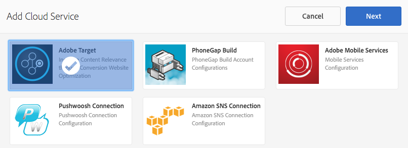

# Configuración del Cloud Service de Adobe Target {#configuring-adobe-target-cloud-service}

>[!NOTE]
>
>Adobe SPA recomienda utilizar el Editor de para proyectos que requieran una representación del lado del cliente basada en el marco de trabajo de la aplicación de una sola página (por ejemplo, React). [Más información](/help/sites-developing/spa-overview.md).

>[!NOTE]
>
>Este documento forma parte del [Introducción a Adobe Experience Manager AEM () Mobile](/help/mobile/getting-started-aem-mobile.md) Guía, un punto de partida recomendado para referencia de AEM Mobile.

Existen varios pasos que deben cumplirse para que los autores de contenido puedan empezar a generar contenido de destino para aplicaciones móviles: Obtención del conjunto adecuado de permisos para usuarios y grupos, creación de servicios en la nube, configuración de la aplicación para la actividad y, finalmente, generación del contenido.

El supuesto a partir de ahora es que la [Aplicación de referencia híbrida de AEM Mobile](https://github.com/Adobe-Marketing-Cloud-Apps/aem-mobile-hybrid-reference) se ha implementado correctamente y se puede acceder a él mediante el panel de AEM Mobile.

## Permisos {#permissions}

Los usuarios que necesitan acceder a la consola de personalización deben formar parte de `target-activity-authors` grupo. Se sugiere que, como parte de la configuración de usuarios y grupos, el grupo de actividad de destinatario se agregue al grupo de administradores de aplicaciones. Al agregar el grupo target-activity-authors, esto permite a los usuarios ver la entrada del menú de navegación Personalización.

Si se olvida agregar los usuarios o grupos a los que desea tener acceso con el Admin Console de personalización al grupo target-activity-authors, los usuarios no podrán ver la consola de personalización.

## Cloud Services {#cloud-services}

Para que el contenido de destino funcione para aplicaciones móviles, hay dos servicios que deben configurarse: el servicio Adobe Target y el servicio Adobe Mobile Services. El servicio Adobe Target proporciona el motor para procesar las solicitudes de los clientes y devolver el contenido personalizado. El servicio de Adobe Mobile Services proporciona la conexión entre los servicios de Adobe y la aplicación móvil a través del archivo ADBMobileConfig.json, que consume el complemento AMS Cordova. Desde el panel de control de AEM Mobile, puede configurar la aplicación añadiendo los dos servicios.

## Cloud Service de Adobe Target {#adobe-target-cloud-service}

En el panel de AEM Mobile, busque Administrar Cloud Service y haga clic en el botón +.

En el asistente Agregar Cloud Service, seleccione la tarjeta de servicio en la nube Adobe Target y haga clic en Siguiente.

En la lista desplegable Seleccionar una configuración, puede crear una configuración o seleccionar una de las existentes. Para crear una configuración, seleccione &quot;Crear configuración&quot; en la lista desplegable. Introduzca un título para la configuración de Target. Introduzca el código de cliente, el correo electrónico y la contraseña asociados a su cuenta de Target. Si no conoce los valores de estos campos, póngase en contacto con el servicio de asistencia de Adobe Target. Haga clic en el botón &quot;Verificar&quot; para validar las credenciales. Una vez verificado, haga clic en el botón Enviar para crear el servicio en la nube.

El servicio en la nube que se crea se asocia automáticamente a la aplicación móvil mediante el asistente. El valor de la propiedad cq:cloudserviceconfigs se establece en el nodo jcr:content del nodo de grupo de aplicaciones. Para el ejemplo de aplicación híbrida, se establece en /content/mobileapps/hybrid-reference-app/jcr:content con el valor que señala al nodo de marco de trabajo generado automáticamente en /etc/cloudservices/testandtarget/adobe-target-aem-apps/framework. El nodo de marco de trabajo tiene dos propiedades establecidas de forma predeterminada: sexo y edad. AEM El marco de trabajo solo se utiliza con la vista previa de la vista previa de la y no tiene ningún impacto en el dispositivo.

Una vez completado el asistente, el mosaico Administrar Cloud Service contiene el servicio en la nube de Target, pero contiene una advertencia sobre la falta de una cuenta de Adobe Mobile Service.

## Adobe Mobile Service {#adobe-mobile-service}

Es necesario vincular también una cuenta de Adobe Mobile Services (AMS) a la aplicación. El servicio AMS proporciona el archivo ADBMobileConfig.json requerido que contiene la información del código de cliente de Target. Antes de crear una asociación con la cuenta de AMS, la cuenta de AMS debe ser modificada por un usuario que tenga permisos de AMS.

### Código de cliente {#client-code}

Para iniciar sesión en los servicios de AMS, visite [https://mobilemarketing.adobe.com](https://mobilemarketing.adobe.com/), seleccione la aplicación móvil y haga clic en la configuración. Busque el campo Opciones de Target de SDK, coloque el código de cliente en el campo y haga clic en Guardar.

Ahora que el código de cliente se ha asociado a la aplicación móvil, cuando el servicio en la nube de AMS se configura mediante el Panel de control móvil de Adobe, los ajustes de los servicios se entregarán mediante el archivo ADBMobileConfig.json.

### No se pudo entregar el servicio de Adobe Mobile {#adobe-mobile-service-could-service}

Ahora que AMS está configurado, es hora de asociar la aplicación móvil al Tablero móvil de Adobe. En el panel de AEM Mobile, busque Administrar Cloud Service y haga clic en el botón +.

Seleccione la tarjeta de Adobe Mobile Services y haga clic en Siguiente.

En el paso del asistente Crear o Seleccionar, seleccione la lista desplegable Mobile Services y la entrada Crear configuración. Proporcione un título, una empresa, un nombre de usuario y una contraseña, y seleccione el centro de datos adecuado. Si no conoce estos valores, póngase en contacto con el administrador de Adobe Mobile Services para obtenerlos. Una vez rellenados todos los campos, haga clic en **Verificar**. El proceso de verificación va a AMS y verifica las credenciales de la cuenta. Una vez validada correctamente, se rellenará una lista de aplicaciones móviles en la que se seleccionará la aplicación móvil asociada en el menú desplegable. Haga clic en el botón Enviar para completar el asistente. El proceso puede tardar un poco en obtener los datos de configuración y cualquier análisis asociado con la aplicación. Una vez completado el proceso, haga clic en **Listo** del modal para volver al Panel de control móvil de Adobe.

Al volver al panel móvil, el mosaico Administrar Cloud Service contiene el servicio en la nube de AMS. Además, el mosaico Analizar métricas se rellena con informes de ciclo vital.

## Controladores de sincronización de contenido de Target {#target-content-sync-handlers}

AEM Para enviar contenido al dispositivo del usuario, el contenido se genera procesando las ofertas creadas por los autores de contenido Para gestionar la renderización de ofertas de destino, hay un nuevo controlador de sincronización de contenido que procesa las ofertas. Utilizando la aplicación de referencia híbrida como ejemplo, el paquete de contenido en (inglés) contiene ContentSyncConfig con un [mobileappoffers](https://github.com/Adobe-Marketing-Cloud-Apps/aem-mobile-hybrid-reference/blob/master/aem-package/content-author/src/main/content/jcr_root/content/mobileapps/hybrid-reference-app/en/_jcr_content/pge-app/app-config-dev/targetOffers/.content.xml) controlador. El siguiente paso es crucial para procesar ofertas en el dispositivo. El controlador de ofertas móviles tiene una propiedad path que identifica la ruta a la actividad de personalización que se utiliza para la aplicación.

Por ejemplo, si hay una actividad en */content/campaigns/hybridref*, copie esta ruta y péguela como el valor en *ruta* propiedad del controlador mobileapps.

Para la aplicación de referencia híbrida, hay dos controladores de ofertas móviles, uno para desarrollo y otro para producciones.

Una vez establecida la ruta de las actividades en la propiedad path del controlador de ofertas móviles, guarde el controlador. El controlador ya está listo para iniciar las ofertas de procesamiento para dispositivos móviles.

### Modo de procesamiento {#render-mode}

El controlador mobileapps está configurado de forma diferente para las configuraciones de publicación y desarrollo. Para las configuraciones de publicación hay una propiedad llamada *renderMode* con un valor de *publicar* se establece en el nodo cq:ContentSyncConfig. El controlador mobileapps hace referencia a renderMode y, si se establece en publish, edita el id de mbox que se crea. AEM De forma predeterminada, los mboxes que crea el usuario tienen el valor —author anexado al id de mbox. Esto identifica que la actividad no se ha publicado y debe utilizar la campaña sin publicar para las resoluciones de oferta.

Cuando el contenido se almacena en zona intermedia mediante el panel de Adobe Mobile, el contenido almacenado en zona intermedia se considera contenido listo para la producción y se procesa mediante la configuración de sincronización de contenido no desarrollada. Procesar de esta manera hace que —author se elimine de todos los id de mbox y espere que una actividad publicada esté disponible en el servidor de Target. Antes de probar el contenido ensayado, asegúrese de que la actividad se publique.

## Creación de contenido {#creating-content}

Ahora que se han creado los servicios en la nube y se ha configurado el controlador de ofertas móviles, los autores de contenido pueden empezar a generar experiencias segmentadas.
