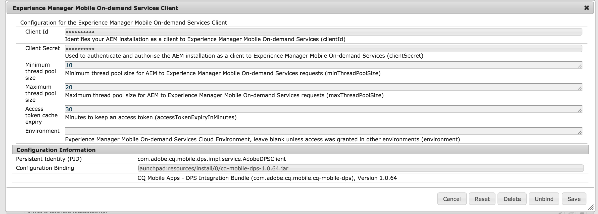

# Configuración de AEM Mobile{#aem-mobile-setup}

{{ue-over-mobile}}

>[!CAUTION]
>
>Los clientes existentes de aplicaciones móviles de Adobe Experience Manager (AEM) que migran de AEM 6.2 o 6.3 a AEM 6.5 pueden seguir utilizando aplicaciones de AEM Mobile descargando un paquete de Uso compartido de paquetes. Sin embargo, las nuevas instalaciones de AEM 6.5 no admiten la funcionalidad de aplicaciones de AEM Mobile.

Para utilizar AEM para producir contenido para aplicaciones de AEM Mobile, debe integrar la instancia de AEM con la cuenta y los proyectos de AEM Mobile On-demand Services basados en la nube.

Siga estos pasos para configurar AEM Mobile y permitir así al usuario crear y administrar el contenido dentro de AEM.

## Aprovisionamiento de AEM Mobile {#aem-mobile-provisioning}

Para empezar a configurar AEM Mobile, debe hacer lo siguiente:

* **Solicitar una clave de API**: para acceder a la API de On-Demand Services, debe solicitar una clave de API. Para solicitar la clave de API, completa el [formulario de PDF](https://helpx.adobe.com/digital-publishing-solution/help/aem-mobile-end-of-life-faq.html). Enviar el formulario completado al Soporte técnico de Adobe Developer: [wwds@adobe.com](mailto:wwds@adobe.com)

* **Generar el ID de dispositivo y el token de dispositivo**: Una vez que haya recibido la clave de API, puede generar el ID de dispositivo y el token de dispositivo. Vaya a `https://aex.aemmobile.adobe.com` y haga lo siguiente:

   * Proporcione la clave API
   * Inicie sesión con un Adobe ID que haya agregado a un proyecto de AEM Mobile con los siguientes permisos (consulte los pasos a continuación para crear un proyecto)

      * Administración > Administrar proyectos y usuarios
      * Contenido > Añadir y editar contenido, Eliminar contenido, Ver contenido, Publicar contenido

Si se cumplen todas las condiciones, se generan un ID de dispositivo y un token de dispositivo.

>[!NOTE]
>
>Se debe otorgar acceso a la Adobe ID necesaria en un proyecto de AEM Mobile. Consulte [Administración de cuentas para AEM Mobile](https://helpx.adobe.com/digital-publishing-solution/help/aem-mobile-end-of-life-faq.html) en la Ayuda en línea.

## Creación de proyectos para AEM Mobile {#creating-projects-for-aem-mobile}

Al crear un proyecto, se especifica la configuración de cualquier plataforma de destino: iOS, Android™, Windows y Desktop Web Viewer. Muchos de los ajustes del proyecto que especifique afectan al comportamiento de la aplicación.

Para crear un proyecto es necesario iniciar sesión en el portal de On-Demand Services con un Adobe ID que tenga la función de administrador maestro. La edición de un proyecto requiere un rol de administrador maestro o un rol de usuario con el permiso **Administrar proyectos y usuarios**.

>[!NOTE]
>
>Para obtener más información sobre la creación de proyectos en AEM Mobile, haga clic [aquí](https://helpx.adobe.com/digital-publishing-solution/help/creating-projects.html).

## Configuración de un conector de AEM Mobile {#configuring-an-aem-mobile-connector}

La configuración de AEM implica los siguientes pasos para la configuración del conector. Una vez completada la configuración del conector de AEM Mobile, el usuario puede configurar grupos de usuarios y permisos.

El conector AEM Mobile On-Demand se utiliza para enlazar el contenido administrado por AEM Mobile con los servicios bajo demanda de Adobe Experience Manager Mobile. Esto permite a los autores de contenido crear y administrar material para aplicaciones móviles mediante las herramientas de AEM, así como utilizar los servicios bajo demanda de AEM Mobile para facilitar la distribución de contenido móvil.

>[!NOTE]
>
>Este es un paso único para configurar la instancia de AEM.

### Configuración del cliente de AEM Mobile On-demand Services {#configuring-aem-mobile-on-demand-services-client}

Complete los pasos de configuración para que las integraciones de AEM Mobile funcionen correctamente.

1. Ir a la configuración del servicio OSGI

   1. AEM > Herramientas > Operaciones > Consola web
   1. Desplácese o busque ***Cliente de Experience Manager Mobile On-demand Services (antes cliente de Adobe Digital Publishing Solution)***

1. Editar ***cliente de Experience Manager Mobile On-demand Services***

   1. **(Obligatorio)** Introduzca los campos obligatorios:

      1. ID de cliente.
      1. Secreto del cliente.

   1. **(Opcional)** Editar valores existentes.

1. Guarde los cambios.
1. Este es un ejemplo de configuración:

### Configuración de AEM Mobile On-demand Services Cloud Service {#configuring-aem-mobile-on-demand-services-cloudservice}

1. Vaya a Cloud Services.

   1. AEM > Herramientas > Implementación > [CloudServices](http://localhost:4502/libs/cq/core/content/tools/cloudservices.html). Desplácese o busque ***Adobe Experience Manager Mobile On-demand Services***

1. Seleccione ***Configurar ahora*** o ***Mostrar configuraciones*** y seleccione el icono de agregar configuración.

1. Crear una configuración

   1. Escribir un título y un nombre
   1. Introducir ID de dispositivo
   1. Introducir token de dispositivo
   1. Seleccione ***Probar la configuración del dispositivo*** para validar los valores introducidos
   1. Seleccione Aceptar

## Adición de funciones de usuario de AEM Mobile y asignación de permisos {#adding-aem-mobile-user-roles-and-assigning-permissions}

Después de crear un proyecto, debe crear funciones y conceder acceso a los usuarios. Los administradores maestros son los únicos que pueden crear y editar funciones. Al crear una función, habilita las capacidades (o los permisos) para los usuarios a los que se asignan dichos permisos. Por ejemplo, puede crear una función que incluya permisos para la creación de aplicaciones y otra función que incluya permisos para la creación y publicación de contenido.

En el desarrollo de aplicaciones de AEM Mobile, existen tres funciones diferentes:

* Administrador
* Desarrollador
* Autor

Para obtener más información sobre cómo crear funciones con diferentes permisos, como crear aplicaciones o crear y publicar contenido, haga clic en [Crear funciones de usuario y conceder acceso](https://helpx.adobe.com/digital-publishing-solution/help/account-admin-dps.html) en la Ayuda de AEM Mobile.

>[!NOTE]
>
>La administración del contenido de la aplicación requiere un esfuerzo colectivo por parte de los desarrolladores, los autores de contenido y los administradores. Los autores manipulan las páginas, que a su vez se basan en plantillas y componentes generados por los desarrolladores de aplicaciones. Por último, los administradores publican de forma estratégica el contenido actualizado de la aplicación. La configuración de Grupos y permisos de AEM define sus funciones en el panel de aplicaciones o en el Centro de control.
>
>Ver [Panel de AEM Mobile](/help/mobile/mobile-apps-ondemand-application-dashboard.md).

Cuando haya terminado de crear funciones con diferentes permisos, como generar aplicaciones o crear y publicar contenido, consulte [**Configurar el usuario y los grupos de usuarios**](/help/mobile/aem-mobile-configure-users.md). Al hacerlo, puede configurar a los usuarios y grupos para que admitan la creación y administración de sus aplicaciones móviles.

### Recursos adicionales {#additional-resources}

Para obtener más información sobre las otras dos funciones y responsabilidades a la hora de crear una aplicación de AEM Mobile On-demand Services, consulte los siguientes recursos:

* [Desarrollo del contenido de AEM para AEM Mobile On-demand Services](/help/mobile/aem-mobile-on-demand.md)
* [Creación de contenido de AEM para la aplicación de AEM Mobile On-demand Services](/help/mobile/mobile-apps-ondemand.md)

>[!NOTE]
>
>Para obtener una vista previa del contenido de la aplicación, incluidas las páginas de exploración y los artículos, vea [Vista previa con comprobaciones](/help/mobile/aem-mobile-manage-ondemand-services.md).
