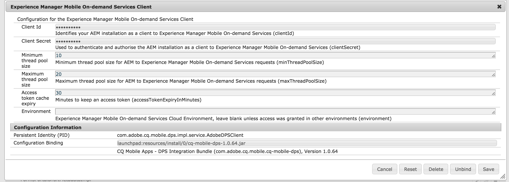

# Configuración de AEM Mobile{#aem-mobile-setup}

>[!NOTE]
>
>Adobe SPA recomienda utilizar el Editor de para proyectos que requieran una representación del lado del cliente basada en el marco de trabajo de la aplicación de una sola página (por ejemplo, React). [Más información](/help/sites-developing/spa-overview.md).

>[!CAUTION]
>
>Los clientes existentes de Adobe Experience Manager AEM AEM AEM () Mobile Apps que migran de la versión 6.2 o 6.3 a la versión 6.5 de la aplicación de AEM Mobile pueden seguir usando este servicio descargando un paquete desde Uso compartido de paquetes. AEM Sin embargo, las nuevas instalaciones de 6.5 no admiten la funcionalidad de aplicaciones de AEM Mobile.

AEM Para utilizar la para producir contenido para aplicaciones de AEM Mobile AEM, debe integrar la instancia de la instancia de la con la cuenta y los proyectos de AEM Mobile On-demand Services basados en la nube.

Siga estos pasos para configurar AEM Mobile AEM y, por lo tanto, permitir al usuario crear y administrar el contenido dentro de los elementos de la interfaz de usuario de la interfaz de usuario de.

## Aprovisionamiento de AEM Mobile {#aem-mobile-provisioning}

Para empezar a configurar AEM Mobile, debe hacer lo siguiente:

* **Solicitar una clave de API**: para acceder a la API de On-Demand Services, debe solicitar una clave de API. Para solicitar la clave de API, complete el [formulario de PDF](https://helpx.adobe.com/digital-publishing-solution/help/aem-mobile-end-of-life-faq.html). Envíe el formulario completado al Soporte técnico de Adobe Developer: [wwds@adobe.com](mailto:wwds@adobe.com)

* **Generar el ID de dispositivo y el token de dispositivo**: Una vez que haya recibido la clave de API, puede generar el ID y el token del dispositivo. Ir a `https://aex.aemmobile.adobe.com` y haga lo siguiente:

   * Proporcione la clave API
   * Inicie sesión con un Adobe ID que haya agregado a un proyecto de AEM Mobile con los siguientes permisos (consulte los pasos a continuación para crear un proyecto)

      * Administración > Administrar proyectos y usuarios
      * Contenido > Añadir y editar contenido, Eliminar contenido, Ver contenido, Publicar contenido

Si se cumplen todas las condiciones, se generan un ID de dispositivo y un token de dispositivo.

>[!NOTE]
>
>Se debe otorgar acceso a la Adobe ID necesaria en un proyecto de AEM Mobile. Consulte [Administración de cuentas para AEM Mobile](https://helpx.adobe.com/digital-publishing-solution/help/aem-mobile-end-of-life-faq.html) en la Ayuda en línea.

## Creación de proyectos para AEM Mobile {#creating-projects-for-aem-mobile}

Al crear un proyecto, se especifica la configuración de cualquier plataforma de destino: iOS, Android™, Windows y Desktop Web Viewer. Muchos de los ajustes del proyecto que especifique afectan al comportamiento de la aplicación.

Para crear un proyecto es necesario iniciar sesión en el portal de On-Demand Services con un Adobe ID que tenga la función de administrador maestro. La edición de un proyecto requiere una función de administrador maestro o una función de usuario con un **Administrar proyectos y usuarios** permiso.

>[!NOTE]
>
>Para obtener más información sobre la creación de proyectos en AEM Mobile, haga clic en [aquí](https://helpx.adobe.com/digital-publishing-solution/help/creating-projects.html).

## Configuración de un conector de AEM Mobile {#configuring-an-aem-mobile-connector}

AEM La configuración del conector implica los siguientes pasos para la configuración del conector. Una vez completada la configuración del conector de AEM Mobile, el usuario puede configurar grupos de usuarios y permisos.

El conector AEM Mobile On-Demand se utiliza para enlazar el contenido administrado por AEM Mobile con los servicios bajo demanda de Adobe Experience Manager Mobile. AEM Esto permite a los autores de contenido crear y administrar material para aplicaciones móviles mediante herramientas de, así como utilizar los servicios bajo demanda de AEM Mobile para facilitar la distribución de contenido móvil.

>[!NOTE]
>
>AEM Este es un paso de un solo uso para configurar la instancia de.

### Configuración del cliente de AEM Mobile On-demand Services {#configuring-aem-mobile-on-demand-services-client}

Complete los pasos de configuración para que las integraciones de AEM Mobile funcionen correctamente.

1. Ir a la configuración del servicio OSGI

   1. AEM > Herramientas > Operaciones > Consola web
   1. Desplazarse o buscar ***Cliente de Experience Manager Mobile On-demand Services (antes cliente de Adobe Digital Publishing Solution)***

1. Editar ***Cliente de Experience Manager Mobile On-demand Services***

   1. **(Obligatorio)** Introduzca los campos obligatorios:

      1. ID del cliente.
      1. Secreto de cliente.

   1. **(Opcional)** Edite los valores existentes.

1. Guarde los cambios.
1. Este es un ejemplo de configuración:

### Configuración de AEM Mobile On-demand Services Cloud Service {#configuring-aem-mobile-on-demand-services-cloudservice}

1. Ve con los Cloud Service.

   1. AEM > Herramientas > Implementación > [CloudServices](http://localhost:4502/libs/cq/core/content/tools/cloudservices.html). Desplazarse o buscar ***Adobe Experience Manager Mobile On-demand Services***

1. Seleccionar ***Configurar ahora*** o ***Mostrar configuraciones*** y seleccione el icono añadir configuración.

1. Crear una configuración

   1. Escriba un título y un nombre
   1. Introducir ID de dispositivo
   1. Introducir token de dispositivo
   1. Seleccionar ***Probar configuración del dispositivo*** para validar los valores introducidos
   1. Seleccione Aceptar

## Adición de funciones de usuario de AEM Mobile y asignación de permisos {#adding-aem-mobile-user-roles-and-assigning-permissions}

Después de crear un proyecto, debe crear funciones y conceder acceso a los usuarios. Los administradores maestros son los únicos que pueden crear y editar funciones. Al crear una función, habilita las capacidades (o los permisos) para los usuarios a los que se asignan dichos permisos. Por ejemplo, puede crear una función que incluya permisos para la creación de aplicaciones y otra función que incluya permisos para la creación y publicación de contenido.

En el desarrollo de aplicaciones de AEM Mobile, existen tres funciones diferentes:

* Administrador
* Desarrollador
* Autor

Para obtener más información sobre la creación de funciones con diferentes permisos, como para la creación de aplicaciones o para crear y publicar contenido, haga clic en [Creación de funciones de usuario y concesión de acceso](https://helpx.adobe.com/digital-publishing-solution/help/account-admin-dps.html) en la Ayuda de AEM Mobile.

>[!NOTE]
>
>La administración del contenido de la aplicación requiere un esfuerzo colectivo por parte de los desarrolladores, los autores de contenido y los administradores. Los autores manipulan las páginas, que a su vez se basan en plantillas y componentes generados por los desarrolladores de aplicaciones. Por último, los administradores publican de forma estratégica el contenido actualizado de la aplicación. AEM La configuración de grupos de usuarios y permisos de la aplicación define sus funciones en el panel de aplicaciones o en el Centro de control de Campaign.
>
>Consulte [Panel de AEM Mobile](/help/mobile/mobile-apps-ondemand-application-dashboard.md).

Cuando haya terminado de crear funciones con diferentes permisos, como para la creación de aplicaciones o para crear y publicar contenido, consulte [**Configuración de usuarios y grupos de usuarios**](/help/mobile/aem-mobile-configure-users.md). Al hacerlo, puede configurar a los usuarios y grupos para que admitan la creación y administración de sus aplicaciones móviles.

### Recursos adicionales {#additional-resources}

Para obtener más información sobre las otras dos funciones y responsabilidades a la hora de crear una aplicación de AEM Mobile On-demand Services, consulte los siguientes recursos:

* [AEM Desarrollo de contenido para AEM Mobile On-demand Services](/help/mobile/aem-mobile-on-demand.md)
* [AEM Creación de contenido de la aplicación de para AEM Mobile On-demand Services](/help/mobile/mobile-apps-ondemand.md)

>[!NOTE]
>
>Para obtener una vista previa del contenido de la aplicación, incluidas las páginas de exploración y los artículos, consulte [Vista previa con comprobación preliminar](/help/mobile/aem-mobile-manage-ondemand-services.md).
