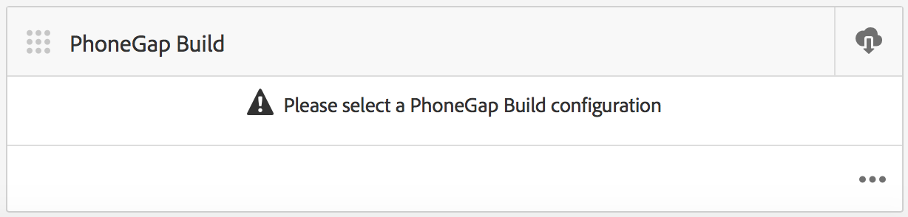
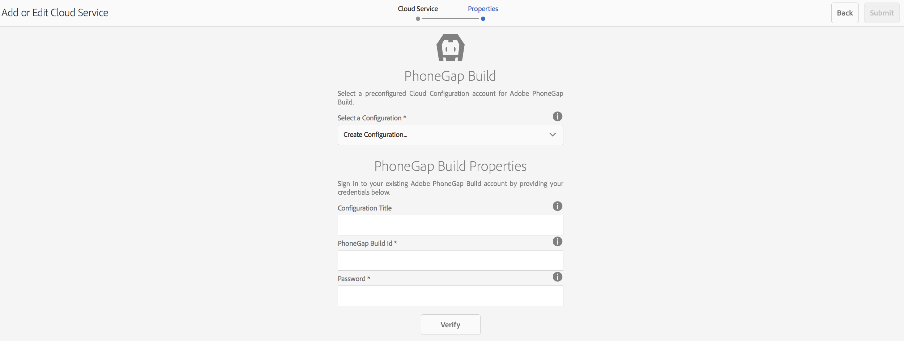

# Configurar su Cloud Service de Adobe PhoneGap Build {#configure-your-adobe-phonegap-build-cloud-service}

>[!NOTE]
>
>Adobe recomienda utilizar el Editor de SPA para proyectos que requieren una representación del lado del cliente basada en el marco de aplicaciones de una sola página (por ejemplo, React). [Más información](/help/sites-developing/spa-overview.md).

La variable **Mosaico de PhoneGap Build** en el panel de la aplicación, podrá crear y distribuir la aplicación móvil PhoneGap mediante el servicio de Adobe PhoneGap Build.

Todas las plataformas admitidas definidas dentro de **Administrar aplicación** el mosaico se construirá con PhoneGap Build al impulsar una compilación remota con el **PhoneGap Build** Mosaico.

Puede insertar una compilación remota en [https://build.phonegap.com](https://build.phonegap.com) o descargar la fuente para compilar localmente con [CLI de PhoneGap](https://docs.phonegap.com/references/phonegap-cli/).



## Configuración del Cloud Service {#configuring-the-cloud-service}

Para aprovechar el PhoneGap Build, debe configurar el Cloud Service de PhoneGap Build AEM con la información de su cuenta de PhoneGap Build.

Si actualmente no tiene una cuenta, vaya a [https://build.phonegap.com](https://build.phonegap.com) ¡y regístrese! Si es miembro de Adobe Creative Cloud, es posible que tenga compatibilidad con hasta 25 aplicaciones privadas (aplicaciones de código abierto).

Una vez que haya comprobado que la cuenta de PhoneGap Build está activa, vaya a la consola de administración de AEM Cloud, específicamente a la consola [Cloud Service del PhoneGap Build](http://localhost:4502/etc/cloudservices/phonegap-build.html) (http://localhost:4502/etc/cloudservices/phonegap-build.html).

Utilice la variable **Administrar Cloud Services** para configurar una nueva configuración del servicio en la nube.

### Uso del mosaico Administrar Cloud Services {#using-manage-cloud-services-tile}

Antes de empezar a compilar la aplicación mediante **PhoneGap Build** en, debe configurar los servicios de nube mediante la variable **Administrar Cloud Services** desde el panel de AEM Mobile.

Para configurar los servicios en la nube para su aplicación, siga los pasos a continuación:

1. Haga clic en en la esquina superior derecha del **Administrar Cloud Services** mosaico.

   

1. Choose **PhoneGap Build** de la **Agregar o editar Cloud Service** en el Navegador.

   Haga clic en **Siguiente**.

   

1. Introduzca sus credenciales para crear una nueva configuración de nube.

   Una vez verificada, haga clic en **Submit**. Esta configuración de nube configurada ahora aparece en la sección **Administrar Cloud Services** mosaico.

   

### Creación de la aplicación con PhoneGap Build {#building-your-application-with-phonegap-build}

Una vez configurados los servicios de nube, puede crear la aplicación con **PhoneGap Build** mosaico. Haga clic en en la esquina superior derecha para elegir entre la **Generar remoto** o **Fuente de descarga** opciones.


Para invocar una compilación remota con Adobe PhoneGap Build, haga clic en **Generar remoto**.

>[!NOTE]
>
>Si la compilación falla por cualquier motivo (el icono rojo de iOS que aparece a continuación indica que la plataforma ha fallado), puede pasar el ratón por encima del icono para obtener el mensaje de error. Como alternativa, puede hacer clic en el punto triple, &#39;...&#39; en la parte inferior del mosaico para navegar directamente a https://build.phonegap.com (debe autenticarse) y ver y administrar la compilación directamente.

### Creación de la aplicación con la CLI de PhoneGap {#building-your-application-with-phonegap-cli}

PhoneGap proporciona una interfaz de línea de comandos para crear la aplicación localmente.

Compile la aplicación PhoneGap en su equipo utilizando la interfaz de línea de comandos (CLI) de PhoneGap. Para incluir el contenido AEM en la aplicación, AEM crea un archivo ZIP que contiene el contenido de la aplicación móvil, las configuraciones de sincronización de contenido y otros recursos necesarios. Descargue el archivo ZIP e inclúyalo en su compilación.

Para aprovechar la interfaz de línea de comandos de PhoneGap, deberá configurar el entorno local para que incluya:

1. SDK de plataforma (iOS, Android, WindowsPhone, ...) y
1. CLI de PhoneGap

Puede leer más [here](https://docs.phonegap.com/references/phonegap-cli/).

Una vez que haya instalado los requisitos previos, realice una prueba sencilla creando una aplicación sencilla y ejecutándola en el simulador o mejor aún en el dispositivo, desde un intento de terminal:

```xml
phonegap create myApp
cd myApp
phonegap run ios (or android, ...)
```

>[!NOTE]
>
>añadir —emular al final de esta línea si no desea ejecutarla en el dispositivo conectado.

Una vez que haya verificado que lo anterior funciona, use la variable **PhoneGap Build** Mosaico a **Fuente de descarga**. Guarde y descomprima el archivo en su sistema local. Una vez hecho esto:

* vaya a ese archivo guardado (carpeta)
* ejecutar &#39;phonegap run ios&#39; (o android, etc.)

### Recursos adicionales {#additional-resources}

Para obtener más información sobre las funciones y responsabilidades de un Autor y Desarrollador, consulte los siguientes recursos:

* [Desarrollo para Adobe PhoneGap Enterprise con AEM](/help/mobile/developing-in-phonegap.md)
* [Creación para Adobe PhoneGap Enterprise en AEM](/help/mobile/phonegap.md)
