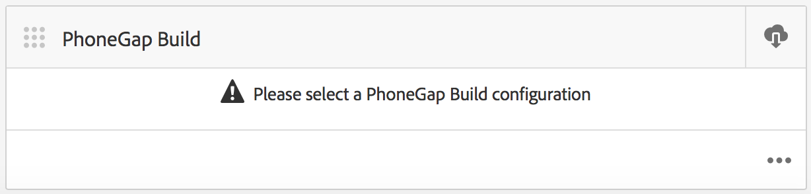
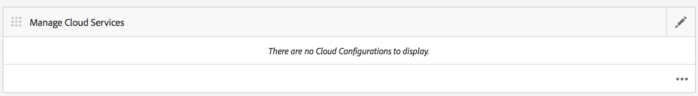
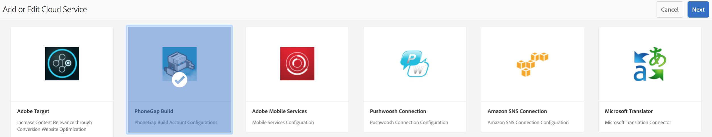
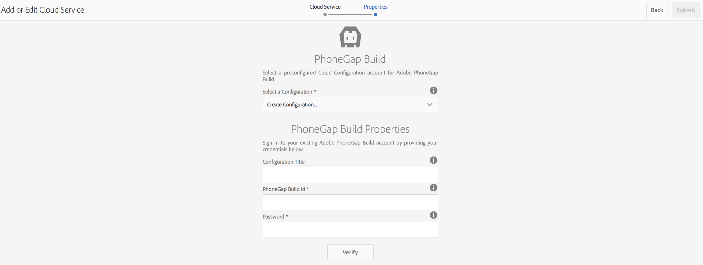
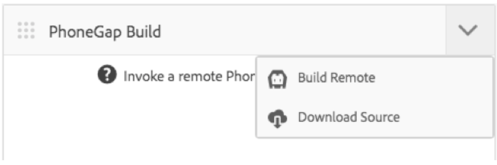

# Configuración de Adobe PhoneGap Build Cloud Service {#configure-your-adobe-phonegap-build-cloud-service}

{{ue-over-mobile}}

El **mosaico de PhoneGap Build** en el panel de aplicaciones le permite generar y distribuir su aplicación móvil de PhoneGap a través del servicio Adobe PhoneGap Build.

Todas las plataformas admitidas definidas dentro del mosaico **Administrar aplicación** se crean con PhoneGap Build al insertar una compilación remota con el mosaico **PhoneGap Build**.

Puede insertar una compilación remota en `https://build.phonegap.com` o descargar el origen para compilar localmente con la CLI de PhoneGap en `https://docs.phonegap.com/references/phonegap-cli/`.



## Configuración de Cloud Service {#configuring-the-cloud-service}

Para aprovechar PhoneGap Build, debe configurar AEM PhoneGap Build Cloud Service con la información de la cuenta de PhoneGap Build.

Si todavía no tiene una cuenta, vaya a `https://build.phonegap.com` y regístrese. Si es miembro de Adobe Creative Cloud, puede que admita hasta 25 aplicaciones privadas (aplicaciones de código no abierto).

Una vez que haya comprobado que su cuenta de PhoneGap Build está activa, vaya a la consola de AEM Cloud Management, específicamente a [PhoneGap Build Cloud Service](http://localhost:4502/etc/cloudservices/phonegap-build.html) (http://localhost:4502/etc/cloudservices/phonegap-build.html).

Use el mosaico **Administrar servicios de nube** para configurar una nueva configuración de servicio de nube.

### Uso del mosaico Administrar servicios de nube {#using-manage-cloud-services-tile}

Antes de empezar a crear la aplicación con el mosaico **PhoneGap Build**, debe configurar los servicios en la nube con el mosaico **Administrar servicios en la nube** del panel de AEM Mobile.

Para configurar los servicios en la nube de su aplicación, siga los pasos a continuación:

1. Haga clic en la esquina superior derecha del mosaico **Administrar servicios de nube**.

   

1. Elija la opción **PhoneGap Build** en la pantalla **Agregar o editar Cloud Service**.

   Haga clic en **Siguiente**.

   

1. Introduzca sus credenciales para poder crear una configuración de nube.

   Una vez verificado, haga clic en **Enviar**. Esta configuración de nube configurada ahora se muestra en el mosaico **Administrar servicios de nube**.

   

### Generar una aplicación con PhoneGap Build {#building-your-application-with-phonegap-build}

Una vez que haya configurado los servicios en la nube, puede generar su aplicación con el mosaico **PhoneGap Build**. Haz clic en la esquina superior derecha para elegir entre las opciones **Generar remoto** o **Descargar Source**.



Para invocar una compilación remota con Adobe PhoneGap Build, haga clic en **Generar remoto**.

>[!NOTE]
>
>Si la compilación falla por algún motivo (el icono rojo de iOS a continuación indica que la plataforma ha fallado), puede pasar el ratón sobre el icono para obtener el mensaje de error. También puede hacer clic en el punto triple, &#39;...&#39; en la parte inferior del mosaico para navegar directamente a `https://build.phonegap.com` (debe autenticarse) y ver y administrar su compilación directamente.

### Creación de la aplicación con la CLI de PhoneGap {#building-your-application-with-phonegap-cli}

PhoneGap proporciona una interfaz de línea de comandos para generar la aplicación localmente.

Compile la aplicación PhoneGap en el equipo mediante la interfaz de línea de comandos (CLI) de PhoneGap. Para incluir el contenido de AEM en la aplicación, AEM crea un archivo ZIP que incluye el contenido de la aplicación móvil, las configuraciones de sincronización de contenido y otros recursos necesarios. Descargue el archivo ZIP e inclúyalo en su compilación.

Para aprovechar la CLI de PhoneGap, debe configurar su entorno local para que incluya lo siguiente:

1. Platform SDK (iOS, Android™, Windows Phone, ...) y,
1. CLI de PhoneGap

Puede leer más aquí en `https://docs.phonegap.com/references/phonegap-cli/`.

Una vez instalados los requisitos previos, realice una prueba sencilla creando una aplicación sencilla y ejecutándola en el simulador o, mejor aún, en el dispositivo, desde un terminal. Pruebe lo siguiente:

```xml
phonegap create myApp
cd myApp
phonegap run ios (or android, ...)
```

>[!NOTE]
>
>Añada: emule al final de esta línea si no desea ejecutarlo en el dispositivo conectado.

Una vez que haya comprobado que lo anterior funciona, use el mosaico **PhoneGap Build** para **descargar Source**. Guarde y descomprima el archivo en el sistema local. Una vez hecho esto:

* vaya a ese archivo guardado (carpeta)
* ejecute &#39;phonegap run ios&#39; (o android, etc.)

### Recursos adicionales {#additional-resources}

Para obtener más información sobre las funciones y responsabilidades de un autor y un desarrollador, consulte los recursos siguientes:

* [Desarrollo para Adobe PhoneGap Enterprise con AEM](/help/mobile/developing-in-phonegap.md)
* [Creación para Adobe PhoneGap Enterprise en AEM](/help/mobile/phonegap.md)
